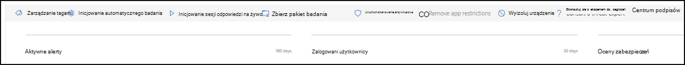

# Akcje dotyczące odpowiedzi na urządzeniu

[!INCLUDE [Microsoft 365 Defender rebranding](../../includes/microsoft-defender.md)]

**Dotyczy:**
- [Ochrona punktu końcowego w usłudze Microsoft Defender Plan 2](https://go.microsoft.com/fwlink/p/?linkid=2154037)
- [Microsoft Defender dla Firm](/microsoft-365/security/defender-business/mdb-overview)

> Chcesz mieć dostęp do usługi Defender dla punktu końcowego? [Zarejestruj się, aby korzystać z bezpłatnej wersji próbnej.](https://signup.microsoft.com/create-account/signup?products=7f379fee-c4f9-4278-b0a1-e4c8c2fcdf7e&ru=https://aka.ms/MDEp2OpenTrial?ocid=docs-wdatp-respondmachine-abovefoldlink)

Szybko odpowiadaj na wykryte ataki, wyodrębniając urządzenia lub zbierając pakiet badania. Po podjęciu działania na urządzeniach możesz sprawdzić szczegóły aktywności w Centrum akcji.

Akcje odpowiedzi są uruchamiane wzdłuż górnej części strony określonego urządzenia i obejmują:

- Zarządzanie tagami
- Inicjowanie automatycznego badania
- Inicjowanie sesji odpowiedzi na żywo
- Zbierz pakiet badania
- Uruchom skanowanie antywirusowe
- Ograniczanie wykonywania aplikacji
- Wyizoluj urządzenie
- Skonsultuj się z ekspertem ds. zagrożeń
- Centrum akcji

 Strony urządzeń można znaleźć w dowolnym z następujących widoków:

- **Pulpit nawigacyjny operacji zabezpieczeń** — wybieranie nazwy urządzenia z karty ryzyka Urządzenia.
- **Kolejka alertów** - z kolejki alertów wybierz nazwę urządzenia obok ikony urządzenia.
- **Lista Urządzenia** — wybierz nagłówek nazwy urządzenia z listy urządzeń.
- **Pole wyszukiwania** - wybierz pozycję Urządzenie z menu rozwijanego i wprowadź nazwę urządzenia.

> [!IMPORTANT]
>
> - Te akcje odpowiedzi są dostępne tylko dla urządzeń w Windows 10, wersji 1703 lub nowszej, Windows 11, Windows Server 2019 i Windows Server 2022.
> - W przypadku platform Windows odpowiedzi (takich jak izolacji urządzenia) zależą od możliwości innych firm.
> - W przypadku agentów pierwszej firmy Microsoft należy zapoznać się z linkiem "więcej informacji" w poszczególnych funkcjach, aby uzyskać minimalne wymagania dotyczące systemu operacyjnego.

## Zarządzanie tagami

Dodawanie tagów i zarządzanie nimi w celu utworzenia przynależności do grup logicznych. Tagi urządzeń obsługują prawidłowe mapowanie sieci, pozwalając na dołączanie różnych tagów w celu przechwycenia kontekstu i umożliwienia dynamicznego tworzenia listy w ramach zdarzenia.

Aby uzyskać więcej informacji na temat tagowania urządzeń, zobacz [Tworzenie tagów urządzeń i zarządzanie nimi](machine-tags.md).

## Inicjowanie automatycznego badania

W razie potrzeby możesz rozpocząć nowe zautomatyzowane badanie ogólnego przeznaczenia na urządzeniu. Gdy jest uruchomione badanie, wszelkie inne alerty wygenerowane z urządzenia będą dodawane do trwającego automatycznego badania do czasu jego ukończenia. Ponadto, jeśli to samo zagrożenie będzie widoczne na innych urządzeniach, zostaną one dodane do badania.

Aby uzyskać więcej informacji na temat zautomatyzowanych badań, zobacz [Omówienie zautomatyzowanych badań](automated-investigations.md).

## Inicjowanie sesji odpowiedzi na żywo

Funkcja odpowiedzi na żywo umożliwia błyskawiczny dostęp do urządzenia przy użyciu połączenia powłoki zdalnej. Umożliwia to użytkownikom szczegółową pracę w ramach badania i natychmiastowe działania w celu natychmiastowego reagowania na określone zagrożenia w czasie rzeczywistym.

Odpowiedź na żywo ma na celu usprawnianie analiz przez umożliwienie zbierania danych forensycznych, uruchamiania skryptów, wysyłania podejrzanych jednostek do analizy, korygowania zagrożeń oraz aktywnego poszukiwania wyłaniających się zagrożeń.

Aby uzyskać więcej informacji na temat odpowiedzi na żywo, zobacz [Badanie jednostek na urządzeniach przy użyciu funkcji odpowiedzi na żywo](live-response.md).

## Zbieranie pakietu badania z urządzeń

W ramach procesu badania lub odpowiedzi możesz zebrać pakiet badania z urządzenia. Zbierając pakiet badań, można określić bieżący stan urządzenia oraz lepiej zrozumieć narzędzia i techniki używane przez atakującego.

> [!IMPORTANT]
>
>Te akcje nie są obecnie obsługiwane w systemach macOS i Linux. Użyj funkcji odpowiedzi na żywo, aby uruchomić akcję. Aby uzyskać więcej informacji na temat odpowiedzi na żywo, zobacz [Badanie jednostek na urządzeniach przy użyciu funkcji odpowiedzi na żywo.](live-response.md)

Aby pobrać pakiet (plik zip) i zbadać zdarzenia, które wystąpiły na urządzeniu

1. Wybierz **pozycję Odbierz pakiet** badania w wierszu akcji odpowiedzi u góry strony urządzenia.
2. W polu tekstowym określ, dlaczego chcesz wykonać tę akcję. Wybierz **pozycję Potwierdź**.
3. Plik zip zostanie pobrany

Alternatywny sposób:

1. Wybierz **pozycję Centrum** akcji w sekcji akcji odpowiedzi na stronie urządzenia.

   :::image type="content" source="images/action-center-package-collection.png" alt-text="Opcja Centrum akcji" lightbox="images/action-center-package-collection.png":::

2. W wysuwaniu Centrum akcji wybierz pozycję **Pakiet kolekcji dostępny do** pobrania pliku zip.

   :::image type="content" source="images/collect-package.png" alt-text="Opcja pobierania pakietu" lightbox="images/collect-package.png":::

Pakiet zawiera następujące foldery:

 

****

|Folder|Opis|
|---|---|
|Autowybłysy|Zawiera zestaw plików reprezentujących zawartość rejestru znanego punktu autostartu (ASEP, Auto start entry point) w celu zidentyfikowania uporczywości atakującego na urządzeniu. 
 
<b>UWAGA:</b> Jeśli klucz rejestru nie zostanie znaleziony, plik będzie zawierać następujący komunikat: "BŁĄD: System nie mógł odnaleźć określonego klucza rejestru lub określonej wartości".
|
|Zainstalowane programy|Ten .CSV zawiera listę zainstalowanych programów, które ułatwiają określenie, co jest obecnie zainstalowane na urządzeniu. Aby uzyskać więcej informacji, [zobacz Win32_Product zajęć](https://go.microsoft.com/fwlink/?linkid=841509).|
|Połączenia sieciowe|Ten folder zawiera zestaw punktów danych związanych z informacjami o łączności, które mogą pomóc w zidentyfikowaniu łączności z podejrzanymi adresami URL, infrastrukturą poleceń i kontrolek atakującego (C&C), ruchu bocznego lub połączeń zdalnych. <ul><li>ActiveNetConnections.txt: Wyświetla statystykę protokołu i bieżące połączenia sieciowe TCP/IP. Umożliwia wyszukiwania podejrzanych połączeń procesów.</li><li>Arp.txt: Wyświetla tabele pamięci podręcznej bieżącego protokołu rozpoznawania adresów (ARP) dla wszystkich interfejsów. Pamięć podręczna usługi ARP może ujawniać innych hostów w sieci, które zostały naruszone lub podejrzanych systemów w sieci, które mogły zostać użyte do uruchomienia ataków wewnętrznej.</il><li>DnsCache.txt: Wyświetla zawartość pamięci podręcznej klienta rozpoznawania nazw DNS, która zawiera zarówno wpisy wstępnie załadowane z lokalnego pliku Hosts, jak i wszystkie ostatnio uzyskane rekordy zasobów dla zapytań nazw rozpoznanych przez komputer. Może to pomóc w zidentyfikowaniu podejrzanych połączeń.</li><li>IpConfig.txt: Wyświetla pełną konfigurację protokołu TCP/IP dla wszystkich kart. Karty mogą przedstawiać interfejsy fizyczne, takie jak zainstalowane karty sieciowe, lub interfejsy logiczne, takie jak połączenia telefoniczne.</li><li>FirewallExecutionLog.txt i pfirewall.log</li></ul>

<b>UWAGA:</b> Plik pfirewall.log musi znajdować się w pliku %windir%\system32\logfiles\firewall\pfirewall.log, więc zostanie uwzględniony w pakiecie badania. Aby uzyskać więcej informacji na temat tworzenia pliku dziennika zapory, zobacz [Konfigurowanie zapory Windows Defender przy użyciu zaawansowanego dziennika zabezpieczeń.](/windows/security/threat-protection/windows-firewall/configure-the-windows-firewall-log)
|
|Pliki pre przedpremierowe|Windows pliki Pre preschu zostały zaprojektowane tak, aby przyspieszyć proces uruchamiania aplikacji. Za jego pomocą można śledzić wszystkie pliki ostatnio używane w systemie i znaleźć śledzenia aplikacji, które mogły zostać usunięte, ale nadal można je znaleźć na wstępnej liście plików. <ul><li>Preujeszch folder: Zawiera kopię prekopiowych plików z `%SystemRoot%\Prefetch`. UWAGA: Zalecamy pobranie preszerego podglądu plików w celu wyświetlenia plików preszybowanych.</li><li>PrefetchFilesList.txt: Zawiera listę wszystkich skopiowanych plików, których można użyć do śledzenia w przypadku błędu kopiowania do folderu przedpremierowego.</li></ul>|
|Procesy|Zawiera plik .CSV listę uruchomionych procesów i umożliwia identyfikowanie bieżących procesów uruchomionych na urządzeniu. Może to być przydatne podczas identyfikowania podejrzanego procesu i jego stanu.|
|Zaplanowane zadania|Zawiera plik .CSV listę zaplanowanych zadań, który może być używany do identyfikowania procedur wykonywanych automatycznie na wybranym urządzeniu w celu wyszukiwania podejrzanych kodów ustawionych do automatycznego uruchamiania.|
|Dziennik zdarzeń zabezpieczeń|Zawiera dziennik zdarzeń zabezpieczeń, który zawiera rekordy działań logowania lub wylogowania oraz inne zdarzenia związane z zabezpieczeniami określone przez zasady inspekcji systemu. 

<b>UWAGA:</b> Otwórz plik dziennika zdarzeń przy użyciu przeglądarki zdarzeń.
|
|Usługi|Zawiera plik .CSV z listą usług i ich stanów.|
|Windows wiadomości serwera (SMB)|Zawiera listę współużytków dostępu do plików, drukarek i portów seryjnych oraz różnorodnej komunikacji między węzłami w sieci. Może to pomóc w zidentyfikowaniu ex y ex yy i ruchu bocznego danych. 
 Zawiera pliki dla połączeń SMBInboundSessions i SMBOutboundSession. 
 
<b>UWAGA:</b> Jeśli nie ma żadnych sesji (przychodzących lub wychodzących), otrzymasz plik tekstowy, który zawiera informacje o tym, że nie znaleziono żadnych sesji SMB.
|
|Informacje o systemie|Zawiera plik SystemInformation.txt, który zawiera informacje o systemie, takie jak wersja systemu operacyjnego i karty sieciowe.|
|Katalogi temp|Zawiera zestaw plików tekstowych z listą plików znajdujących się w %Temp% dla każdego użytkownika w systemie. 
 Może to ułatwić śledzenie podejrzanych plików, które mogą zostać porzucone przez atakującego w systemie. 
 
<b>UWAGA:</b> Jeśli plik zawiera następujący komunikat: "System nie może znaleźć określonej ścieżki", oznacza to, że nie istnieje katalog tymczasowy dla tego użytkownika i może to być spowodowane tym, że użytkownik nie zalogował się do systemu.
|
|Użytkownicy i grupy|Lista plików, które reprezentują poszczególne grupy i ich członków.|
|WdSupportLogs|Zapewnia MpCmdRunLog.txt i MPSupportFiles.cab  
 
<b>UWAGA:</b> Ten folder zostanie utworzony tylko w Windows 10 wersji 1709 lub nowszej z aktualizacją z lutego 2020 r. lub nowszej: <ul><li>Win10 1709 (RS3) Kompilacja 16299.1717: [KB4537816](https://support.microsoft.com/help/4537816/windows-10-update-kb4537816)</li><li>Win10 1803 (RS4) Kompilacja 17134.1345: [KB4537795](https://support.microsoft.com/help/4537795/windows-10-update-kb4537795)</li><li>Win10 1809 (RS5) Kompilacja 17763.1075: [KB4537818](https://support.microsoft.com/help/4537818/windows-10-update-kb4537818)</li><li>Win10 1903/1909 (19h1/19h2) kompilacje 18362.693 i 18363.693: [KB4535996](https://support.microsoft.com/help/4535996/windows-10-update-kb4535996)</li></ul> 
|
|CollectionSummaryReport.xls|Ten plik jest podsumowaniem kolekcji pakietu badania, zawiera listę punktów danych, polecenie służące do wyodrębniania danych, stan wykonywania i kod błędu w przypadku niepowodzenia. Za pomocą tego raportu można śledzić, czy pakiet zawiera wszystkie oczekiwane dane, oraz identyfikować, czy wystąpiły jakiekolwiek błędy.|
|

## Uruchamianie Program antywirusowy Microsoft Defender skanowania na urządzeniach

W ramach procesu badania lub odpowiedzi możesz zdalnie zainicjować skanowanie antywirusowe, aby pomóc w zidentyfikowaniu i naprawieniu złośliwego oprogramowania, które może być obecne na naruszonym urządzeniu.

>[!IMPORTANT]
>- Ta akcja nie jest obecnie obsługiwana w systemach macOS i Linux. Użyj funkcji odpowiedzi na żywo, aby uruchomić akcję. Aby uzyskać więcej informacji na temat odpowiedzi na żywo, zobacz [Badanie jednostek na urządzeniach przy użyciu funkcji odpowiedzi na żywo.](live-response.md)
>- Skanowanie Program antywirusowy Microsoft Defender programu Microsoft Defender AV może być uruchamiane razem z innymi rozwiązaniami antywirusowymi, niezależnie od tego, czy program Microsoft Defender AV jest aktywnym rozwiązaniem antywirusowym. Program Microsoft Defender AV może być w trybie pasywnym. Aby uzyskać więcej informacji, [zobacz Program antywirusowy Microsoft Defender zgodności](/microsoft-365/security/defender-endpoint/microsoft-defender-antivirus-compatibility).

Po wybraniu opcji **Uruchom skanowanie antywirusowe** wybierz typ skanowania, który chcesz uruchomić (szybkie lub pełne) i dodaj komentarz przed potwierdzeniem skanowania.

:::image type="content" source="images/run-antivirus.png" alt-text="Powiadomienie z zaznaczeniem opcji szybkiego skanowania lub pełnego skanowania i dodania komentarza" lightbox="images/run-antivirus.png":::

Centrum akcji będzie wyświetlać informacje o skanowaniach, a oś czasu urządzenia będzie zawierać nowe zdarzenie, odzwierciedlające, że akcja skanowania została przesłana na urządzeniu. Alerty audio/wideo programu Microsoft Defender będą odzwierciedlać wszystkie wykrywanie powierzchni podczas skanowania.

> [!NOTE]
> W przypadku wyzwalania skanowania za pomocą akcji odpowiedzi programu Defender dla punktu końcowego wartość "ScanAvgCPULoadFactor" programu antywirusowego Microsoft Defender nadal ma zastosowanie i ogranicza wpływ skanu na procesor.
>
> Jeśli scanAvgCPULoadFactor nie jest skonfigurowany, wartość domyślna to ograniczenie maksymalnego obciążenia procesora podczas skanowania do 50%.
>
> Aby uzyskać więcej informacji, [zobacz configure-advanced-scan-types-microsoft-defender-antivirus](/windows/security/threat-protection/microsoft-defender-antivirus/configure-advanced-scan-types-microsoft-defender-antivirus).

## Ograniczanie wykonywania aplikacji

Oprócz zawierają one ataki przez zatrzymanie złośliwych procesów, można także zablokować urządzenie i uniemożliwić uruchamianie kolejnych prób potencjalnie złośliwych programów.

>[!IMPORTANT]
> - Ta akcja jest dostępna dla urządzeń Windows 10, wersja 1709 lub nowsza, Windows 11 i Windows Server 2016. 
> - Ta funkcja jest dostępna, jeśli Twoja organizacja używa Program antywirusowy Microsoft Defender.
> - Ta akcja musi spełniać wymagania dotyczące Windows Defender zasad integralności kontroli aplikacji i podpisywania. Aby uzyskać więcej informacji, zobacz [Formaty zasad integralności kodu i podpisywanie](/windows/security/threat-protection/windows-defender-application-control/use-code-signing-to-simplify-application-control-for-classic-windows-applications)).

Aby ograniczyć uruchamianie aplikacji, stosowane są zasady integralności kodu, które zezwalają na uruchamianie plików tylko wtedy, gdy są one podpisane przez certyfikat wystawiony przez firmę Microsoft. Ta metoda ograniczeń może pomóc zapobiec kontrolowaniu przez atakującego naruszonych urządzeń i wykonywaniu dalszych złośliwych działań.

> [!NOTE]
> W dowolnym momencie będzie można odwrócić ograniczenie działania aplikacji. Przycisk na stronie urządzenia zmieni się na przycisk Usuń ograniczenia **aplikacji, a** następnie wykonasz te same czynności, co ograniczenie wykonywania aplikacji.

Po wybraniu opcji **Ogranicz wykonywanie aplikacji** na stronie urządzenia wpisz komentarz i wybierz pozycję **Potwierdź**. Centrum akcji będzie wyświetlać informacje o skanowaniach, a oś czasu urządzenia będzie zawierać nowe zdarzenie.

:::image type="content" source="images/restrict-app-execution.png" alt-text="Powiadomienie dotyczące ograniczeń aplikacji" lightbox="images/restrict-app-execution.png":::

### Powiadomienie dla użytkownika urządzenia

Jeśli aplikacja jest ograniczona, zostanie wyświetlone następujące powiadomienie informujące użytkownika o ograniczeniu uruchamiania aplikacji:

:::image type="content" source="images/atp-app-restriction.png" alt-text="Komunikat ograniczenia aplikacji" lightbox="images/atp-app-restriction.png":::

>[!NOTE]
>Powiadomienie nie jest dostępne w Windows Server 2016 i Windows Server 2012 R2.

## Odizolowanie urządzeń od sieci

W zależności od wagi ataków i wrażliwości urządzenia może być konieczne odizolowanie urządzenia od sieci. Takie działanie może zapobiec kontrolowaniu przez atakującego naruszonego urządzenia i wykonywaniu dalszych działań, takich jak eksektacja danych i ruchy boczne.

>[!IMPORTANT]
>- Ta akcja nie jest obecnie obsługiwana w systemach macOS i Linux. Użyj funkcji odpowiedzi na żywo, aby uruchomić akcję. Aby uzyskać więcej informacji na temat odpowiedzi na żywo, zobacz [Badanie jednostek na urządzeniach przy użyciu funkcji odpowiedzi na żywo.](live-response.md)
>- Pełna izolacji jest dostępna dla urządzeń Windows 10 w wersjach 1703, Windows 11, Windows Server 2019, Windows Server 2016, Windows Server 2012 R2 i Windows Server 2022.
>- Izolacji selektywnej jest dostępna dla urządzeń Windows 10, wersji 1709 lub nowszej i Windows 11.
>- W przypadku odizolowania urządzenia dozwolone są tylko niektóre procesy i miejsca docelowe. Dlatego urządzenia, które znajdują się za pełnym szyfrowaniem VPN, nie będą mogły uzyskać dostępu do usługi Ochrona punktu końcowego w usłudze Microsoft Defender chmurze po odizolowanym urządzeniu. Zalecamy używanie sieci VPN z rozdzielanym rozdzielanym rozdzielaniem na Ochrona punktu końcowego w usłudze Microsoft Defender sieci Program antywirusowy Microsoft Defender związanych z ochroną chmury.

Ta funkcja izolacji urządzenia odłącza naruszone urządzenie z sieci, zachowując łączność z usługą Defender for Endpoint, która nadal monitoruje urządzenie.

Na Windows 10, w wersji 1709 lub nowszej, będziesz mieć większą kontrolę nad poziomem izolacji sieci. Możesz również włączyć łączność Outlook, Microsoft Teams i Skype dla firm (czyli "selektywnej izolacji").

> [!NOTE]
> W dowolnym momencie będzie można ponownie połączyć urządzenie z siecią. Przycisk na stronie urządzenia zmieni się na Zwolnij z **izolacji, a** następnie podejmiesz te same kroki co odizolowanie urządzenia.

Po wybraniu opcji **Wyizoluj urządzenie** na stronie urządzenia wpisz komentarz i wybierz pozycję **Potwierdź**. Centrum akcji będzie wyświetlać informacje o skanowaniach, a oś czasu urządzenia będzie zawierać nowe zdarzenie.

:::image type="content" source="images/isolate-device.png" alt-text="Strona szczegółów odizolowanych urządzeń" lightbox="images/isolate-device.png":::

> [!NOTE]
> Urządzenie pozostanie połączone z usługą Defender for Endpoint, nawet jeśli jest odizolowane od sieci. Jeśli wybrano opcję włączenia funkcji Outlook i Skype dla firm komunikacji, będzie można komunikować się z użytkownikiem, gdy urządzenie jest odizolowane.

### Powiadomienie dla użytkownika urządzenia

Gdy urządzenie jest wyizolowane, jest wyświetlane następujące powiadomienie informujące użytkownika, że urządzenie jest odizolowane od sieci:

:::image type="content" source="images/atp-notification-isolate.png" alt-text="Brak komunikatu o połączeniu sieciowym" lightbox="images/atp-notification-isolate.png":::

## Skonsultuj się z ekspertem ds. zagrożeń

Aby uzyskać więcej informacji na temat potencjalnie naruszonych lub już naruszonych urządzeń, możesz skorzystać z pomocy eksperta ds. zagrożeń firmy Microsoft. Microsoft Threat Experts być zaangażowani bezpośrednio z poziomu Microsoft 365 Defender w celu terminowej i dokładnej odpowiedzi. Eksperci dostarczają szczegółowych informacji nie tylko dotyczących potencjalnie naruszonego urządzenia, ale również lepszego zrozumienia złożonych zagrożeń, powiadomień o atakach ukierunkowanych, które otrzymasz, lub jeśli potrzebujesz więcej informacji o alertach lub kontekście analizy zagrożeń, które są wyświetlane na pulpicie nawigacyjnym portalu.

Aby [uzyskać szczegółowe informacje, zobacz](/microsoft-365/security/defender-endpoint/configure-microsoft-threat-experts#consult-a-microsoft-threat-expert-about-suspicious-cybersecurity-activities-in-your-organization) Konsultowanie się ze specjalistą ds. zagrożeń firmy Microsoft.

## Sprawdzanie szczegółów aktywności w Centrum akcji

Centrum **akcji** zawiera informacje o akcjach, które zostały wykonane na urządzeniu lub pliku. Będzie można wyświetlić następujące szczegóły:

- Kolekcja pakietów badania
- Skanowanie antywirusowe
- Ograniczenie aplikacji
- Izolacji urządzenia

Wyświetlane są również wszystkie inne powiązane szczegóły, na przykład data/godzina przesłania, przesyłający użytkownik i jeśli działanie zakończyło się powodzeniem lub niepowodzeniem.

:::image type="content" source="images/action-center-details.png" alt-text="Centrum akcji z informacjami" lightbox="images/action-center-details.png":::

## Zobacz też

- [Akcje odpowiedzi dotyczące pliku](respond-file-alerts.md)
- [Ręczne akcje odpowiedzi w ramach Ochrona punktu końcowego w usłudze Microsoft Defender Plan 1](defender-endpoint-plan-1.md#manual-response-actions)
- [Nieścisłości raportu](/microsoft-365/security/defender-endpoint/tvm-security-recommendation#report-inaccuracy)
