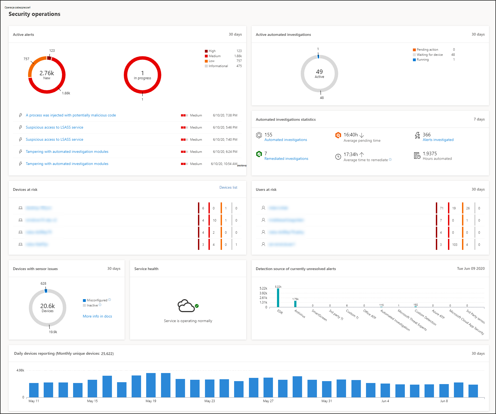
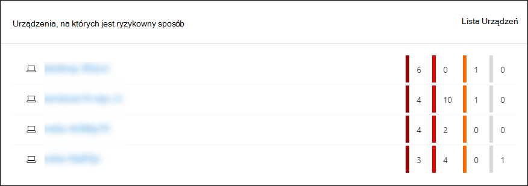
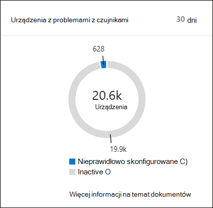
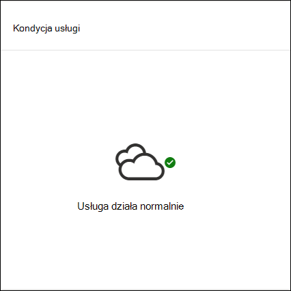
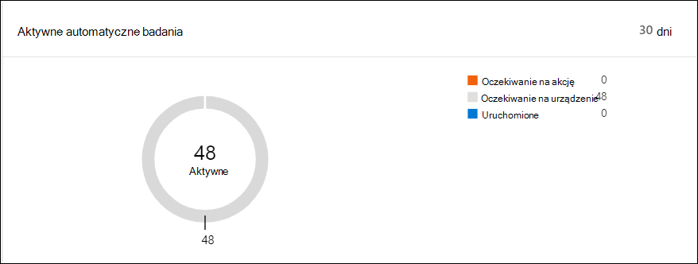
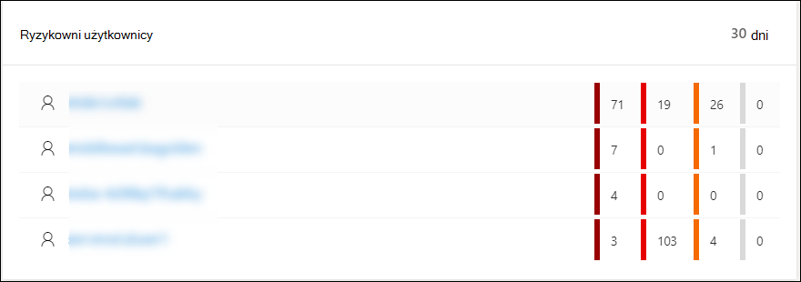

# Centrum zabezpieczeń usługi Microsoft Defender pulpit nawigacyjny Operacji zabezpieczeń

[!INCLUDE [Microsoft 365 Defender rebranding](../../includes/microsoft-defender.md)]

**Dotyczy:**
- [Microsoft Defender for Endpoint Plan 2](https://go.microsoft.com/fwlink/?linkid=2154037)

> Chcesz mieć dostęp do programu Microsoft Defender dla punktu końcowego? [Zarejestruj się, aby korzystać z bezpłatnej wersji próbnej.](https://signup.microsoft.com/create-account/signup?products=7f379fee-c4f9-4278-b0a1-e4c8c2fcdf7e&ru=https://aka.ms/MDEp2OpenTrial?ocid=docs-wdatp-secopsdashboard-abovefoldlink)

Pulpit **nawigacyjny Operacje zabezpieczeń** to miejsce, wykrywanie i reagowanie w punktach końcowych funkcje są nasłone. Zawiera on ogólne informacje na temat tego, gdzie wykrywanie było widziane, i wyróżnia, gdzie potrzebne są akcje odpowiedzi.

Pulpit nawigacyjny zawiera migawkę:

- Aktywne alerty
- Urządzenia, na których jest ryzykowny sposób
- Kondycja czujnika
- Kondycja usługi
- Raportowanie codziennych urządzeń
- Aktywne automatyczne badania
- Zautomatyzowana statystyka badania
- Ryzykowni użytkownicy
- Podejrzane działania

Możesz eksplorować i badać alerty i urządzenia, aby szybko określić, czy, gdzie i kiedy wystąpiły podejrzane działania w Twojej sieci, aby ułatwić zrozumienie kontekstu, w którym się pojawiły.

Na **pulpicie nawigacyjnym** Operacje zabezpieczeń zobaczysz zagregowane zdarzenia ułatwiające identyfikację istotnych zdarzeń lub zachowań na urządzeniu. Możesz również przejść do szczegółów szczegółowych zdarzeń i wskaźników niskiego poziomu.

Zawiera również kafelki, które można klikać, które zapewniają wskazówki wizualne dotyczące ogólnego stanu kondycji organizacji. Każdy kafelek powoduje otwarcie szczegółowego widoku odpowiedniego przeglądu.

## Aktywne alerty

Na kafelku możesz wyświetlić ogólną liczbę aktywnych alertów z ostatnich 30 dni w Twojej sieci. Alerty są pogrupowane w **nowe i** **w toku**.

Każda grupa jest dodatkowo skategoryzowana według odpowiednich poziomów ważności alertów. Kliknij liczbę alertów w każdym pierścieniu alertów, aby wyświetlić posortowany widok kolejki tej kategorii (**Nowy** **lub W toku**).

Aby uzyskać więcej informacji, zobacz [Omówienie alertów](alerts-queue.md).

Każdy wiersz zawiera kategorię ważności alertu i krótki opis alertu. Możesz kliknąć alert, aby wyświetlić jego szczegółowy widok. Aby uzyskać więcej informacji, zobacz  [Omówienie alertów i alertów w programie Microsoft Defender](investigate-alerts.md) [dla punktów końcowych](alerts-queue.md).

## Urządzenia, na których jest ryzykowny sposób

Na tym kafelku jest wyświetlona lista urządzeń z największą liczbą aktywnych alertów. Całkowita liczba alertów dla każdego urządzenia jest wyświetlana w kółku obok nazwy urządzenia, a następnie dodatkowo skategoryzowana według poziomów ważności na końcu kafelka (umieść wskaźnik myszy na każdym pasku ważności, aby wyświetlić jego etykietę).

Kliknij nazwę urządzenia, aby wyświetlić szczegółowe informacje o tym urządzeniu. Aby uzyskać więcej informacji, [zobacz Badanie urządzeń na liście Program Microsoft Defender dla urządzeń końcowych](investigate-machines.md).

Możesz również kliknąć **listę Urządzenia** u góry kafelka **, aby** przejść bezpośrednio do listy Urządzenia posortowane według liczby aktywnych alertów. Aby uzyskać więcej informacji, [zobacz Badanie urządzeń na liście Program Microsoft Defender dla urządzeń końcowych](investigate-machines.md).

## Urządzenia z problemami z czujnikami

**Kafelek Urządzenia z problemami** z czujnikami pozwala na dostarczenie danych czujnika do usługi Microsoft Defender for Endpoint na poszczególnych urządzeniach. Raportuje ono, ile urządzeń wymaga uwagi i ułatwia zidentyfikowanie urządzeń sprawiających problem.

Istnieją dwa wskaźniki stanu, które dostarczają informacji na temat liczby urządzeń, które nie zgłaszają poprawnie usługi:

- **Nieprawidłowo skonfigurowane**: Te urządzenia mogą częściowo zgłaszać dane czujnika do usługi Microsoft Defender for Endpoint i mogą mieć błędy konfiguracji do rozwiązania.
- **Nieaktywny**: Urządzenia, które w ciągu ostatniego miesiąca przestały zgłaszać dane do usługi Microsoft Defender for Endpoint przez ponad siedem dni.

Po kliknięciu dowolnej grupy zostanie wyświetlona lista urządzeń przefiltrowana według wyboru. Aby uzyskać więcej informacji, zobacz [Sprawdzanie stanu czujnika](check-sensor-status.md) i [Badanie urządzeń](investigate-machines.md).

## Kondycja usługi

**Kafelek Kondycja** usługi informuje o tym, czy usługa jest aktywna lub czy występują problemy.

Aby uzyskać więcej informacji na temat kondycji usługi, zobacz [Sprawdzanie kondycji usługi Endpoint w programie Microsoft Defender](service-status.md).

## Raportowanie codziennych urządzeń

**Kafelek Raportowanie urządzeń dziennych** przedstawia wykres słupkowy przedstawiający liczbę urządzeń raportowania codziennie w ciągu ostatnich 30 dni. Umieść wskaźnik myszy na poszczególnych słupkach na wykresie, aby zobaczyć dokładną liczbę urządzeń raportowania w każdym dniu.

## Aktywne automatyczne badania

Możesz wyświetlić ogólną liczbę zautomatyzowanych badań z ostatnich 30 dni w Twojej sieci, na kafelku Aktywne **automatyczne badania** . Badania są pogrupowane w akcje **Oczekujące**, **Oczekiwanie na urządzenie** i **Uruchomione**.

## Zautomatyzowana statystyka badania

Ten kafelek zawiera statystykę związaną z automatycznymi badaniami z ostatnich siedmiu dni. Na tej stronie pokazano liczbę ukończonych analiz, liczbę pomyślnie naprawionych badań, średni czas oczekiwania na zainicjowanie badania, średni czas rozwiązywania alertów, liczbę badanych alertów oraz liczbę godzin automatyzacji zapisywanych w trakcie typowego badania ręcznego. 

Możesz kliknąć **pozycję Automatyczne badania****, Działania** naprawcze i Alerty badane, aby  przejść do strony Badania, przefiltrowane według odpowiedniej kategorii. Dzięki temu możesz wyświetlić szczegółowy wykaz analiz w kontekście.

## Ryzykowni użytkownicy

Na tym kafelku jest wyświetlona lista kont użytkowników z najbardziej aktywnymi alertami oraz liczba alertów dotyczących alertów wysokiego, średniego lub niskiego poziomu. 

Kliknij konto użytkownika, aby wyświetlić szczegółowe informacje o koncie użytkownika. Aby uzyskać więcej informacji [, zobacz Badanie konta użytkownika](investigate-user.md).

> Chcesz mieć dostęp do programu Microsoft Defender dla punktu końcowego? [Zarejestruj się, aby korzystać z bezpłatnej wersji próbnej.](https://signup.microsoft.com/create-account/signup?products=7f379fee-c4f9-4278-b0a1-e4c8c2fcdf7e&ru=https://aka.ms/MDEp2OpenTrial?ocid=docs-wdatp-secopsdashboard-belowfoldlink)

## Tematy pokrewne

- [Opis portalu programu Microsoft Defender for Endpoint](use.md)
- [Omówienie portalu](portal-overview.md)
- [Wyświetlanie pulpitu nawigacyjnego zarządzania & zagrożeniami](tvm-dashboard-insights.md)
- [Wyświetlanie pulpitu nawigacyjnego analizy zagrożeń i stosowanie zalecanych działań zaradczych](threat-analytics.md)
