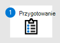

# Przełączanie do programu Microsoft Defender dla punktu końcowego — etap 1. Przygotowywanie

**Dotyczy:**
- [Microsoft Defender for Endpoint Plan 1](https://go.microsoft.com/fwlink/?linkid=2154037)
- [Microsoft Defender for Endpoint Plan 2](https://go.microsoft.com/fwlink/?linkid=2154037)
- [Microsoft 365 Defender](https://go.microsoft.com/fwlink/?linkid=2118804)

|  Etap 1. Przygotowywanie |  [Etap 2. Konfigurowanie](switch-to-mde-phase-2.md) |  [Etap 3. Wniesienie](switch-to-mde-phase-3.md) |
|--|--|--|
|*Jesteś tutaj!*| | |

**Witamy w fazie przygotowywanie się do [przełączenia do usługi Defender dla punktu końcowego](switch-to-mde-overview.md#the-migration-process)**.

Ten etap migracji obejmuje następujące kroki:

1. [Uzyskiwanie i wdrażanie aktualizacji na urządzeniach organizacji](#get-and-deploy-updates-across-your-organizations-devices)
2. [Uzyskaj program Defender dla punktu końcowego](#get-microsoft-defender-for-endpoint).
3. [Udzielanie dostępu do portalu Microsoft 365 Defender sieci.](#grant-access-to-the-microsoft-365-defender-portal)
4. [Konfigurowanie ustawień serwera proxy i łączności internetowej urządzenia](#configure-device-proxy-and-internet-connectivity-settings).

## Uzyskiwanie i wdrażanie aktualizacji na urządzeniach organizacji

Najlepszym rozwiązaniem jest dbanie o aktualne informacje na urządzeniach i punktach końcowych organizacji. Upewnij się, że Twoje istniejące rozwiązanie do ochrony punktu końcowego i oprogramowania antywirusowego jest aktualne oraz że systemy operacyjne i aplikacje, których organizacja ma również najnowsze aktualizacje. W ten sposób można teraz zapobiec problemom w późniejszym czasie podczas migracji do usługi Defender for Endpoint i Program antywirusowy Microsoft Defender.

### Upewniaj się, że istniejące rozwiązanie jest aktualne

Zadbaj o aktualizację swojego istniejącego rozwiązania ochrony punktu końcowego i upewnij się, że na urządzeniach Twojej organizacji są dostępne najnowsze aktualizacje zabezpieczeń.

Potrzebujesz pomocy? Zapoznaj się z dokumentacją swojego dostawcy rozwiązań.

### Upewniaj się, że urządzenia w Twojej organizacji są aktualne

Potrzebujesz pomocy przy aktualizowaniu urządzeń w Twojej organizacji? Zobacz następujące zasoby:

  

|System operacyjny|Zasób|
|---|---|
|System Windows|[Microsoft Update](https://www.update.microsoft.com)|
|macOS|[Jak zaktualizować oprogramowanie na komputerze Mac](https://support.apple.com/HT201541)|
|iOS|[Aktualizowanie iPhone, iPad lub iPoda touch](https://support.apple.com/HT204204)|
|Android|[Sprawdzanie & wersji systemu Android](https://support.google.com/android/answer/7680439)|
|Linux|[Linux 101: Aktualizowanie systemu](https://www.linux.com/training-tutorials/linux-101-updating-your-system)|

## Uzyskaj program Microsoft Defender dla punktu końcowego

Teraz, gdy urządzenia w organizacji zostały zaktualizowane, następnym krokiem jest oprogramowanie Defender for Endpoint, przypisanie licencji i upewninie się, że usługa jest aprowowana.

1. Już dziś kup lub wypróbuj usługę Defender for Endpoint. [Rozpocznij bezpłatną wersję próbną lub poproś o ofertę](https://aka.ms/mdatp).

2. Sprawdź, czy licencje są poprawnie aprowowane. [Sprawdź stan licencji](production-deployment.md#check-license-state).

3. Skonfiguruj dedykowane wystąpienie usługi Defender for Endpoint w chmurze. Zobacz [Konfiguracja punktu końcowego programu Defender: Konfiguracja dzierżawy](production-deployment.md#tenant-configuration).

4. Jeśli punkty końcowe (takie jak urządzenia) w organizacji używają serwera proxy do uzyskiwania dostępu do Internetu, zobacz [Defender for Endpoint setup: Network configuration (Konfiguracja sieci](production-deployment.md#network-configuration)).

Na tym etapie możesz udzielić dostępu administratorom zabezpieczeń i operatorom zabezpieczeń, którzy będą korzystać z portalu <a href="https://go.microsoft.com/fwlink/p/?linkid=2077139" target="_blank">Microsoft 365 Defender zabezpieczeń</a>.

> [!NOTE]
> Portal Microsoft 365 Defender jest czasami nazywany portalem programu Defender for Endpoint i można uzyskać do niego dostęp pod nr <a href="https://go.microsoft.com/fwlink/p/?linkid=2077139" target="_blank">https://security.microsoft.com</a>. Poprzednia Centrum zabezpieczeń usługi Microsoft Defender (https://securitycenter.windows.com)wkrótce przekieruje do portalu Microsoft 365 Defender sieci. Aby dowiedzieć się więcej, [zobacz Microsoft 365 Defender przegląd portalu](portal-overview.md).

## Udzielanie dostępu do portalu Microsoft 365 Defender sieci Microsoft 365 Defender

Portal <a href="https://go.microsoft.com/fwlink/p/?linkid=2077139" target="_blank">Microsoft 365 Defender to</a> miejsce, do którego uzyskujesz dostęp do funkcji i możliwości usługi Defender for Endpoint oraz konfigurujesz je. Aby dowiedzieć się więcej, [zobacz Omówienie Microsoft 365 Defender projektu](use.md).

Uprawnienia do portalu Microsoft 365 Defender można przyznać przy użyciu podstawowych uprawnień lub kontroli dostępu opartej na rolach (RBAC). Zalecamy korzystanie z RBAC, aby mieć bardziej szczegółową kontrolę nad uprawnieniami.

1. Zaplanuj role i uprawnienia administratorów zabezpieczeń i operatorów zabezpieczeń. Zobacz [Kontrola dostępu oparta na rolach](prepare-deployment.md#role-based-access-control).

2. Konfigurowanie RBAC. Zalecamy skonfigurowanie RBAC za pomocą usługi [Intune](/mem/intune/fundamentals/what-is-intune), zwłaszcza jeśli Twoja organizacja używa kombinacji urządzeń z systemem Windows 10, macOS, iOS i Android. Zobacz [Konfigurowanie RBAC przy użyciu usługi Intune](/mem/intune/fundamentals/role-based-access-control).

    Jeśli Twoja organizacja wymaga metody innej niż Intune, wybierz jedną z następujących opcji:

    - [Menedżer konfiguracji](/mem/configmgr/core/servers/deploy/configure/configure-role-based-administration)
    - [Zaawansowane zasady grupy zaawansowane](/microsoft-desktop-optimization-pack/agpm)
    - [Windows administracyjne](/windows-server/manage/windows-admin-center/overview)

3. Udzielanie dostępu do portalu Microsoft 365 Defender sieci. (Potrzebujesz pomocy? Zobacz [Zarządzanie dostępem do portalu przy użyciu RBAC](rbac.md).

## Konfigurowanie ustawień serwera proxy i łączności internetowej urządzenia

Aby umożliwić komunikację między urządzeniami i usługą Defender for Endpoint, skonfiguruj ustawienia serwera proxy i Internetu. W poniższej tabeli znajdują się linki do zasobów, za pomocą których można skonfigurować ustawienia serwera proxy i Internetu dla różnych systemów operacyjnych i możliwości:

  

|Możliwości|System operacyjny|Zasoby|
|---|---|---|
|[Wykrywanie punktu końcowego i](overview-endpoint-detection-response.md) odpowiedź (EDR)|[Windows 10](/windows/release-health/release-information) lub nowszy  Windows Server 2022   [Windows Server 2019](/windows/release-health/status-windows-10-1809-and-windows-server-2019)  [Windows Server 1803 lub nowszy](/windows-server/get-started/whats-new-in-windows-server-1803)|[Konfigurowanie ustawień serwera proxy komputera i łączności internetowej](configure-proxy-internet.md)|
|EDR|[Windows Server 2016](/windows/release-health/status-windows-10-1607-and-windows-server-2016)  [Windows Server 2012 R2](/windows/release-health/status-windows-8.1-and-windows-server-2012-r2)  [Windows Server 2008 R2 z dodatkiem SP1](/windows/release-health/status-windows-7-and-windows-server-2008-r2-sp1)  [Windows 8.1](/windows/release-health/status-windows-8.1-and-windows-server-2012-r2)  [Windows 7 z dodatkiem SP1](/windows/release-health/status-windows-7-and-windows-server-2008-r2-sp1)|[Konfigurowanie ustawień serwera proxy i łączności internetowej](onboard-downlevel.md#configure-proxy-and-internet-connectivity-settings)|
|EDR|macOS (zobacz [Wymagania systemowe](microsoft-defender-endpoint-mac.md)|[Defender for Endpoint on macOS: Network connections](microsoft-defender-endpoint-mac.md#network-connections)|
|[Program antywirusowy Microsoft Defender](microsoft-defender-antivirus-in-windows-10.md)|[Windows 10](/windows/release-health/release-information)    [Windows Server 2019](/windows/release-health/status-windows-10-1809-and-windows-server-2019)   Windows Server 2022    [Windows Server 1803 lub nowszy](/windows-server/get-started/whats-new-in-windows-server-1803)    [Windows Server 2016](/windows-server/get-started/whats-new-in-windows-server-2016)|[Konfigurowanie i sprawdzanie poprawności Program antywirusowy Microsoft Defender połączeń sieciowych](configure-network-connections-microsoft-defender-antivirus.md)|
|Oprogramowanie antywirusowe|macOS (zobacz [Wymagania systemowe](microsoft-defender-endpoint-mac.md)|[Defender for Endpoint on macOS: Network connections](microsoft-defender-endpoint-mac.md#network-connections)|
|Oprogramowanie antywirusowe|Linux (zobacz [Wymagania systemowe](microsoft-defender-endpoint-linux.md#system-requirements))|[Program Defender dla punktu końcowego w systemie Linux: połączenia sieciowe](microsoft-defender-endpoint-linux.md#network-connections)|

## Następny krok

**Gratulacje**! Ukończono etap **Przygotowywanie** przełączania [do usługi Defender dla punktu końcowego](switch-to-mde-overview.md#the-migration-process)!

- [Kontynuuj konfigurowanie usługi Defender dla punktu końcowego](switch-to-mde-phase-2.md).
