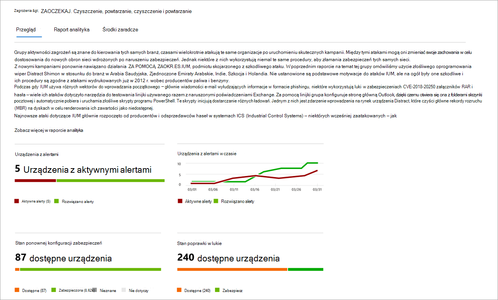
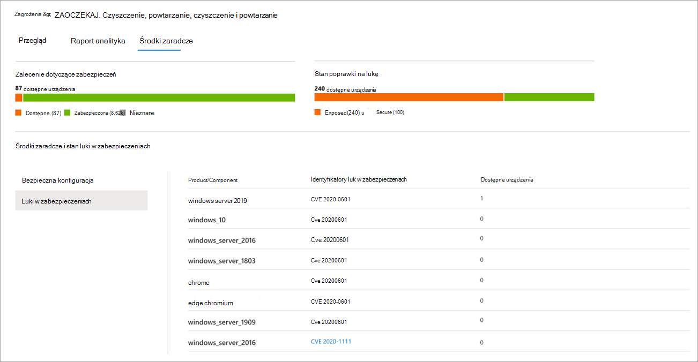

# Śledzenie wyłaniających się zagrożeń i reagowanie na nie za pomocą analizy zagrożeń

[!INCLUDE [Microsoft 365 Defender rebranding](../../includes/microsoft-defender.md)]

**Dotyczy:**
- [Microsoft Defender for Endpoint Plan 2](https://go.microsoft.com/fwlink/?linkid=2154037)
- [Microsoft 365 Defender](https://go.microsoft.com/fwlink/?linkid=2118804)

> Chcesz mieć dostęp do programu Microsoft Defender dla punktu końcowego? [Zarejestruj się, aby korzystać z bezpłatnej wersji próbnej.](https://signup.microsoft.com/create-account/signup?products=7f379fee-c4f9-4278-b0a1-e4c8c2fcdf7e&ru=https://aka.ms/MDEp2OpenTrial?ocid=docs-wdatp-exposedapis-abovefoldlink)

W związku z coraz bardziej zaawansowanymi mechanizmami adwersji i nowymi zagrożeniami coraz częściej trzeba mieć możliwość szybkiego rozwiązania:

- Ocenianie wpływu nowych zagrożeń
- Sprawdzenie odporności na zagrożenia lub ich narażenie
- Identyfikowanie czynności, które można podjąć w celu zatrzymania lub zatrzymania zagrożeń

Analiza zagrożeń to zestaw raportów od ekspertów ds. zabezpieczeń firmy Microsoft dotyczących najbardziej istotnych zagrożeń, w tym:

- Aktywne działania podszywają się pod użytkowników i ich kampanie
- Popularne i nowe techniki ataków
- Krytyczne luki w zabezpieczeniach
- Typowe powierzchnie ataków
- Rozpowszechnione złośliwe oprogramowanie

Każdy raport zawiera szczegółową analizę zagrożeń oraz obszerne wskazówki dotyczące obrony przed tym zagrożeniem. Obejmuje on również dane z Twojej sieci, które wskazują, czy zagrożenie jest aktywne i czy są stosowane odpowiednie zabezpieczenia.

Obejrzyj ten krótki klip wideo, aby dowiedzieć się więcej o tym, jak analiza zagrożeń może ułatwić śledzenie najnowszych zagrożeń i ich zatrzymanie.

> [!VIDEO https://www.microsoft.com/videoplayer/embed/RE4bw1f]

## Wyświetlanie pulpitu nawigacyjnego analizy zagrożeń

Pulpit nawigacyjny analizy zagrożeń to doskonały punkt wyjścia do uzyskiwania dostępu do raportów, które są najbardziej istotne dla Twojej organizacji. Zawiera on podsumowanie zagrożeń w następujących sekcjach:

- **Najnowsze zagrożenia**: zawiera listę ostatnio opublikowanych raportów o zagrożeniach wraz z liczbą urządzeń z aktywnymi i rozwiązanymi alertami.
- **Zagrożenia o wysokim poziomie wpływu**: zawiera listę zagrożeń, które miały największy wpływ na organizację. W tej sekcji zagrożenia są poszepniane według liczby urządzeń z aktywnymi alertami.
- **Podsumowanie zagrożeń**: pokazuje ogólny wpływ śledzenia zagrożeń, pokazując liczbę zagrożeń za pomocą aktywnych i rozwiązanych alertów.

Wybierz zagrożenie z pulpitu nawigacyjnego, aby wyświetlić raport o tym zagrożeńu.

## Wyświetlanie raportu analizy zagrożeń

Każdy raport analizy zagrożeń zawiera informacje w trzech sekcjach: **Przegląd**, **Raport analityka** i **Środki zaradcze**.

### Omówienie: Szybkie rozumienie zagrożenia, ocenianie jego wpływu i przeglądanie obron

Sekcja **Omówienie** zawiera podgląd szczegółowego raportu analityka. Zawiera również wykresy, które podkreślają wpływ zagrożenia na organizację i ekspozycję użytkowników za pośrednictwem nieprawidłowo skonfigurowanych i nieskomponowanych urządzeń.

 _Sekcja Przegląd raportu analizy zagrożeń_

#### Ocenianie wpływu na organizację

Każdy raport zawiera wykresy zaprojektowane w celu zapewnienia informacji o wpływie zagrożenia na strukturę organizacyjną:

- **Urządzenia z alertami**: wyświetla bieżącą liczbę różnych urządzeń, na które wpływa zagrożenie. Urządzenie jest skategoryzowane  jako Aktywne, jeśli z tym zagrożeniem jest co najmniej jeden alert  i rozpoznano go, jeśli wszystkie alerty skojarzone z zagrożeniami na urządzeniu zostały rozwiązane.
- **Urządzenia z alertami w czasie**: wyświetla liczbę różnych urządzeń z aktywnymi i  rozwiązanymi **alertami** w czasie. Liczba rozwiązanych alertów wskazuje, jak szybko Organizacja reaguje na alerty skojarzone z zagrożeniami. Najlepiej, jeśli na wykresie alerty powinny zostać rozwiązane w ciągu kilku dni.

#### Przegląd odporności i postawy zabezpieczeń

Każdy raport zawiera wykresy, które zawierają omówienie tego, jak chroni twoja organizacja przed danym zagrożeniem:

- **Stan konfiguracji zabezpieczeń**: pokazuje liczbę urządzeń, na których zastosowano zalecane ustawienia zabezpieczeń, które mogą pomóc w zminimalizowaniu zagrożeń. Urządzenia są traktowane jako **Bezpieczne** , jeśli zastosowano _wszystkie_ śledzone ustawienia.
- **Stan poprawki w lukach**: pokazuje liczbę urządzeń, na których zastosowano aktualizacje zabezpieczeń lub poprawki w celu rozwiązania luk w zabezpieczeniach, które są wykorzystywane przez zagrożenie.

### Raport analityka: Uzyskiwanie informacji ekspertów na temat specjalistów od zabezpieczeń firmy Microsoft

Przejdź do sekcji **Raport analityka,** aby przeczytać szczegółowy opis eksperta. Większość raportów zawiera szczegółowe opisy łańcuchów ataków, w tym taktyk i technik zamapowanych na platformę CK ATT MITRE&CK, wyczerpujące listy zaleceń i zaawansowane wskazówki dotyczące ochrony przed [zagrożeniami.](advanced-hunting-overview.md)

[Dowiedz się więcej o raporcie analityka](threat-analytics-analyst-reports.md)

### Środki zaradcze: Przejrzyj listę środków zaradczych i stan urządzeń

W sekcji **Środki zaradcze** przejrzyj listę konkretnych zaleceń, które mogą być pomocne w zwiększaniu odporności organizacji na zagrożenia. Lista śledzonych środków zaradczych obejmuje:

- **Aktualizacje zabezpieczeń**: Wdrażanie aktualizacji lub poprawek zabezpieczeń w przypadku luk
- **Program antywirusowy Microsoft Defender sieci Program antywirusowy Microsoft Defender**
  - Wersja analizy zabezpieczeń
  - Ochrona w chmurze
  - Potencjalnie niechciana ochrona aplikacji (PUA)
  - Ochrona w czasie rzeczywistym

Środki zaradcze zawarte w tej sekcji zawierają dane [Zarządzanie zagrożeniami i lukami, które](next-gen-threat-and-vuln-mgt.md) zawierają również szczegółowe informacje na temat przechodzenia do szczegółów z różnych łączy w raporcie.

_Sekcja środki zaradcze w raporcie analizy zagrożeń_

## Dodatkowe szczegóły i ograniczenia dotyczące raportu

Podczas korzystania z raportów należy pamiętać o następujących kwestiach:

- Zakres danych zależy od zakresu kontroli dostępu opartej na rolach . Zobaczysz stan urządzeń w grupach, [do których możesz uzyskać dostęp](machine-groups.md).
- Wykresy odzwierciedlają tylko środki zaradcze, które są śledzone. Sprawdź omówienie raportu, aby uzyskać dodatkowe środki zaradcze, które nie są widoczne na wykresach.
- Środki zaradcze nie gwarantują pełnej odporności. Podane środki zaradcze odzwierciedlają najlepsze możliwe działania potrzebne do zwiększenia odporności.
- Urządzenia są liczone jako "niedostępne", jeśli nie przesłały danych do usługi.
- Statystyki dotyczące oprogramowania antywirusowego są oparte na Program antywirusowy Microsoft Defender ustawieniach. Urządzenia z rozwiązaniami antywirusowymi innych firm mogą być wyświetlane jako "dostępne".

## Tematy pokrewne

- [Aktywne wyszukiwanie zagrożeń dzięki zaawansowanym narzędziom do wyszukiwania](advanced-hunting-overview.md)
- [Opis sekcji raportu analityka](threat-analytics-analyst-reports.md)
- [Ocenianie i rozwiązywanie problemów z zabezpieczeniami i ich ekspozycję](next-gen-threat-and-vuln-mgt.md)
