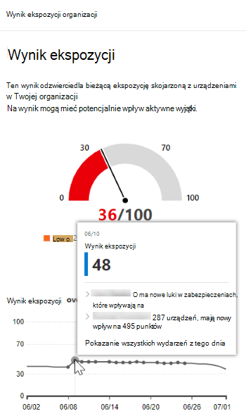
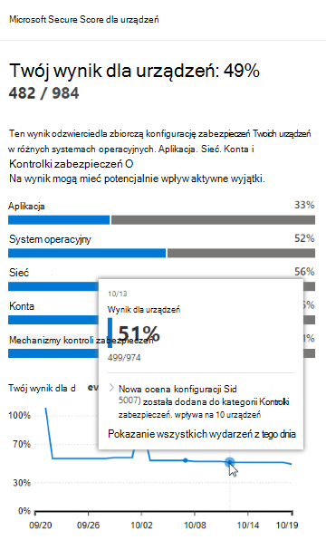
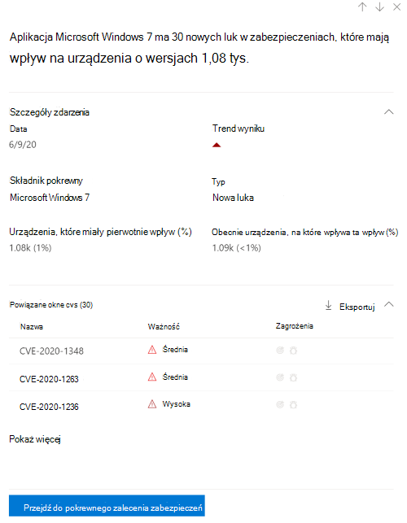
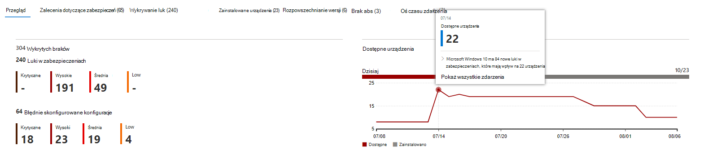

# Oś czasu wydarzenia — Zarządzanie zagrożeniami i lukami

[!INCLUDE [Microsoft 365 Defender rebranding](../../includes/microsoft-defender.md)]

**Dotyczy:**
- [Microsoft Defender for Endpoint Plan 2](https://go.microsoft.com/fwlink/?linkid=2154037)
- [Microsoft 365 Defender](https://go.microsoft.com/fwlink/?linkid=2118804)

> Chcesz mieć dostęp do programu Microsoft Defender dla punktu końcowego? [Zarejestruj się, aby korzystać z bezpłatnej wersji próbnej.](https://signup.microsoft.com/create-account/signup?products=7f379fee-c4f9-4278-b0a1-e4c8c2fcdf7e&ru=https://aka.ms/MDEp2OpenTrial?ocid=docs-wdatp-portaloverview-abovefoldlink)

Oś czasu zdarzeń to kanał wiadomości ryzyka, który ułatwia interpretowanie tego, jak ryzyko jest wprowadzane w organizacji w ramach nowych luk lub luk w zabezpieczeniach. Możesz wyświetlić zdarzenia, które mogą mieć wpływ na ryzyko Twojej organizacji. Można na przykład znaleźć nowe luki w zabezpieczeniach, które zostały wprowadzone, luki, które stały się wykorzystywane, wykorzystywanie luk dodanych do zestawu exploitów i nie tylko.

Oś czasu wydarzenia zawiera również historię wyników ekspozycji  i wyników bezpiecznego działania firmy [Microsoft](tvm-microsoft-secure-score-devices.md) dla urządzeń, dzięki czemu możesz ustalić przyczynę dużych zmian. Zdarzenia mogą mieć wpływ na twoje urządzenia lub wyniki dla urządzeń. Ogranicz ekspozycję użytkowników, uwzględniając działania, które należy rozwiązać, na podstawie priorytetowych [zaleceń dotyczących zabezpieczeń](tvm-security-recommendation.md).

> [!TIP]
> Aby uzyskać wiadomości e-mail dotyczące nowych zdarzeń luk w zabezpieczeniach, zobacz Konfigurowanie powiadomień [e-mail z luk w zabezpieczeniach w programie Microsoft Defender dla punktu końcowego](configure-vulnerability-email-notifications.md)

## Przechodzenie do strony osi czasu zdarzenia

Istnieją również trzy punkty wejścia z pulpitu [Zarządzanie zagrożeniami i lukami wprowadzania](tvm-dashboard-insights.md):

- **Karta wyników ekspozycji organizacji**: Umieść wskaźnik myszy na kropce wydarzenia na wykresie "Wynik ekspozycji w czasie" i wybierz pozycję "Zobacz wszystkie zdarzenia z tego dnia". Zdarzenia te reprezentują luki w zabezpieczeniach oprogramowania.
- **Microsoft Secure Score for Devices**: Umieść wskaźnik myszy na kropce wydarzenia na wykresie "Twój wynik dla urządzeń w czasie", a następnie wybierz pozycję "Zobacz wszystkie zdarzenia z tego dnia". Zdarzenia reprezentują nowe oceny konfiguracji.
- **Górna karta zdarzeń**: Wybierz pozycję "Pokaż więcej" u dołu górnej tabeli zdarzeń. Na karcie wyświetlane są trzy najbardziej efektowne zdarzenia z ostatnich 7 dni. Zdarzenia mające wpływ mogą obejmować te zdarzenia, które mają wpływ na dużą liczbę urządzeń lub są one krytyczną luką w zabezpieczeniach.

### Wyniki ekspozycji i wykresy bezpiecznego wyniku firmy Microsoft dla urządzeń

Na Zarządzanie zagrożeniami i lukami nawigacyjnym umieść wskaźnik myszy na wykresie wyników ekspozycji, aby wyświetlić najważniejsze zdarzenia luk w oprogramowaniu z tego dnia, które dotyczyły Twoich urządzeń. Umieść wskaźnik myszy na wykresie Microsoft Secure Score for Devices, aby wyświetlić nowe oceny konfiguracji zabezpieczeń wpływające na wynik.

Jeśli nie ma żadnych zdarzeń mających wpływ na Twoje urządzenia lub wyniki dla urządzeń, nie zostaną wyświetlone żadne zdarzenia.

 

### Przechodzenie do szczegółów zdarzeń z tego dnia

Wybranie **opcji Pokaż wszystkie zdarzenia z tego** dnia umożliwia wyświetlanie strony osi czasu zdarzenia z niestandardowym zakresem dat dla tego dnia.

Wybierz **pozycję Niestandardowy zakres** , aby zmienić zakres dat na inny niestandardowy lub wstępnie ustawiony zakres czasu.

## Omówienie osi czasu wydarzenia

Na stronie Oś czasu wydarzenia możesz wyświetlić wszystkie niezbędne informacje dotyczące zdarzenia.

Funkcje:

- Dostosowywanie kolumn
- Filtrowanie według typu zdarzenia lub procentu urządzeń, na które wpływa wpływ
- Wyświetlanie 30, 50 lub 100 elementów na stronie

Dwie duże liczby w górnej części strony pokazują liczbę nowych luk i luk, które można wykorzystać, a nie zdarzenia. Niektóre zdarzenia mogą mieć wiele luk, a niektóre luki w zabezpieczeniach mogą mieć wiele zdarzeń.

### Kolumny

- **Data**: miesiąc, dzień, rok
- **Zdarzenie**: zdarzenie, które ma wpływ, łącznie ze składnikiem, typem i liczbą urządzeń, których to wpływa
- **Składnik pokrewny**: oprogramowanie
- **Urządzenia, których pierwotnie dotyczyło** to zdarzenie, dotyczyły liczby i procentu urządzeń, na które miało to wpływ. Możesz również filtrować według procentu urządzeń, które miały pierwotnie wpływ na całkowitą liczbę urządzeń.
- **Obecnie wpływa na urządzenia**: bieżąca liczba (wartość procentowa) urządzeń, na które bieżące zdarzenie ma wpływ. To pole można znaleźć, wybierając pozycję **Dostosuj kolumny**.
- **Typy**: odzwierciedlają zdarzenia z sygnaturą czasową, które mają wpływ na wynik. Można je filtrować.
  - Exploit added to an exploit kit
  - Exploit został zweryfikowany
  - Nowe wykorzystywanie publiczne
  - Nowa luka
  - Nowa ocena konfiguracji
- **Trend wyników: trend** wyników ekspozycji

### Ikony

Obok zdarzeń są wyświetlane następujące ikony:

-  Nowe wykorzystywanie publiczne
-  Opublikowano nową lukę
-  Exploit znaleziony w zestawie exploitów
-  Exploit verified

### Przechodzenie do szczegółów określonego zdarzenia

Po wybraniu zdarzenia zostanie wyświetlone wysuwne informacje z listą szczegółów i aktualnych życiorysów dotyczących Twoich urządzeń. Możesz wyświetlić więcej cves lub wyświetlić powiązane zalecenie.

Strzałka poniżej "trendu wyników" pomaga ustalić, czy to zdarzenie potencjalnie zostało podniesione, czy niższy wynik ekspozycji organizacyjnej. Wyższy wynik ekspozycji oznacza, że urządzenia są bardziej narażone na wykorzystywanie.

W tym miejscu wybierz **pozycję Przejdź do pokrewnego zalecenia zabezpieczeń** , aby wyświetlić zalecenie dotyczące luki w zabezpieczeniach związanej z nową luką w oprogramowaniu na [stronie zalecenia dotyczące zabezpieczeń](tvm-security-recommendation.md). Po przeczytaniu opisu i luk w zabezpieczeniach w treści zalecenia zabezpieczeń możesz przesłać żądanie naprawy i śledzić je na [stronie rozwiązywania problemów](tvm-remediation.md).

## Wyświetlanie osi czasu zdarzeń na stronach oprogramowania

Aby otworzyć stronę oprogramowania, wybierz zdarzenie, > w wysuwanych oknach wysuwanych wybierz nazwę oprogramowania z hiperlinkiem (na przykład Visual Studio 2017). [Dowiedz się więcej o stronach oprogramowania](tvm-software-inventory.md#software-pages)

Zostanie wyświetlana pełna strona ze wszystkimi szczegółami określonego oprogramowania. Aby wyświetlić oś czasu zdarzeń dla danego oprogramowania, kliknij wskaźnik myszy na wykresie.

Przejdź do karty osi czasu zdarzenia, aby wyświetlić wszystkie zdarzenia związane z tym oprogramowaniem. Można też wyświetlić zalecenia dotyczące zabezpieczeń, informacje dotyczące wykrytych luk, zainstalowanych urządzeń i rozpowszechniania wersji.

## Tematy pokrewne

- [Omówienie zagrożeń i zarządzanie lukami w zabezpieczeniach wiadomości](next-gen-threat-and-vuln-mgt.md)
- [Pulpit nawigacyjny](tvm-dashboard-insights.md)
- [Wynik ekspozycji](tvm-exposure-score.md)
- [Zalecenia dotyczące zabezpieczeń](tvm-security-recommendation.md)
- [Usuwanie luk w zabezpieczeniach](tvm-remediation.md)
- [Spis oprogramowania](tvm-software-inventory.md)
