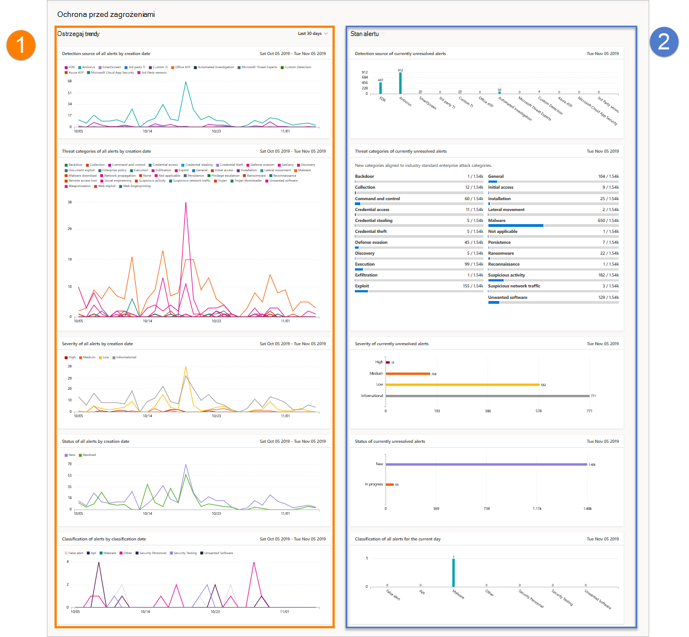

# Raport ochrony przed zagrożeniami w programie Microsoft Defender dla punktu końcowego

[!INCLUDE [Microsoft 365 Defender rebranding](../../includes/microsoft-defender.md)]

**Dotyczy:**
- [Microsoft Defender for Endpoint Plan 2](https://go.microsoft.com/fwlink/?linkid=2154037)
- [Microsoft 365 Defender](https://go.microsoft.com/fwlink/?linkid=2118804)

> Chcesz mieć dostęp do usługi Defender dla punktu końcowego? [Zarejestruj się, aby korzystać z bezpłatnej wersji próbnej.](https://signup.microsoft.com/create-account/signup?products=7f379fee-c4f9-4278-b0a1-e4c8c2fcdf7e&ru=https://aka.ms/MDEp2OpenTrial?ocid=docs-wdatp-pullalerts-abovefoldlink)

Raport ochrony przed zagrożeniami zawiera szczegółowe informacje o alertach generowanych w organizacji. Raport zawiera popularne informacje przedstawiające źródła wykrywania, kategorie, ważności, statusy, klasyfikacje i wyznaczanie alertów w czasie.

Pulpit nawigacyjny ma strukturę dwóch sekcji:

Sekcja|Opis
---|---
1|Alerty trendów
2|Podsumowanie alertu

## Ostrzegaj trendy
Domyślnie trendy alertów wyświetlają informacje alertów z 30-dniowego okresu kończącego się na ostatni pełny dzień. Aby uzyskać lepszą perspektywę trendów występujących w organizacji, możesz dostosować okres raportowania, dostosowując pokazywany okres. Aby dostosować przedział czasu, wybierz zakres czasu z listy rozwijanej:

- 30 dni
- 3 miesięcy
- 6 miesięcy
- Niestandardowe

> [!NOTE]
> Filtry te są stosowane tylko w sekcji trendów alertów. Nie wpływa to na sekcję podsumowania alertu.

## Podsumowanie alertu

Mimo że trendy alertów pokazują popularne informacje alertów, w podsumowaniu alertów są zawarte informacje alertów zawęgowane do bieżącego dnia.

 Podsumowanie alertu umożliwia przechodzenie do szczegółów określonej kolejki alertów z zastosowanym do niej odpowiednim filtrem. Na przykład kliknięcie paska EDR na karcie Źródła wykrywania spowoduje kolejkę alertów z wynikami, wyświetlając tylko alerty wygenerowane z EDR wykrywania.

> [!NOTE]
> Dane odzwierciedlone w sekcji podsumowania są objęte zakresem 180 dni przed datą bieżącą. Jeśli na przykład dzisiejszą datą jest 5 listopada 2019 r., dane w sekcji podsumowania będą odzwierciedlać liczby od 5 maja 2019 r. do 5 listopada 2019 r.
>
> Filtr zastosowany w sekcji trendów nie jest stosowany w sekcji podsumowania.

## Atrybuty alertów

Raport składa się z kart z następującymi atrybutami alertów:

- **Źródła wykrywania**: wyświetla informacje o czujnikach i technologiach wykrywania, które dostarczają danych używanych przez usługę Microsoft Defender for Endpoint do wyzwalania alertów.
- **Kategorie zagrożeń**: pokazuje typy zagrożeń lub działań ataków, które wyzwolą alerty, wskazując możliwe obszary, w których są skoncentrowane operacje zabezpieczeń.
- **Ważność**: pokazuje poziom ważności alertów, wskazując zbiorczy potencjalny wpływ zagrożeń dla organizacji oraz poziom reakcji potrzebnych do ich rozwiązania.
- **Stan**: pokazuje stan rozwiązania alertów, wskazując wydajność ręcznych odpowiedzi alertów i zautomatyzowanych działań naprawczych (jeśli są włączone).
- **Określanie &** klasyfikacji: pokazuje, jak sklasyfikowano alerty przy rozwiązywaniu problemów, czy sklasyfikowano je jako rzeczywiste zagrożenia (prawdziwe alerty), czy jako niepoprawne wykrywanie (alerty fałszowe). Na tych kartach powiązywane są także określenia rozwiązanych alertów, zapewniające dodatkowe informacje, takie jak typy znalezionych rzeczywistych zagrożeń lub normalne działania, które zostały niepoprawnie wykryte.

## Filtrowanie danych

Użyj podanych filtrów, aby uwzględnić lub wykluczyć alerty z określonymi atrybutami.

> [!NOTE]
> Filtry te są stosowane **do** wszystkich kart w raporcie.

Aby na przykład wyświetlić dane dotyczące tylko alertów o wysokim poziomie ważności:

1. W **obszarze Alerty & alerty** \>  \> **filtry > ważności** wybierz pozycję **Wysoka**.
2. Upewnij się, że wszystkie inne opcje w obszarze **Ważność są wyebrane** .
3. Wybierz **pozycję Zastosuj**.

## Temat pokrewny

- [Raport kondycji i zgodności urządzeń](machine-reports.md)
