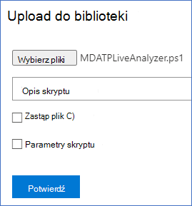

# <a name="collect-support-logs-in-microsoft-defender-for-endpoint-using-live-response"></a>Zbieranie dzienników pomocy technicznej w programie Microsoft Defender dla punktu końcowego przy użyciu funkcji odpowiedzi na żywo


**Dotyczy:**
- [Microsoft Defender for Endpoint Plan 2](https://go.microsoft.com/fwlink/?linkid=2154037)
- [Microsoft 365 Defender](https://go.microsoft.com/fwlink/?linkid=2118804)

> Chcesz mieć dostęp do usługi Defender dla punktu końcowego? [Zarejestruj się, aby korzystać z bezpłatnej wersji próbnej.](https://signup.microsoft.com/create-account/signup?products=7f379fee-c4f9-4278-b0a1-e4c8c2fcdf7e&ru=https://aka.ms/MDEp2OpenTrial?ocid=docs-wdatp-pullalerts-abovefoldlink)


Podczas kontaktowania się z pomocą techniczną może zostaćsz poproszony o dostarczenie pakietu wyjściowego narzędzia Microsoft Defender for Endpoint Client Analyzer.

Ten temat zawiera instrukcje dotyczące uruchamiania narzędzia za pośrednictwem usługi Live Response.

1. Pobierz odpowiedni skrypt
   - Tylko dzienniki czujnika aplikacji Microsoft Defender for Endpoint: [LiveAnalyzer.ps1 skryptu](https://aka.ms/MDELiveAnalyzer).
      - Pakiet wyników o przybliżonym rozmiarze: ~100 KB
   - Czujnik klienta programu Microsoft Defender for Endpoint i dzienniki oprogramowania antywirusowego: [LiveAnalyzer+MDAV.ps1 skrypt.](https://aka.ms/MDELiveAnalyzerAV)
       - Pakiet wyników o przybliżonym rozmiarze: ~10 Mb

2. [Zainicjuj sesję live response](live-response.md#initiate-a-live-response-session-on-a-device) na komputerze, który chcesz zbadać.

3. Wybierz **Upload plik do biblioteki**.

    

4. Wybierz **pozycję Wybierz plik**.

    

5. Zaznacz pobrany plik o nazwie MDELiveAnalyzer.ps1 a następnie kliknij pozycję **Potwierdź**

   

6. W trakcie sesji LiveResponse użyj poniższych poleceń, aby uruchomić analizatora i zebrać plik wyników:

    ```console
    Run MDELiveAnalyzer.ps1
    GetFile "C:\ProgramData\Microsoft\Windows Defender Advanced Threat Protection\Downloads\MDEClientAnalyzerResult.zip"
    ```

    [](images/analyzer-commands.png#lightbox)

> [!NOTE]
>
> - Najnowszą wersję Preview aplikacji MDEClientAnalyzer można pobrać tutaj: [https://aka.ms/Betamdeanalyzer](https://aka.ms/Betamdeanalyzer).
>
> - Skrypt LiveAnalyzer pobiera pakiet rozwiązywania problemów na komputerze docelowym z: https://mdatpclientanalyzer.blob.core.windows.net.
>
>   Jeśli nie możesz zezwolić komputerowi na osiągnięcie powyższego adresu URL, przekaż plik MDEClientAnalyzerPreview.zip do biblioteki przed uruchomieniem skryptu LiveAnalyzer:
>
>   ```console
>   PutFile MDEClientAnalyzerPreview.zip -overwrite
>   Run MDELiveAnalyzer.ps1
>   GetFile "C:\ProgramData\Microsoft\Windows Defender Advanced Threat Protection\Downloads\MDEClientAnalyzerResult.zip"
>   ```
>
> - Aby uzyskać więcej informacji na temat gromadzenia danych lokalnie na komputerze, jeśli komputer nie komunikuje się z usługami w chmurze programu Microsoft Defender for Endpoint lub nie jest widoczny w portalu programu Microsoft Defender for Endpoint zgodnie z oczekiwaniami, zobacz Weryfikowanie łączności klienta z usługą [Microsoft Defender](configure-proxy-internet.md#verify-client-connectivity-to-microsoft-defender-for-endpoint-service-urls) dla usługi punktów końcowych.
> 
> - Zgodnie [z opisem w](live-response-command-examples.md) przykładach poleceń na żywo możesz chcieć użyć symbolu "&" na końcu polecenia, aby zbierać dzienniki jako akcję tła:
>   ```console
>   Run MDELiveAnalyzer.ps1&
>   ```


## <a name="see-also"></a>Zobacz też
- [Omówienie analizatora klientów](overview-client-analyzer.md)
- [Pobieranie i uruchamianie analizatora klienta](download-client-analyzer.md)
- [Uruchamianie analizatora klienta na Windows](run-analyzer-windows.md)
- [Uruchamianie analizatora klienta w systemie macOS lub Linux](run-analyzer-macos-linux.md)
- [Zbieranie danych na potrzeby zaawansowanego rozwiązywania problemów na Windows](data-collection-analyzer.md)
- [Opis raportu w formacie HTML analizatora](analyzer-report.md)
