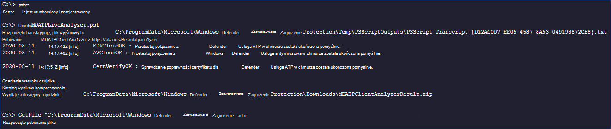

# <a name="collect-support-logs-in-microsoft-defender-for-endpoint-using-live-response"></a>Zbieranie dzienników pomocy technicznej w programie Ochrona punktu końcowego w usłudze Microsoft Defender przy użyciu funkcji odpowiedzi na żywo


**Dotyczy:**
- [Ochrona punktu końcowego w usłudze Microsoft Defender Plan 2](https://go.microsoft.com/fwlink/?linkid=2154037)
- [Microsoft 365 Defender](https://go.microsoft.com/fwlink/?linkid=2118804)

> Chcesz mieć dostęp do usługi Defender dla punktu końcowego? [Zarejestruj się, aby korzystać z bezpłatnej wersji próbnej.](https://signup.microsoft.com/create-account/signup?products=7f379fee-c4f9-4278-b0a1-e4c8c2fcdf7e&ru=https://aka.ms/MDEp2OpenTrial?ocid=docs-wdatp-pullalerts-abovefoldlink)


Podczas kontaktowania się z pomocą techniczną może zostaćsz poproszony o podanie pakietu wyjściowego narzędzia Ochrona punktu końcowego w usłudze Microsoft Defender Analizator klienta.

Ten temat zawiera instrukcje dotyczące uruchamiania narzędzia za pośrednictwem usługi Live Response.

1. Pobieranie i pobieranie wymaganych skryptów dostępnych w podfolderze "Narzędzia" analizatora Ochrona punktu końcowego w usłudze Microsoft Defender [klienta](https://aka.ms/BetaMDEAnalyzer). <br>
Aby na przykład pobrać podstawowy czujnik i dzienniki kondycji urządzenia, uzyskaj zdalnego dostępu ".. \Tools\MDELiveAnalyzer.ps1".<br>
Jeśli potrzebujesz również dzienników obsługi oprogramowania antywirusowego Defender (MpSupportFiles.cab), pobierz ".. \Tools\MDELiveAnalyzerAV.ps1" 

2. [Zainicjuj sesję live response](live-response.md#initiate-a-live-response-session-on-a-device) na komputerze, który chcesz zbadać.

3. Wybierz **Upload plik do biblioteki**.

   :::image type="content" source="images/upload-file.png" alt-text="Plik przekazywania" lightbox="images/upload-file.png":::

4. Wybierz **pozycję Wybierz plik**.

   :::image type="content" source="images/choose-file.png" alt-text="Przycisk wybierz plik-1" lightbox="images/choose-file.png":::

5. Zaznacz pobrany plik o nazwie MDELiveAnalyzer.ps1 a następnie kliknij pozycję **Potwierdź**

   :::image type="content" source="images/analyzer-file.png" alt-text="The choose file button-2" lightbox="images/analyzer-file.png":::

6. W trakcie sesji LiveResponse użyj poniższych poleceń, aby uruchomić analizatora i zebrać plik wyników:

    ```console
    Run MDELiveAnalyzer.ps1
    GetFile "C:\ProgramData\Microsoft\Windows Defender Advanced Threat Protection\Downloads\MDEClientAnalyzerResult.zip"
    ```

    [](images/analyzer-commands.png#lightbox)

> [!NOTE]
>
> - Najnowszą wersję Preview aplikacji MDEClientAnalyzer można pobrać tutaj: [https://aka.ms/Betamdeanalyzer](https://aka.ms/Betamdeanalyzer).
>
> - Skrypt LiveAnalyzer pobiera pakiet rozwiązywania problemów na komputerze docelowym z: https://mdatpclientanalyzer.blob.core.windows.net.
>
>   Jeśli nie możesz zezwolić komputerowi na osiągnięcie powyższego adresu URL, przekaż plik MDEClientAnalyzerPreview.zip do biblioteki przed uruchomieniem skryptu LiveAnalyzer:
>
>   ```console
>   PutFile MDEClientAnalyzerPreview.zip -overwrite
>   Run MDELiveAnalyzer.ps1
>   GetFile "C:\ProgramData\Microsoft\Windows Defender Advanced Threat Protection\Downloads\MDEClientAnalyzerResult.zip"
>   ```
>
> - Aby uzyskać więcej informacji na temat gromadzenia danych lokalnie na komputerze w przypadku, gdy komputer nie komunikuje się z usługami firmy Ochrona punktu końcowego w usłudze Microsoft Defender w chmurze lub nie jest widoczny w portalu usługi Ochrona punktu końcowego w usłudze Microsoft Defender zgodnie z oczekiwaniami, [zobacz Sprawdź łączność klienta z Ochrona punktu końcowego w usłudze Microsoft Defender URL usługi](configure-proxy-internet.md#verify-client-connectivity-to-microsoft-defender-for-endpoint-service-urls).
> 
> - Zgodnie [z opisem w](live-response-command-examples.md) przykładach poleceń na żywo możesz chcieć użyć symbolu "&" na końcu polecenia, aby zbierać dzienniki jako akcję tła:
>   ```console
>   Run MDELiveAnalyzer.ps1&
>   ```


## <a name="see-also"></a>Zobacz też
- [Omówienie analizatora klientów](overview-client-analyzer.md)
- [Pobieranie i uruchamianie analizatora klienta](download-client-analyzer.md)
- [Uruchamianie analizatora klienta na Windows](run-analyzer-windows.md)
- [Uruchamianie analizatora klienta w systemie macOS lub Linux](run-analyzer-macos-linux.md)
- [Zbieranie danych na potrzeby zaawansowanego rozwiązywania problemów na Windows](data-collection-analyzer.md)
- [Opis raportu w formacie HTML analizatora](analyzer-report.md)
