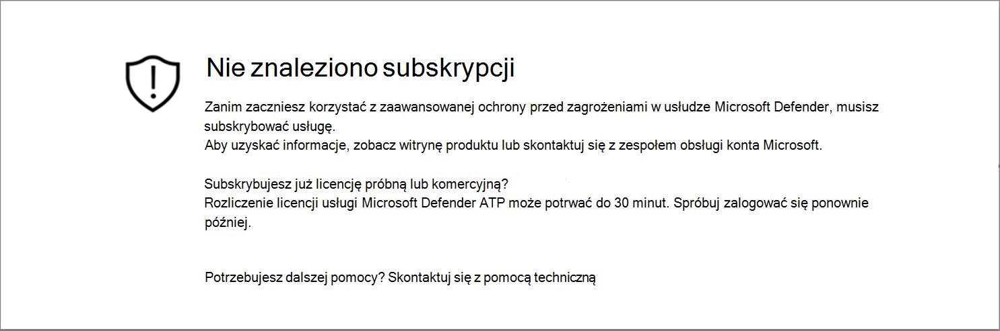
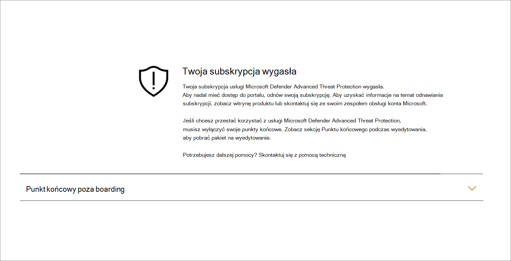
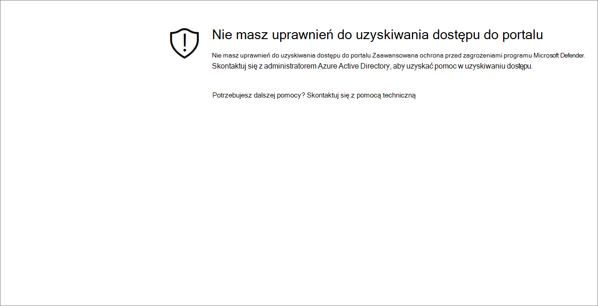

# Rozwiązywanie problemów z dostępem do subskrypcji i portalu

[!INCLUDE [Microsoft 365 Defender rebranding](../../includes/microsoft-defender.md)]

**Dotyczy:**

- [Microsoft Defender for Endpoint Plan 1](https://go.microsoft.com/fwlink/p/?linkid=2154037)
- [Microsoft Defender for Endpoint Plan 2](https://go.microsoft.com/fwlink/p/?linkid=2154037)
- [Microsoft 365 Defender](https://go.microsoft.com/fwlink/?linkid=2118804)

> Chcesz mieć dostęp do programu Microsoft Defender dla punktu końcowego? [Zarejestruj się, aby korzystać z bezpłatnej wersji próbnej.](https://signup.microsoft.com/create-account/signup?products=7f379fee-c4f9-4278-b0a1-e4c8c2fcdf7e&ru=https://aka.ms/MDEp2OpenTrial?ocid=docs-wdatp-troublshootonboarding-abovefoldlink)

Ta strona zawiera szczegółowe kroki rozwiązywania problemów, które mogą wystąpić podczas konfigurowania usługi programu Microsoft Defender dla punktu końcowego.

Jeśli zostanie wyświetlony komunikat o błędzie, Microsoft 365 Defender szczegółowe wyjaśnienie przyczyny problemu i zostaną podane odpowiednie linki.

## Nie znaleziono subskrypcji

Jeśli podczas uzyskiwania dostępu do usługi Microsoft 365 Defender zostanie wyświetlony komunikat  Nie znaleziono subskrypcji, oznacza to, że Azure Active Directory (Azure AD) używany do logowania użytkownika do portalu, nie ma licencji programu Microsoft Defender dla punktu końcowego.

Potencjalne powody:

- Licencje Windows E5 i Office E5 to oddzielne licencje.
- Licencja została zakupiona, ale nie jest aprowowana w tym wystąpieniu usługi Azure AD.
  - Może to być problem z inicjowaniem obsługi licencji.
  - Może to być przypadkowo aprowizowana licencja na inny Microsoft Azure AD niż ta używana do uwierzytelniania w usłudze.

W obu przypadkach należy skontaktować się z pomocą techniczną firmy Microsoft: [General Microsoft Defender for Endpoint Support lub](https://support.microsoft.com/getsupport?wf=0&tenant=ClassicCommercial&oaspworkflow=start_1.0.0.0&locale=en-us&supportregion=en-us&pesid=16055&ccsid=636419533611396913) [Volume license support](https://www.microsoft.com/licensing/servicecenter/Help/Contact.aspx).

## Twoja subskrypcja wygasła

Jeśli podczas uzyskiwania dostępu Microsoft 365 Defender się komunikat Twoja subskrypcja wygasła, Twoja subskrypcja usługi online wygasła. Subskrypcja usługi Microsoft Defender for Endpoint, podobnie jak każda inna subskrypcja usługi online, ma datę wygaśnięcia.

W dowolnym momencie możesz odnowić lub przedłużyć licencję. Podczas uzyskiwania dostępu do portalu po dacie wygaśnięcia zostanie  wyświetlony komunikat Twoja subskrypcja zostanie wyświetlony komunikat z opcją pobrania pakietu wynosięcia urządzenia, jeśli nie odnowisz licencji.

> [!NOTE]
> Ze względów bezpieczeństwa pakiet używany na urządzeniach offboardowych wygaśnie po 30 dniach od daty jego pobrania. Pakiety wynoszące wygasłe wysłane na urządzenie zostaną odrzucone. Podczas pobierania pakietu wynegocjowego zostaniesz o nim powiadomiony(-a) o dacie wygaśnięcia pakietów, a także w nazwie pakietu.

## Nie masz uprawnień do uzyskiwania dostępu do portalu

Jeśli otrzymasz wiadomość w przypadku, gdy nie masz uprawnień do uzyskiwania dostępu do **portalu, musisz** pamiętać, że program Microsoft Defender for Endpoint to produkt monitorowania zabezpieczeń, badania zdarzeń i reagowania na incydenty, dlatego dostęp do niego jest ograniczany i kontrolowany przez użytkownika.
Aby uzyskać więcej informacji, zobacz [**Przypisywanie dostępu użytkownika do portalu**](/windows/threat-protection/windows-defender-atp/assign-portal-access-windows-defender-advanced-threat-protection).

## Dane nie są obecnie dostępne w niektórych sekcjach portalu

Jeśli pulpit nawigacyjny portalu i inne sekcje zawierają komunikat o błędzie, taki jak "Dane obecnie nie są dostępne":

Musisz zezwolić na wszystkie `security.windows.com` poddomeny w jej obszarze w przeglądarce internetowej. Na przykład `*.security.windows.com`.

## Problemy z komunikacją w portalu

Jeśli wystąpią problemy z uzyskaniem dostępu do portalu, brakjącymi danymi lub ograniczeniem dostępu do części portalu, musisz sprawdzić, czy następujące adresy URL są dozwolone i otwarte do komunikacji.

- `*.blob.core.windows.net`
- `crl.microsoft.com`
- `https://*.microsoftonline-p.com`
- `https://*.security.microsoft.com`
- `https://automatediracs-eus-prd.security.microsoft.com`
- `https://login.microsoftonline.com`
- `https://login.windows.net`
- `https://onboardingpackagescusprd.blob.core.windows.net`
- `https://secure.aadcdn.microsoftonline-p.com`
- `https://security.microsoft.com`
- `https://static2.sharepointonline.com`
