# <a name="troubleshoot-microsoft-defender-for-endpoint-onboarding-issues"></a>Rozwiązywanie problemów z dołączaniem do programu Microsoft Defender for Endpoint

[!INCLUDE [Microsoft 365 Defender rebranding](../../includes/microsoft-defender.md)]


**Dotyczy:**

- [Microsoft Defender for Endpoint Plan 2](https://go.microsoft.com/fwlink/p/?linkid=2154037)
- Windows Server 2012 R2
- System Windows Server 2016
- [Microsoft 365 Defender](https://go.microsoft.com/fwlink/?linkid=2118804)

> Chcesz mieć dostęp do usługi Defender dla punktu końcowego? [Zarejestruj się, aby korzystać z bezpłatnej wersji próbnej.](https://signup.microsoft.com/create-account/signup?products=7f379fee-c4f9-4278-b0a1-e4c8c2fcdf7e&ru=https://aka.ms/MDEp2OpenTrial?ocid=docs-wdatp-pullalerts-abovefoldlink)

Jeśli wystąpią problemy, może być konieczne rozwiązanie problemów z procesem dołączania programu Microsoft Defender for Endpoint.
Ta strona zawiera szczegółowe kroki rozwiązywania problemów z wdrażaniem, które mogą wystąpić podczas wdrażania przy użyciu jednego z narzędzi wdrażania, oraz typowe błędy, które mogą wystąpić na urządzeniach.

Przed rozpoczęciem rozwiązywania problemów z narzędziami dołączania należy sprawdzić, czy są spełnione minimalne wymagania dotyczące urządzeń dołączających do usług. [Dowiedz się więcej o wymaganiach dotyczących licencjonowania, sprzętu i oprogramowania, które należy spełnić, aby wdowysyłać urządzenia do usługi](minimum-requirements.md).

## <a name="troubleshoot-issues-with-onboarding-tools"></a>Rozwiązywanie problemów z narzędziami dołączania

Jeśli po zakończeniu procesu dołączania urządzenia nie są już na liście Urządzenia po upływie godziny[](investigate-machines.md), może to wskazywać na problem z włozeniem lub łącznością.

### <a name="troubleshoot-onboarding-when-deploying-with-group-policy"></a>Rozwiązywanie problemów z dołączaniem podczas wdrażania za pomocą aplikacji zasady grupy

Wdrożenie za zasady grupy jest wykonywane przez uruchomienie skryptu wdrażania na urządzeniach. Konsola zasady grupy nie wskazuje, czy wdrożenie zakończyło się pomyślnie, czy nie.

Jeśli po zakończeniu procesu dołączania urządzenia nie są już na liście Urządzenia po upływie godziny[](investigate-machines.md), możesz sprawdzić wyniki skryptu na tych urządzeniach. Aby uzyskać więcej informacji, zobacz [Rozwiązywanie problemów z wdrażaniem podczas wdrażania za pomocą skryptu](#troubleshoot-onboarding-when-deploying-with-a-script).

Jeśli skrypt zostanie pomyślnie ukończony, zobacz Rozwiązywanie problemów z dołączaniem na urządzeniach [, aby uzyskać](#troubleshoot-onboarding-issues-on-the-device) informacje o dodatkowych błędach, które mogą wystąpić.

### <a name="troubleshoot-onboarding-issues-when-deploying-with-microsoft-endpoint-configuration-manager"></a>Rozwiązywanie problemów z dołączaniem podczas wdrażania za pomocą aplikacji Microsoft Endpoint Configuration Manager

W przypadku korzystania z urządzeń korzystających z następujących wersji programu Menedżer konfiguracji:

- Microsoft Endpoint Configuration Manager
- System Center 2012 Menedżer konfiguracji
- System Center 2012 R2 Menedżer konfiguracji

Wdrożenie przy użyciu powyższych wersji pakietu Menedżer konfiguracji jest wykonywane przez uruchomienie skryptu dołączania na urządzeniach. Możesz śledzić wdrożenie w konsoli Menedżer konfiguracji sieci.

Jeśli wdrożenie się nie powiedzie, możesz sprawdzić wynik skryptu na urządzeniach.

Jeśli pomyślnie ukończono dołączanie, ale urządzenia nie są wyświetlane na liście Urządzenia po  upływie godziny, zobacz Rozwiązywanie problemów z [](#troubleshoot-onboarding-issues-on-the-device) dołączaniem na urządzeniu, aby uzyskać informacje o dodatkowych błędach, które mogą wystąpić.

### <a name="troubleshoot-onboarding-when-deploying-with-a-script"></a>Rozwiązywanie problemów z dołączaniem podczas wdrażania za pomocą skryptu

**Sprawdź wynik skryptu na urządzeniu:**

1. Kliknij **przycisk Start**, wpisz **podgląd zdarzeń** i naciśnij klawisz **Enter**.

2. Przejdź do **Windows Dzienniki.** \> 

3. Poszukaj zdarzenia w źródle zdarzeń **WDATPOnboarding** .

Jeśli skrypt nie powiedzie się, a zdarzenie jest błędem, możesz sprawdzić identyfikator zdarzenia w poniższej tabeli, aby uzyskać pomoc w rozwiązywaniu problemów.

> [!NOTE]
> Następujące identyfikatory zdarzeń są specyficzne tylko dla skryptu dołączania.

<br>

****

|Identyfikator zdarzenia|Typ błędu|Kroki rozwiązywania problemu|
|:---:|---|---|
|`5`|Znaleziono dane wynoszone, ale nie można ich usunąć|Sprawdź uprawnienia do rejestru, a w szczególności <p> `HKLM\SOFTWARE\Policies\Microsoft\Windows Advanced Threat Protection`.|
|`10`|Danych dołączania nie można zapisywać w rejestrze|Sprawdź uprawnienia do rejestru, a w szczególności <p> `HKLM\SOFTWARE\Policies\Microsoft\Windows Advanced Threat Protection`. <p> Sprawdź, czy skrypt został uruchomiony jako administrator.|
|`15`|Nie można uruchomić usługi SENSE|Sprawdzanie kondycji usługi (`sc query sense` polecenie). Upewnij się, że nie jest w stanie pośrednim (na przykład *Pending_Stopped*' lub *"Pending_Running")* i spróbuj ponownie uruchomić skrypt (z uprawnieniami administratora). <p> Jeśli na urządzeniu działa Windows 10 wersji 1607 `sc query sense` `START_PENDING`i ponownie zostanie uruchomione polecenie, uruchom ponownie urządzenie. Jeśli ponowne uruchomienie urządzenia nie rozwiązało problemu, uaktualnij go do aktualizacji KB4015217 i spróbuj ponownie wboardować.|
|`15`|Nie można uruchomić usługi SENSE|Jeśli komunikat o błędzie jest taki: Wystąpił błąd systemu 577 lub błąd 1058, należy włączyć sterownik Program antywirusowy Microsoft Defender ELAM. Aby uzyskać instrukcje, zobacz Zapewnianie, że [](#ensure-that-microsoft-defender-antivirus-is-not-disabled-by-a-policy) Program antywirusowy Microsoft Defender nie jest wyłączone przez zasady.|
|`30`|Nie można czekać na uruchomienie usługi przez skrypt|Uruchamianie usługi mogło zostać wykonane dłużej lub wystąpiły błędy podczas próby uruchomienia. Aby uzyskać więcej informacji o zdarzeniach i błędach związanych z sensem, zobacz [Przeglądanie zdarzeń i błędów przy użyciu przeglądarki zdarzeń](event-error-codes.md).|
|`35`|Skrypt nie znalazł potrzebnej wartości rejestru stanu dołączania|Przy pierwszym uruchamianiu usługi SENSE jest zapisywany stan dołączania do lokalizacji rejestru. <p> `HKLM\SOFTWARE\Microsoft\Windows Advanced Threat Protection\Status`. <p> Skrypt nie znalazł go po kilku sekundach. Możesz je przetestować ręcznie i sprawdzić, czy są dostępne. Aby uzyskać więcej informacji o zdarzeniach i błędach związanych z sensem, zobacz [Przeglądanie zdarzeń i błędów przy użyciu przeglądarki zdarzeń](event-error-codes.md).|
|`40`|Stan dołączania do usługi SENSE nie jest ustawiony na **1**|Usługa SENSE nie została prawidłowo w naniesiena. Aby uzyskać więcej informacji o zdarzeniach i błędach związanych z sensem, zobacz [Przeglądanie zdarzeń i błędów przy użyciu przeglądarki zdarzeń](event-error-codes.md).|
|`65`|Niewystarczające uprawnienia|Uruchom ponownie skrypt z uprawnieniami administratora.|
|

### <a name="troubleshoot-onboarding-issues-using-microsoft-intune"></a>Rozwiązywanie problemów z dołączaniem przy użyciu Microsoft Intune

Możesz użyć Microsoft Intune do sprawdzenia kodów błędów i próby rozwiązania przyczyny problemu.

Jeśli skonfigurowano zasady w usłudze Intune i nie są one propagowane na urządzeniach, może być konieczne skonfigurowanie automatycznej rejestracji mdM.

Skorzystaj z poniższych tabel, aby zrozumieć możliwe przyczyny problemów podczas dołączania do pracy:

- Microsoft Intune kodów błędów i OMA-URIs tabeli
- Znane problemy dotyczące tabeli niezgodności
- Tabela dzienników zdarzeń zarządzania urządzeniami przenośnymi (MDM)

Jeśli żaden z dzienników zdarzeń i czynności rozwiązywania problemów nie działają, pobierz skrypt Local z  sekcji Zarządzanie urządzeniami w portalu i uruchom go w wierszu polecenia z podwyższonym poziomem uprawnień.

#### <a name="microsoft-intune-error-codes-and-oma-uris"></a>Microsoft Intune kodów błędów i OMA-URIs

<br>

****

|Hex kodu błędu|Kod błędu Dec|Opis błędu|OMA-URI|Możliwe kroki przyczyn i rozwiązywania problemów|
|:---:|---|---|---|---|
|0x87D1FDE8|-2016281112|Działania naprawcze nie powiodły się|Wniesienie <p> Wyniesienie|**Możliwa przyczyna:** Wnonięcie lub wynoszenie nie powiodło się w przypadku niewłaściwego obiektu blob: nieprawidłowy podpis lub brakujące pola PreviousOrgIds. <p> **Procedura rozwiązywania problemów:** <p> Sprawdź identyfikatory zdarzeń [w sekcji dziennika](#view-agent-onboarding-errors-in-the-device-event-log) zdarzeń urządzenia w przypadku błędów dołączania agenta widoku. <p> Sprawdź dzienniki zdarzeń MDM w poniższej tabeli lub postępuj zgodnie z instrukcjami w tece Diagnozowanie niepowodzeń usługi [MDM w](/windows/client-management/mdm/diagnose-mdm-failures-in-windows-10) Windows.|
||||Wniesienie <p> Wyniesienie <p> SampleSharing|**Możliwa przyczyna:** Klucz rejestru programu Microsoft Defender for Endpoint Policy nie istnieje lub klient OMA DM nie ma uprawnień do zapisu w tym kluczu. <p> **Procedura rozwiązywania problemów:** Upewnij się, że istnieje następujący klucz rejestru: `HKEY_LOCAL_MACHINE\SOFTWARE\Policies\Microsoft\Windows Advanced Threat Protection` <p> Jeśli nie istnieje, otwórz polecenie z podwyższonym poziomem uprawnień i dodaj klucz.|
||||SenseIsRunning <p> OnboardingState <p> OrgId|**Możliwa przyczyna:** Próba rozwiązania problemów za pomocą właściwości tylko do odczytu. Dołączanie nie powiodło się. <p> **Procedura rozwiązywania problemów:** Zapoznaj się z instrukcjami rozwiązywania [problemów w tece Rozwiązywanie problemów z dołączaniem na urządzeniu](#troubleshoot-onboarding-issues-on-the-device). <p> Sprawdź dzienniki zdarzeń MDM w poniższej tabeli lub postępuj zgodnie z instrukcjami w tece Diagnozowanie niepowodzeń usługi [MDM w](/windows/client-management/mdm/diagnose-mdm-failures-in-windows-10) Windows.|
||||Wszystkie|**Możliwa przyczyna:** Spróbuj wdrożyć program Microsoft Defender for Endpoint na nie obsługiwanej sku/platformie, zwłaszcza Holographic SKU. <p> Obecnie obsługiwane platformy: <p> Enterprise, Education i Professional.<p> Serwer nie jest obsługiwany.|
|0x87D101A9|-2016345687|SyncML(425): Żądane polecenie nie powiodło się, ponieważ nadawca nie ma odpowiednich uprawnień kontroli dostępu do adresata.|Wszystkie|**Możliwa przyczyna:** Spróbuj wdrożyć program Microsoft Defender for Endpoint na nie obsługiwanej sku/platformie, zwłaszcza Holographic SKU.<p> Obecnie obsługiwane platformy: <p> Enterprise, Education i Professional.|
|

#### <a name="known-issues-with-non-compliance"></a>Znane problemy dotyczące braku zgodności

W poniższej tabeli przedstawiono informacje o problemach związanych z niezgodnościami i o tym, jak można je rozwiązać.

<br>

****

|Sprawa|Symptomy|Możliwe kroki przyczyn i rozwiązywania problemów|
|:---:|---|---|
|`1`|Urządzenie jest zgodne przez usługę SenseIsRunning OMA-URI. Ale jest niezgodne przez orgid, dołączanie i dołączanieState OMA-URI.|**Możliwa przyczyna:** Sprawdź, czy użytkownik przekazał OOBE po Windows instalacji lub uaktualnieniu. Podczas dołączania do systemu OOBE nie można ukończyć, ale sense już działa. <p> **Procedura rozwiązywania problemów:** Poczekaj na ukończenie pracy systemu OOBE.|
|`2`|Urządzenie jest zgodne przez interfejsy OMA-URI organizacji, dołączania i dołączania, ale jest niezgodne przez senseisrunning OMA-URI.|**Możliwa przyczyna:** Typ uruchamiania usługi Sense service jest ustawiony jako "Opóźnione rozpoczęcie". Czasami powoduje to, że Microsoft Intune zgłasza urządzenie jako niezgodne przez SenseIsRunning, gdy sesja DM występuje przy uruchomieniu systemu. <p> **Procedura rozwiązywania problemów:** Problem powinien zostać automatycznie rozwiązany w ciągu 24 godzin.|
|`3`|Urządzenie jest niezgodne|**Procedura rozwiązywania problemów:** Upewnij się, że zasady dołączania i wynoszania nie są wdrażane jednocześnie na tym samym urządzeniu.|
|

#### <a name="mobile-device-management-mdm-event-logs"></a>Dzienniki zdarzeń zarządzania urządzeniami przenośnymi

Wyświetlanie dzienników zdarzeń usługi MDM w celu rozwiązywania problemów, które mogą się pojawić podczas dołączania:

Nazwa dziennika: Microsoft\Windows\DeviceManagement-EnterpriseDiagnostics-Provider

Nazwa kanału: Administrator

<br>

****

|Identyfikator|Ważność|Opis zdarzenia|Procedura rozwiązywania problemów|
|---|---|---|---|
|1819|Error|Program Microsoft Defender for Endpoint CSP: Nie można ustawić wartości węzła. NodeId: (%1), TokenName: (%2), Result: (%3).|Pobierz [aktualizację skumulowaną dla Windows 10 1607](https://go.microsoft.com/fwlink/?linkid=829760).|
|

## <a name="troubleshoot-onboarding-issues-on-the-device"></a>Rozwiązywanie problemów z dołączaniem na urządzeniu

Jeśli używane narzędzia wdrażania nie wskazują błędu w procesie wdrażania, ale urządzenia nadal nie pojawiają się na liście urządzeń w ciągu godziny, przejdź do poniższych tematów weryfikacji, aby sprawdzić, czy wystąpił błąd u agenta programu Microsoft Defender for Endpoint.

- [Wyświetlanie błędów dołączania agenta w dzienniku zdarzeń urządzenia](#view-agent-onboarding-errors-in-the-device-event-log)
- [Upewnij się, że usługa danych diagnostycznych jest włączona](#ensure-the-diagnostics-service-is-enabled)
- [Upewnij się, że usługa jest ustawiona na uruchomienie](#ensure-the-service-is-set-to-start)
- [Upewnij się, że urządzenie ma połączenie internetowe](#ensure-the-device-has-an-internet-connection)
- [Zapewnianie Program antywirusowy Microsoft Defender że zasady nie wyłączą tego ustawienia](#ensure-that-microsoft-defender-antivirus-is-not-disabled-by-a-policy)

### <a name="view-agent-onboarding-errors-in-the-device-event-log"></a>Wyświetlanie błędów dołączania agenta w dzienniku zdarzeń urządzenia

1. Kliknij **przycisk Start**, wpisz **podgląd zdarzeń** i naciśnij klawisz **Enter**.

2. W **okienku Podgląd zdarzeń (lokalnie)** rozwiń pozycję **Aplikacje i usługi Logs** \> **Microsoft** \> **Windows** \> **SENSE**.

   > [!NOTE]
   > SENSE to wewnętrzna nazwa używana do obsługi czujnika zachowania, który służy do obsługi programu Microsoft Defender for Endpoint.

3. Wybierz **pozycję Operacyjne** , aby załadować dziennik.

4. W **okienku Akcja** kliknij pozycję **Filtruj bieżący dziennik**.

5. Na karcie **Filtr** w obszarze **Poziom zdarzenia wybierz** pozycję **Krytyczne**, **Ostrzeżenie** i **Błąd**, a następnie kliknij przycisk **OK**.

   

6. Zdarzenia, które mogą wskazywać problemy, pojawią się w **okienku Operacyjne** . Możesz spróbować je rozwiązać w oparciu o rozwiązania z poniższej tabeli:

   <br>

   ****

   |Identyfikator zdarzenia|Komunikat|Kroki rozwiązywania problemu|
   |:---:|---|---|
   |`5`|Program Microsoft Defender for Endpoint service failed to connect to the server at _variable_|[Upewnij się, że urządzenie ma dostęp do Internetu](#ensure-the-device-has-an-internet-connection).|
   |`6`|Usługa Microsoft Defender for Endpoint nie jest wnoowana i nie znaleziono parametrów dołączania. Kod błędu: _zmienna_|[Uruchom ponownie skrypt dołączania](configure-endpoints-script.md).|
   |`7`|Nie można odczytać parametrów dołączania do usługi Microsoft Defender for Endpoint. Kod błędu: _zmienna_|[Upewnij się, że urządzenie ma dostęp do Internetu](#ensure-the-device-has-an-internet-connection), a następnie ponownie uruchom cały proces dołączania.|
   |`9`|Zmiana typu uruchomienia usługi Microsoft Defender for Endpoint nie powiodła się. Kod błędu: zmienna|Jeśli zdarzenie miało miejsce podczas dołączania, uruchom ponownie komputer i ponownie spróbuj uruchomić skrypt dołączania. Aby uzyskać więcej informacji, zobacz [Ponownie uruchom skrypt dołączania](configure-endpoints-script.md). <br><br>Jeśli zdarzenie miało miejsce podczas wynegocjowania, skontaktuj się z pomocą techniczną.|
   |`10`|Usługa Microsoft Defender for Endpoint nie może zachowywać informacji o dołączaniu. Kod błędu: zmienna|Jeśli zdarzenie miało miejsce podczas dołączania, ponownie spróbuj uruchomienie skryptu dołączania. Aby uzyskać więcej informacji, zobacz [Ponownie uruchom skrypt dołączania](configure-endpoints-script.md). <br><br>Jeśli problem będzie nadal występował, skontaktuj się z pomocą techniczną.|
   |`15`|Program Microsoft Defender for Endpoint nie może uruchomić kanału poleceń z adresem URL: _zmienna_|[Upewnij się, że urządzenie ma dostęp do Internetu](#ensure-the-device-has-an-internet-connection).|
   |`17`|Nie można zmienić lokalizacji usługi połączonych usług user experiences i telemetrii programu Microsoft Defender dla punktu końcowego. Kod błędu: zmienna|[Uruchom ponownie skrypt dołączania](configure-endpoints-script.md). Jeśli problem będzie nadal występował, skontaktuj się z pomocą techniczną.|
   |`25`|Nie można zresetować stanu kondycji usługi Microsoft Defender for Endpoint w rejestrze. Kod błędu: _zmienna_|Skontaktuj się z pomocą techniczną.|
   |`27`|Nie można włączyć programu Microsoft Defender dla trybu punktu końcowego w Windows Defender. Proces dołączania nie powiódł się. Kod błędu: zmienna|Skontaktuj się z pomocą techniczną.|
   |`29`|Nie można odczytać parametrów wynoszowania. Typ błędu: %1, Kod błędu: %2, Opis: %3|Upewnij się, że urządzenie ma dostęp do Internetu, a następnie ponownie uruchom cały proces wywęzienia.|
   |`30`|Nie można wyłączyć trybu $(build.sense.productDisplayName) w programie Microsoft Defender for Endpoint. Kod błędu: %1|Skontaktuj się z pomocą techniczną.|
   |`32`|Usługa $(build.sense.productDisplayName) nie powiodła się po zakończeniu procesu wynoszania. Kod błędu: %1|Sprawdź, czy typ uruchomienia usługi jest ręczny i czy ponownie uruchom urządzenie.|
   |`55`|Nie można utworzyć autologowania bezpiecznego etW. Kod błędu: %1|Uruchom ponownie urządzenie.|
   |`63`|Aktualizowanie typu uruchomienia usługi zewnętrznej. Nazwa: %1, rzeczywisty typ rozpoczęcia: %2, oczekiwany typ rozpoczęcia: %3, kod wyjścia: %4|Zidentyfikuj, co powoduje zmiany w typie uruchomienia wymienionej usługi. Jeśli kod zakończenia jest innego niż 0, należy ręcznie naprawić typ początku, aby był oczekiwanym typem początku.|
   |`64`|Uruchamianie zatrzymało usługę zewnętrzną. Nazwa: %1, kod wyjścia: %2|Jeśli zdarzenie nadal się pojawia, skontaktuj się z pomocą techniczną.|
   |`68`|Typ uruchomienia usługi jest nieoczekiwany. Nazwa usługi: %1, rzeczywisty typ rozpoczęcia: %2, oczekiwany typ rozpoczęcia: %3|Zidentyfikuj, co powoduje zmiany w typie początku. Naprawianie wymienionego typu uruchomienia usługi.|
   |`69`|Usługa została zatrzymana. Nazwa usługi: %1|Uruchom wymienioną usługę. Jeśli ten problem nie ustąpi, skontaktuj się z pomocą techniczną.|
   |

Na urządzeniu znajdują się dodatkowe składniki, od których zależy agent programu Microsoft Defender for Endpoint. Jeśli w dzienniku zdarzeń agenta programu Microsoft Defender for Endpoint nie ma błędów związanych z dołączaniem, postępuj zgodnie z poniższymi krokami, aby upewnić się, że dodatkowe składniki są poprawnie skonfigurowane.

<span id="ensure-the-diagnostics-service-is-enabled" />

### <a name="ensure-the-diagnostic-data-service-is-enabled"></a>Upewnij się, że usługa danych diagnostycznych jest włączona

Jeśli urządzenia nie zgłaszają się poprawnie, może być konieczne sprawdzenie, czy usługa Windows jest automatycznie uruchamiana i działa na urządzeniu. Usługa mogła zostać wyłączona przez inne programy lub zmiany w konfiguracji użytkownika.

Najpierw upewnij się, że usługa jest ustawiona tak, aby uruchamiała się automatycznie podczas uruchamiania Windows, a następnie sprawdź, czy usługa jest obecnie uruchomiona (i uruchom ją, jeśli nie jest).

### <a name="ensure-the-service-is-set-to-start"></a>Upewnij się, że usługa jest ustawiona na uruchomienie

**Użyj wiersza polecenia, aby sprawdzić typ uruchamiania Windows danych diagnostycznych**:

1. Otwórz wiersz polecenia z podwyższonym poziomem uprawnień na urządzeniu:

   a. Kliknij **przycisk Start**, wpisz **cmd** i naciśnij klawisz **Enter**.

   b. Kliknij prawym przyciskiem myszy **pozycję Wiersz polecenia i** wybierz **pozycję Uruchom jako administrator**.

2. Wprowadź następujące polecenie i naciśnij klawisz **Enter**:

   ```console
   sc qc diagtrack
   ```

   Jeśli usługa jest włączona, wynik powinien wyglądać tak, jak na poniższym zrzucie ekranu:

   

   Jeśli to `START_TYPE` ustawienie nie jest ustawione `AUTO_START`na , musisz skonfigurować usługę tak, aby uruchamiała się automatycznie.

**Użyj wiersza polecenia, aby ustawić automatyczne uruchamianie Windows danych diagnostycznych:**

1. Otwórz wiersz polecenia z podwyższonym poziomem uprawnień na urządzeniu:

   a. Kliknij **przycisk Start**, wpisz **cmd** i naciśnij klawisz **Enter**.

   b. Kliknij prawym przyciskiem myszy **pozycję Wiersz polecenia i** wybierz **pozycję Uruchom jako administrator**.

2. Wprowadź następujące polecenie i naciśnij klawisz **Enter**:

   ```console
   sc config diagtrack start=auto
   ```

3. Zostanie wyświetlony komunikat o sukcesie. Sprawdź zmianę, wprowadzając następujące polecenie, a następnie naciśnij klawisz **Enter**:

   ```console
   sc qc diagtrack
   ```

4. Uruchom usługę. W wierszu polecenia wpisz następujące polecenie i naciśnij klawisz **Enter**:

   ```console
   sc start diagtrack
   ```

### <a name="ensure-the-device-has-an-internet-connection"></a>Upewnij się, że urządzenie ma połączenie internetowe

Czujnik programu Microsoft Defender for Endpoint wymaga, Windows Http (WinHTTP) firmy Microsoft do zgłaszania danych czujnika i komunikowania się z usługą Microsoft Defender for Endpoint.

System WinHTTP jest niezależny od ustawień serwera proxy przeglądania Internetu i innych aplikacji kontekstowych użytkownika i musi mieć możliwość wykrycia serwerów proxy dostępnych w danym środowisku.

Aby upewnić się, że czujnik ma łączność z usługą, wykonaj czynności opisane w temacie Weryfikowanie łączności klienta z usługą [Microsoft Defender dla adresów URL usługi punktu końcowego](configure-proxy-internet.md#verify-client-connectivity-to-microsoft-defender-for-endpoint-service-urls) .

Jeśli weryfikacja zakończy się niepowodzeniem i Twoje środowisko łączy się z Internetem za pomocą serwera proxy, postępuj zgodnie z instrukcjami opisanymi w temacie Konfigurowanie ustawień serwera [proxy i łączności internetowej](configure-proxy-internet.md) .

### <a name="ensure-that-microsoft-defender-antivirus-is-not-disabled-by-a-policy"></a>Zapewnianie Program antywirusowy Microsoft Defender że zasady nie wyłączą tego ustawienia

> [!IMPORTANT]
> Poniższe informacje dotyczą tylko urządzeń, które nie  otrzymały jeszcze aktualizacji z sierpnia 2020 r. (wersja 4.18.2007.8) do Program antywirusowy Microsoft Defender.
>
> Ta aktualizacja gwarantuje, że Program antywirusowy Microsoft Defender wyłączyć na urządzeniach klienckich za pośrednictwem zasad systemowych.

**Problem**: Usługa Microsoft Defender for Endpoint nie uruchamia się po rozpoczęciu pracy.

**Objaw**: Podczas próby uruchomienia usługi pomyślnie ukończono dołączanie, ale podczas próby uruchomienia usługi jest wyświetlany błąd 577 lub 1058.

**Rozwiązanie**: Jeśli na Twoich urządzeniach jest uruchomiony klient ochrony przed złośliwym oprogramowaniem innej firmy, agent programu Microsoft Defender for Endpoint potrzebuje, aby włączono sterownik ochrony przed złośliwym oprogramowaniem (ELAM, Early Launch Antimalware). Należy się upewnić, że zasady systemowe nie wyłączają tej opcji.

- W zależności od narzędzia służącego do implementowania zasad musisz sprawdzić, czy wyczyszczysz Windows Defender zasad:

  - DisableAntiSpyware
  - DisableAntiVirus

  Na przykład w zasady grupy nie powinny być żadne pozycje, takie jak następujące wartości:

  - `<Key Path="SOFTWARE\Policies\Microsoft\Windows Defender"><KeyValue Value="0" ValueKind="DWord" Name="DisableAntiSpyware"/></Key>`
  - `<Key Path="SOFTWARE\Policies\Microsoft\Windows Defender"><KeyValue Value="0" ValueKind="DWord" Name="DisableAntiVirus"/></Key>`

> [!IMPORTANT]
> To `disableAntiSpyware` ustawienie zostanie wycofane i będzie ignorowane na wszystkich Windows 10 urządzeniach od sierpnia 2020 r. (wersja 4.18.2007.8) do Program antywirusowy Microsoft Defender.

- Po wyczyszczeniu zasad ponownie uruchom kroki dotyczące dołączania.

- Możesz również sprawdzić poprzednie wartości kluczy rejestru, aby sprawdzić, czy zasady są wyłączone, otwierając klucz rejestru `HKEY_LOCAL_MACHINE\SOFTWARE\Policies\Microsoft\Windows Defender`.

    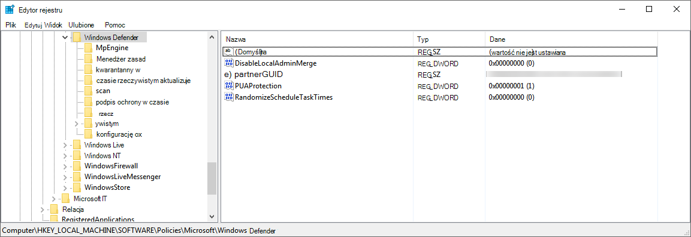

   > [!NOTE]
   > Wszystkie Windows Defender (wdboot, wdfilter, wdnisdrv, wdnissvc i windefend) powinny być w stanie domyślnym. Zmiana uruchamiania tych usług jest nieobsługiwana i może spowodować ponowne zaimportowanie systemu.
   >
   > Przykład konfiguracji domyślnych dla oprogramowania WdBoot i WdFilter:
   >
   > - `<Key Path="SYSTEM\CurrentControlSet\Services\WdBoot"><KeyValue Value="0" ValueKind="DWord" Name="Start"/></Key>`
   > - `<Key Path="SYSTEM\CurrentControlSet\Services\WdFilter"><KeyValue Value="0" ValueKind="DWord" Name="Start"/></Key>`

## <a name="troubleshoot-onboarding-issues"></a>Rozwiązywanie problemów z dołączaniem 

> [!NOTE]
> Poniższe wskazówki dotyczące rozwiązywania problemów mają zastosowanie tylko w Windows Server 2016 i niższej.

Jeśli wystąpią problemy podczas dołączania serwera, przejdź przez poniższe kroki weryfikacji, aby rozwiązać możliwe problemy.


- [Upewnij Microsoft Monitoring Agent, że program MMA jest zainstalowany i skonfigurowany do zgłaszania danych czujnika do usługi](configure-server-endpoints.md)
- [Upewnij się, że ustawienia serwera proxy i łączności internetowej są poprawnie skonfigurowane](configure-server-endpoints.md)

Konieczne może być również sprawdzenie następujących czynności:

- Sprawdź, czy na karcie Procesy w Menedżerze zadań jest uruchomiona usługa  Microsoft Defender for Endpoint **Service**. Przykład:

    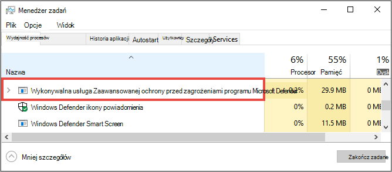

- Sprawdź **, czy w** \> **Menedżerze** \> operacji Dzienniki zdarzeń przeglądarki zdarzeń występują błędy.

- W **chmurze** Usługi sprawdź, **czy Microsoft Monitoring Agent** na serwerze. Na przykład:

    

- W **Microsoft Monitoring Agent** \> **Azure Log Analytics (OMS)** sprawdź obszar roboczy i sprawdź, czy jest uruchomiony stan.

    

- Sprawdź, czy urządzenia są odzwierciedlane na liście **Urządzenia w** portalu.

## <a name="confirming-onboarding-of-newly-built-devices"></a>Potwierdzanie doniania nowo utworzonych urządzeń

W niektórych przypadkach dołączanie jest wdrażane na nowo utworzonym urządzeniu, ale nie jest ukończone.

Poniższe czynności zawierają wskazówki dotyczące następującego scenariusza:

- Pakiet wdrażania na nowo utworzonych urządzeniach
- Czujnik nie uruchamia się, ponieważ OOBE (Out-of-box experience) lub pierwsze logowanie użytkownika nie zostało ukończone
- Urządzenie jest wyłączone lub ponownie uruchomione przed pierwszym logowaniem przez użytkownika końcowego
- W tym scenariuszu usługa SENSE nie zostanie uruchamiana automatycznie mimo wdrożenia pakietu wdrażania

> [!NOTE]
> Logowanie użytkownika po OOBE nie jest już wymagane, aby usługa SENSE uruchamiała się w następujących lub najnowszych wersjach programu Windows: Windows 10, wersja 1809 lub Windows Server 2019 lub Windows Server 2022 z aktualizacją zbiorczą aktualizacji z [22 kwietnia 2021](https://support.microsoft.com/kb/5001384) r. Windows 10, wersja 1909 z aktualizacją [z kwietnia 2021 r](https://support.microsoft.com/kb/5001396). Windows 10 2004/20H2 z aktualizacją pakietu zbiorczą z [28 kwietnia 2021 r](https://support.microsoft.com/kb/5001391). 


> [!NOTE]
> Poniższe kroki mają zastosowanie tylko w przypadku korzystania z Microsoft Endpoint Configuration Manager. Aby uzyskać więcej szczegółowych informacji na temat dołączania przy Microsoft Endpoint Configuration Manager, zobacz [Program Microsoft Defender dla punktu końcowego](/mem/configmgr/protect/deploy-use/windows-defender-advanced-threat-protection).

1. Utwórz aplikację w aplikacji Microsoft Endpoint Configuration Manager.

    

2. Wybierz **pozycję Ręcznie określ informacje o aplikacji**.

    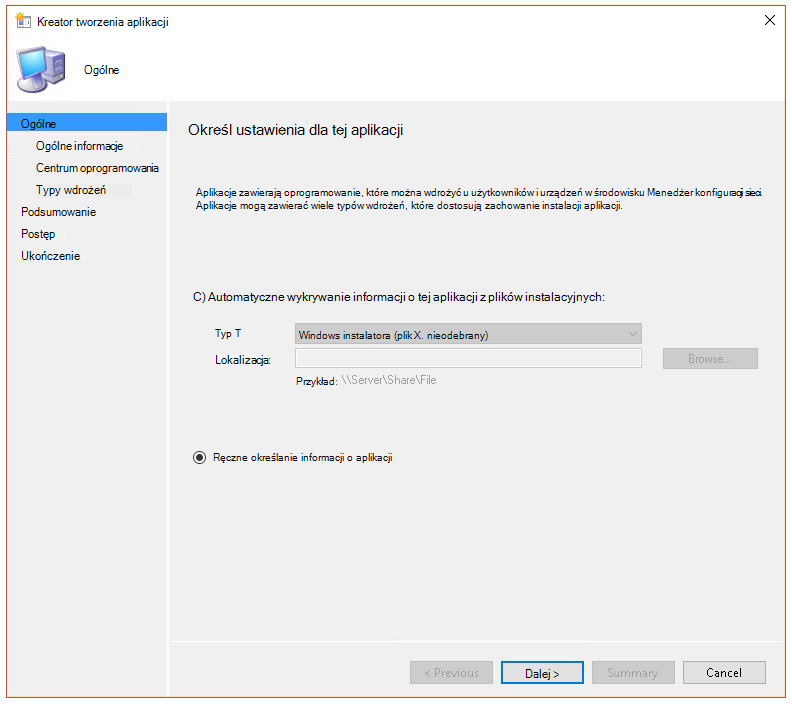

3. Określ informacje o aplikacji, a następnie wybierz pozycję **Dalej**.

    

4. Określ informacje o centrum oprogramowania, a następnie wybierz pozycję **Dalej**.

    

5. Na **stronie Typy wdrażania** wybierz pozycję **Dodaj**.

    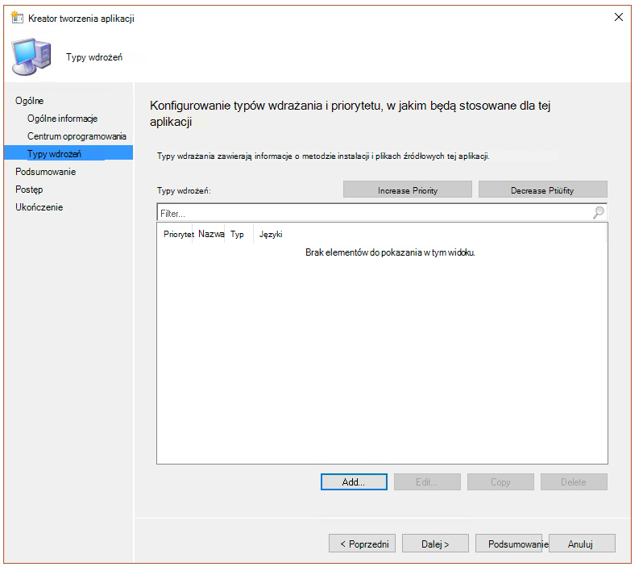

6. Wybierz **pozycję Ręcznie określ informacje o typie wdrożenia**, a następnie wybierz pozycję **Dalej**.

    

7. Określ typ wdrożenia, a następnie wybierz pozycję **Dalej**.

    

8. W **programie** \> **Instalacja zawartości** określ polecenie: `net start sense`.

    

9. W **przypadku metody wykrywania** wybierz **pozycję Konfiguruj reguły, aby wykryć obecność tego** typu wdrożenia, a następnie wybierz pozycję **Dodaj klauzulę**.

    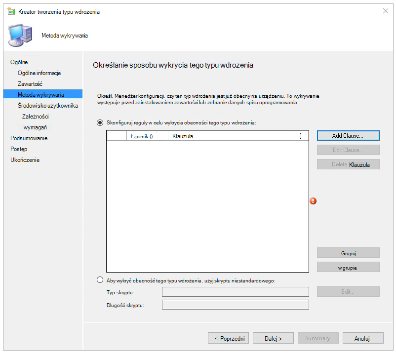

10. Określ następujące szczegóły reguły wykrywania, a następnie wybierz przycisk **OK**:

    

11. W **przypadku metody wykrywania** wybierz pozycję **Dalej**.

    

12. W **jęz**. użytkownika określ następujące informacje, a następnie wybierz pozycję **Dalej**:

    

13. W **polecej** Wymagania wybierz przycisk **Dalej**.

    

14. W **zależnościach** wybierz pozycję **Dalej**.

    

15. W **programie Summary** wybierz pozycję **Next (Dalej**).

    

16. W **2016** roku wybierz **pozycję Zamknij**.

    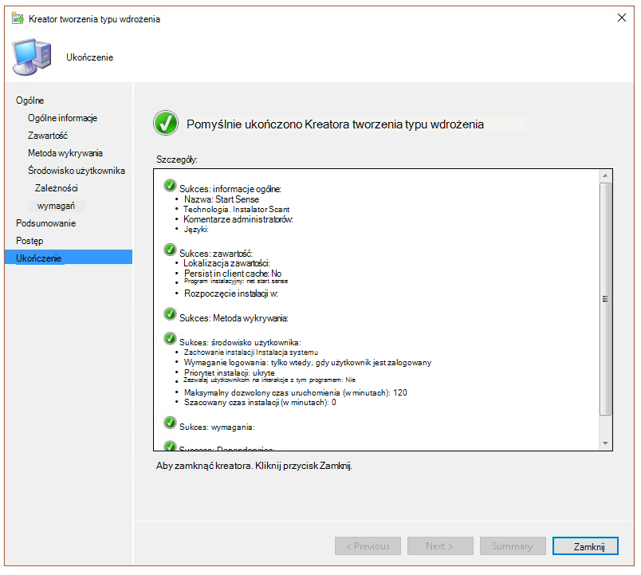

17. W **typach wdrażania** wybierz pozycję **Dalej**.

    

18. W **programie Summary** wybierz pozycję **Next (Dalej**).

    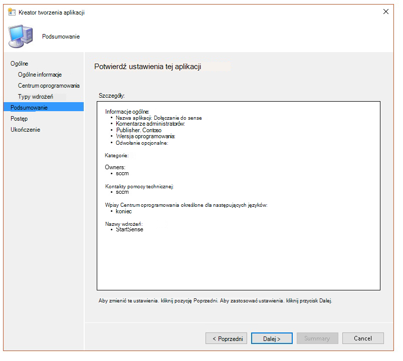

    Zostanie wyświetlony stan: Obraz konfiguracji Microsoft Endpoint Configuration Manager 

19. W **2016** roku wybierz **pozycję Zamknij**.

    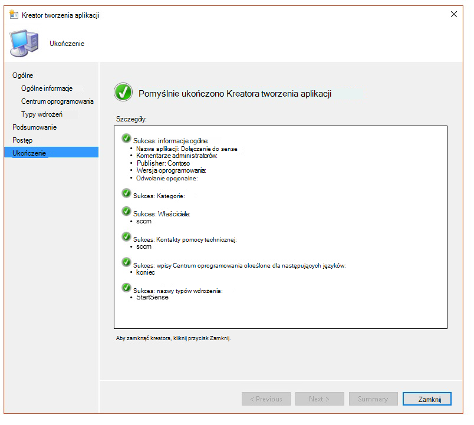

20. Teraz możesz wdrożyć aplikację, klikając aplikację prawym przyciskiem myszy i wybierając pozycję **Wdeksuj**.

    

21. W **ogólne** wybierz **pozycję Automatycznie rozpowszechniaj zawartość dla zależności i** **Przeglądaj**.

    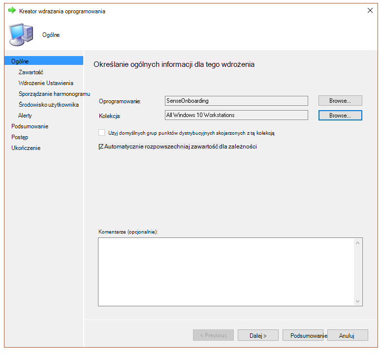

22. W **treści wybierz** pozycję **Dalej**.

    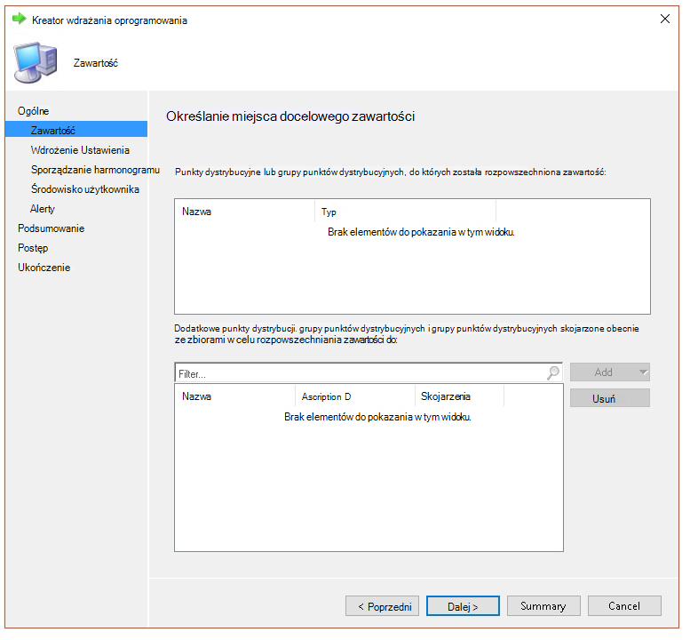

23. W **ustawieniach wdrażania** wybierz pozycję **Dalej**.

    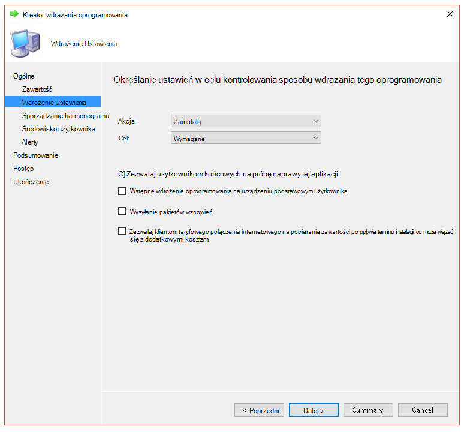

24. W **planowaniu** wybierz **opcję Jak najszybciej po dostępnym czasie**, a następnie wybierz pozycję **Dalej**.

    

25. W **oknie Środowisko użytkownika** wybierz pozycję **Zat zatwierdzeniu zmian w terminie lub w oknie konserwacji (wymaga ponownego uruchomienia)** i wybierz pozycję **Dalej**.

    

26. W **alertach** wybierz pozycję **Dalej**.

    

27. W **programie Summary** wybierz pozycję **Next (Dalej**).

    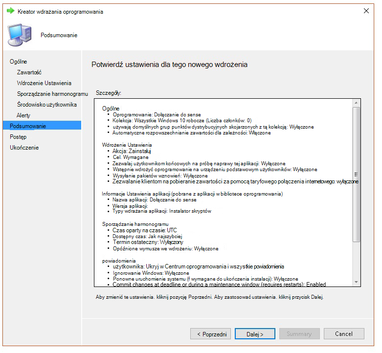

    Zostanie wyświetlony stan Obraz 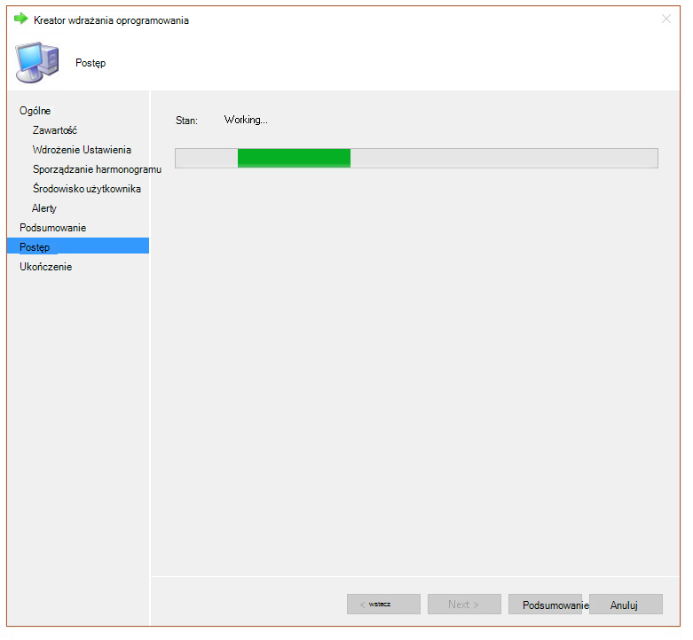

28. W **2016** roku wybierz **pozycję Zamknij**.

    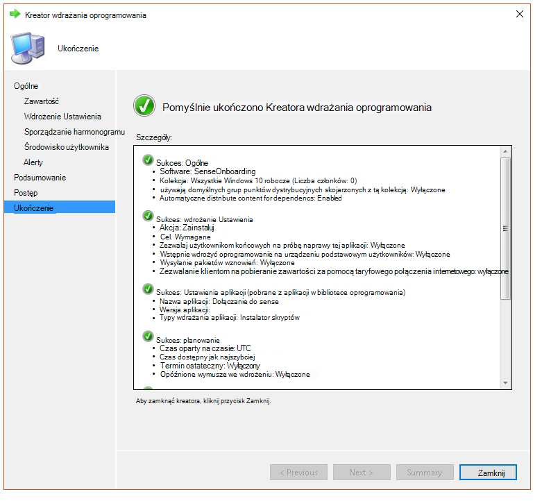

## <a name="related-topics"></a>Tematy pokrewne

- [Rozwiązywanie problemów z usługą Microsoft Defender for Endpoint](troubleshoot-mdatp.md)
- [Urządzenia wyniesiene na urządzeniach w](onboard-configure.md)
- [Konfiguruj ustawienia serwera proxy urządzenia i połączenia internetowego](configure-proxy-internet.md)
