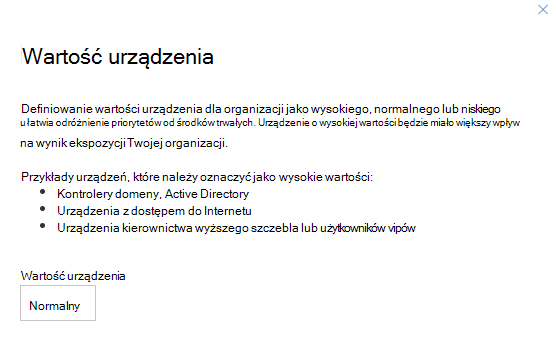

# Przypisywanie wartości urządzenia — Zarządzanie zagrożeniami i lukami

[!INCLUDE [Microsoft 365 Defender rebranding](../../includes/microsoft-defender.md)]

**Dotyczy:**
- [Microsoft Defender for Endpoint Plan 2](https://go.microsoft.com/fwlink/p/?linkid=2154037)
- [Zagrożenia i zarządzanie lukami w zabezpieczeniach](next-gen-threat-and-vuln-mgt.md)
- [Microsoft 365 Defender](https://go.microsoft.com/fwlink/?linkid=2118804)

> Chcesz mieć dostęp do programu Microsoft Defender dla punktu końcowego? [Zarejestruj się, aby korzystać z bezpłatnej wersji próbnej.](https://signup.microsoft.com/create-account/signup?products=7f379fee-c4f9-4278-b0a1-e4c8c2fcdf7e&ru=https://aka.ms/MDEp2OpenTrial?ocid=docs-wdatp-portaloverview-abovefoldlink)

[!include[Prerelease information](../../includes/prerelease.md)]

Definiowanie wartości urządzenia ułatwia rozróżnianie priorytetów zasobów. Wartość urządzenia jest używana do uwzględniania oceny ryzyka pojedynczego składnika majątku w Zarządzanie zagrożeniami i lukami obliczania wyników ekspozycji. Urządzenia przypisane jako "wysoka wartość" otrzymają więcej wagi.

Możesz także użyć [ustawionego interfejsu API wartości urządzenia](set-device-value.md).

Opcje wartości urządzenia:

- Niska
- Normalny (domyślny)
- High (Wysoki)

Przykłady urządzeń, do których powinna być przypisana wysoka wartość:

- Kontrolery domeny, Active Directory
- Urządzenia z dostępem do Internetu
- Urządzenia VIP
- Urządzenia hostowanie wewnętrznych/zewnętrznych usług produkcyjnych

## Wybierz wartość urządzenia

1. Przejdź do dowolnej strony urządzenia. Najłatwiej jest je znaleźć w spisie urządzeń.

2. Wybierz **pozycję Wartość urządzenia** z trzech kropek obok paska akcji w górnej części strony.

    

3. Zostanie wyświetlone wysuw z bieżącą wartością urządzenia i jej wartością. Sprawdź wartość urządzenia i wybierz to, które najlepiej pasuje do twojego urządzenia.

## Jak wartość urządzenia wpływa na wynik ekspozycji

Ocena ekspozycji jest średnią ważoną dla wszystkich urządzeń. Jeśli masz grupy urządzeń, możesz również filtrować wyniki według grupy urządzeń.

- Normalne urządzenia mają waga 1
- Urządzenia o niskich wartościach mają waga 0,75
- Urządzenia o wysokiej wartości mają waga NumberOfAssets / 10.
    - Jeśli masz 100 urządzeń, każde urządzenie o wysokiej wartości będzie mieć waga 10 (100/10)

## Tematy pokrewne

- [Omówienie zagrożeń i zarządzanie lukami w zabezpieczeniach wiadomości](next-gen-threat-and-vuln-mgt.md)
- [Wynik ekspozycji](tvm-exposure-score.md)
- [Interfejsy API](next-gen-threat-and-vuln-mgt.md#apis)