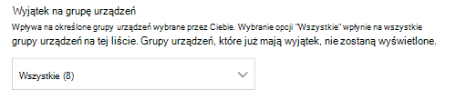
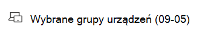
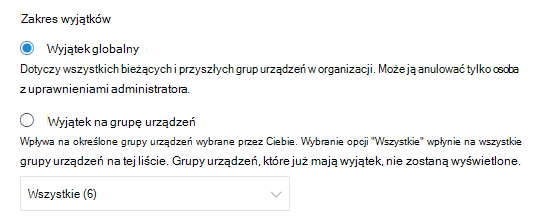
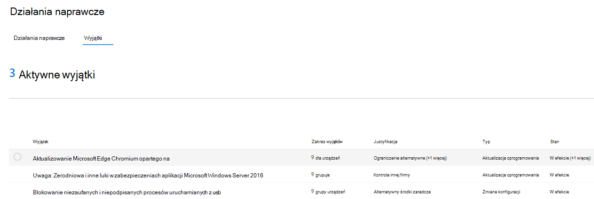
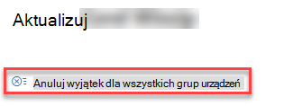
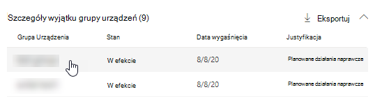

# Tworzenie i wyświetlanie wyjątków dla zaleceń dotyczących zabezpieczeń — Zarządzanie zagrożeniami i lukami

[!INCLUDE [Microsoft 365 Defender rebranding](../../includes/microsoft-defender.md)]

**Dotyczy:**

- [Microsoft Defender for Endpoint Plan 2](https://go.microsoft.com/fwlink/?linkid=2154037)
- [Zagrożenia i zarządzanie lukami w zabezpieczeniach](next-gen-threat-and-vuln-mgt.md)
- [Microsoft 365 Defender](https://go.microsoft.com/fwlink/?linkid=2118804)

> Chcesz mieć dostęp do programu Microsoft Defender dla punktu końcowego? [Zarejestruj się, aby korzystać z bezpłatnej wersji próbnej.](https://signup.microsoft.com/create-account/signup?products=7f379fee-c4f9-4278-b0a1-e4c8c2fcdf7e&ru=https://aka.ms/MDEp2OpenTrial?ocid=docs-wdatp-portaloverview-abovefoldlink)

Alternatywą dla żądania rozwiązania problemów, gdy w danej chwili zalecenie nie jest istotne, możesz utworzyć wyjątki dla zaleceń. Jeśli Twoja organizacja ma grupy urządzeń, będzie można zakresować wyjątek do konkretnych grup urządzeń. W przypadku wybranych grup urządzeń można utworzyć wyjątki lub dla wszystkich grup urządzeń, które już istnieją i istnieją.

W przypadku utworzenia wyjątku dla zalecenia zalecenie nie będzie aktywne do końca czasu trwania wyjątku. Stan zalecenia zmieni się na **Pełny wyjątek** lub **Częściowy wyjątek** (według grupy urządzeń).

## Uprawnienia

Tylko użytkownicy z uprawnieniami do obsługi wyjątków mogą zarządzać wyjątkami (w tym tworzeniem lub anulowaniem). [Dowiedz się więcej o rolach RBAC](user-roles.md).

## Tworzenie wyjątku

Wybierz zalecenie zabezpieczeń, dla których chcesz utworzyć wyjątek, a następnie wybierz pozycję **Opcje** wyjątków i wypełnij formularz.

### Wyjątek według grupy urządzeń

Zastosuj wyjątek do wszystkich bieżących grup urządzeń lub wybierz określone grupy urządzeń. Przyszłe grupy urządzeń nie będą uwzględniane w wyjątku. Grupy urządzeń, które już mają wyjątek, nie będą wyświetlane na liście. Jeśli wybierzesz tylko niektóre grupy urządzeń, stan zalecenia zmieni się z "aktywne" na "częściowy wyjątek". Stan zmieni się na "pełny wyjątek", jeśli wybierzesz wszystkie grupy urządzeń.

#### Widoki filtrowane

Jeśli na dowolnej stronie ustawień filtrowanych urządzeń jest wyświetlana grupa Zarządzanie zagrożeniami i lukami, jako opcje będą widoczne tylko te grupy urządzeń, które zostały odfiltrowane.

Jest to przycisk filtrowania według grupy urządzeń na dowolnej Zarządzanie zagrożeniami i lukami stronie:

Widok wyjątków z odfiltrowanych grup urządzeń:

#### Duża liczba grup urządzeń

Jeśli Twoja organizacja ma więcej niż 20 grup urządzeń, wybierz pozycję **Edytuj** obok opcji filtrowanych grup urządzeń.

Zostanie wyświetlone wysuwne pole, w którym możesz wyszukiwać i wybierać grupy urządzeń do uwzględnionia. Wybierz ikonę znacznika wyboru pod ikony Wyszukaj, aby zaznaczyć lub usunąć zaznaczenie wszystkich.

### Wyjątki globalne

Jeśli masz uprawnienia administratora globalnego, możesz utworzyć i anulować wyjątek globalny. Dotyczy to **wszystkich bieżących** i przyszłych grup urządzeń w organizacji i tylko użytkownik z podobnym uprawnieniem może go zmienić. Stan zalecenia zmieni się z "aktywny" na "pełny wyjątek".

Warto pamiętać o kilku kwestiach:

- Jeśli w ramach wyjątku globalnego znajduje się zalecenie, nowo utworzone wyjątki dla grup urządzeń zostaną zawieszone do czasu wygaśnięcia lub anulowania wyjątku globalnego. Po tym momencie wyjątki nowej grupy urządzeń będą obowiązywać do momentu ich wygaśnięcia.
- Jeśli w przypadku zalecenia istnieją już wyjątki dla określonych grup urządzeń i utworzono wyjątek globalny, wyjątek grupy urządzeń zostanie zawieszony do momentu jego wygaśnięcia lub anulowania wyjątku globalnego przed jego wygaśnięciem.

### Justowanie

Wybierz uzasadnienie wyjątku, który należy przechować, zamiast korygować odpowiednie zalecenia dotyczące zabezpieczeń. Wypełnij kontekst justowania, a następnie ustaw czas trwania wyjątku.

Na poniższej liście przedstawiono uzasadnienie opcji wyjątków:

- **Kontrola osób trzecich** — produkt lub oprogramowanie innej firmy już rozwiązuje to zalecenie — wybranie tego typu uzasadnienia spowoduje obniżenie wyniku ekspozycji i zwiększenie bezpiecznego wyniku z powodu zmniejszenia ryzyka
- **Alternatywne środki zaradcze** — wewnętrzne narzędzie już rozwiązuje to zalecenie — wybranie tego typu uzasadnienia spowoduje obniżenie wyniku ekspozycji i zwiększenie bezpiecznego wyniku, ponieważ ryzyko jest zmniejszone
- **Zaakceptowane ryzyko** — zagrożenie i/lub zaimplementowanie zalecenia jest zbyt kosztowne
- **Planowane działania naprawcze (prolongaty)** — już zaplanowane, ale oczekuje na wykonanie lub autoryzację

## Wyświetl wszystkie wyjątki

Przejdź do karty **Wyjątki** na stronie **Działania naprawcze** . Filtrowanie można filtrować, justowanie, wpisywanie i status.

 Wybierz wyjątek, aby otworzyć wysuwną ulotkę ze szczegółami. Wyjątki dla każdej grupy urządzeń będą zawierały listę wszystkich grup urządzeń, których wyjątek można wyeksportować. Możesz także wyświetlić pokrewne zalecenie lub anulować wyjątek.

## Jak anulować wyjątek

Aby anulować wyjątek, przejdź do karty **Wyjątki** na stronie **Działania naprawcze** . Wybierz wyjątek.

Aby anulować wyjątek dla wszystkich grup urządzeń lub dla wyjątku globalnego, wybierz przycisk **Anuluj wyjątek dla wszystkich grup** urządzeń. Możesz anulować wyjątki tylko dla grup urządzeń, do których masz uprawnienia.

### Anulowanie wyjątku dla określonej grupy urządzeń

Wybierz określoną grupę urządzeń, aby anulować wyjątek dla tej grupy. Dla grupy urządzeń pojawi się wysuw i możesz wybrać anuluj **wyjątek**.

## Wpływ na widok po zastosowaniu wyjątków

Na stronie Rekomendacje wybierz pozycję Dostosuj kolumny i zaznacz  pola wyboru Urządzenia udostępniane (po wyjątkach **)** i Wpływ **(po wyjątkach).**

W kolumnie dostępne urządzenia (po wyjątkach) są widoczne pozostałe urządzenia, które są nadal narażone na luki po zastosowaniu wyjątków. Wyjątek, który wpływa na ekspozycję, to na przykład "kontrola strony trzeciej" i "alternatywne środki zaradcze". Inne justowania nie zmniejszają ekspozycji urządzenia i są nadal uznawane za ujawnione.

Wpływ (po wyjątkach) pokazuje pozostały wpływ na wynik ekspozycji lub bezpieczny wynik po zastosowaniu wyjątków. Wyjątki mające wpływ na wyniki obejmują "kontrolkę innej firmy" i "alternatywne ograniczenie". Inne justowanie nie zmniejsza ekspozycji urządzenia, a zatem wynik ekspozycji i bezpiecznej oceny nie zmieniają się.

## Tematy pokrewne

- [Omówienie zagrożeń i zarządzanie lukami w zabezpieczeniach wiadomości](next-gen-threat-and-vuln-mgt.md)
- [Usuwanie luk w zabezpieczeniach](tvm-remediation.md)
- [Zalecenia dotyczące zabezpieczeń](tvm-security-recommendation.md)
- [Wynik ekspozycji](tvm-exposure-score.md)
- [Microsoft Secure Score dla urządzeń](tvm-microsoft-secure-score-devices.md)
