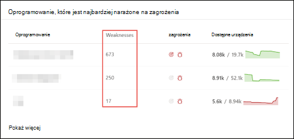
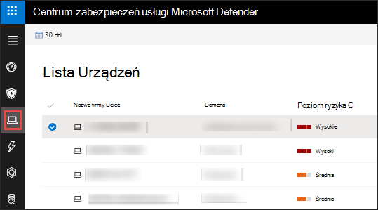

# Luki w zabezpieczeniach w mojej organizacji — Zarządzanie zagrożeniami i lukami

[!INCLUDE [Microsoft 365 Defender rebranding](../../includes/microsoft-defender.md)]

**Dotyczy:**
- [Microsoft Defender for Endpoint Plan 2](https://go.microsoft.com/fwlink/?linkid=2154037)
- [Zagrożenia i zarządzanie lukami w zabezpieczeniach](next-gen-threat-and-vuln-mgt.md)
- [Microsoft 365 Defender](https://go.microsoft.com/fwlink/?linkid=2118804)

> Chcesz mieć dostęp do programu Microsoft Defender dla punktu końcowego? [Zarejestruj się, aby korzystać z bezpłatnej wersji próbnej.](https://signup.microsoft.com/create-account/signup?products=7f379fee-c4f9-4278-b0a1-e4c8c2fcdf7e&ru=https://aka.ms/MDEp2OpenTrial?ocid=docs-wdatp-portaloverview-abovefoldlink)

> [!IMPORTANT]
> Zagrożenia i zarządzanie lukami w zabezpieczeniach mogą pomóc w zidentyfikowaniu luk w log4j w aplikacjach i składnikach. [Dowiedz się więcej](https://www.microsoft.com/security/blog/2021/12/11/guidance-for-preventing-detecting-and-hunting-for-cve-2021-44228-log4j-2-exploitation/#TVM).

Zagrożenia i zarządzanie lukami w zabezpieczeniach wykorzystujące te same sygnały w programie Defender na temat ochrony punktu końcowego w celu skanowania i wykrycia luk.

Strona **Słabe zawiera** listę luk w oprogramowaniu, jakie mogą przed to zrobić Twoje urządzenia, wyszczególnione w identyfikatorze Common Vulnerabilities and Exposures (CVE). Możesz również przejrzeć oceny ważności, wspólnego systemu oceniania luk, ochrony przed zagrożeniami itp.

> [!NOTE]
> Jeśli do luki nie przypisano oficjalnego identyfikatora CVE, nazwa luki w zabezpieczeniach jest przypisywana przez Zarządzanie zagrożeniami i lukami.

> [!TIP]
> Aby uzyskać wiadomości e-mail dotyczące nowych zdarzeń luk w zabezpieczeniach, zobacz Konfigurowanie powiadomień [e-mail z luk w zabezpieczeniach w programie Microsoft Defender dla punktu końcowego](configure-vulnerability-email-notifications.md)

## Przejdź do strony Braki

Uzyskaj dostęp do strony Braki na kilka różnych sposobów:

- Wybieranie **opcji Słabe** z menu **nawigacji zarządzania** lukami w portalu Microsoft 365 Defender [luk](portal-overview.md)
- Wyszukiwanie globalne

### Menu nawigacji

Przejdź do menu **nawigacji zarządzania lukami** w zabezpieczeniach i wybierz pozycję **Słabe,** aby otworzyć listę CW.

### Luki w wyszukiwaniu globalnym

1. Przejdź do globalnego menu rozwijanego wyszukiwania.
2. Wybierz **lukę i** klucz w identyfikatorze Typowe luki w zabezpieczeniach i ekspozycje (CVE, Common Vulnerabilities and Exposures), którego szukasz, a następnie wybierz ikonę wyszukiwania. Zostanie **otwarta strona** Braki z informacjami CVE, których szukasz.

3. Wybierz opcję CVE, aby otworzyć panel wysuwu z większej liczby informacji, takich jak opis luki w zabezpieczeniach, szczegóły, szczegółowe informacje o zagrożeniach i ujawnione urządzenia.

Aby zobaczyć pozostałe luki na stronie Braki, wpisz  CVE, a następnie wybierz pozycję wyszukaj.

## Omówienie braków

Zaradcze w przypadku luk w zabezpieczeniach w ujawnionych urządzeniach w celu zmniejszenia ryzyka dla twoich zasobów i organizacji. Jeśli w **kolumnie Dostępne urządzenia** jest pokazana 0, oznacza to, że nie jest to ryzykowne.

### Analiza naruszenia i zagrożeń

Wyświetlaj wszelkie związane z tym informacje o naruszeniach zabezpieczeń i zagrożeniach w kolumnie **Zagrożenia,** gdy ikony mają kolor czerwony.

 > [!NOTE]
 > Zawsze priorytetyzuj zalecenia związane z bieżącymi zagrożeniami. Te zalecenia są oznaczone ikoną szczegółowej informacji o zagrożeniach  Ikona analizy naruszenia prostego .

Ikona analizy naruszenia jest wyróżniona, jeśli w organizacji istnieje luka.

Ikona Szczegółowych informacji o zagrożeniach jest wyróżniona, jeśli skojarzona z nim luka w zabezpieczeniach, która znajduje się w organizacji. Umieszczenie wskaźnika myszy na ikonie wskazuje, czy zagrożenie jest elementem zestawu wykorzystującego luki, czy związane z określonymi zaawansowanymi trwałymi kampaniami lub grupami działań. Jeśli jest to możliwe, dostępny jest link do raportu analizy zagrożeń z wiadomościami o zerowej wykorzystywaniu, ujawnianiu informacji i powiązanych poradach dotyczących zabezpieczeń.

### Zdobywanie luk w zabezpieczeniach

Jeśli wybierzesz opcję CVE, zostanie otwarty panel wysuwu z większej liczby informacji, takich jak opis luki w zabezpieczeniach, szczegóły, szczegółowe informacje o zagrożeniach i ujawnione urządzenia.

- Kategoria "Funkcja systemu operacyjnego" jest wyświetlana w odpowiednich scenariuszach
- Możesz przejść do pokrewnego zalecenia zabezpieczeń dla każdego CVE z ujawnionym urządzeniem

 

### Oprogramowanie, które nie jest obsługiwane

W przypadku oprogramowania, które nie jest obecnie obsługiwane przez zagrożenia, & zarządzanie lukami w zabezpieczeniach nadal występuje na stronie Braki. Ponieważ to oprogramowanie nie jest obsługiwane, dostępne będą tylko ograniczone dane.

Udostępniane informacje o urządzeniach nie będą dostępne w programach CWI z nieobsługiwanym oprogramowaniem. Filtruj według nieobsługiwanego oprogramowania, wybierając opcję "Niedostępne" w sekcji "Dostępne urządzenia".

:::image type="content" alt-text="Widoczne urządzenia filtru." source="images/tvm-exposed-devices-filter.png":::

## Wyświetlanie typowych luk i naświetleń (CVE) w innych miejscach

### Najbardziej narażone oprogramowanie na pulpicie nawigacyjnym

1. Przejdź do [pulpitu Zarządzanie zagrożeniami i lukami i](tvm-dashboard-insights.md) przewiń w dół do **widżetu oprogramowania, który jest** najbardziej narażony na zagrożenia. Zobaczysz liczbę luk w zabezpieczeniach znalezionych w poszczególnych oprogramowaniu, a także informacje o zagrożeniach i wysokopoziomowy widok informacji o narażeniu na urządzenia w czasie.

    

2. Wybierz oprogramowanie, które chcesz zbadać, aby przejść do strony szczegółów.

3. Wybierz **kartę Wykryj luki** .

4. Wybierz lukę w zabezpieczeniach, którą chcesz zbadać, aby uzyskać więcej informacji na temat luk w zabezpieczeniach

    

### Odnajdowanie luk na stronie urządzenia

Wyświetlanie powiązanych informacji na stronie urządzenia.

1. Przejdź do paska Microsoft 365 Defender nawigacji, a następnie wybierz ikonę urządzenia. Zostanie **otwarta strona Spis** urządzeń.

2. Na stronie **Spis urządzeń** wybierz nazwę urządzenia, które chcesz zbadać.

    

3. Zostanie otwarta strona urządzenia ze szczegółami i opcjami odpowiedzi dla urządzenia, które chcesz zbadać.

4. Wybierz **pozycję Wykryj luki w zabezpieczeniach**.

   :::image type="content" alt-text="Strona urządzenia ze szczegółami i opcjami odpowiedzi." source="images/tvm-discovered-vulnerabilities.png" lightbox="images/tvm-discovered-vulnerabilities.png":::

5. Wybierz lukę, którą chcesz zbadać, aby otworzyć panel wysuwu z informacjami typu CVE, takimi jak opis luki w zabezpieczeniach, analiza zagrożeń i logika wykrywania.

#### Logika wykrywania CVE

Podobnie jak w przypadku dowodów z oprogramowania, pokazujemy teraz logikę wykrywania zastosowaną na urządzeniu, aby było wiadomo, że jest podatny na zagrożenia. Nowa sekcja nosi nazwę "Logika wykrywania" (w przypadku wszelkich wykrytych luk na stronie urządzenia) i zawiera logikę oraz źródło wykrywania.

Kategoria "Funkcja systemu operacyjnego" jest również wyświetlana w odpowiednich scenariuszach. Funkcja CVE dotyczy urządzeń, na których działa narażony system operacyjny, tylko w przypadku, gdy jest włączony określony składnik systemu operacyjnego. Załóżmy, że Windows Server 2019 lub Windows Server 2022 ma lukę w jego składniku DNS. Dzięki tej nowej funkcji dołączymy ten kod CVE tylko do urządzeń z systemami Windows Server 2019 i Windows Server 2022 z włączoną możliwością DNS w ich systemie operacyjnym.

:::image type="content" alt-text="Przykład logiki wykrywania, który zawiera listę oprogramowania wykrytego na urządzeniu i kb/s." source="images/tvm-cve-detection-logic.png":::

## Nieścisłości raportu

Zgłaszaj błędy fałszywie dodatnie, jeśli widzisz niejasne, nieprawidłowe lub niepełne informacje. Możesz również zgłaszać zalecenia dotyczące zabezpieczeń, które zostały już usunięte.

1. Otwórz oknem cve na stronie Słabe.
2. Wybierz **pozycję Nieścisłości raportu** , a zostanie otwarte okienko wysuwu.
3. Wybierz kategorię nieścisłości z menu rozwijanego i wprowadź swój adres e-mail oraz szczegóły nieścisłości.
4. Wybierz **pozycję Prześlij**. Twoja opinia zostanie natychmiast przesłana do Zarządzanie zagrożeniami i lukami ekspertów.

## Artykuły pokrewne

- [Omówienie zagrożeń i zarządzanie lukami w zabezpieczeniach wiadomości](next-gen-threat-and-vuln-mgt.md)
- [Zalecenia dotyczące zabezpieczeń](tvm-security-recommendation.md)
- [Spis oprogramowania](tvm-software-inventory.md)
- [Szczegółowe informacje pulpitu nawigacyjnego](tvm-dashboard-insights.md)
- [Wyświetlanie i organizowanie listy programu Microsoft Defender dla urządzeń końcowych](machines-view-overview.md)
