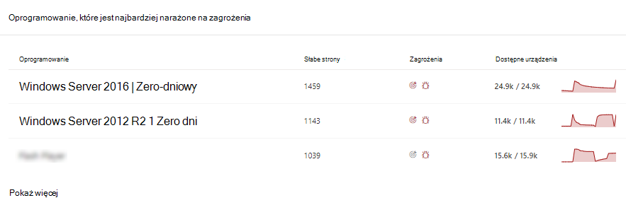

# Ograniczanie problemów bezbłędnych dni — Zarządzanie zagrożeniami i lukami

[!INCLUDE [Microsoft 365 Defender rebranding](../../includes/microsoft-defender.md)]

**Dotyczy:**

- [Microsoft Defender for Endpoint Plan 2](https://go.microsoft.com/fwlink/?linkid=2154037)
- [Zagrożenia i zarządzanie lukami w zabezpieczeniach](next-gen-threat-and-vuln-mgt.md)
- [Microsoft 365 Defender](https://go.microsoft.com/fwlink/?linkid=2118804)

> Chcesz mieć dostęp do programu Microsoft Defender dla punktu końcowego? [Zarejestruj się, aby korzystać z bezpłatnej wersji próbnej.](https://signup.microsoft.com/create-account/signup?products=7f379fee-c4f9-4278-b0a1-e4c8c2fcdf7e&ru=https://aka.ms/MDEp2OpenTrial?ocid=docs-wdatp-portaloverview-abovefoldlink)

Zerodniowa luka to zagrożenie w oprogramowaniu, dla którego nie opublikowano żadnej oficjalnej poprawki ani aktualizacji zabezpieczeń. Dostawca oprogramowania może, ale nie musi wiedzieć o lukie, i nie są dostępne żadne publiczne informacje o tym czynniku. Luki w zabezpieczeniach typu "zerodniowy" często mają wysoki poziom ważności i są aktywnie używane.

Zagrożenia i zarządzanie lukami w zabezpieczeniach będą wyświetlane tylko bezbłędne luki, o których zawiera on informacje.

## Znajdowanie informacji o bezbłędnych lukach

Po odnalezioniu zerowej luki w zabezpieczeniach informacje na jej temat zostaną przekazane za pośrednictwem poniższych doświadczeń w portalu Microsoft 365 Defender sieci.

> [!NOTE]
> Funkcja 0-dniowej luki w zabezpieczeniach jest obecnie dostępna tylko dla Windows produktów.

### Zagrożenia i zarządzanie lukami w zabezpieczeniach nawigacyjny

Poszukaj rekomendacji z tagiem "zerodniowym" na karcie "Najważniejsze zalecenia dotyczące zabezpieczeń".

Znajdź najlepsze oprogramowanie z tagiem "zero-day" na karcie "Oprogramowanie najbardziej narażone na zagrożenia".

### Strona słabe

Poszukaj nazwanej 0-dniowej luki w zabezpieczeniach wraz z opisem i szczegółami.

- Jeśli do tej luki przypisano identyfikator CVE, obok nazwy tego typu danych będzie oznaczona etykieta zerodniowa.

- Jeśli do tej luki nie przypisano identyfikatora CVE, można go znaleźć pod wewnętrzną, tymczasową nazwą o nazwie "TVM-XXXX-XXXX". Nazwa zostanie zaktualizowana po przypisaniu oficjalnego identyfikatora CVE, ale nadal będzie można wyszukiwać poprzednią nazwę wewnętrzną w panelu bocznym.

:::image type="content" alt-text="Przykład zerowym dniem dla strony słabej CVE-2020-17087." source="images/tvm-zero-day-weakness-name.png" lightbox="images/tvm-zero-day-weakness-name.png":::

### Strona spisu oprogramowania

Poszukaj oprogramowania z tagiem "zero-day". Filtruj według tagu "zero-day", aby wyświetlić tylko oprogramowanie z bezbłędną luką.

:::image type="content" alt-text="Przykład zerowej Windows Server 2016 na stronie spisu oprogramowania." source="images/tvm-zero-day-software-inventory.png" lightbox="images/tvm-zero-day-software-inventory.png":::

### Strona oprogramowania

Poszukaj tagu "zerodniowego" dla każdego oprogramowania, na które wpływa usterki bezdniowe.

:::image type="content" alt-text="Przykład zerowym dniem dla Windows Server 2016 oprogramowania." source="images/tvm-zero-day-software-page.png" lightbox="images/tvm-zero-day-software-page.png":::

### Strona Zalecenia dotyczące zabezpieczeń

Wyświetl jasne sugestie dotyczące środków zaradczych i środków zaradczych, w tym obejścia, jeśli istnieją. Filtruj według tagu "zero-day", aby wyświetlić tylko zalecenia dotyczące zabezpieczeń dotyczące luk w zabezpieczeniach z dniem zerodniowym.

Jeśli jest dostępne oprogramowanie z 0-dniową luką w zabezpieczeniach i dodatkowymi lukimi w zabezpieczeniach, otrzymasz jedno zalecenie dotyczące wszystkich luk w zabezpieczeniach.

:::image type="content" alt-text="Zero-dniowy przykład Windows Server 2016 na stronie zalecenia dotyczące zabezpieczeń." source="images/tvm-zero-day-security-recommendation.png" lightbox="images/tvm-zero-day-security-recommendation.png":::

## Usuwanie luk w zabezpieczeniach z dniem zerodniowym

Przejdź do strony zalecenia zabezpieczeń i wybierz zalecenie z wartością zero-dniową. Zostanie otwarte okno wysuwu z informacjami o zerowej dzień i innych lukach w zabezpieczeniach tego oprogramowania.

Będzie dostępny link do opcji złagodzenia wpływu i obejść, jeśli są one dostępne. Obejścia mogą zmniejszyć ryzyko związane z tą bezbłędną luką do czasu wdrożenia poprawki lub aktualizacji zabezpieczeń.

Otwórz opcje rozwiązywania problemów i wybierz typ uwagi. W przypadku problemów bezbłędnych bezbłędnie zaleca się opcję "wymaganej uwagi", ponieważ aktualizacja nie została jeszcze opublikowana. Nie można wybrać daty wykonania, ponieważ nie ma żadnej konkretnej akcji do wykonania. Jeśli istnieją starsze luki w zabezpieczeniach tego oprogramowania, które chcesz naprawić, możesz zastąpić opcję działań naprawczych "wymagana uwaga" i wybrać pozycję "aktualizuj".

## Śledzenie działań naprawczych bez dni

Przejdź do strony Zarządzanie zagrożeniami i lukami [działania naprawcze](tvm-remediation.md), aby wyświetlić element działania naprawczego. Jeśli wybrano opcję rozwiązywania problemów "wymagana uwaga", nie będzie paska postępu, stanu biletu ani daty zakończenia, ponieważ nie ma żadnych rzeczywistych działań, które możemy monitorować. Możesz filtrować według typu działania naprawczego, na przykład "aktualizacja oprogramowania" lub "wymagana uwaga", aby wyświetlić wszystkie elementy aktywności w tej samej kategorii.

## Poprawianie luk w zabezpieczeniach z dniem zerodniowym

Gdy poprawka zostanie wydana z dniem zerowydniowym, zalecenie zostanie zmienione na "Aktualizacja" i niebieską etykietę obok niego z etykietą "Nowa aktualizacja zabezpieczeń przez zero dni". Nie będzie on już uwzględniany jako dzień zerowy, a tag bezdniowy zostanie usunięty ze wszystkich stron.

## Artykuły pokrewne

- [Omówienie zagrożeń i zarządzanie lukami w zabezpieczeniach wiadomości](next-gen-threat-and-vuln-mgt.md)
- [Pulpit nawigacyjny](tvm-dashboard-insights.md)
- [Zalecenia dotyczące zabezpieczeń](tvm-security-recommendation.md)
- [Spis oprogramowania](tvm-software-inventory.md)
- [Luki w zabezpieczeniach w mojej organizacji](tvm-weaknesses.md)
