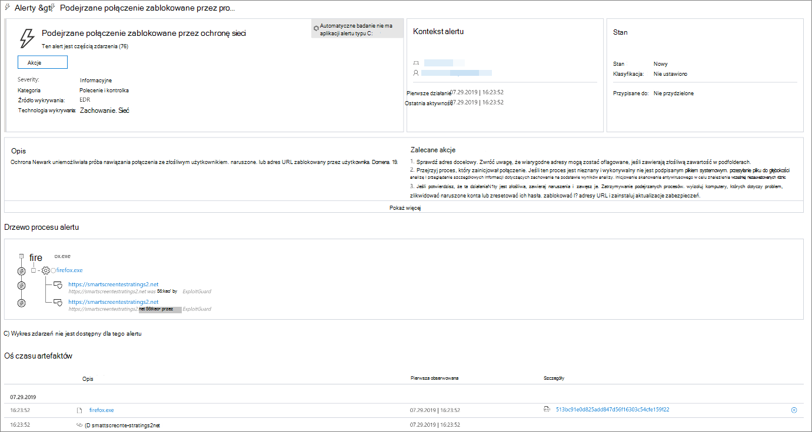

# Reagowanie na zagrożenia w sieci Web

[!INCLUDE [Microsoft 365 Defender rebranding](../../includes/microsoft-defender.md)]

**Dotyczy:**
- [Microsoft Defender for Endpoint Plan 1](https://go.microsoft.com/fwlink/p/?linkid=2154037)
- [Microsoft Defender for Endpoint Plan 2](https://go.microsoft.com/fwlink/p/?linkid=2154037)
- [Microsoft 365 Defender](https://go.microsoft.com/fwlink/?linkid=2118804)

> Chcesz mieć dostęp do programu Microsoft Defender dla punktu końcowego? [Zarejestruj się, aby korzystać z bezpłatnej wersji próbnej.](https://signup.microsoft.com/create-account/signup?products=7f379fee-c4f9-4278-b0a1-e4c8c2fcdf7e&ru=https://aka.ms/MDEp2OpenTrial?ocid=docs-wdatp-main-abovefoldlink&rtc=1)

Ochrona sieci Web w programie Microsoft Defender for Endpoint umożliwia efektywne badanie i odpowiadanie na alerty dotyczące złośliwych witryn internetowych i witryn internetowych na niestandardowej liście wskaźników.

## Wyświetlanie alertów o zagrożeniach w sieci Web

Program Microsoft Defender for Endpoint generuje następujące [alerty](manage-alerts.md) dotyczące złośliwej lub podejrzanej aktywności w sieci Web:

- **Podejrzane połączenie zablokowane** przez ochronę sieci: Ten alert jest generowany, gdy próba uzyskania dostępu do złośliwej witryny lub witryny internetowej na niestandardowej liście wskaźników zostanie  zatrzymana przez ochronę sieci w *trybie blokowania*
- **Podejrzane połączenie wykryte przez** ochronę sieci: Ten alert jest generowany, gdy próba uzyskania dostępu do złośliwej witryny lub witryny internetowej na niestandardowej liście wskaźników jest wykrywana przez ochronę sieci w trybie *tylko inspekcji*

Każdy alert zawiera następujące informacje:

- Urządzenie, które próbowało uzyskać dostęp do zablokowanej witryny internetowej
- Aplikacja lub program użyty do wysłania żądania sieci Web
- Złośliwy adres URL lub adres URL na niestandardowej liście wskaźników
- Zalecane działania dla osób odpowiadających

> [!NOTE]
> Aby zmniejszyć liczbę alertów, usługa Microsoft Defender for Endpoint konsoliduje każdego dnia wykrywanie zagrożeń sieci Web dla tej samej domeny na tym samym urządzeniu do jednego alertu. W raporcie ochrony sieci Web jest generowany i liczony tylko [jeden alert](web-protection-monitoring.md).

## Sprawdzanie szczegółów witryny sieci Web

Możesz przejść do bardziej dogłębnych danych, wybierając adres URL lub domenę witryny internetowej w alercie. Spowoduje to otwarcie strony dotyczącej tego konkretnego adresu URL lub domeny z różnymi informacjami, między innymi:

- Urządzenia, które próbowały uzyskać dostęp do witryny internetowej
- Zdarzenia i alerty związane z witryną internetową
- Jak często witryna sieci Web była widziana w zdarzeniach w organizacji

    

[Dowiedz się więcej o adresie URL lub stronach encji domeny](investigate-domain.md)

## Sprawdzanie urządzenia

Możesz również sprawdzić urządzenie, które próbowało uzyskać dostęp do zablokowanego adresu URL. Wybranie nazwy urządzenia na stronie alertu spowoduje otwarcie strony z kompletnymi informacjami o urządzeniu.

[Dowiedz się więcej o stronach encji urządzenia](investigate-machines.md)

## Przeglądarka internetowa i powiadomienia Windows dla użytkowników końcowych

Dzięki ochronie sieci Web w programie Microsoft Defender for Endpoint użytkownicy końcowi nie będą mieć możliwości odwiedzania złośliwych lub niechcianych witryn internetowych za pomocą Microsoft Edge lub innych przeglądarek. Ponieważ blokowanie jest wykonywane przez [ochronę sieci](network-protection.md), pojawi się błąd ogólny z przeglądarki sieci Web. Zobaczą też powiadomienie od Windows.

 *Zagrożenia internetowe zablokowane na Microsoft Edge*

 *Zagrożenia internetowe zablokowane w przeglądarce Chrome*

## Tematy pokrewne

- [Omówienie ochrony sieci Web](web-protection-overview.md)
- [Filtrowanie zawartości sieci Web](web-content-filtering.md)
- [Ochrona przed zagrożeniami internetowymi](web-threat-protection.md)
- [Monitorowanie zabezpieczeń sieci Web](web-protection-monitoring.md)
