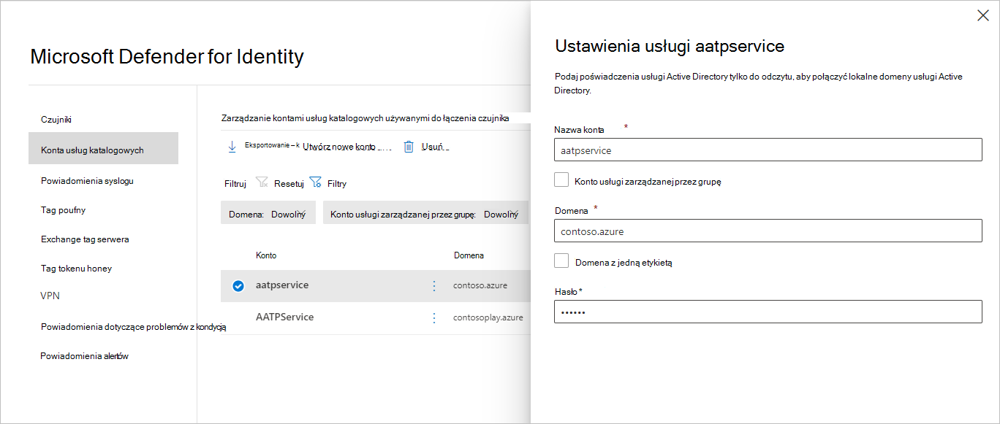

# Konto usług katalogowych usługi katalogowej usługi Microsoft Defender for Identity w usłudze Microsoft 365 Defender

**Dotyczy:**

- Microsoft 365 Defender
- Defender for Identity

W tym artykule wyjaśniono, jak skonfigurować konto usług katalogowych [usługi katalogowej usługi Microsoft Defender dla](/defender-for-identity) tożsamości [w usłudze Microsoft 365 Defender](/microsoft-365/security/defender/overview-security-center).

>[!IMPORTANT]
>W ramach schłodowania w Microsoft 365 Defender tożsamości niektóre opcje i szczegóły zmieniły się od ich lokalizacji w portalu usługi Defender dla tożsamości. Zapoznaj się ze szczegółami poniżej, aby dowiedzieć się, gdzie znaleźć zarówno znane, jak i nowe funkcje.

## Konfigurowanie konta usług katalogowych

Aby połączyć [czujnik z](sensor-health.md#add-a-sensor) domenami usługi Active Directory, musisz skonfigurować konta usług katalogowych.

1. Na <a href="https://go.microsoft.com/fwlink/p/?linkid=2077139" target="_blank">Microsoft 365 Defender</a> **przejdź do Ustawienia** i **Tożsamości**.

    

1. Wybierz **pozycję Konta usługi katalogowej**. Zobaczysz konta skojarzone z którymi domenami.

    

1. Jeśli wybierzesz konto, zostanie otwarte okienko z ustawieniami tego konta.

    

1. Aby dodać nowe konto usług katalogowych, wybierz pozycję **Utwórz nowe konto** i wypełnij pola **Nazwa** konta, **Domena** i **Hasło**. Możesz także wybrać, czy jest to konto usługi zarządzanej przez **grupę (** gMSA) i czy należy ono do domeny **Single label**.

    

1. Wybierz **Zapisz**.

## Zobacz też

- [Kondycja i ustawienia czujnika tożsamości usługi Microsoft Defender](sensor-health.md)
