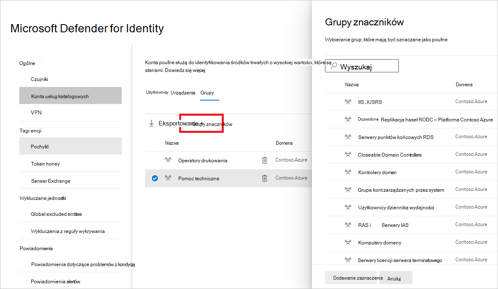
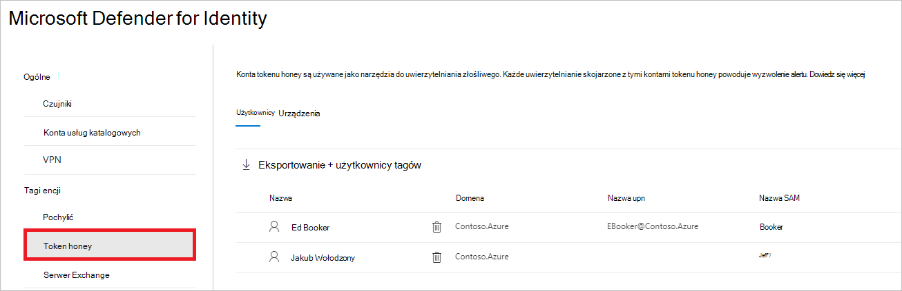
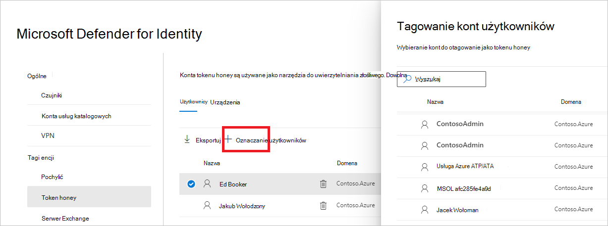

# Tagi jednostki tożsamości usługi Defender w programie Microsoft 365 Defender

**Dotyczy:**

- Microsoft 365 Defender
- Defender for Identity

W tym artykule wyjaśniono, jak stosować [tagi encji tożsamości usługi Microsoft Defender](/defender-for-identity) [w Microsoft 365 Defender.](/microsoft-365/security/defender/overview-security-center)

>[!IMPORTANT]
>W ramach schłodowania w Microsoft 365 Defender tożsamości niektóre opcje i szczegóły zmieniły się od ich lokalizacji w portalu usługi Defender dla tożsamości. Zapoznaj się ze szczegółami poniżej, aby dowiedzieć się, gdzie znaleźć zarówno znane, jak i nowe funkcje.

## Tagi encji

W Microsoft 365 Defender można ustawić trzy typy tagów encji tożsamości usługi **Defender: tagi** poufne, tagi **Honeytoken** i Exchange **serwera**.

Aby ustawić te tagi, <a href="https://go.microsoft.com/fwlink/p/?linkid=2077139" target="_blank">na Microsoft 365 Defender</a> przejdź **do Ustawienia i** **Tożsamości**.

Ustawienia tagów zostaną wyświetlone w obszarze **Tagi encji**.

Aby ustawić każdy typ tagu, postępuj zgodnie z poniższymi instrukcjami.

## Tagi poufne

Tag **Sensitive służy** do identyfikowania zasobów o wysokiej wartości. Ścieżka ruchu bocznego również zależy od stanu wrażliwości encji. Niektóre jednostki są automatycznie traktowane jako poufne przez program Defender dla tożsamości. Aby uzyskać listę tych środków trwałych, zobacz [Poufne jednostki](/defender-for-identity/manage-sensitive-honeytoken-accounts#sensitive-entities).

Możesz również ręcznie otagować użytkowników, urządzenia lub grupy jako poufne.

1. Wybierz **pozycję Poufne**. Pojawi się istniejący poufny obszar **Użytkownicy**, **Urządzenia** i **Grupy**.

    

1. W obszarze każdej kategorii wybierz **pozycję Tag...** , aby otagować ten typ encji. Na przykład w obszarze **Grupy** wybierz pozycję **Grupy znaczników.** Zostanie otwarte okienko z grupami, które możesz oznaczyć. Aby wyszukać grupę, wprowadź jej nazwę w polu wyszukiwania.

    

1. Zaznacz grupę i kliknij pozycję **Dodaj zaznaczenie.**

    

## Tagi Honeytoken

Jednostki Honeytoken są używane jako groty złośliwych szpadów. Każde uwierzytelnianie skojarzone z tymi jednostkami honeytoken powoduje wyzwolenie alertu.

Użytkownicy lub urządzenia za pomocą tagu **Honeytoken** można oznaczać tak samo jak poufne konta.

1. Wybierz **pozycję Honeytoken**. Zobaczysz istniejących użytkowników i urządzeń korzystających z  poszczegłonia.

    

1. W obszarze każdej kategorii wybierz **pozycję Tag...** , aby otagować ten typ encji. Na przykład w obszarze **Użytkownicy** wybierz pozycję **Otaguj użytkowników.** Zostanie otwarte okienko z grupami, które możesz oznaczyć. Aby wyszukać grupę, wprowadź jej nazwę w polu wyszukiwania.

    

1. Wybierz użytkownika i kliknij pozycję **Dodaj zaznaczenie.**

    

## Exchange tagów serwera

Program Defender for Identity uznaje Exchange jako zasoby o wysokiej wartości i automatycznie oznacza je jako **poufne**. Możesz także ręcznie otagować urządzenia jako Exchange serwerach.

1. Wybierz **Exchange serwera**. Następnie zobaczysz istniejące urządzenia z etykietą Exchange **serwera**.

    

1. Aby otagować urządzenie jako serwer Exchange, wybierz pozycję **Urządzenia tagów**.  Zostanie otwarte okienko z urządzeniami, które możesz oznaczyć. Aby wyszukać urządzenie, wprowadź jego nazwę w polu wyszukiwania.

    

1. Wybierz urządzenie i kliknij pozycję **Dodaj zaznaczenie.**

    

## Zobacz też

- [Zarządzanie alertami zabezpieczeń usługi Defender for Identity](manage-security-alerts.md)
