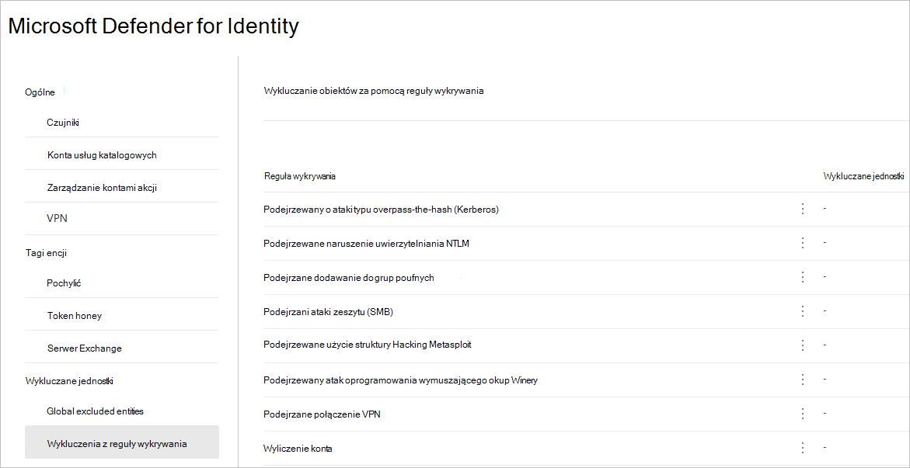
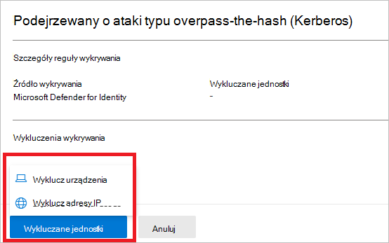
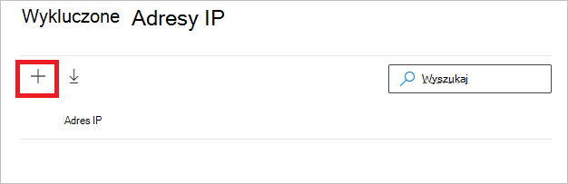
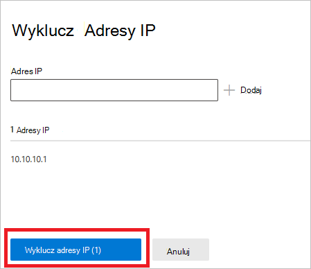
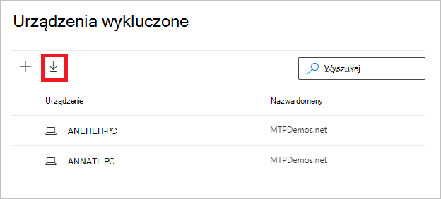
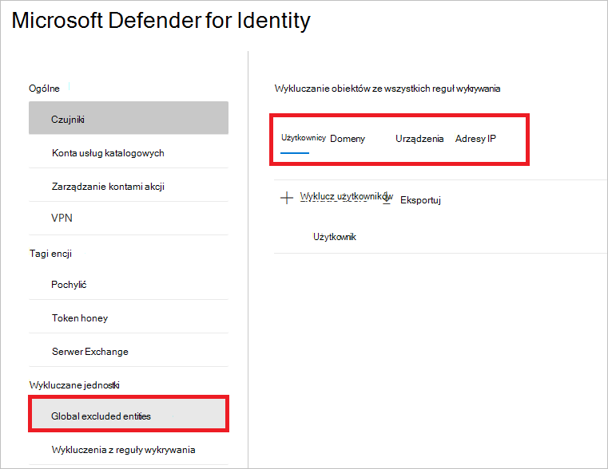
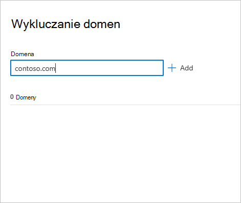

# Konfigurowanie usługi Defender pod celu wykrywania wykluczeń tożsamości w Microsoft 365 Defender

**Dotyczy:**

- Microsoft 365 Defender
- Defender for Identity

W tym artykule wyjaśniono, jak skonfigurować program [Microsoft Defender pod celu wykrywania](/defender-for-identity) tożsamości w innych [Microsoft 365 Defender](/microsoft-365/security/defender/overview-security-center).

> [!IMPORTANT]
> W ramach schłodowania w Microsoft 365 Defender tożsamości niektóre opcje i szczegóły zmieniły się od ich lokalizacji w portalu usługi Defender dla tożsamości. Zapoznaj się ze szczegółami poniżej, aby dowiedzieć się, gdzie znaleźć zarówno znane, jak i nowe funkcje.

[!INCLUDE [Product long](includes/product-long.md)] umożliwia wyłączenie określonych adresów IP, komputerów, domen lub użytkowników z szeregu wykryciy.

Na przykład **alert rekonesansu DNS** może zostać wyzwolony przez skaner zabezpieczeń, który używa systemu DNS jako mechanizmu skanowania. Utworzenie wykluczenia pomaga w ignorowania takich skanerów przez defender for Identity i zmniejszaniu wyników fałszywie dodatnich.

>[!NOTE]
>W przypadku najpopularniejszych domen z otwartą podejrzaną komunikacją przez [alerty DNS](/defender-for-identity/exfiltration-alerts#suspicious-communication-over-dns-external-id-2031) obserwowaliśmy domeny wykluczonych przez klientów najczęstszą z alertów. Te domeny są domyślnie dodawane do listy wykluczeń, ale możesz je łatwo usunąć.

## Jak dodać wykluczenia wykrywania

1. Na [Microsoft 365 Defender](https://security.microsoft.com/) **przejdź do Ustawienia** i **Tożsamości**.

    

1. W menu po lewej  stronie zobaczysz pozycję Wykluczone jednostki.

    

Wykluczenia można następnie ustawić za pomocą dwóch metod: Wykluczenia z reguły **wykrywania** i jednostek **wykluczonych globalnie**.

## Wykluczenia z reguły wykrywania

1. W menu po lewej stronie wybierz pozycję **Wykluczenia z reguły wykrywania**. Zostanie wyświetlona lista reguł wykrywania.

    

1. Dla każdego wykrywania, który chcesz skonfigurować, wykonaj następujące czynności:

    1. Zaznacz regułę. Wykrywanie można wyszukiwać za pomocą paska wyszukiwania. Po wybraniu tej opcji zostanie otwarte okienko ze szczegółami reguły wykrywania.

        

    1. Aby dodać wykluczenie, wybierz przycisk **Wyklucz encje** , a następnie wybierz typ wykluczenia. Dla każdej reguły są dostępne różne wykluczone jednostki. Należą do nich użytkownicy, urządzenia, domeny i adresy IP. W tym przykładzie dostępne opcje to **Wyklucz urządzenia** i **Wyklucz adresy IP**.

        

    1. Po wybraniu typu wykluczenia możesz dodać wykluczenie. W okienku, które zostanie otwarte, wybierz ten przycisk **+** , aby dodać wykluczenie.

        

    1. Następnie dodaj jednostkę do wykluczenia. Wybierz **pozycję + Dodaj** , aby dodać jednostkę do listy.

        

    1. Następnie wybierz **pozycję Wyklucz adresy IP** (w tym przykładzie), aby zakończyć wykluczenie.

        

    1. Po dodaniu wykluczeń możesz wyeksportować listę lub usunąć wykluczenia, wracając do przycisku **Wyklucz encji** . W tym przykładzie zwróciliśmy do **wykluczania urządzeń**. Aby wyeksportować listę, wybierz przycisk ze strzałką w dół.

        

    1. Aby usunąć wykluczenie, wybierz wykluczenie i wybierz ikonę kosza.

        

## Global excluded entities

Teraz możesz również konfigurować wykluczenia dla **jednostek wykluczonych globalnie**. Wykluczenia globalne umożliwiają definiowanie określonych jednostek (adresów IP, podsieci, urządzeń lub domen) w celu wykluczenia ich we wszystkich wykryciach, które ma program Defender for Identity. Jeśli więc wykluczysz urządzenie, będzie ono stosowane tylko do wykrywania, które w ramach wykrywania ma identyfikację urządzenia.

1. Z menu po lewej stronie wybierz pozycję Globalne **wykluczone jednostki**. Zobaczysz kategorie jednostek, które możesz wykluczyć.

    

1. Wybierz typ wykluczenia. W tym przykładzie wybrano opcję **Wyklucz domeny**.

    

1. Zostanie otwarte okienko, w którym możesz dodać domenę do wykluczenia. Dodaj domenę, którą chcesz wykluczyć.

    

1. Domena zostanie dodana do listy. Wybierz **pozycję Wyklucz domeny** , aby ukończyć wykluczenie.

    

1. Następnie zobaczysz domenę na liście jednostek do wykluczenia ze wszystkich reguł wykrywania. Możesz wyeksportować listę lub usunąć encje, zaznaczając je i **klikając przycisk Usuń** .

    

## Zobacz też

- [Zarządzanie alertami zabezpieczeń usługi Defender for Identity](manage-security-alerts.md)
