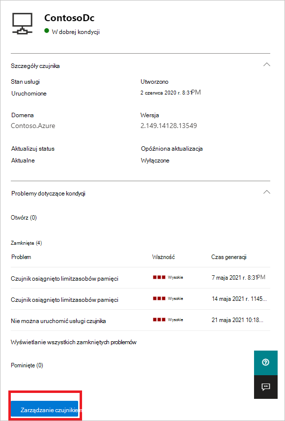
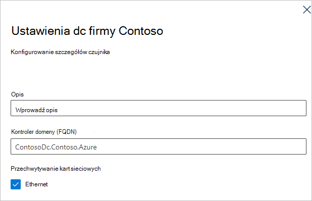

# Kondycja i ustawienia czujnika tożsamości usługi Microsoft Defender w aplikacji Microsoft 365 Defender

**Dotyczy:**

- Microsoft 365 Defender
- Defender for Identity

W tym artykule wyjaśniono, jak skonfigurować i monitorować czujnik [tożsamości programu Microsoft Defender](/defender-for-identity) [w Microsoft 365 Defender](/microsoft-365/security/defender/overview-security-center).

>[!IMPORTANT]
>W ramach schłodowania w Microsoft 365 Defender tożsamości niektóre opcje i szczegóły zmieniły się od ich lokalizacji w portalu usługi Defender dla tożsamości. Zapoznaj się ze szczegółami poniżej, aby dowiedzieć się, gdzie znaleźć zarówno znane, jak i nowe funkcje.

## Wyświetl ustawienia i stan czujnika tożsamości usługi Defender

1. Na <a href="https://go.microsoft.com/fwlink/p/?linkid=2077139" target="_blank">Microsoft 365 Defender</a> **przejdź do Ustawienia** i **Tożsamości**.

    

1. Wybierz stronę **Czujniki** , na której są wyświetlane wszystkie czujniki usługi Defender for Identity. Dla każdego czujnika zobaczysz jego nazwę, członkostwo w domenie, numer wersji, jeśli aktualizacje powinny być opóźnione, stan usługi, stan aktualizacji, stan kondycji, liczbę problemów dotyczących kondycji oraz czas utworzenia czujnika.

    

    >[!NOTE]
    >W portalu usługi Defender for Identity ustawienia czujnika i informacje o kondycji były w osobnych lokalizacjach. Pamiętaj, Microsoft 365 Defender że teraz są na tej samej stronie.

1. Jeśli wybierzesz **pozycję** Filtry, możesz wybrać filtry, które będą dostępne. Następnie w przypadku każdego filtru możesz wybrać czujniki do wyświetlenia.

    

    

1. Jeśli wybierzesz jeden z czujnika, zostanie otwarte okienko z informacjami o czujniku i jego stanie kondycji.

    

1. Jeśli wybierzesz dowolny z problemów z kondycją, zostanie otwarte okienko ze szczegółami na ich temat. Jeśli wybierzesz problem zamknięty, możesz otworzyć go ponownie w tym miejscu.

    

1. Jeśli wybierzesz **pozycję Zarządzaj czujnikiem**, zostanie otwarte okienko, w którym możesz skonfigurować szczegóły czujnika.

    

    

1. Na stronie **Czujniki** możesz wyeksportować listę czujniki do pliku .csv, wybierając pozycję **Eksportuj**.

    

## Dodaj czujnik

Na stronie **Czujniki** możesz dodać nowy czujnik.

1. Wybierz **pozycję Dodaj czujnik**.

    

1. Zostanie otwarte okienko z przyciskiem pobierania instalatora czujnika i wygenerowanym kluczem dostępu.

    

1. Wybierz **pozycję Pobierz instalatora** , aby zapisać pakiet lokalnie. Plik zip zawiera następujące pliki:

    - Instalator czujnika usługi Defender for Identity

    - Plik ustawień konfiguracji z informacjami wymaganymi do nawiązania połączenia z usługą w chmurze Defender for Identity

1. Skopiuj klawisz **programu Access**. Do połączenia się z wystąpieniem usługi Defender for Identity jest wymagany klucz dostępu czujnika tożsamości usługi Defender. Klucz dostępu to hasło logowania się do wdrożenia czujnika, po którym cała komunikacja jest wykonywana przy użyciu certyfikatów na celu uwierzytelniania i szyfrowania TLS. Użyj **przycisku Generuj** ponownie, jeśli kiedykolwiek zajdą konieczność ponownego wygenerowania nowego klucza dostępu. Nie wpływa on na żadne wcześniej wdrożone czujniki, ponieważ jest używany tylko do wstępnej rejestracji czujnika.

1. Skopiuj pakiet na dedykowany serwer lub kontroler domeny, na który instalujesz czujnik usługi Defender for Identity.

## Zobacz też

- [Zarządzanie alertami zabezpieczeń usługi Defender for Identity](manage-security-alerts.md)
