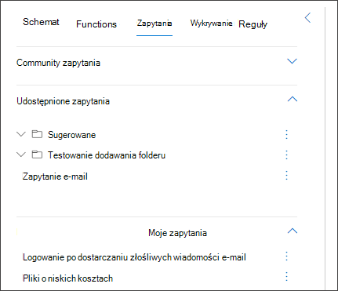

# Korzystanie z zapytań udostępnionych podczas zaawansowanego wyszukiwania

[!INCLUDE [Microsoft 365 Defender rebranding](../includes/microsoft-defender.md)]

**Dotyczy:**
- Microsoft 365 Defender
- Ochrona punktu końcowego w usłudze Microsoft Defender

[Zaawansowane zapytania](advanced-hunting-overview.md) myśliwskie mogą być udostępniane użytkownikom w tej samej organizacji. Możesz również znaleźć zapytania udostępnione publicznie w GitHub. Te zapytania umożliwiają szybkie prowadzenie określonych scenariuszy wyszukiwania zagrożeń bez konieczności pisania zapytań od podstaw.

## Zapisywanie, modyfikowanie i udostępnianie zapytania
Nowe lub istniejące zapytanie można zapisać w taki sposób, aby było dostępne tylko dla Ciebie lub udostępnione innym użytkownikom w organizacji. 

1. Tworzenie lub modyfikowanie zapytania. 

2. Kliknij przycisk **listy rozwijanej Zapisz** zapytanie i wybierz pozycję **Zapisz jako**.
    
3. Wprowadź nazwę zapytania. 

   

4. Wybierz folder, w którym chcesz zapisać zapytanie.
    - **Zapytania udostępnione** — udostępnione wszystkim użytkownikom w organizacji
    - **Moje zapytania —** dostępne tylko dla Ciebie
    
5. Wybierz **Zapisz**. 

## Usuwanie lub zmienianie nazwy zapytania
1. Wybierz trzy kropki z prawej strony zapytania, którego nazwę chcesz zmienić lub usunąć.

    

2. Wybierz **pozycję Usuń** i potwierdź usunięcie. Możesz też **wybrać pozycję Zmień** nazwę i podać nową nazwę zapytania.

## Tworzenie bezpośredniego linku do zapytania
Aby wygenerować link, który otwiera zapytanie bezpośrednio w zaawansowanym edytorze zapytań wyszukiwania, zakończ zapytanie i wybierz pozycję **Udostępnij link**.

## Zapytania programu Access w GitHub repozytorium  
Firma Microsoft ds. zabezpieczeń regularnie udostępnia zaawansowane zapytania myśliwskie w [wyznaczonym repozytorium publicznym na GitHub](https://aka.ms/hunting-queries). To repozytorium jest otwarte na udziały. Aby dołączyć, [dołącz GitHub bezpłatnie](https://github.com/).

>[!tip]
>Poza tym, w celu znajdowania działań i wskaźników skojarzonych z wyłaniających się zagrożeniami, są również zapewniane zaawansowane zapytania myśliwskie firmy Microsoft. Te zapytania są udostępniane w ramach raportów analizy zagrożeń w [programie](/windows/security/threat-protection/microsoft-defender-atp/threat-analytics) Microsoft 365 Defender.

## Tematy pokrewne
- [Omówienie zaawansowanego wyszukiwania](advanced-hunting-overview.md)
- [Poznaw język zapytań](advanced-hunting-query-language.md)
- [Praca z wynikami zapytania](advanced-hunting-query-results.md)
- [Przeszukaj urządzenia, wiadomości e-mail, aplikacje i tożsamości](advanced-hunting-query-emails-devices.md)
- [Opis schematu](advanced-hunting-schema-tables.md)
- [Stosowanie najlepszych rozwiązań kwerend](advanced-hunting-best-practices.md)