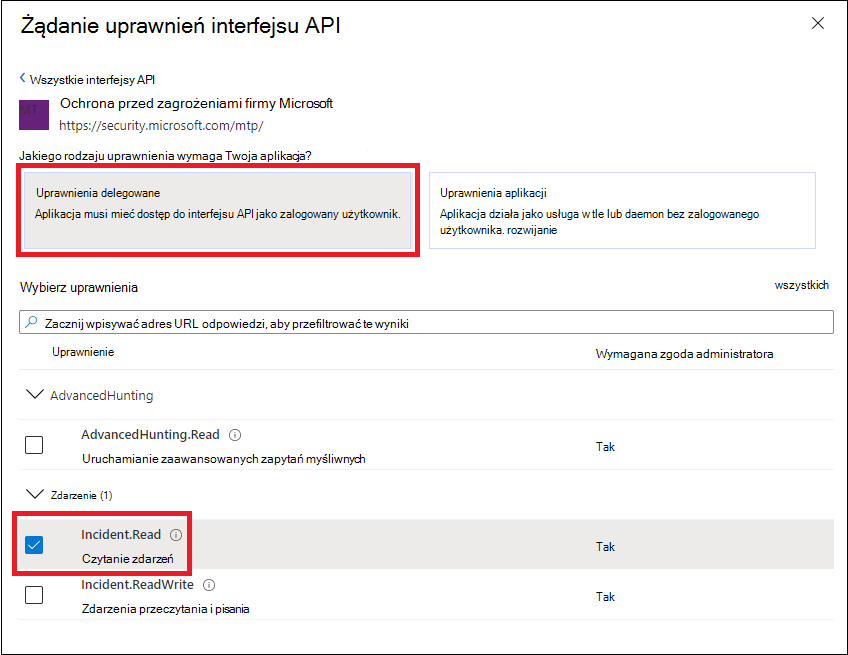
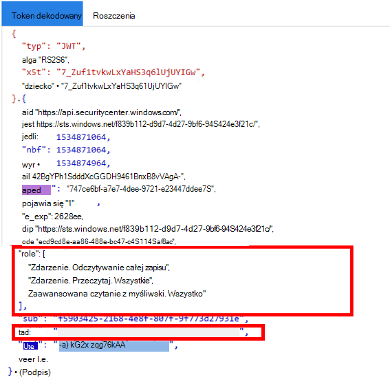

# <a name="create-an-app-to-access-microsoft-365-defender-apis-on-behalf-of-a-user"></a>Tworzenie aplikacji w celu uzyskania Microsoft 365 Defender interfejsów API w imieniu użytkownika

[!INCLUDE [Microsoft 365 Defender rebranding](../includes/microsoft-defender.md)]

**Dotyczy:**

- Microsoft 365 Defender

> [!IMPORTANT]
> Niektóre informacje odnoszą się do wstępnie wypuszczonych produktów, które mogą zostać znacząco zmodyfikowane przed jego komercyjną premierą. Firma Microsoft nie udziela żadnych gwarancji, wyraźnych ani dorozumianych, w odniesieniu do podanych tutaj informacji.

Na tej stronie opisano, jak utworzyć aplikację w celu uzyskania dostępu programowego Microsoft 365 Defender w imieniu jednego użytkownika.

Jeśli potrzebujesz dostępu programowego do programu Microsoft 365 Defender bez zdefiniowanego użytkownika (na przykład gdy piszesz aplikację w tle lub daemon), zobacz Tworzenie aplikacji w celu uzyskania dostępu do aplikacji Microsoft 365 Defender bez [użytkownika.](api-create-app-web.md) Jeśli chcesz zapewnić dostęp do wielu dzierżaw — na przykład jeśli obsługujesz dużą organizację lub grupę klientów — zobacz Tworzenie aplikacji z dostępem partnera do interfejsów [API Microsoft 365 Defender API](api-partner-access.md). Jeśli nie masz pewności, jakiego rodzaju dostępu potrzebujesz, zobacz [Wprowadzenie](api-access.md).

Microsoft 365 Defender udostępnia większość danych i akcji za pośrednictwem zestawu interfejsów API programistycznych. Te interfejsy API ułatwiają automatyzowanie przepływów pracy i korzystanie Microsoft 365 Defender możliwości firmy. Ten dostęp do interfejsu API wymaga uwierzytelniania OAuth2.0. Aby uzyskać więcej informacji, zobacz [Kod autoryzacji protokołu OAuth 2.0 Flow](/azure/active-directory/develop/active-directory-v2-protocols-oauth-code).

Aby używać tych interfejsów API, należy wykonać następujące czynności:

- Utwórz aplikację usługi Azure Active Directory (Azure AD).
- Uzyskaj token dostępu przy użyciu tej aplikacji.
- Token umożliwia uzyskanie dostępu do Microsoft 365 Defender API.

W tym artykule wyjaśniono, jak to zrobić:

- Tworzenie aplikacji usługi Azure AD
- Uzyskiwanie tokenu dostępu do Microsoft 365 Defender
- Sprawdź poprawność tokenu

> [!NOTE]
> Podczas uzyskiwania Microsoft 365 Defender API w imieniu użytkownika będą potrzebne odpowiednie uprawnienia aplikacji i uprawnienia użytkownika.

> [!TIP]
> Jeśli masz uprawnienie do wykonywania akcji w portalu, masz uprawnienie do wykonywania tej akcji w interfejsie API.

## <a name="create-an-app"></a>Tworzenie aplikacji

1. Zaloguj się do [platformy Azure](https://portal.azure.com) jako użytkownik z rolą **administratora globalnego** .

2. Przejdź do **Azure Active Directory** >  **Rejestracja aplikacjiAppNew** >  **registration**.

   

3. W formularzu wybierz nazwę aplikacji i wprowadź następujące informacje dotyczące przekierowania URI, a następnie wybierz pozycję **Zarejestruj**.

   

   - **Typ aplikacji:** Klient publiczny
   - **Przekierowywanie URI:** https://portal.azure.com

4. Na stronie aplikacji wybierz pozycję Uprawnienia **interfejsu APIUdzyskaj** >  >  **uprawnieniaAPImki** używane przez moją organizację >, wpisz **Microsoft Threat Protection** i wybierz pozycję **Microsoft Threat Protection**. Aplikacja może teraz uzyskać dostęp do Microsoft 365 Defender.

   > [!TIP]
   > *Ochrona przed zagrożeniami firmy Microsoft* to wcześniejsza Microsoft 365 Defender i nie będzie wyświetlana na oryginalnej liście. Aby tekst był wyświetlany, musisz rozpocząć pisanie jego nazwy w polu tekstowym.

   

   - Wybierz **pozycję Uprawnienia delegowane**. Wybierz odpowiednie uprawnienia dla scenariusza (na przykład **Odczyt zdarzenia**), a następnie wybierz pozycję **Dodaj uprawnienia**.

   

    > [!NOTE]
    > Musisz wybrać odpowiednie uprawnienia dla swojego scenariusza. *Czytanie wszystkich zdarzeń to* tylko przykład. Aby ustalić, jakich uprawnień potrzebujesz, zapoznaj się z sekcją **Uprawnienia** w interfejsie API, który chcesz wywołać.
    >
    > Aby na przykład [uruchamiać zapytania zaawansowane](api-advanced-hunting.md), wybierz uprawnienie Uruchamianie zapytań zaawansowanych. aby [odizolować urządzenie](/windows/security/threat-protection/microsoft-defender-atp/isolate-machine), wybierz uprawnienie "Wyizoluj komputer".

5. Wybierz pozycję **Utłań zgodę administratora**. Za każdym razem, gdy dodajesz uprawnienie, musisz zaznaczyć pozycję Udawaj **administratorów** , aby je obowiązywało.

   

6. Zanotuj swój identyfikator aplikacji i identyfikator dzierżawy w bezpiecznym miejscu. Są one wymienione w obszarze **Omówienie** na stronie aplikacji.

   

## <a name="get-an-access-token"></a>Uzyskiwanie tokenu dostępu

Aby uzyskać więcej informacji Azure Active Directory tokenów, zobacz [samouczek dotyczący usługi Azure AD](/azure/active-directory/develop/active-directory-v2-protocols-oauth-client-creds).

### <a name="get-an-access-token-using-powershell"></a>Uzyskiwanie tokenu dostępu przy użyciu programu PowerShell

```PowerShell
if(!(Get-Package adal.ps)) { Install-Package -Name adal.ps } # Install the ADAL.PS package in case it's not already present

$tenantId = '' # Paste your directory (tenant) ID here.
$clientId = '' # Paste your application (client) ID here.
$redirectUri = '' # Paste your app's redirection URI

$authority = "https://login.windows.net/$tenantId"
$resourceUrl = 'https://api.security.microsoft.com'

$response = Get-ADALToken -Resource $resourceUrl -ClientId $clientId -RedirectUri $redirectUri -Authority $authority -PromptBehavior:Always
$response.AccessToken | clip

$response.AccessToken
```

## <a name="validate-the-token"></a>Sprawdź poprawność tokenu

1. Skopiuj i wklej token do aplikacji [JWT](https://jwt.ms) , aby go odkodować.
1. Upewnij się, że *role w* tokenie dekodowany zawierają odpowiednie uprawnienia.

Na poniższej ilustracji widać dekodowany token nabyte z aplikacji, ```Incidents.Read.All```za pomocą , ```Incidents.ReadWrite.All```i ```AdvancedHunting.Read.All``` uprawnień:



## <a name="use-the-token-to-access-the-microsoft-365-defender-api"></a>Używanie tokenu w celu uzyskania dostępu do Microsoft 365 Defender API

1. Wybierz odpowiedni interfejs API (zdarzenia lub zaawansowane szukanie). Aby uzyskać więcej informacji, zobacz [Obsługiwane Microsoft 365 Defender API](api-supported.md).
2. W żądaniu http, które chcesz wysłać, `"Bearer" <token>`ustaw nagłówek autoryzacji *na wartość ,* Użytkownik jest schematem autoryzacji, a *token jest tokenem* weryfikowanego przez Ciebie.
3. Token wygaśnie w ciągu godziny. W tym czasie możesz wysłać więcej niż jedno żądanie przy użyciu tego samego tokenu.

W poniższym przykładzie pokazano, jak wysłać żądanie w celu uzyskania listy zdarzeń przy **użyciu języka C#**.

```C#
    var httpClient = new HttpClient();
    var request = new HttpRequestMessage(HttpMethod.Get, "https://api.security.microsoft.com/api/incidents");

    request.Headers.Authorization = new AuthenticationHeaderValue("Bearer", token);

    var response = httpClient.SendAsync(request).GetAwaiter().GetResult();
```

## <a name="related-articles"></a>Artykuły pokrewne

- [Microsoft 365 Defender interfejsów API — omówienie](api-overview.md)
- [Uzyskiwanie dostępu do Microsoft 365 Defender API](api-access.md)
- [Tworzenie aplikacji "Witaj świecie"](api-hello-world.md)
- [Tworzenie aplikacji w celu uzyskania Microsoft 365 Defender dostępu bez użytkownika](api-create-app-web.md)
- [Tworzenie aplikacji z dostępem partnera z wieloma dzierżawami do Microsoft 365 Defender API](api-partner-access.md)
- [Informacje o limitach i licencjonowaniu interfejsu API](api-terms.md)
- [Opis kodów błędów](api-error-codes.md)
- [Autoryzacja protokołu OAuth 2.0 do logowania użytkownika i dostępu do interfejsu API](/azure/active-directory/develop/active-directory-v2-protocols-oauth-code)
