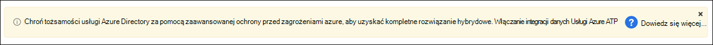
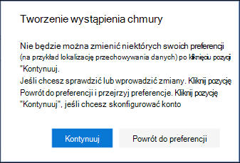
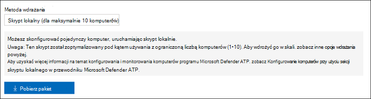
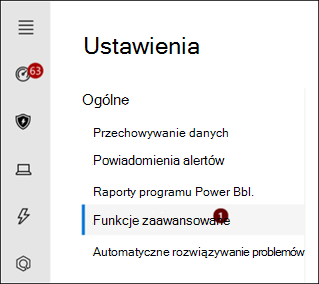
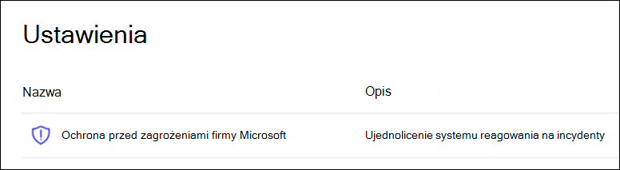

# Konfigurowanie Microsoft 365 Defender w laboratorium próbnym lub środowisku pilotażowym

[!INCLUDE [Microsoft 365 Defender rebranding](../includes/microsoft-defender.md)]

**Dotyczy:**
- Microsoft 365 Defender

Tworzenie Microsoft 365 Defender próbnego lub pilotażowego i wdrażanie go jest procesem trzyfazowym:

| [Etap 1. Przygotowywanie](prepare-m365d-eval.md) | [Etap 2. Konfigurowanie](setup-m365deval.md) | Etap 3. Wniesienie |  [Powrót do podręcznika pilotażowego](m365d-pilot.md) |
|--|--|--|--|
|| |*Jesteś tutaj!* | |

Jesteś obecnie w fazie konfiguracji.

Przygotowanie jest kluczem do każdego pomyślnego wdrożenia. W tym artykule otrzymasz  przewodniki na temat punktów, które należy wziąć pod uwagę podczas przygotowywania się do wdrożenia programu Microsoft Defender dla punktu końcowego.

## Microsoft 365 Defender i słupów
Microsoft 365 Defender składa się z czterech słupów. Chociaż jeden słupek może już stanowić wartość dla zabezpieczeń Twojej organizacji sieci, włączenie tych czterech Microsoft 365 Defender spowoduje, że Twoja organizacja będzie najbardziej wartościowa.

W tej sekcji podano konfigurować:

- Usługa Microsoft Defender dla Office 365
- Microsoft Defender for Identity
- Microsoft Cloud App Security
- Ochrona punktu końcowego w usłudze Microsoft Defender

## Konfigurowanie usługi Microsoft Defender dla Office 365

> [!NOTE]
> Pomiń ten krok, jeśli masz już włączoną usługę Defender dla Office 365.

Istnieje moduł programu PowerShell o nazwie *Office 365 Advanced Threat Protection Recommended Configuration Analyzer (ORCA),* który ułatwia określenie niektórych z tych ustawień. Po uruchomieniu jako administrator w dzierżawie get-ORCAReport pomoże wygenerować ocenę ustawień ochrony przed spamem, wiadomości anti-phish i innych ustawień wiadomości. Możesz pobrać ten moduł z https://www.powershellgallery.com/packages/ORCA/.

1. Przejdź do [Office 365 Centrum &](https://protection.office.com/homepage) **zgodnościReat** >  **managementPolicy** > .

   

2. Kliknij **pozycję Ochrona przed wyłudzaniem** informacji, **wybierz pozycję Utwórz** i wpisz nazwę i opis zasad. Kliknij **Dalej**.

   

   > [!NOTE]
   > Edytuj zaawansowane zasady ochrony przed wyłudzaniem informacji w programie Microsoft Defender dla Office 365. Zmień **zaawansowany próg wyłudzania informacji** **na 2 — agresywny**.

3. Kliknij menu **rozwijane Dodaj warunek** i wybierz domeny jako domenę adresata. Kliknij **Dalej**.

   

4. Przejrzyj ustawienia. Kliknij **pozycję Utwórz te zasady,** aby potwierdzić.

   

5. Wybierz **Sejf załączników** i wybierz opcję Włącz **atP dla SharePoint, OneDrive i Microsoft Teams** atp.

   

6. Kliknij ikonę +, aby utworzyć nowe bezpieczne zasady załączników i zastosować je jako domenę adresata do swoich domen. Kliknij **Zapisz**.

   

7. Następnie wybierz zasady **ołówka Sejf**, a następnie kliknij ikonę ołówka, aby edytować zasady domyślne.

8. Upewnij się, że **opcja Nie śledź** po kliknięciu przez użytkowników bezpiecznych linków nie jest zaznaczona, podczas gdy pozostałe opcje są zaznaczone. Aby [uzyskać szczegółowe Sejf, zobacz ustawienia linku](/microsoft-365/security/office-365-security/recommended-settings-for-eop-and-office365). Kliknij **Zapisz**.

   

9. Następnie wybierz zasady **ochrony przed złośliwym** oprogramowaniem, wybierz domyślną i wybierz ikonę ołówka.

10. Kliknij **Ustawienia** pozycję **Tak i użyj domyślnego** tekstu powiadomień, aby włączyć funkcję **wykrywania złośliwego oprogramowania**. Włącz **filtr typowych typów** załączników. Kliknij **Zapisz**.

    

11. Przejdź do [Office 365 usługi & w Centrum](https://protection.office.com/homepage) >  zgodnościWyszukiwanie >  **dziennikaAudit** i włączanie inspekcji.

    

12. Zintegruj usługę Microsoft Defender dla Office 365 z programem Microsoft Defender for Endpoint. Przejdź do [Office 365 centrum &](https://protection.office.com/homepage) >  zgodności Programu **SecurityThreat** **managementExplorer** >  i wybierz pozycję **Microsoft Defender for Endpoint Ustawienia** w prawym górnym rogu ekranu. W oknie dialogowym Połączenie usługi Defender for Endpoint włącz **usługę Połączenie do programu Microsoft Defender for Endpoint**.

    

## Konfigurowanie usługi Microsoft Defender dla tożsamości

> [!NOTE]
> Pomiń ten krok, jeśli masz już włączoną usługę Microsoft Defender dla tożsamości

1. Przejdź do [Microsoft 365 Security Center i](https://security.microsoft.com/info) > **pozycję Więcej zasobówMicrosoft** >  **Defender for Identity**.

   

2. Kliknij **przycisk Utwórz** , aby uruchomić kreatora programu Microsoft Defender dla tożsamości.

   

3. Wybierz **pozycję Podaj nazwę użytkownika i hasło, aby połączyć się z lasem usługi Active Directory**.

   

4. Wprowadź swoje poświadczenia lokalne usługi Active Directory. Może to być dowolne konto użytkownika z dostępem do odczytu usługi Active Directory.

   

5. Następnie wybierz pozycję **Download Sensor Setup (Pobierz konfigurację** czujnika) i przenieś plik do kontrolera domeny.

   

6. Wykonaj konfigurację czujnika tożsamości programu Microsoft Defender for Identity i rozpocznij wykonywanie czynności kreatora.

   

7. Kliknij **przycisk Dalej** w typie wdrożenia czujnika.

   

8. Skopiuj klucz dostępu, ponieważ musisz wprowadzić go dalej w Kreatorze.

   

9. Skopiuj klawisz dostępu do Kreatora i kliknij pozycję **Zainstaluj**.

   

10. Gratulacje! Pomyślnie skonfigurowano usługę Microsoft Defender for Identity na kontrolerze domeny.

    

11. W sekcji [ustawień usługi Microsoft Defender for Identity](https://go.microsoft.com/fwlink/?linkid=2040449) wybierz **Microsoft Defender for Endpoint **, a następnie włącz przełącznik. Kliknij **Zapisz**.

    

## Konfigurowanie Microsoft Cloud App Security

> [!NOTE]
> Pomiń ten krok, jeśli masz już włączoną Microsoft Cloud App Security.

1. Przejdź do [Microsoft 365 Centrum](https://security.microsoft.com/info) **zabezpieczeńWięcej** >  zasobów  >  Microsoft Cloud App Security.

   

2. Po wyświetleniu monitu o integrację usługi Microsoft Defender for Identity wybierz pozycję **Włącz integrację danych usługi Microsoft Defender for Identity**.

   

   > [!NOTE]
   > Jeśli nie widzisz tej prośby, może to oznaczać, że integracja danych usługi Microsoft Defender dla tożsamości została już włączona. Jeśli jednak nie masz pewności, skontaktuj się z administratorem IT, aby potwierdzić.

3. Przejdź do **Ustawienia**, włącz przełącznik integracji z usługą **Microsoft Defender dla tożsamości**, a następnie kliknij przycisk **Zapisz**.

   

   > [!NOTE]
   > W przypadku nowych wystąpień usługi Microsoft Defender dla tożsamości ten przełącznik integracji jest automatycznie włączony. Przed rozpoczęciem następnego kroku upewnij się, że integracja z usługą Microsoft Defender for Identity została włączona.

4. W obszarze Ustawienia odnajdowania w chmurze wybierz pozycję **Microsoft Defender for Endpoint integration (Integracja z** programem Endpoint), a następnie włącz integrację. Kliknij **Zapisz**.

   

5. W obszarze Ustawienia odnajdowania w chmurze wybierz **pozycję Wzbogacanie użytkowników**, a następnie włącz integrację z usługą Azure Active Directory.

   

## Konfigurowanie programu Microsoft Defender dla punktu końcowego

> [!NOTE]
> Pomiń ten krok, jeśli masz już włączony program Microsoft Defender dla punktu końcowego.

1. Przejdź do [Microsoft 365 ZabezpieczeńWięcej](https://security.microsoft.com/info) >  **zasobów** >  **Centrum zabezpieczeń usługi Microsoft Defender**. Kliknij **przycisk Otwórz**.

   

2. Postępuj zgodnie z kreatorem programu Microsoft Defender for Endpoint. Kliknij **Dalej**.

   

3. Wybierz preferowaną lokalizację przechowywania danych, zasady przechowywania danych, rozmiar organizacji i zgodę na funkcje wersji Preview.

   

   > [!NOTE]
   > Później nie możesz zmienić niektórych ustawień, takich jak lokalizacja przechowywania danych.

   Kliknij **Dalej**.

4. Kliknij **przycisk Kontynuuj** , a usługa będzie zapewniać usługę Microsoft Defender dla dzierżawy punktu końcowego.

   

5. Wdowaj punkty końcowe za pośrednictwem zasad grupy, Microsoft Endpoint Manager lub uruchamiając skrypt lokalny do usługi Microsoft Defender for Endpoint. Dla uproszczenia w tym przewodniku jest używany skrypt lokalny.

6. Kliknij **pozycję Pobierz pakiet** i skopiuj skrypt dołączania do punktów końcowych.

   

7. W punkcie końcowym uruchom skrypt dołączania jako administrator i wybierz pozycję Y.

   

8. Gratulacje! Pierwszy punkt końcowy został przez Ciebie wnoszony.

   

9. Skopiuj test wykrywania z kreatora Programu Microsoft Defender dla punktu końcowego.

   

10. Skopiuj skrypt programu PowerShell do wiersza polecenia o podwyższonym poziomie uprawnień i uruchom go.

    

11. Wybierz **pozycję Rozpocznij korzystanie z usługi Microsoft Defender for Endpoint** z kreatora.

    

12. Odwiedź [Centrum zabezpieczeń usługi Microsoft Defender.](https://securitycenter.windows.com/) Przejdź do **Ustawienia** a następnie wybierz pozycję **Funkcje zaawansowane**.

    

13. Włącz integrację z usługą **Microsoft Defender for Identity**.

    

14. Włącz integrację z analizą **Office 365 zagrożeniami**.

    

15. Włącz integrację z **usługą Microsoft Cloud App Security**.

    

16. Przewiń w dół i **kliknij pozycję Zapisz preferencje** , aby potwierdzić nowe integracje.

    

## Uruchom Microsoft 365 Defender sieciowej

> [!NOTE]
> Począwszy od 1 czerwca 2020 r., firma Microsoft automatycznie Microsoft 365 Defender funkcje dla wszystkich uprawnionych dzierżaw. Zobacz ten [artykuł Community technicznej firmy Microsoft na temat uprawnień do licencji,](https://techcommunity.microsoft.com/t5/security-privacy-and-compliance/microsoft-threat-protection-will-automatically-turn-on-for/ba-p/1345426) aby uzyskać szczegółowe informacje.

Przejdź do [Microsoft 365 zabezpieczeń](https://security.microsoft.com/homepage). Przejdź do **Ustawienia**, a następnie wybierz pozycję **Microsoft 365 Defender**.

Aby uzyskać bardziej wyczerpujące wskazówki, [zobacz Włączanie Microsoft 365 Defender](m365d-enable.md).

Gratulacje! Właśnie utworzono laboratorium Microsoft 365 Defender lub środowisko pilotażowe! Teraz możesz zapoznać się z Microsoft 365 Defender użytkownikami. Zobacz, czego możesz się dowiedzieć z Microsoft 365 Defender w interakcyjny przewodniku i dowiedz się, jak korzystać z poszczególnych pulpitów nawigacyjnych do wykonywania Twoich codziennie wykonywanych zadań związanych z operacjami zabezpieczeń.

[Zapoznaj się z interakcyjny przewodnik](https://aka.ms/MTP-Interactive-Guide)

Następnie możesz zasymulować atak i zobaczyć, jak funkcje krzyżowe produktu wykrywają, tworzą alerty i automatycznie reagują na ataki bez plików na punkt końcowy.

## Następny krok

- [Generowanie alertu testowego](generate-test-alert.md) — uruchom symululę ataków w laboratorium Microsoft 365 Defender próbnego.
