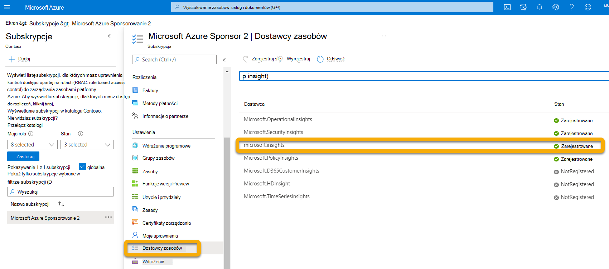
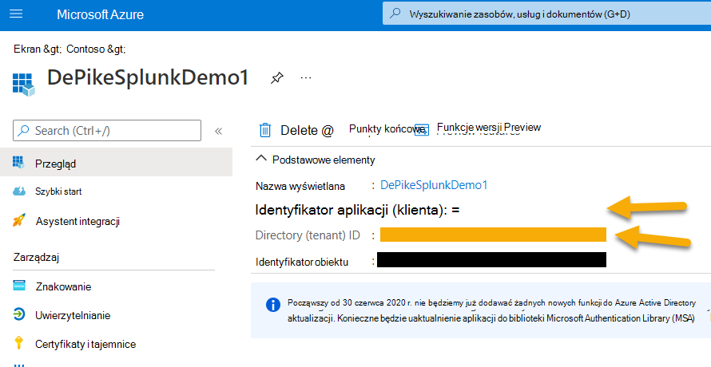
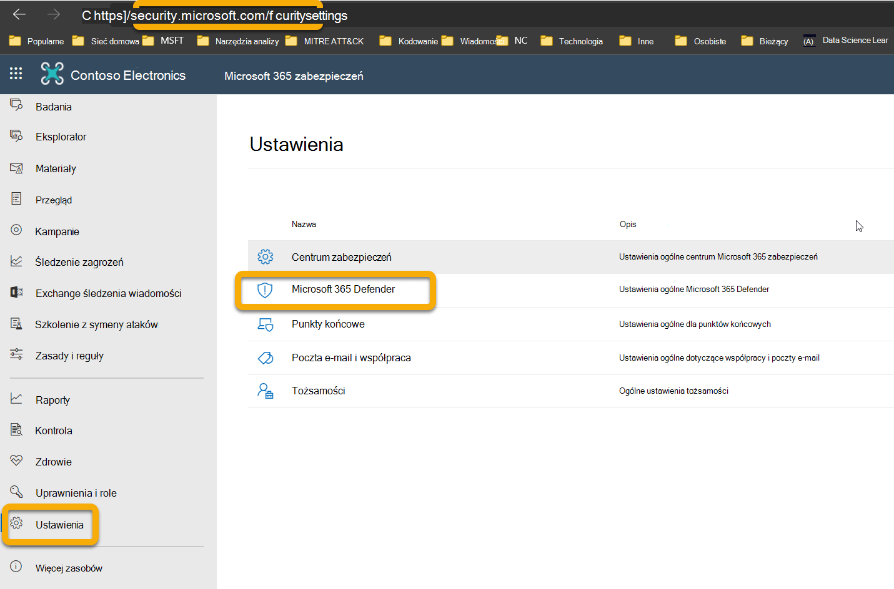
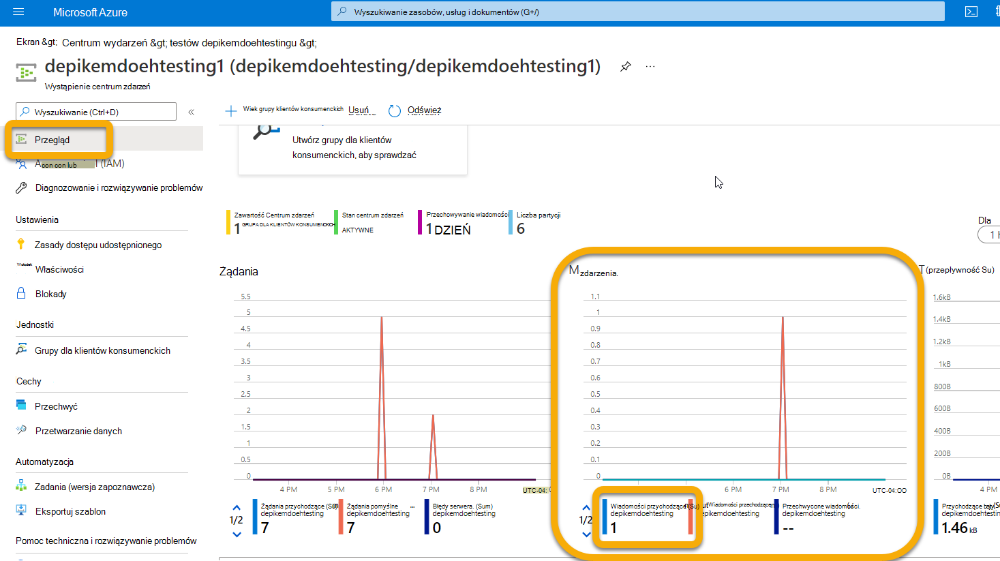

# <a name="configure-your-event-hub"></a>Konfigurowanie Centrum zdarzeń

[!INCLUDE [Microsoft 365 Defender rebranding](../../includes/microsoft-defender.md)]

**Dotyczy:**
- [Microsoft 365 Defender](https://go.microsoft.com/fwlink/?linkid=2118804)

Dowiedz się, jak skonfigurować Centrum zdarzeń, aby umożliwiało dostęp do zdarzeń z Microsoft 365 Defender.

## <a name="set-up-the-required-resource-provider-in-the-event-hub-subscription"></a>Konfigurowanie wymaganego dostawcy zasobów w subskrypcji centrum zdarzeń

1. Zaloguj się do witryny [Azure Portal](https://portal.azure.com).
1. Wybierz **pozycję Subskrypcje** > **{ Wybierz subskrypcję, która** zostanie wdrożona w centrum zdarzeń u } > **Dostawców zasobów**.
1. Sprawdź, czy witryna **Microsoft.Szczegółowe informacje** Dostawca został zarejestrowany. W przeciwnym razie zarejestruj je.



## <a name="set-up-azure-active-directory-app-registration"></a>Konfigurowanie rejestracji Azure Active Directory aplikacji

> ! [UWAGA] Musisz mieć rolę administratora lub Azure Active Directory (AAD) musi być tak ustawiona, aby zezwolić użytkownikom niebędącym administratorami na rejestrowanie aplikacji. Aby przypisać rolę podmiotu zabezpieczeń usługi, musisz również mieć rolę Właściciel lub Administrator dostępu użytkownika. Aby uzyskać więcej informacji, zobacz [Tworzenie aplikacji Azure AD & podmiotu zabezpieczeń usługi w portalu \| — Platforma tożsamości Microsoft Microsoft Docs](/azure/active-directory/develop/howto-create-service-principal-portal).

1. Utwórz nową rejestrację (która w sposób natury tworzy podmiot zabezpieczeń usługi) w **Azure Active Directory** \> **Rejestracji aplikacji Nowa** \> **rejestracja.**

1. Wypełnij formularz tylko nazwą (nie jest wymagany żaden adres URI przekierowania).

    

    

1. Utwórz klucz tajny, klikając pozycję **Certyfikaty & Tajemnica** \> **nowego klienta**:

    

> [!WARNING]
> **Nie będzie można ponownie uzyskać dostępu do klienta tajnego, dlatego zapisz go**.

## <a name="set-up-event-hub-namespace"></a>Konfigurowanie przestrzeni nazw Centrum zdarzeń

1. Tworzenie przestrzeni nazw centrum zdarzeń:

    Przejdź **do Centrum zdarzeń \>** Dodaj i wybierz warstwę cen, jednostki przepływności i Automatyczne inflate (wymaga standardowej ceny i w obszarze funkcji) odpowiednią dla spodziewanego obciążenia. Aby uzyskać więcej informacji, [zobacz Ceny — centrum Microsoft Azure \|](https://azure.microsoft.com/pricing/details/event-hubs/)

    > [!NOTE]
    > Możesz użyć istniejącego centrum zdarzeń, ale przepływność i skalowanie są ustawiane na poziomie przestrzeni nazw, więc zalecane jest umieścić centrum zdarzeń w przestrzeni nazw, w którym się znajduje.

   

1. Potrzebny będzie również identyfikator zasobu tej przestrzeni nazw centrum zdarzeń. Przejdź do strony przestrzeni nazw centrum zdarzeń \> Azure. Skopiuj tekst w obszarze Identyfikator zasobu i zanotuj go do użycia w sekcji konfiguracja Microsoft 365 poniżej.

    

1. Po utworzeniu przestrzeni nazw centrum zdarzeń musisz dodać podmiot zabezpieczeń usługi rejestracji aplikacji jako czytelnik, klienta danych centrum zdarzeń Azure oraz użytkownika, który będzie logował się do usługi Microsoft 365 Defender jako współautor (możesz to również zrobić na poziomie Grupa zasobów lub Subskrypcja).

    Ten krok należy wykonać w obszarze Kontrola dostępu przestrzeni nazw centrum **zdarzeń** **(IAM,** Namespace \> Access Control) \> **Dodawanie** i weryfikowanie w **obszarze Przypisania ról**:

    

## <a name="set-up-event-hub"></a>Konfigurowanie Centrum zdarzeń

**Opcja 1.**

W przestrzeni nazw możesz utworzyć Centrum zdarzeń, a wszystkie  typy zdarzeń (tabele) wybrane do wyeksportowania zostaną zapisane w tym **jednym Centrum** zdarzeń.

**Opcja 2:**

Zamiast eksportować wszystkie typy zdarzeń (tabele) do jednego centrum zdarzeń, możesz wyeksportować każdą tabelę do innego centrum zdarzeń w przestrzeni nazw centrum zdarzeń (jedno Centrum zdarzeń na typ zdarzenia).

W tej opcji Microsoft 365 Defender tworzyć Centrum zdarzeń.

> [!NOTE]
> Jeśli korzystasz z przestrzeni nazw centrum zdarzeń, która  nie jest częścią klastrów centrum zdarzeń, możesz wybrać tylko do 10 typów zdarzeń (tabel) do wyeksportowania w każdym zdefiniowym Ustawienia eksportowania ze względu na ograniczenie platformy Azure do 10 centrum zdarzeń na przestrzeń nazw centrum zdarzeń.

Przykład:


Jeśli wybierzesz tę opcję, możesz przejść do sekcji [Microsoft 365 Defender wysyłania](#configure-microsoft-365-defender-to-send-email-tables) tabel poczty e-mail.

Utwórz Centrum zdarzeń w przestrzeni nazw, wybierając pozycję **Centrum zdarzeń** \> **+ Centrum zdarzeń**.

Liczba partycji umożliwia zwiększanie przepływności za pośrednictwem równoległości, dlatego zaleca się zwiększenie tej liczby w zależności od spodziewago się obciążenia. Zalecane są domyślne wartości przechowywania i przechwytywania wiadomości wartości 1 i Wył.


W tym Centrum zdarzeń (nie przestrzeni nazw) musisz skonfigurować zasady dostępu udostępnionego za pomocą wysyłania i odsłuchiwać oświadczenia. Kliknij zasady dostępu udostępnionego **w** \>  \> Centrum zdarzeń **+ Dodaj**, a następnie nadaj jej nazwę zasady (nie jest używana w innym miejscu), a następnie zaznacz pole **wyboru Wyślij** i **odsłuchaj**.


## <a name="configure-microsoft-365-defender-to-send-email-tables"></a>Konfigurowanie Microsoft 365 Defender wysyłania tabel wiadomości e-mail

### <a name="set-up-microsoft-365-defender-send-email-tables-to-splunk-via-event-hub"></a>Konfigurowanie i Microsoft 365 Defender e-mail do splunk za pośrednictwem Centrum zdarzeń

1. Zaloguj się <a href="https://go.microsoft.com/fwlink/p/?linkid=2077139" target="_blank">Microsoft 365 Defender</a> przy użyciu konta spełniającego wszystkie następujące wymagania dotyczące roli:

    - Rola współautora na poziomie zasobu przestrzeni *nazw* centrum zdarzeń lub wyższym dla centrum zdarzeń, do którym chcesz wyeksportować dane. Bez tego uprawnienia podczas próby zapisania ustawień zostanie wyświetlany komunikat o błędzie eksportu.

    - Rola administratora globalnego lub administratora zabezpieczeń w dzierżawie powiązana z usługą Microsoft 365 Defender Azure.

    

1. Kliknij pozycję **Nieprzetworzone eksportowanie danych \> +Dodaj**.

    Teraz użyjemy danych zarejestrowanych powyżej.

    **Nazwa**: Ta wartość jest lokalna i powinna być taka sama jak w środowisku.

    **Przesyłaj zdarzenia dalej do centrum zdarzeń**: Zaznacz to pole wyboru.

    **Identyfikator zasobu Centrum zdarzeń**: Ta wartość to identyfikator zasobu przestrzeni nazw centrum zdarzeń, który został zarejestrowany podczas konfigurowania Centrum zdarzeń.

    **Nazwa centrum zdarzeń**: Jeśli utworzono Centrum zdarzeń w przestrzeni nazw centrum zdarzeń, wklej nazwę centrum zdarzeń nagraną powyżej.

    Jeśli zdecydujesz się na Microsoft 365 Defender tworzenia Centrum zdarzeń dla typów zdarzeń (tabel), pozostaw to pole puste.

    **Typy wydarzeń**: Wybierz zaawansowane tabele myśliwskie, które chcesz przesyłać dalej do Centrum wydarzeń, a następnie do aplikacji niestandardowej. Tabele alertów pochodzi Microsoft 365 Defender, tabele urządzeń to z programu Microsoft Defender for Endpoint (EDR), a tabele poczty e-mail są z programu Microsoft Defender for Office 365. Zdarzenia poczty e-mail rejestruje wszystkie transakcje poczty e-mail. Rejestrowane są również adresy URL (linki Sejf), załączniki (załączniki Sejf) i zdarzenia po dostarczeniu (ZAP) i mogą być dołączane do zdarzeń poczty e-mail w polu NetworkMessageId.

    

1. Nie zapomnij kliknąć przycisku **Prześlij**.

### <a name="verify-that-the-events-are-being-exported-to-the-event-hub"></a>Sprawdzanie, czy zdarzenia są eksportowane do Centrum zdarzeń

Możesz sprawdzić, czy wydarzenia są wysyłane do Centrum wydarzeń, uruchamiając podstawowe zapytanie zaawansowanego wyszukiwania. Wybierz **pozycję Wyszukiwanie** \> **zaawansowanego wyszukiwania** \> **myśliwego** i wprowadź następujące zapytanie:

```console
EmailEvents
|joinkind=fullouterEmailAttachmentInfoonNetworkMessageId
|joinkind=fullouterEmailUrlInfoonNetworkMessageId
|joinkind=fullouterEmailPostDeliveryEventsonNetworkMessageId
|whereTimestamp\>ago(1h)
|count
```

Dzięki temu można sprawdzić, ile wiadomości e-mail otrzymano w ostatniej godzinie, sprzężenia ze wszystkimi innymi tabelami. Będzie też wyświetlane, jeśli są wyświetlane zdarzenia, które można wyeksportować do centrum zdarzeń. Jeśli ta liczba pokazuje 0, nie zobaczysz żadnych danych wychodzącej do Centrum zdarzeń.


Po sprawdzeniu, że dane są do wyeksportowania, możesz wyświetlić Centrum zdarzeń, aby sprawdzić, czy wiadomości są przychodzące. Może to potrwać do godziny.

1. Na platformie Azure przejdź do **centrum zdarzeń** \> Kliknij centrum zdarzeń **przestrzeni** \>  \> nazw Kliknij centrum **zdarzeń**.
1. W **obszarze Omówienie** przewiń w dół i na wykresie Wiadomości powinien być wyświetlony widok Wiadomości przychodzące. Jeśli nie widzisz żadnych wyników, nie będzie żadnych komunikatów dla aplikacji niestandardowej do wyszukiwania.

    
