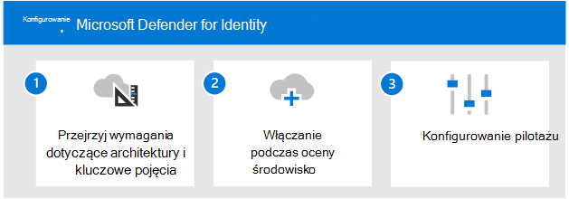

# Krok nr 2. Omówienie oceniania usługi Microsoft Defender pod celu tożsamości

**Dotyczy:**
- Microsoft 365 Defender

> [!NOTE]
> Ten artykuł jest również częścią Microsoft 365 Defender XDR, o którym mówimy w tym [przeglądzie](eval-overview.md).

 Przed rozpoczęciem procesu włączającego i uruchamiającego pilotaż usługi Microsoft Defender for Identity, jeśli zamierzasz ocenić usługę Microsoft 365 Defender jako rozwiązanie *XDR (eXtended Detection and Response) (XDR, Detection and Response),* upewnij się, że od początku przeglądasz ten proces: oceniasz program [Microsoft 365 Defender,](eval-overview.md) w tym utworzono [ Microsoft 365 Defender środowiska oceny](eval-create-eval-environment.md).
 

Aby włączyć i pilotaż usługi Microsoft Defender dla tożsamości, należy wykonać poniższe czynności.

W poniższej tabeli opisano kroki opisane na ilustracji.

| |Krok  |Opis  |
|---------|---------|---------|
|1|[Przegląd wymagań dotyczących architektury i kluczowych pojęć](eval-defender-identity-architecture.md)    | Poznaj architekturę usługi Defender for Identity i upewnij się, że Twoje środowisko spełnia wymagania wstępne dotyczące architektury.       |
|2|[Włączanie środowiska oceny](eval-defender-identity-enable-eval.md)     |   Postępuj zgodnie z instrukcjami, aby skonfigurować środowisko oceny.      |
|3|[Konfigurowanie pilotażu](eval-defender-identity-pilot.md)     |   Dowiedz się więcej o ustawieniach wzorcowych dla środowiska tożsamości i wypróbuj samouczki usługi Defender dla tożsamości.     |
||||

