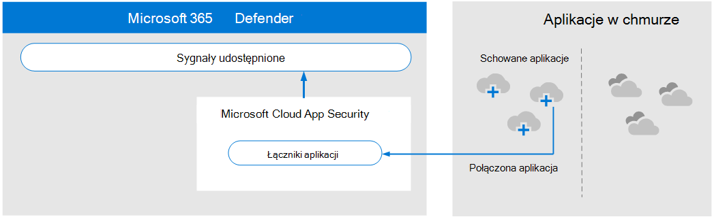
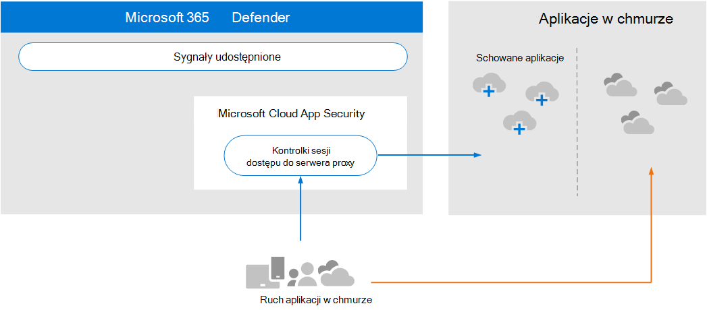

# Przegląd wymagań dotyczących architektury i kluczowych pojęć dotyczących programu Microsoft Defender dla aplikacji w chmurze

**Dotyczy:**

- Microsoft 365 Defender

Ten artykuł dotyczy [kroku 1 z 3](eval-defender-mcas-overview.md) w procesie konfigurowania środowiska oceny dla programu Microsoft Defender dla aplikacji w chmurze oraz programu Microsoft 365 Defender. Aby uzyskać więcej informacji na temat tego procesu, zobacz artykuł [z omówieniem](eval-defender-identity-overview.md).

Przed włączeniem programu Microsoft Defender dla aplikacji w chmurze upewnij się, że rozumiesz architekturę i może spełniać wymagania. 

## Opis architektury

Usługa Microsoft Defender dla aplikacji w chmurze to broker zabezpieczeń dostępu w chmurze (CASB). Zabezpieczenia CASB pełnią funkcje strażnika dostępu do usług brokera w czasie rzeczywistym między użytkownikami przedsiębiorstwa i zasobami w chmurze, z których korzystają, niezależnie od miejsca, w którym znajdują się Twoi użytkownicy, i niezależnie od urządzenia, z którego korzystają. Program Microsoft Defender dla aplikacji w chmurze natywnie integruje się z możliwościami zabezpieczeń firmy Microsoft, w tym z programem Microsoft 365 Defender.

Bez usługi Defender dla aplikacji w chmurze aplikacje w chmurze używane przez Twoją organizację są niezabezpieczone i nie są chronione, jak pokazano na ilustracji.

Na ilustracji:
- Korzystanie z aplikacji w chmurze przez organizację nie jestmonitorowane i nie jest chronione. 
- To zastosowanie nie wchodzi w zakres ochrony zapewnianych przez organizację zarządzaną. 

#### Odnajdowanie aplikacji w chmurze

Pierwszym krokiem do zarządzania korzystaniem z aplikacji w chmurze jest odkrycie, które aplikacje w chmurze są używane przez Twoją organizację. Na następnym diagramie pokazano, jak odnajdowanie chmury działa z usługą Defender dla aplikacji w chmurze.

Na poniższej ilustracji istnieją dwie metody, za pomocą których można monitorować ruch sieciowy i odnajdować aplikacje w chmurze używane przez Twoją organizację.
- Odp. Odnajdowanie aplikacji w chmurze jest natywnie zintegrowane z programem Microsoft Defender for Endpoint. Usługa Defender for Endpoint zgłasza, że aplikacje i usługi w chmurze są dostępne z zarządzanych przez Windows 10 i Windows 11 urządzeń. 
- B. W przypadku zasięgu wszystkich urządzeń połączonych z siecią dziennik usługi Defender for Cloud Apps jest instalowany na zaporach i innych serwerach proxy w celu zbierania danych z punktów końcowych. Te dane są wysyłane do usługi Defender for Cloud Apps w celu analizy.

#### Zarządzanie aplikacjami w chmurze

Po odnajdywaniu aplikacji w chmurze i analizowaniu zachowania ich działania przez Twoją organizację możesz rozpocząć zarządzanie aplikacjami w chmurze, które wybierzesz. 

Na poniższej ilustracji:
- Niektóre aplikacje są schowane do użytku. Jest to prosty sposób na rozpoczęcie zarządzania aplikacjami.
- Możesz włączyć większą widoczność i kontrolę, łącząc aplikacje za pomocą łączników aplikacji. Łączniki aplikacji używają interfejsów API dostawców aplikacji.

#### Stosowanie kontrolek sesji do aplikacji w chmurze

Program Microsoft Defender for Cloud Apps służy jako odwrotny serwer proxy, zapewniając dostęp tego serwera do aplikacji w chmurze. Dzięki temu usługa Defender dla aplikacji w chmurze może stosować skonfigurowane przez Ciebie opcje sterowania sesją. 

Na poniższej ilustracji:
- Dostęp do schowanych aplikacji w chmurze od użytkowników i urządzeń w organizacji jest przekierowywowyny za pośrednictwem usługi Defender for Cloud Apps.
- Ten dostęp do serwera proxy umożliwia zastosowanie kontrolek sesji.
- Nie wpływa to na aplikacje w chmurze, które nie zostały wyparte lub jawnie niezamówione.

Kontrolki sesji umożliwiają stosowanie parametrów do sposobu, w jaki aplikacje w chmurze są używane przez Twoją organizację. Jeśli na przykład Twoja organizacja korzysta z usługi Salesforce, możesz skonfigurować zasady sesji, które zezwalają tylko zarządzanym urządzeniu na uzyskiwanie dostępu do danych organizacji w u usługi Salesforce. Prostszy przykład może dotyczyć konfigurowania zasad monitorowania ruchu z urządzeń nieza zarządzaniem, co pozwala przeanalizować ryzyko związane z tym ruchem przed zastosowaniem bardziej rygorystycznych zasad.

#### Integracja z usługą Azure AD i kontrolką aplikacji dostępu warunkowego

Być może do dzierżawy usługi Azure AD zostały już dodane aplikacje SaaS, aby wymuszać uwierzytelnianie wieloskładnikowe i inne zasady dostępu warunkowego. Program Microsoft Defender dla aplikacji w chmurze natywnie integruje się z usługą Azure AD. Wystarczy skonfigurować zasady w usłudze Azure AD w celu używania kontrolki aplikacji dostępu warunkowego w usłudze Defender dla aplikacji w chmurze. Ruch sieciowy dla tych zarządzanych aplikacji SaaS jest przekierowywał za pośrednictwem programu Defender dla aplikacji w chmurze jako serwera proxy, co pozwala usłudze Defender dla aplikacji w chmurze na monitorowanie tego ruchu i stosowanie kontrolek sesji. 

Na poniższej ilustracji:
- Aplikacje SaaS są zintegrowane z dzierżawą usługi Azure AD. Dzięki temu usługa Azure AD może wymuszać zasady dostępu warunkowego, w tym uwierzytelnianie wieloskładnikowe.
- Do usługi Defender for Cloud Apps dodano Azure Active Directory kierowania ruchu aplikacji SaaS do usługi Defender for Cloud Apps. Zasady określają, do jakich aplikacji SaaS mają być stosowane te zasady. W konsekwencji, gdy usługa Azure AD wymusza wszelkie zasady dostępu warunkowego, które mają zastosowanie do tych aplikacji SaaS, usługa Azure AD kieruje następnie ruchem sesji za pośrednictwem usługi Defender dla aplikacji w chmurze.
- Program Defender for Cloud Apps monitoruje ten ruch i stosuje wszelkie zasady kontroli sesji skonfigurowane przez administratorów. 

Być może odkryto i pogotowiono aplikacje w chmurze przy użyciu usługi Defender dla aplikacji w chmurze, które nie zostały dodane do usługi Azure AD. Z funkcji kontroli aplikacji dostępu warunkowego możesz skorzystać, dodając te aplikacje w chmurze do dzierżawy usługi Azure AD oraz zakres reguł dostępu warunkowego.

#### Ochrona organizacji przed hakerami

Usługa Defender for Cloud Apps samodzielnie zapewnia zaawansowaną ochronę. Jednak w połączeniu z innymi możliwościami usługi Microsoft 365 Defender Defender dla aplikacji w chmurze dostarcza dane do udostępnianych sygnałów, które razem pomagają zatrzymywać ataki.

Warto powtórzyć tę ilustrację od przeglądu do tego przewodnika Microsoft 365 Defender oceny i pilotażu. 

Gdy skupisz się na prawej stronie tej ilustracji, usługa Microsoft Defender dla aplikacji w chmurze zauważy nietypowe zachowanie, takie jak niemożliwy podróż, dostęp poświadczeń oraz nietypowe działania w zakresie pobierania, udostępniania plików lub przesyłania dalej poczty i zgłasza je zespołowi zabezpieczeń. W efekcie usługa Defender dla aplikacji w chmurze zapobiega późniejszemu ruchu ze względu na hakerów i ekscytację poufnych danych. Program Microsoft 356 Defender for Cloud skoreluje sygnały ze wszystkich składników, aby zapewnić pełną historię ataków.

## Opis kluczowych pojęć

W poniższej tabeli przedstawiono kluczowe pojęcia, które należy zrozumieć podczas oceniania, konfigurowania i wdrażania programu Microsoft Defender dla aplikacji w chmurze.

|Pojęcie  |Opis |Więcej informacji  |
|---------|---------|---------|
| Defender for Cloud Apps Dashboard | Zawiera omówienie najważniejszych informacji na temat organizacji oraz linki do bardziej szczegółowego badania.        | [Praca z pulpitem nawigacyjnym ](/cloud-app-security/daily-activities-to-protect-your-cloud-environment)       |
| Kontrolka aplikacji dostępu warunkowego    | Odwróć architekturę serwera proxy, która jest zintegrowana z Twoim dostawcą tożsamości( IdP), aby nadać zasadom dostępu warunkowego usługi Azure AD i selektywnie wymusić kontrolki sesji.        |  [Ochrona aplikacji za pomocą programu Microsoft Defender dla aplikacji w chmurze Kontrola aplikacji dostępu warunkowego](/cloud-app-security/proxy-intro-aad)       |
|  Wykaz aplikacji w chmurze   | Wykaz aplikacji w chmurze udostępnia pełny obraz w wykazie firmy Microsoft z ponad 16 000 aplikacji w chmurze, które są klasyfikowane i klasyfikowane na podstawie ponad 80 czynników ryzyka.    |  [Praca z wynikami ryzyka aplikacji](/cloud-app-security/risk-score)       |
| Pulpit nawigacyjny odnajdowania w chmurze    | Odnajdowanie w chmurze analizuje dzienniki ruchu i ma na celu dać więcej informacji na temat sposobu, w jaki aplikacje w chmurze są używane w Twojej organizacji, a także alerty i poziomy ryzyka.     |  [Praca z wykrytymi aplikacjami   ](/cloud-app-security/discovered-apps)    |
|Połączone aplikacje |Usługa Defender dla aplikacji w chmurze zapewnia end-to-end ochronę połączonych aplikacji przy użyciu integracji z chmurą i chmury, łączników interfejsu API oraz kontrolek dostępu w czasie rzeczywistym i sesji za pomocą naszych warunkowych kontrolek dostępu do aplikacji. |[Ochrona połączonych aplikacji](/cloud-app-security/protect-connected-apps) |
| | | |

## Przejrzyj wymagania dotyczące architektury

### Odnajdowanie aplikacji w chmurze

Aby odkryć aplikacje w chmurze używane w Twoim środowisku, możesz wykonać jedną lub obie z następujących czynności:

- Szybko przygotuj się do pracy dzięki odnajdowi w chmurze przez integrację z usługą Microsoft Defender for Endpoint. Ta natywna integracja umożliwia natychmiastowe rozpoczęcie zbierania danych dotyczących ruchu w chmurze na Windows 11 i Windows 10 sieci i poza siecią.
- Aby odkryć wszystkie aplikacje w chmurze dostępne na wszystkich urządzeniach połączonych z Twoją siecią, wdaj dziennik usługi Defender for Cloud Apps na zapory i innych serwerach proxy. Dane z punktów końcowych są zbierane i wysyłane do usługi Defender for Cloud Apps w celu analizy. Usługa Defender for Cloud Apps natywnie integruje się z niektórymi serwerów proxy innych firm, aby uzyskać jeszcze więcej możliwości.

Te opcje są zawarte w [kroku 2. Włącz środowisko oceny](eval-defender-mcas-enable-eval.md). 

### Stosowanie zasad dostępu warunkowego usługi Azure AD do aplikacji w chmurze

Warunkowe sterowanie aplikacjami dostępu (możliwość stosowania zasad dostępu warunkowego do aplikacji w chmurze) wymaga integracji z usługą Azure AD. Nie jest to wymagane, aby rozpocząć pracę z usługą Defender dla aplikacji w chmurze. Jest to krok, który zachęcamy do wypróbowania w fazie pilotażowej — [krok 3. Pilotaż programu Microsoft Defender dla aplikacji w chmurze](eval-defender-mcas-pilot.md).

## Integracja usług SIEM

Program Microsoft Defender for Cloud Apps możesz zintegrować z ogólnym serwerem SIEM lub z programem Microsoft Sentinel, aby włączyć scentralizowane monitorowanie alertów i działań z połączonych aplikacji. 

Ponadto program Microsoft Sentinel zawiera łącznik programu Microsoft Defender for Cloud Apps w celu zapewnienia bardziej dogłębnej integracji z programem Microsoft Sentinel. Pozwala to nie tylko uzyskać wgląd w aplikacje w chmurze, ale również uzyskać zaawansowane analizy w celu identyfikowania i zwalczania cyberataków oraz kontrolowania ruchu danych.

- [Integracja ogólnego SIEM](/cloud-app-security/siem)
- [Alerty strumieniowe i dzienniki odnajdowania chmury z usługi Defender dla aplikacji w chmurze do programu Microsoft Sentinel](/azure/sentinel/connect-cloud-app-security)

### Następne kroki

Krok 2 z 3. [Włączanie środowiska oceny dla programu Microsoft Defender dla aplikacji w chmurze](eval-defender-mcas-enable-eval.md)

Powrót do omówieniem Szacowanie [programu Microsoft Defender dla aplikacji w chmurze](eval-defender-mcas-overview.md)

Wróć do przeglądu projektów [oceniania i Microsoft 365 Defender](eval-overview.md)
