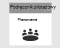
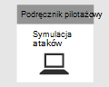

# Zamykanie i podsumowywanie projektu Microsoft 365 Defender pilotażowego  

[!INCLUDE [Microsoft 365 Defender rebranding](../includes/microsoft-defender.md)]

**Dotyczy:**
- Microsoft 365 Defender

| [Planowanie](m365d-pilot-plan.md) | [Przygotowanie](prepare-m365d-eval.md) |  [Symulowanie ataków](m365d-pilot-simulate.md) |  Zamykanie i podsumowywane|
|--|--|--|--|
|| | |*Jesteś tutaj!*|

Jesteś obecnie w etapie zakończenia i podsumowania.

Właśnie została uruchomiona zaawansowana symulacja ataków z możliwością tylko pamięci, która zdalnie wykonywała kod na kontrolerze domeny. Wiesz już, jak program Microsoft Defender dla punktu końcowego i usługi Microsoft Defender dla tożsamości wykrywają i tworzą alerty w przypadku złośliwej aktywności. W portalu Microsoft 365 Security Center można również zobaczyć, jak alerty z różnych źródeł są dostarczane wraz z innymi informacjami kontekstowymi. Taka integracja umożliwia analitykom SOC badanie i podjąć konieczne działania. Utworzono również zaawansowane zapytanie wyszukiwania, które identyfikuje przychodzące wiadomości e-mail, w których użytkownik otwierał lub zapisywał załącznik i na jego podstawie tworzył wykrywanie.

Zakończenie procesu zakończyło się po zakończeniu wszystkich testów.

Ostateczny wynik powinien być:

- Ukończona karta wyników
- Szczegółowy raport wyników pilotażu
- Decyzja o tym, jak przejść dalej

Prezentuj raporty z twoich ostatecznych danych wyjściowych wewnętrznym uczestnikom projektu (wskazanym podczas fazy [przygotowywania](./prepare-m365d-eval.md) ) i kontaktom Microsoft. Takie nakłady pracy zapewniają, że wszelkie opinie mogą być używane do ulepszania produktów i dokumentacji.

Mamy nadzieję, że ta symulacja była udana. Zacznij wdrażać to, co wiesz na większą skalę w organizacji, aby w pełni wyekspować zintegrowane rozwiązanie zabezpieczeń.

## Następny krok
Aby dowiedzieć się więcej o Microsoft 365 Defender, zobacz następujące interakcyjne przewodniki:
- [Zabezpieczanie organizacji za pomocą programu Microsoft Defender dla Office 365](https://aka.ms/O365ATP-Interactive-Guide)
- [Wykrywanie podejrzanych działań i potencjalnych ataków za pomocą usługi Microsoft Defender dla tożsamości](https://aka.ms/AATP-Interactive-Guide)
- [Wykrywaj zagrożenia i zarządzaj alertami za pomocą Microsoft Cloud App Security](https://aka.ms/DetectThreatsAndAlertsMCAS-InteractiveGuide)
- [Badanie i rozwiązywanie problemów związanych z zagrożeniami za pomocą programu Microsoft Defender dla punktu końcowego](https://aka.ms/MDATP-IR-Interactive-Guide)