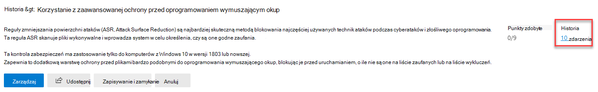

# Śledzenie historii bezpiecznego wyniku firmy Microsoft i spełnienie celów

[!INCLUDE [Microsoft 365 Defender rebranding](../includes/microsoft-defender.md)]

[Microsoft Secure Score](microsoft-secure-score.md) to miara stanu zabezpieczeń organizacji. Wyższa liczba oznacza więcej działań usprawnień. Można go znaleźć w https://security.microsoft.com/securescore portalu [Microsoft 365 Defender.](microsoft-365-defender.md#the-microsoft-365-defender-portal)

## Zyskaj wgląd w aktywność, która wpłynęła na Twój wynik

Wyświetl na karcie Historia wykres wyników **swojej organizacji w** czasie.

Poniżej wykresu znajduje się lista wszystkich akcji podjętych w wybranym zakresie czasowym i ich atrybutów, takich jak punkty i kategorie wynikowe. Zakres dat i filtr można dostosowywać według kategorii.

Jeśli wybierzesz akcję udoskonalania skojarzoną z działaniem, zostanie wyświetlone wysuwanie pełnej akcji udoskonalania.

Aby wyświetlić całą historię dla danego działania udoskonalania, wybierz link historii w wysuwanych wynikach.

## Odkrywanie trendów i ustawianie celów

Karta **Metryki &** zawiera kilka schematów i wykresów, które zapewniają lepszą widoczność trendów i ustawianie celów. Można ustawić zakres dat dla całej strony wizualizacji. Wizualizacje są następujące:

* **Strefa bezpiecznych wyników —** dostosowana na podstawie celów i definicji organizacji, czyli zakresów dobrych, dobrych i złych wyników.
* **Trend regresji** — oś czasu punktów, które zostały regresji z powodu zmian konfiguracji, użytkownika lub urządzenia.  
* **Trend porównania** — porównanie bezpiecznego wyniku organizacji z czasem innych osób. Widok ten może zawierać linie reprezentujące średnią wyników w organizacjach o podobnej liczby miejsc siedzących i niestandardowy widok porównania, który można ustawić.
* **Trend akceptacji ryzyka** — oś czasu działań udoskonalania oznaczonych jako "zaakceptowane ryzyko".
* **Zmiany wyników** — liczba zdobywanych punktów, punkty wyeksgregowane i zmiany wyniku w określonym zakresie dat.

### Porównywanie wyników z organizacjami, które polubiły Twój wynik

Istnieją dwa miejsca, w których można porównać swoje wyniki z organizacjami, które są podobne do Twojego.

#### Porównanie wykresu słupkowego

Wykres słupkowy porównania jest dostępny na **karcie** Omówienie. Umieść wskaźnik myszy na wykresie, aby wyświetlić wynik i szansę sprzedaży wyników. 

**Organizacje, takie** jak Twoja, to średni wynik innych dzierżaw w tym samym regionie (pod warunkiem, że mamy co najmniej pięć lub więcej dzierżaw do porównania) z wielkością organizacji podobną do Twojej.

Dane porównania są anonimizowane, więc nie wiemy dokładnie, w których dokładnie są pozostałe dzierżawy.

#### Trend porównania

Na karcie **Metryki &** trendów sprawdź, jak bezpieczny wynik organizacji wypada w czasie z innymi osobami.

## Chcemy usłyszeć Od Ciebie

Jeśli masz problemy, po daj nam o tym znać, publikując wpis w społeczności dotyczącej zabezpieczeń [, prywatności & zgodności](https://techcommunity.microsoft.com/t5/Security-Privacy-Compliance/bd-p/security_privacy) . Monitorujemy społeczność i udzielamy pomocy.

## Zasoby pokrewne

- [Omówienie bezpiecznego wyniku firmy Microsoft](microsoft-secure-score.md)
- [Ocenianie postawy dotyczącej zabezpieczeń](microsoft-secure-score-improvement-actions.md)
- [Co będzie wkrótce](microsoft-secure-score-whats-coming.md)
- [Co nowego](microsoft-secure-score-whats-new.md)
