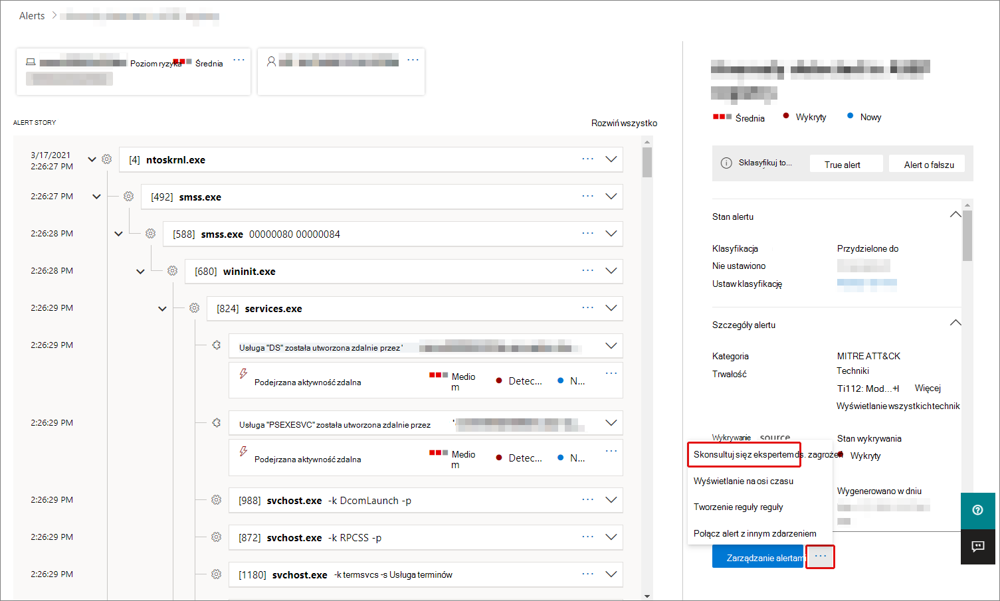
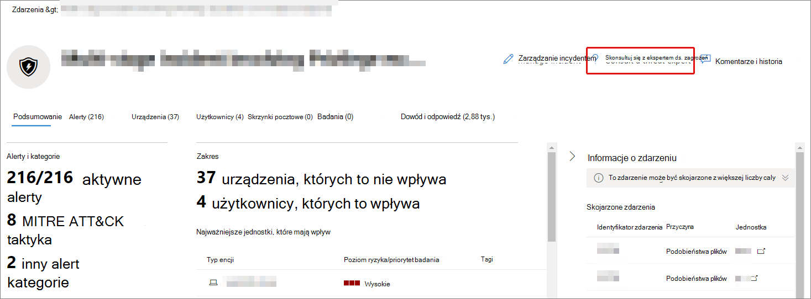
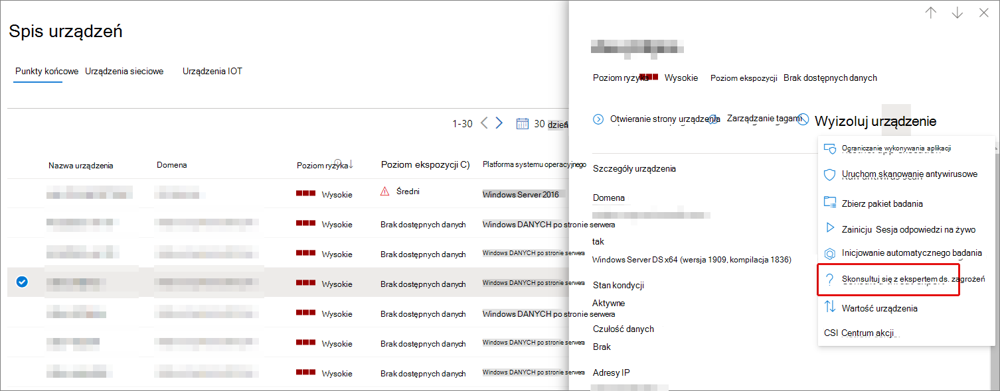

# Omówienie specjalistów ds. zagrożeń firmy Microsoft na platformy Microsoft 365

[!INCLUDE [Microsoft 365 Defender rebranding](../includes/microsoft-defender.md)]

**Dotyczy:**

- [Microsoft 365 Defender](https://go.microsoft.com/fwlink/?linkid=2118804)
- [Ochrona punktu końcowego w usłudze Microsoft Defender](https://go.microsoft.com/fwlink/p/?linkid=2154037)

[!INCLUDE [Prerelease](../includes/prerelease.md)]

Eksperci ds. zagrożeń firmy Microsoft — powiadomienia o ukierunkowanych atakach to usługa zarządzanego chowania pod zagrożeniami. Po zastosowaniu i zaakceptowaniu będziesz otrzymywać powiadomienia o ukierunkowanych atakach od ekspertów do spraw zagrożeń firmy Microsoft, dzięki czemu nie przeoczysz krytycznych zagrożeń dla Twojego środowiska. Te powiadomienia pomogą Chronić punkty końcowe, wiadomości e-mail i tożsamości organizacji.
Eksperci ds. zagrożeń firmy Microsoft — eksperci na żądanie pozwalają uzyskać porady ekspertów dotyczące zagrożeń, przed którymi stoi Twoja organizacja. Możesz uzyskać pomoc w przypadku zagrożeń, przed którymi stoi Twoja organizacja. Jest on dostępny jako usługa subskrypcji.

## Zastosuj do ekspertów do spraw zagrożeń firmy Microsoft — powiadomienia o ukierunkowanych atakach

> [!IMPORTANT]
> Przed zastosowaniem należy omówić wymagania kwalifikacyjne dla ekspertów ds. zagrożeń firmy Microsoft — powiadomień o atakach ukierunkowanych z dostawcą usług technicznych firmy Microsoft i zespołem konta.

Jeśli masz już program Microsoft Defender for Endpoint i usługę Microsoft 365 Defender, możesz złożyć wniosek do ekspertów ds. zagrożeń firmy Microsoft — ukierunkowanych powiadomień o atakach za pośrednictwem ich portalu usługi Microsoft 365 Defender. Przejdź do **strony Ustawienia > punktów końcowych > Ogólne >** Zaawansowane funkcje > ekspertów do spraw zagrożeń firmy Microsoft — powiadomienia o atakach ukierunkowanych i wybierz **pozycję Zastosuj**. Zobacz [Konfigurowanie funkcji ekspertów do spraw zagrożeń firmy Microsoft](./configure-microsoft-threat-experts.md) , aby uzyskać pełny opis.

Po zatwierdzeniu aplikacji otrzymasz powiadomienie o ukierunkowanych atakach, gdy ekspert ds. zagrożeń wykryje zagrożenie dla Twojego środowiska.

## Subskrybuj ekspertów ds. zagrożeń firmy Microsoft — eksperci na żądanie

Skontaktuj się z przedstawicielem firmy Microsoft, aby zasubskrybować usługę Experts on Demand.  Zobacz [Konfigurowanie funkcji ekspertów do spraw zagrożeń firmy Microsoft,](./configure-microsoft-threat-experts.md) aby uzyskać szczegółowe informacje.

## Otrzymywanie powiadomień o atakach ukierunkowanych

Funkcja ekspertów do spraw zagrożeń firmy Microsoft — kierowane powiadomienie o atakach umożliwia proaktywne poszukiwki na najważniejsze zagrożenia dla sieci. Nasi eksperci ds. zagrożeń poszukaj ludzkich adversary, głośnomówiących ataków za pomocą klawiatury oraz zaawansowanych ataków, takich jak cyberprzestępczość. Te powiadomienia będą wyświetlane jako nowy alert. Zarządzana służba chowania obejmuje:

- Monitorowanie i analiza zagrożeń, skracanie czasu pracy i ryzyka dla firmy
- Przeszkolone przez tropię sztuczną inteligencję w celu odnajdowania i kierowania zarówno znanych ataków, jak i wyłaniających się zagrożeń
- Identyfikacja najbardziej istotnych zagrożeń, pomagając socjom maksymalizować ich skuteczność
- Pomóż określić zakres łamania zabezpieczeń i zapewnić jak najwięcej kontekstu, który można szybko dostarczyć, aby umożliwić szybką reakcję SOC.

## Współpraca z ekspertami na żądanie

Możesz również skontaktować się z ekspertami ds. zagrożeń firmy Microsoft bezpośrednio w portalu zabezpieczeń platformy Microsoft 365 w celu szybkiego i precyzyjnego reagowania na zagrożenia.  Eksperci mogą dostarczyć szczegółowych informacji, aby lepiej zrozumieć złożone zagrożenia, przed które mogą być związane Twoja organizacja.  Skonsultuj się z ekspertem, aby:

- Zbierz dodatkowe informacje na temat alertów i zdarzeń, w tym ich głównych przyczyn i zakresu
- Zyskaj wgląd w podejrzane urządzenia, alerty lub zdarzenia i w razie sytuacji, gdy użytkownik napotyka zaawansowanego atakującego, mogą wykonać kolejne kroki.
- Określanie zagrożeń i dostępnych zabezpieczeń związanych z zagrożeniami, kampaniami lub wyłaniających się technikami atakujących

Opcja **Skonsultuj się z ekspertem** ds. zagrożeń jest dostępna w kilku miejscach w portalu:

- <i>**Menu Akcje strony urządzenia**</i> 

- <i>**Menu wysuwu strony spisu urządzeń**</i> 

- <i>**Menu wysuwu strony Alerty**</i> 

- <i>**Menu akcji strony Zdarzenia**</i> 

- <i>**Strona spisu zdarzeń**</i> 

> [!NOTE]
> Jeśli masz subskrypcję pomocy technicznej Premier zamaponą na licencję usługi Microsoft Defender dla Usługi Office 365, możesz śledzić stan spraw ekspertów na żądanie za pomocą Centrum usług Microsoft Services.

Ten klip wideo zawiera krótkie omówienie Centrum usług firmy Microsoft.

> [!VIDEO https://www.microsoft.com/videoplayer/embed/RE4pk9f]

## Zobacz też

- [Konfigurowanie funkcji ekspertów do spraw zagrożeń firmy Microsoft](./configure-microsoft-threat-experts.md)
