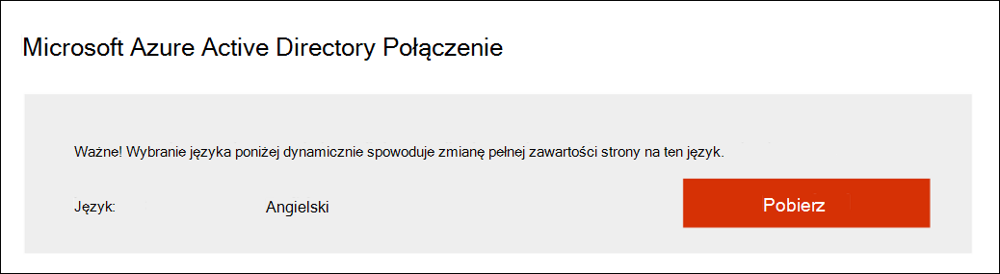
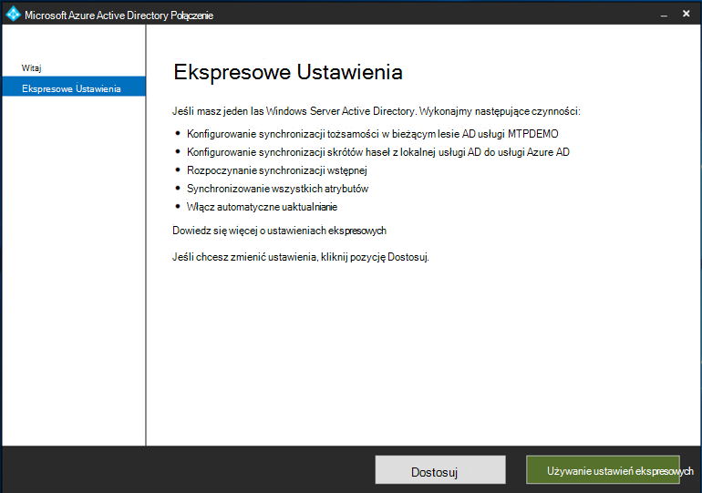

# Przygotowanie laboratorium Microsoft 365 Defender próbnego lub środowiska pilotażowego

[!INCLUDE [Microsoft 365 Defender rebranding](../includes/microsoft-defender.md)]

**Dotyczy:**
- Microsoft 365 Defender

Tworzenie Microsoft 365 Defender próbnego lub pilotażowego i wdrażanie go jest procesem trzyfazowym:

| Etap 1. Przygotowywanie | [Etap 2. Konfigurowanie](setup-m365deval.md) | [Etap 3. Wniesienie](config-m365d-eval.md) |  [Powrót do podręcznika pilotażowego](m365d-pilot.md) |
|--|--|--|--|
|*Jesteś tutaj!* | || |

Jesteś obecnie w fazie przygotowawowej.

Przygotowanie jest kluczem do każdego pomyślnego wdrożenia. Ta sekcja zawiera wskazówki, które należy wziąć pod uwagę podczas przygotowywania się do utworzenia laboratorium próbnego lub środowiska pilotażowego na potrzeby Microsoft 365 Defender wdrażania.

## Wymagania wstępne
Dowiedz się więcej o licencjonowaniu, wymaganiach dotyczących sprzętu i oprogramowania oraz innych ustawieniach konfiguracji w celu zapewnienia obsługi i Microsoft 365 Defender. Zobacz minimalne wymagania dotyczące usług [Microsoft 365 Defender](/microsoft-365/security/defender/prerequisites), [Microsoft Defender for Endpoint](/windows/security/threat-protection/microsoft-defender-atp/minimum-requirements), [Microsoft Defender for Office 365](/office365/servicedescriptions/office-365-advanced-threat-protection-service-description), [Microsoft Defender for Identity](/azure-advanced-threat-protection/atp-prerequisites), [Microsoft Cloud App Security](/azure-advanced-threat-protection/atp-prerequisites).

## Uczestnicy projektu i rejestracja
Zidentyfikuj wszystkich uczestników projektu, którzy biorą udział w projekcie i którzy mogą potrzebować do podpisania, przejrzenia lub pozostania na bieżąco w celu oceny lub uruchomienia projektu pilotażowego.

>[!NOTE]
>Nie wszystkie organizacje mogą mieć termin spłaty organizacji zabezpieczeń, aby mieć takie role. W takim przypadku skonsultuj się z zespołem kadry kierowniczej w celu sprawdzenia i zatwierdzenia zdolności do zatwierdzania.

Dodaj uczestników projektu do poniższej tabeli odpowiednio do potrzeb organizacji.

-   SO = Sign-off on this project

-   R = Przejrzyj ten projekt i wprowadź dane wejściowe

-   I = Poinformowanie o tym projekcie

| Name (Nazwa)                 | Rola                                                                                                                                                                                                          | Akcja |
|----------------------|---------------------------------------------------------------------------------------------------------------------------------------------------------------------------------------------------------------|--------|
| Wprowadź nazwę i adres e-mail | **Dyrektor ds. zabezpieczeń informacji (CISO)** Jest to przedstawiciel kadry kierowniczej, który pełni *rolę sponsora wdrożenia nowej technologii w organizacji.*                                                  | SO     |
| Wprowadź nazwę i adres e-mail | **Kierownik Centrum ochrony przed cyberzagrożeniami (CDOC) Przedstawiciel zespołu CDOC** odpowiedzialny za określenie, jak ta zmiana jest dopasowana do procesów w zespole operacji *zabezpieczeń klientów.*       | SO     |
| Wprowadź nazwę i adres e-mail | **Security Architect** Przedstawiciel zespołu zabezpieczeń odpowiedzialny za określenie, jak ta zmiana będzie dostosowana do podstawowej architektury zabezpieczeń *w organizacji.*                         | R      |
| Wprowadź nazwę i adres e-mail | **Workplace Architect** *Przedstawiciel zespołu IT* odpowiedzialny za określenie sposobu dostosowania tej zmiany do architektury podstawowego miejsca pracy w organizacji.                             | R      |
| Wprowadź nazwę i adres e-mail | **Analityk zabezpieczeń** Przedstawiciel zespołu CDOC, który może przekazać opinię na temat funkcji wykrywania, środowiska użytkownika i ogólnej przydatności tej zmiany z *perspektywy operacji zabezpieczeń.* | I      |

## Przygotowywanie Azure Active Directory
Pomiń ten krok, jeśli masz już włączoną synchronizację między usługą Active Directory i Azure Active Directory lokalnym. Zapoznaj się z dokumentacją najlepszych rozwiązań już w Azure Active Directory. Poniższe kroki są zoptymalizowane pod kątem oceny lub uruchomienia projektu Microsoft 365 Defender pilotażowego.

1. Przejdź do portalu [Azure Active Directory](https://portal.azure.com/#blade/Microsoft_AAD_IAM/ActiveDirectoryMenuBlade) usługi > **Azure AD Połączenie**. 
   

2. Kliknij **pozycję Pobierz** **Microsoft Azure Active Directory Połączenie** i przenieś ją do swojego Kontroler domeny.
  

3. Na kontrolerze domeny postępuj zgodnie z Azure Active Directory Połączenie domeny. Przeczytaj postanowienia licencyjne i zasady zachowania poufności informacji, a następnie zaznacz pole wyboru, jeśli akceptujesz tę zgodę. Kliknij przycisk **Continue** (Kontynuuj).
  

4. Przejdź do aplikacji **Express Ustawienia**.
  

5. Wprowadź poświadczenia administratora globalnego. Kliknij **Dalej**.
  

6. Wprowadź swoje Usługi domenowe w usłudze Active Directory administratora przedsiębiorstwa. Kliknij **Dalej**.
  

7. Kliknij **przycisk Zainstaluj** , aby potwierdzić konfigurację.
  

8. Gratulacje! Pomyślnie skonfigurowano Azure Active Directory Połączenie.
  

Teraz możesz dodawać [użytkowników i grupy do usługi Active Directory](/azure-advanced-threat-protection/atp-playbook-setup-lab#bkmk_hydrate) i konfigurować [zasady SAM-R](/azure-advanced-threat-protection/atp-playbook-setup-lab#configure-sam-r-capabilities-from-contosodc).  

## Porządek konfiguracji
W poniższej tabeli przedstawiono kolejność konfigurowania składników Microsoft 365 Defender laboratorium próbnego lub wdrożenia środowiska pilotażowego przez firmę Microsoft.

| Składnik                               | Opis                                                                                                                                                                                                                                                                                                                                                                                                                                                                                                                                                                                                                                                                                              | Pozycja kolejności konfiguracji |
|-----------------------------------------|----------------------------------------------------------------------------------------------------------------------------------------------------------------------------------------------------------------------------------------------------------------------------------------------------------------------------------------------------------------------------------------------------------------------------------------------------------------------------------------------------------------------------------------------------------------------------------------------------------------------------------------------------------------------------------------------------------|---------------------|
|Usługa Microsoft Defender dla Office 365|Program Microsoft Defender for Office 365 chroni organizację przed złośliwymi zagrożeniami, które mogą być zeszytowane przez wiadomości e-mail, linki (adresy URL) i narzędzia do współpracy.   [Dowiedz się więcej.](/microsoft-365/security/office-365-security/defender-for-office-365)                                                                                                                                                                                                                                             | 1                   |
|Microsoft Defender for Identity|Usługa Microsoft Defender for Identity używa sygnałów usługi Active Directory do identyfikowania, wykrywania i badanie zaawansowanych zagrożeń, naruszonych tożsamości oraz złośliwych działań w ramach niejawnego programu testów skierowanych do organizacji.   [Dowiedz się więcej](/azure-advanced-threat-protection/).| 2 |
|Microsoft Cloud App Security| Microsoft Cloud App Security to casb (Cloud Access Security Broker), który działa w wielu chmurach. Zapewnia on zaawansowaną widoczność, kontrolę nad podróżami danych oraz zaawansowane analizy w celu identyfikowania i zwalczania cyberataków we wszystkich usługach w chmurze.   [Dowiedz się więcej](/cloud-app-security/).                                                                                                                                                                                                                                                                                                                                                                       |3                   |
|Ochrona punktu końcowego w usłudze Microsoft Defender | Program Microsoft Defender for Endpoint wykrywanie i reagowanie w punktach końcowych funkcje zaawansowanego wykrywania ataków, które są w pobliżu czasu rzeczywistego i które można z nich świadczyć akcję. Analitycy zabezpieczeń mogą efektywnie określać priorytety alertów, zyskać wgląd w pełny zakres naruszenia zabezpieczeń oraz podjąć działania w celu reagowania na zagrożenia.   [Dowiedz się więcej.](/windows/security/threat-protection/microsoft-defender-atp/microsoft-defender-advanced-threat-protection)                                     |4                   |                                                                                                                                                                                                                                    

## Następny krok
|  [Etap 2. Konfigurowanie](setup-m365deval.md) | Konfigurowanie laboratorium Microsoft 365 Defender próbnego lub środowiska pilotażowego
|:-------|:-----|
