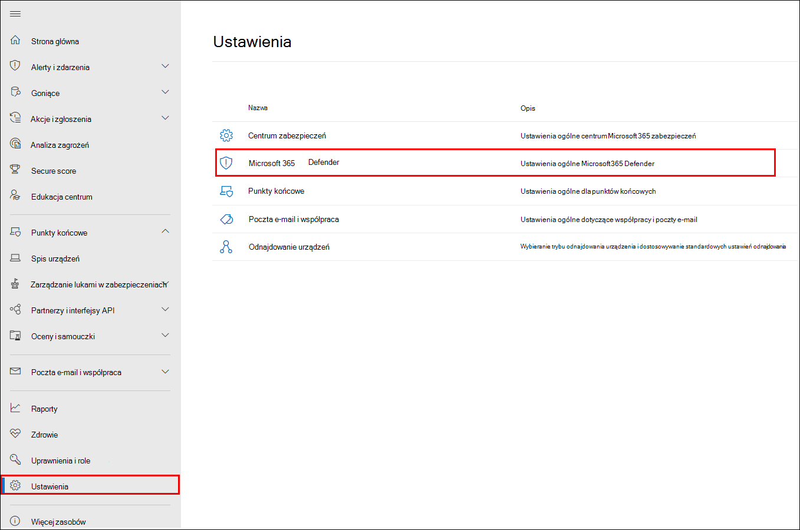
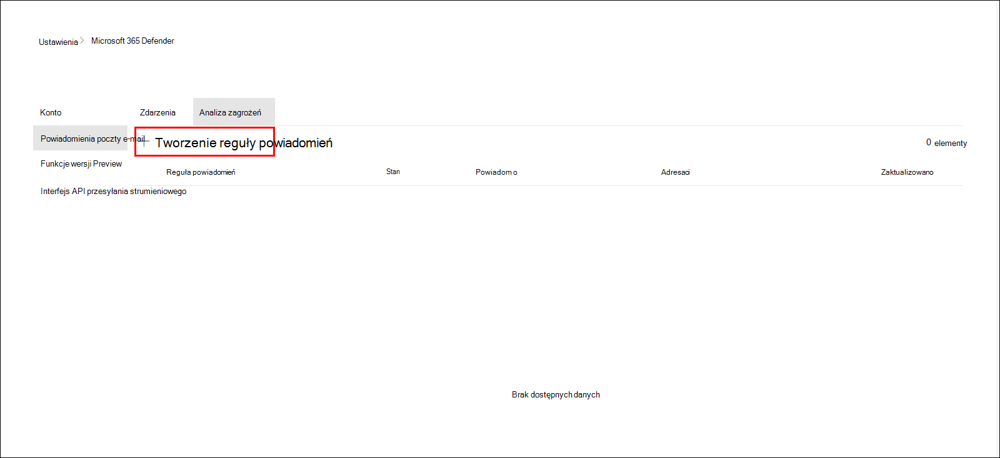
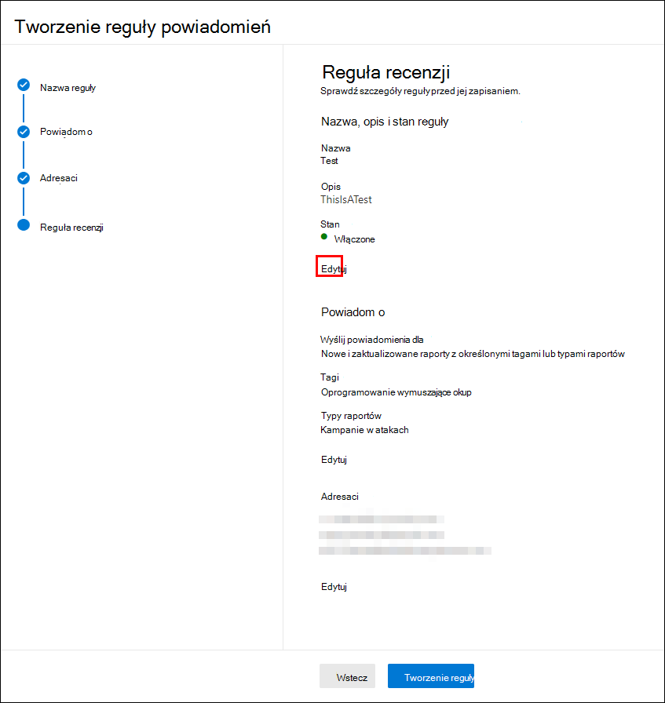
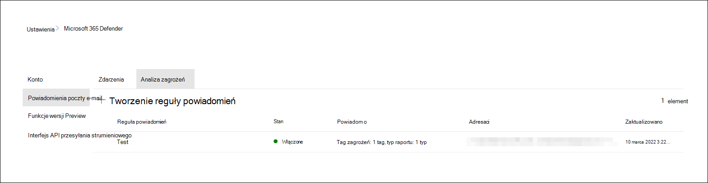

# Analiza zagrożeń w Microsoft 365 Defender

[!INCLUDE [Microsoft 365 Defender rebranding](../includes/microsoft-defender.md)]

**Dotyczy:**

- Microsoft 365 Defender

> Chcesz doświadczyć Microsoft 365 Defender? Można [go ocenić w środowisku laboratoryjnym](m365d-evaluation.md?ocid=cx-docs-MTPtriallab) lub [uruchomić projekt pilotażowy w środowisku produkcyjnym](m365d-pilot.md?ocid=cx-evalpilot).
>

[!INCLUDE [Prerelease](../includes/prerelease.md)]

Analiza zagrożeń to nasze rozwiązanie do analizy zagrożeń w produkcie od ekspertów badaczy zabezpieczeń firmy Microsoft. Jest ona zaprojektowana tak, aby pomóc zespołom ds. zabezpieczeń, aby były jak najbardziej wydajne w obliczu pojawiających się zagrożeń, takich jak:

- Aktywni aktorzy zagrożeń i ich kampanie
- Popularne i nowe techniki ataków
- Krytyczne luki w zabezpieczeniach
- Typowe powierzchnie ataków
- Powszechnie stosowane złośliwe oprogramowanie

Obejrzyj ten krótki film wideo, aby dowiedzieć się więcej o tym, jak analiza zagrożeń może pomóc w śledzeniu najnowszych zagrożeń i ich zatrzymywaniu.

>[!VIDEO https://www.microsoft.com/en-us/videoplayer/embed/RWwJfU]

Dostęp do analizy zagrożeń można uzyskać z lewej górnej strony paska nawigacyjnego Microsoft 365 portalu zabezpieczeń lub z dedykowanej karty pulpitu nawigacyjnego, która pokazuje najważniejsze zagrożenia dla organizacji, zarówno pod względem wpływu, jak i pod względem narażenia.

:::image type="content" source="../../media/threat-analytics/ta_inlandingpage_mtp.png" alt-text="Strona docelowa analizy zagrożeń" lightbox="../../media/threat-analytics/ta_inlandingpage_mtp.png":::

Zagrożenia o dużym wpływie mają największy potencjał do wyrządzenia szkody, podczas gdy zagrożenia związane z wysoką ekspozycją są tymi, na które twoje zasoby są najbardziej narażone. Uzyskanie wglądu w aktywne lub trwające kampanie i wiedza o tym, co robić za pośrednictwem analizy zagrożeń, może pomóc w wyposażeniu zespołu ds. operacji zabezpieczeń w świadome decyzje.

_Gdzie uzyskać dostęp do analizy zagrożeń_

Z bardziej zaawansowanych przeciwników i nowych zagrożeń pojawiających się często i powszechnie, ważne jest, aby móc szybko:

- Identyfikowanie pojawiających się zagrożeń i reagowanie na nie
- Dowiedz się, czy jesteś obecnie atakowany
- Ocena wpływu zagrożenia na zasoby
- Przejrzyj odporność na zagrożenia lub narażenie na nie
- Identyfikowanie działań zaradczych, odzyskiwania lub zapobiegania, które można podjąć w celu zatrzymania lub ograniczenia zagrożeń

Każdy raport zawiera analizę śledzonych zagrożeń i obszerne wskazówki dotyczące sposobu obrony przed tym zagrożeniem. Obejmuje ona również dane z sieci, wskazujące, czy zagrożenie jest aktywne i czy masz odpowiednie zabezpieczenia.

## Wyświetlanie pulpitu nawigacyjnego analizy zagrożeń

Pulpit nawigacyjny analizy zagrożeń ([security.microsoft.com/threatanalytics3](https://security.microsoft.com/threatanalytics3)) wyróżnia raporty, które są najbardziej istotne dla Twojej organizacji. Zawiera podsumowanie zagrożeń w następujących sekcjach:

- **Najnowsze zagrożenia** — zawiera listę ostatnio opublikowanych lub zaktualizowanych raportów o zagrożeniach wraz z liczbą aktywnych i rozwiązanych alertów.
- **Zagrożenia o dużym wpływie** — zawiera listę zagrożeń, które mają największy wpływ na organizację. W tej sekcji wymieniono zagrożenia z największą liczbą aktywnych i rozwiązanych alertów.
- **Najwyższa ekspozycja** — najpierw wyświetla listę zagrożeń z najwyższym poziomem ekspozycji. Poziom narażenia na zagrożenie jest obliczany przy użyciu dwóch informacji: tego, jak poważne są luki w zabezpieczeniach związane z zagrożeniem i ile urządzeń w organizacji może zostać wykorzystanych przez te luki w zabezpieczeniach.

Wybierz zagrożenie na pulpicie nawigacyjnym, aby wyświetlić raport dla tego zagrożenia.

:::image type="content" source="../../media/threat-analytics/ta_dashboard_mtp.png" alt-text="Pulpit nawigacyjny analizy zagrożeń" lightbox="../../media/threat-analytics/ta_dashboard_mtp.png":::

_Pulpit nawigacyjny analizy zagrożeń. Możesz również wybrać pole Wyszukiwania do klucza w słowie kluczowym powiązanym z raportem analizy zagrożeń, który chcesz przeczytać._

## Wyświetlanie raportu analizy zagrożeń

Każdy raport analizy zagrożeń zawiera informacje w kilku sekcjach:

- [**Omówienie**](#overview-quickly-understand-the-threat-assess-its-impact-and-review-defenses)
- [**Raport analityka**](#analyst-report-get-expert-insight-from-microsoft-security-researchers)
- [**Powiązane zdarzenia**](#related-incidents-view-and-manage-related-incidents)
- [**Zasoby, których dotyczy problem**](#impacted-assets-get-list-of-impacted-devices-and-mailboxes)
- [**Uniemożliwiono próby wysłania wiadomości e-mail**](#prevented-email-attempts-view-blocked-or-junked-threat-emails)
- [**Środki zaradcze & narażenia**](#exposure-and-mitigations-review-list-of-mitigations-and-the-status-of-your-devices)

### Omówienie: szybkie zrozumienie zagrożenia, ocena jego wpływu i przegląd zabezpieczeń

Sekcja **Przegląd** zawiera podgląd szczegółowego raportu analityka. Zawiera również wykresy, które wyróżniają wpływ zagrożenia dla organizacji oraz narażenie na nieskonfigurowane i nieprzypisane urządzenia.

:::image type="content" source="../../media/threat-analytics/ta_overview_mtp.png" alt-text="Sekcja przeglądu raportu analizy zagrożeń" lightbox="../../media/threat-analytics/../../media/threat-analytics/ta_overview_mtp.png":::

_Sekcja Omówienie raportu analizy zagrożeń_

#### Ocena wpływu na organizację

Każdy raport zawiera wykresy przeznaczone do dostarczania informacji o organizacyjnym wpływie zagrożenia:

- **Powiązane zdarzenia** — zawiera omówienie wpływu śledzonego zagrożenia na organizację przy użyciu następujących danych:
  - Liczba aktywnych alertów i liczba aktywnych zdarzeń, z którymi są skojarzone
  - Ważność aktywnych zdarzeń
- **Alerty w czasie** — pokazuje liczbę powiązanych **aktywnych** i **rozwiązanych** alertów w czasie. Liczba rozwiązanych alertów wskazuje, jak szybko organizacja reaguje na alerty związane z zagrożeniem. Najlepiej, aby na wykresie były wyświetlane alerty rozwiązane w ciągu kilku dni.
- **Zasoby, których dotyczy problem**— pokazuje liczbę różnych urządzeń i kont e-mail (skrzynek pocztowych), które mają obecnie co najmniej jeden aktywny alert skojarzony ze śledzonym zagrożeniem. Alerty są wyzwalane dla skrzynek pocztowych, które otrzymały wiadomości e-mail z zagrożeniem. Przejrzyj zasady na poziomie organizacji i użytkownika, aby uzyskać przesłonięcia, które powodują dostarczanie wiadomości e-mail z zagrożeniami.
- **Uniemożliwione próby wysłania wiadomości e-mail** — pokazuje liczbę wiadomości e-mail z ostatnich siedmiu dni, które zostały zablokowane przed dostarczeniem lub dostarczone do folderu wiadomości-śmieci.

#### Przegląd odporności i stanu zabezpieczeń

Każdy raport zawiera wykresy, które zawierają omówienie odporności organizacji na dane zagrożenie:

- **Stan bezpiecznej konfiguracji** — pokazuje liczbę urządzeń z nieprawidłowo skonfigurowanymi ustawieniami zabezpieczeń. Zastosuj zalecane ustawienia zabezpieczeń, aby wyeliminować zagrożenie. Urządzenia są uznawane za **bezpieczne** , jeśli zostały zastosowane _wszystkie_ śledzone ustawienia.
- **Stan stosowania poprawek luk w zabezpieczeniach** — pokazuje liczbę urządzeń narażonych na zagrożenia. Stosowanie aktualizacji lub poprawek zabezpieczeń w celu rozwiązania problemów z lukami w zabezpieczeniach wykorzystywanymi przez zagrożenie.

#### Wyświetlanie raportów na tagi zagrożeń

Możesz filtrować listę raportów zagrożeń i wyświetlać najbardziej odpowiednie raporty zgodnie z określonym tagiem zagrożenia (kategorią) lub typem raportu.

- **Tagi zagrożeń** — ułatwiają wyświetlanie najbardziej odpowiednich raportów według określonej kategorii zagrożeń. Na przykład wszystkie raporty związane z oprogramowaniem wymuszającym okup.
- **Typy raportów** — ułatwiają wyświetlanie najbardziej odpowiednich raportów zgodnie z określonym typem raportu. Na przykład wszystkie raporty, które obejmują narzędzia i techniki.
- **Filtry** — ułatwiają wydajne przeglądanie listy raportów o zagrożeniach i filtrowanie widoku na podstawie określonego tagu zagrożenia lub typu raportu. Na przykład przejrzyj wszystkie raporty o zagrożeniach związane z kategorią oprogramowania wymuszającego okup lub raporty o zagrożeniach, które obejmują luki w zabezpieczeniach.

##### Jak to działa?

Zespół analizy zagrożeń firmy Microsoft dodał tagi zagrożeń do każdego raportu o zagrożeniach:

- Dostępne są teraz cztery tagi zagrożeń:
  - Oprogramowanie wymuszające okup
  - Wyłudzanie informacji
  - Luka w zabezpieczeniach
  - Grupa działań
- Tagi zagrożeń są wyświetlane w górnej części strony analizy zagrożeń. Istnieją liczniki dla liczby dostępnych raportów w ramach każdego tagu.

  :::image type="content" source="../../media/threat-analytics/ta-threattags-mtp.png" alt-text="Tagi zagrożeń" lightbox="../../media/threat-analytics/ta-threattags-mtp.png":::

- Listę można również posortować według tagów zagrożeń:

  :::image type="content" source="../../media/threat-analytics//ta-taglist-mtp.png" alt-text="Sekcja Tagi zagrożeń" lightbox="../../media/threat-analytics//ta-taglist-mtp.png":::

- Filtry są dostępne dla tagu zagrożenia i typu raportu:

  :::image type="content" source="../../media/threat-analytics/ta-threattag-filters-mtp.png" alt-text="Strona Filtry" lightbox="../../media/threat-analytics/ta-threattag-filters-mtp.png":::

### Raport analityków: uzyskiwanie szczegółowych informacji ekspertów od badaczy zabezpieczeń firmy Microsoft

W sekcji **Raport analityka** zapoznaj się ze szczegółowym zapisem ekspertów. Większość raportów zawiera szczegółowe opisy łańcuchów ataków, w tym taktykę i techniki mapowane na strukturę MITRE ATT&CK, wyczerpujące listy zaleceń i zaawansowane wskazówki [dotyczące wyszukiwania zagrożeń](advanced-hunting-overview.md) .

[Dowiedz się więcej o raporcie analityka](threat-analytics-analyst-reports.md)

### Powiązane zdarzenia: wyświetlanie powiązanych zdarzeń i zarządzanie nimi

Karta **Powiązane zdarzenia** zawiera listę wszystkich zdarzeń związanych ze śledzonym zagrożeniem. Możesz przypisywać zdarzenia lub zarządzać alertami powiązanymi z każdym zdarzeniem. 

:::image type="content" source="../../media/threat-analytics/ta_related_incidents_mtp.png" alt-text="Sekcja powiązanych zdarzeń raportu analizy zagrożeń" lightbox="../../media/threat-analytics/ta_related_incidents_mtp.png":::

_Sekcja powiązanych zdarzeń raportu analizy zagrożeń_

### Zasoby, których dotyczy problem: pobieranie listy urządzeń i skrzynek pocztowych, których dotyczy problem

Element zawartości jest uważany za mający wpływ, jeśli ma na niego wpływ aktywny, nierozwiązany alert. Karta **Zasoby, których dotyczy** problem, zawiera listę następujących typów zasobów, których dotyczy problem:

- **Urządzenia, których dotyczy problem** — punkty końcowe, które nie zostały rozwiązane Ochrona punktu końcowego w usłudze Microsoft Defender alertów. Te alerty zazwyczaj są wyzwalane podczas obserwacji znanych wskaźników zagrożeń i działań.
- **Skrzynki pocztowe, których to dotyczy**— skrzynki pocztowe, które otrzymały wiadomości e-mail, które wyzwoliły alerty Ochrona usługi Office 365 w usłudze Microsoft Defender. Chociaż większość komunikatów wyzwalających alerty jest zwykle zablokowana, zasady na poziomie użytkownika lub organizacji mogą zastępować filtry.

:::image type="content" source="../../media/threat-analytics/ta_impacted_assets_mtp.png" alt-text="Sekcja elementów zawartości, których dotyczy problem, w raporcie analizy zagrożeń" lightbox="../../media/threat-analytics/ta_impacted_assets_mtp.png":::

_Sekcja elementów zawartości, których dotyczy problem, w raporcie analizy zagrożeń_

### Uniemożliwianie prób wysłania wiadomości e-mail: wyświetlanie zablokowanych lub wiadomości e-mail z zagrożeniami w wiadomościach-śmieciach

Ochrona usługi Office 365 w usłudze Microsoft Defender zazwyczaj blokuje wiadomości e-mail ze znanymi wskaźnikami zagrożeń, w tym złośliwymi linkami lub załącznikami. W niektórych przypadkach proaktywne mechanizmy filtrowania, które sprawdzają podejrzaną zawartość, zamiast tego wysyłają wiadomości e-mail z zagrożeniami do folderu wiadomości-śmieci. W obu przypadkach prawdopodobieństwo uruchomienia kodu złośliwego oprogramowania na urządzeniu przez zagrożenie jest mniejsze.

Karta **Uniemożliwione próby e-mail** zawiera listę wszystkich wiadomości e-mail, które zostały zablokowane przed dostarczeniem lub wysłane do folderu wiadomości-śmieci przez Ochrona usługi Office 365 w usłudze Microsoft Defender.

:::image type="content" source="../../media/threat-analytics/ta_prevented_email_attempts_mtp.png" alt-text="Sekcja uniemożliwiania prób e-mail raportu analizy zagrożeń" lightbox="../../media/threat-analytics/ta_prevented_email_attempts_mtp.png":::

_Sekcja Uniemożliwianie prób e-mail raportu analizy zagrożeń_

### Narażenie i środki zaradcze: przejrzyj listę środków zaradczych i stan urządzeń

W sekcji **Narażenie & środki zaradcze** przejrzyj listę konkretnych zaleceń umożliwiających podjęcie działań, które mogą pomóc zwiększyć odporność organizacji na zagrożenie. Lista śledzonych środków zaradczych obejmuje:

- **Aktualizacje zabezpieczeń** — wdrażanie obsługiwanych aktualizacji zabezpieczeń oprogramowania dla luk w zabezpieczeniach znalezionych na dołączonych urządzeniach
- **Obsługiwane konfiguracje zabezpieczeń**
  - Ochrona dostarczana przez chmurę  
  - Ochrona potencjalnie niechcianej aplikacji (PUA)
  - Ochrona w czasie rzeczywistym

Informacje o ograniczaniu ryzyka w tej sekcji zawierają dane z [Zarządzanie zagrożeniami i lukami](/windows/security/threat-protection/microsoft-defender-atp/next-gen-threat-and-vuln-mgt), które zawierają również szczegółowe informacje szczegółowe z różnych linków w raporcie.

:::image type="content" source="../../media/threat-analytics/ta_mitigations_mtp.png" alt-text="Sekcja środków zaradczych raportu analizy zagrożeń przedstawiająca szczegóły bezpiecznej konfiguracji" lightbox="../../media/threat-analytics/ta_mitigations_mtp.png":::

:::image type="content" source="../../media/threat-analytics/ta_mitigations_mtp2.png" alt-text="Sekcja środków zaradczych raportu analizy zagrożeń przedstawiająca szczegóły luk w zabezpieczeniach" lightbox="../../media/threat-analytics/ta_mitigations_mtp2.png":::

_Sekcja ograniczania narażenia & raportu analizy zagrożeń_

## Konfigurowanie powiadomień e-mail dotyczących aktualizacji raportów

Możesz skonfigurować powiadomienia e-mail, które będą wysyłać aktualizacje raportów analizy zagrożeń.

Aby skonfigurować powiadomienia e-mail dla raportów analizy zagrożeń, wykonaj następujące kroki:

1. Wybierz **pozycję Ustawienia** na pasku bocznym Microsoft 365 Defender. Wybierz **pozycję Microsoft 365 Defender** z listy ustawień.
 

2. Wybierz **pozycję Powiadomienia** >  **e-mailRozwiń analizę**, a następnie wybierz przycisk **+ Utwórz regułę powiadomień**. Zostanie wyświetlone okno wysuwane.

3. Wykonaj kroki wymienione w wysuwnym oknie. Najpierw nadaj nowej regule nazwę. Pole opisu jest opcjonalne, ale wymagana jest nazwa. Regułę można włączyć lub wyłączyć, używając pola wyboru w polu opisu.

> [!NOTE]
> Pola nazwy i opisu dla nowej reguły powiadomień akceptują tylko angielskie litery i cyfry. Nie akceptują spacji, kresek, podkreślenia ani żadnej innej interpunkcji.

4. Wybierz rodzaj raportów, o których chcesz otrzymać powiadomienia. Możesz wybrać między aktualizowaniem wszystkich nowo opublikowanych lub zaktualizowanych raportów, a tylko tymi raportami, które mają określony tag lub typ.

5. Dodaj co najmniej jednego adresata, aby otrzymywać wiadomości e-mail z powiadomieniami. Ten ekran umożliwia również sprawdzenie sposobu otrzymywania powiadomień przez wysłanie testowej wiadomości e-mail.

6. Przejrzyj nową regułę. Jeśli chcesz coś zmienić, wybierz przycisk **Edytuj** na końcu każdej podsekcji. Po zakończeniu przeglądu wybierz przycisk **Utwórz regułę** .

7. Gratulacje! Nowa reguła została pomyślnie utworzona. Wybierz przycisk **Gotowe** , aby zakończyć proces i zamknąć wysuwany.

8. Nowa reguła pojawi się teraz na liście powiadomień e-mail analizy zagrożeń.

## Dodatkowe szczegóły raportu i ograniczenia

> [!NOTE]
> W ramach ujednoliconego środowiska zabezpieczeń analiza zagrożeń jest teraz dostępna nie tylko dla Ochrona punktu końcowego w usłudze Microsoft Defender, ale także dla posiadaczy licencji usługi Microsoft Defender dla Office E5.
>
> Jeśli nie używasz portalu zabezpieczeń Microsoft 365 (Microsoft 365 Defender), możesz również wyświetlić szczegóły raportu (bez usługi Microsoft Defender dla Office danych) w portalu Centrum zabezpieczeń usługi Microsoft Defender ( Ochrona punktu końcowego w usłudze Microsoft Defender).

Aby uzyskać dostęp do raportów analizy zagrożeń, potrzebne są określone role i uprawnienia. Aby uzyskać szczegółowe informacje, zobacz [Role niestandardowe w kontroli dostępu opartej na rolach, aby uzyskać Microsoft 365 Defender](custom-roles.md).

- Aby wyświetlić dane alertów, zdarzeń lub elementów zawartości, których dotyczy problem, musisz mieć uprawnienia do usługi Microsoft Defender w celu Office lub Ochrona punktu końcowego w usłudze Microsoft Defender danych alertów lub obu tych elementów.
- Aby wyświetlić uniemożliwiające próby e-mail, musisz mieć uprawnienia do usługi Microsoft Defender w celu Office danych wyszukiwania zagrożeń.
- Aby wyświetlić środki zaradcze, musisz mieć uprawnienia do Zarządzanie zagrożeniami i lukami danych w Ochrona punktu końcowego w usłudze Microsoft Defender.

Podczas przeglądania danych analizy zagrożeń należy pamiętać o następujących czynnikach:

- Wykresy odzwierciedlają tylko śledzone środki zaradcze. Zapoznaj się z omówieniem raportu, aby uzyskać dodatkowe środki zaradcze, które nie są wyświetlane na wykresach.
- Środki zaradcze nie gwarantują całkowitej odporności. Podane środki zaradcze odzwierciedlają najlepsze możliwe działania potrzebne do zwiększenia odporności.
- Urządzenia są liczone jako "niedostępne", jeśli nie przesłały danych do usługi.
- Statystyki związane z programem antywirusowym są oparte na ustawieniach Program antywirusowy Microsoft Defender. Urządzenia z rozwiązaniami antywirusowymi innych firm mogą być wyświetlane jako "uwidocznione".

## Artykuły pokrewne

- [Proaktywne znajdowanie zagrożeń przy użyciu zaawansowanego wyszukiwania zagrożeń](advanced-hunting-overview.md)
- [Omówienie sekcji raportu analityka](threat-analytics-analyst-reports.md)
- [Ocena i rozwiązywanie problemów ze słabościami i ekspozycjami w zakresie zabezpieczeń](/windows/security/threat-protection/microsoft-defender-atp/next-gen-threat-and-vuln-mgt)
