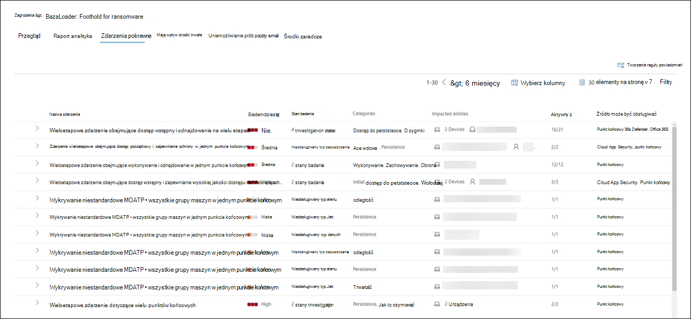
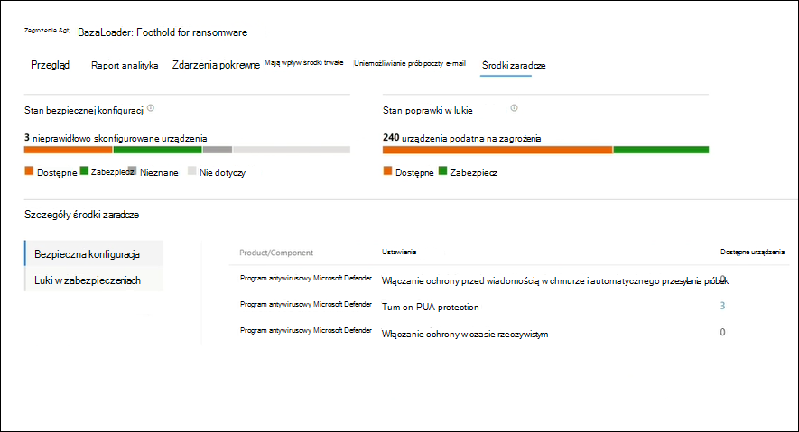

# Analiza zagrożeń w aplikacji Microsoft 365 Defender

[!INCLUDE [Microsoft 365 Defender rebranding](../includes/microsoft-defender.md)]

**Dotyczy:**

- Microsoft 365 Defender

> Chcesz doświadczyć Microsoft 365 Defender? Można go [ocenić w środowisku laboratoryjnym](m365d-evaluation.md?ocid=cx-docs-MTPtriallab) lub [uruchomić projekt pilotażowy w środowisku produkcyjnym](m365d-pilot.md?ocid=cx-evalpilot).
>

[!INCLUDE [Prerelease](../includes/prerelease.md)]

Analiza zagrożeń to nasze rozwiązanie do analizy zagrożeń w produktach od ekspertów firmy Microsoft ds. bezpieczeństwa. Zaprojektowano go, aby pomóc zespołom zabezpieczeń w jak najsekwniejszej wydajności podczas  adresem wyłaniających się zagrożeń, takich jak:

- Aktywne działania podszywają się pod użytkowników i ich kampanie
- Popularne i nowe techniki ataków
- Krytyczne luki w zabezpieczeniach
- Typowe powierzchnie ataków
- Rozpowszechnione złośliwe oprogramowanie

Obejrzyj ten krótki klip wideo, aby dowiedzieć się więcej o tym, jak analiza zagrożeń może ułatwić śledzenie najnowszych zagrożeń i ich zatrzymanie.

>[!VIDEO https://www.microsoft.com/en-us/videoplayer/embed/RWwJfU]

Możesz uzyskać dostęp do analizy zagrożeń z lewej górnej strony paska nawigacyjnego portalu zabezpieczeń lub z dedykowanej karty pulpitu nawigacyjnego, która pokazuje najważniejsze zagrożenia dla Twojej organizacji zarówno pod względem wpływu, jak i ekspozycji. Microsoft 365

Zagrożenia o wysokim poziomie wpływu mają największy potencjał, który może spowodować krzywdę, natomiast zagrożenia wysokiego poziomu ekspozycji są tym, na które Twoje zasoby są najbardziej narażone. Widoczność aktywnych lub trwających kampanii i wiedza o tym, co należy zrobić za pomocą analizy zagrożeń, może ułatwić zespołowi ds. zabezpieczeń podejmowanie świadomych decyzji.

_Gdzie uzyskać dostęp do analizy zagrożeń_

W związku z coraz bardziej zaawansowanymi mechanizmami adwersji i nowymi zagrożeniami coraz częściej trzeba mieć możliwość szybkiego rozwiązania:

- Identyfikowanie wyłaniających się zagrożeń i reagowanie na nie
- Dowiedz się, czy jesteś obecnie w trakcie ataków
- Ocena wpływu zagrożenia na zasoby
- Sprawdzenie odporności na zagrożenia lub ich narażenie
- Zidentyfikuj środki zaradcze, odzyskiwanie lub działania zapobiegania, które można podjąć w celu zatrzymania lub ograniczenia zagrożeń

Każdy raport zawiera analizę śledzenia zagrożeń oraz obszerne wskazówki dotyczące obrony przed tym zagrożeniem. Obejmuje on również dane z Twojej sieci, które wskazują, czy zagrożenie jest aktywne i czy są stosowane odpowiednie zabezpieczenia.

## Wyświetlanie pulpitu nawigacyjnego analizy zagrożeń

Pulpit nawigacyjny analizy zagrożeń ([security.microsoft.com/threatanalytics3](https://security.microsoft.com/threatanalytics3)) wyróżnia raporty, które są najbardziej istotne dla organizacji. Zawiera on podsumowanie zagrożeń w następujących sekcjach:

- **Najnowsze zagrożenia** — zawiera listę ostatnio opublikowanych lub zaktualizowanych raportów o zagrożeniach oraz liczbę aktywnych i rozwiązanych alertów.
- **Zagrożenia o wysokim poziomie wpływu** — są to zagrożenia, które mają największy wpływ na organizację. W tej sekcji wymieniono najpierw zagrożenia, w których jest największa liczba aktywnych i rozwiązanych alertów.
- **Najwyższa ekspozycja** — wyszczególnia najpierw zagrożenia przy najwyższym poziomie ekspozycji. Poziom ochrony przed zagrożeniami oblicza się na podstawie dwóch informacji: jak poważne są luki w zabezpieczeniach związane z tym zagrożeniem i ile urządzeń w organizacji można wykorzystać w związku z tymi lukami.

Wybierz zagrożenie z pulpitu nawigacyjnego, aby wyświetlić raport o tym zagrożeńu.

_Pulpit nawigacyjny analizy zagrożeń. Możesz również wybrać pole Wyszukaj, aby na klawiaturze dodać słowo kluczowe związane z raportem analizy zagrożeń, który chcesz przeczytać._

## Wyświetlanie raportu analizy zagrożeń

Każdy raport analizy zagrożeń zawiera informacje w kilku sekcjach:

- [**Omówienie**](#overview-quickly-understand-the-threat-assess-its-impact-and-review-defenses)
- [**Raport analityka**](#analyst-report-get-expert-insight-from-microsoft-security-researchers)
- [**Zdarzenia pokrewne**](#related-incidents-view-and-manage-related-incidents)
- [**Mają wpływ środki trwałe**](#impacted-assets-get-list-of-impacted-devices-and-mailboxes)
- [**Uniemożliwianie prób poczty e-mail**](#prevented-email-attempts-view-blocked-or-junked-threat-emails)
- [**Środki zaradcze & ekspozycji**](#exposure-and-mitigations-review-list-of-mitigations-and-the-status-of-your-devices)

### Omówienie: Szybkie rozumienie zagrożenia, ocenianie jego wpływu i przeglądanie obron

Sekcja **Omówienie** zawiera podgląd szczegółowego raportu analityka. Zawiera on również wykresy, które podkreślają wpływ zagrożenia na organizację i ekspozycję użytkowników za pośrednictwem nieprawidłowo skonfigurowanych i nieskomponowanych urządzeń.

_Sekcja Przegląd raportu analizy zagrożeń_

#### Ocena wpływu na organizację

Każdy raport zawiera wykresy zaprojektowane w celu zapewnienia informacji o wpływie zagrożenia na strukturę organizacyjną:

- **Zdarzenia pokrewne —** zawiera przegląd wpływu śledzenia zagrożeń dla organizacji przy użyciu następujących danych:
  - Liczba aktywnych alertów i liczba aktywnych zdarzeń, z które są skojarzone
  - Ważność aktywnych zdarzeń
- **Alerty w czasie** — pokazuje liczbę powiązanych  aktywnych i **rozwiązanych alertów** w czasie. Liczba rozwiązanych alertów wskazuje, jak szybko Organizacja reaguje na alerty skojarzone z zagrożeniami. Najlepiej, jeśli na wykresie alerty powinny zostać rozwiązane w ciągu kilku dni.
- **Zasoby, których to wpływ** — pokazuje liczbę różnych urządzeń i kont e-mail (skrzynek pocztowych), w których obecnie jest co najmniej jeden aktywny alert skojarzony z śledzoną zagrożeniami. Alerty są wyzwalane dla skrzynek pocztowych, w których wiadomości e-mail z zagrożeniami zostały odebrane. Przejrzyj zasady zarówno na poziomie organizacji, jak i na poziomie użytkownika, aby uzyskać informacje o zastępowaniu wiadomości e-mail, które powodują dostarczanie wiadomości e-mail z zagrożeniami.
- **Uniemożliwianie prób wiadomości e-mail** — wyświetla liczbę wiadomości e-mail z ostatnich siedmiu dni, które zostały zablokowane przed dostarczeniem lub dostarczone do folderu wiadomości-śmieci.

#### Przegląd odporności i postawy zabezpieczeń

Każdy raport zawiera wykresy, które zawierają omówienie tego, jak chroni twoja organizacja przed danym zagrożeniem:

- **Stan bezpiecznej konfiguracji** — pokazuje liczbę urządzeń z nieprawidłowo skonfigurowanymi ustawieniami zabezpieczeń. Zastosuj zalecane ustawienia zabezpieczeń, aby zmniejszyć zagrożenie. Urządzenia są traktowane **jako Bezpieczne** , _jeśli zastosowano wszystkie_ śledzone ustawienia.
- **Stan poprawki w lukie** — pokazuje liczbę narażonych urządzeń. Zastosuj aktualizacje lub poprawki zabezpieczeń, aby rozwiązać luki w zabezpieczeniach wykorzystywane przez zagrożenie.

#### Wyświetlanie raportów według tagów zagrożeń

Listę raportów zagrożeń można filtrować i wyświetlać najbardziej odpowiednie raporty według określonego tagu zagrożeń (kategorii) lub typu raportu.

- **Tagi zagrożeń** — pomagają w wyświetlaniu najbardziej odpowiednich raportów według określonej kategorii zagrożeń. Na przykład wszystkie raporty dotyczące oprogramowania wymuszającego okup.
- **Typy** raportów — pomagają w wyświetlaniu najbardziej odpowiednich raportów według określonego typu raportu. Na przykład wszystkie raporty, które obejmują narzędzia i techniki.
- **Filtry** — pomagają w wydajnym przeglądaniu listy raportów o zagrożeniach i filtrowaniu widoku na podstawie określonego tagu zagrożeń lub typu raportu. Na przykład przejrzyj wszystkie raporty o zagrożeniach związanych z kategorią oprogramowania wymuszającego okup lub raporty o zagrożeniach, które obejmują luki w zabezpieczeniach.

##### Jak to działa?

Zespół analizy zagrożeń firmy Microsoft dodał tagi zagrożeń do każdego raportu o zagrożeniach:

- Teraz są dostępne cztery tagi zagrożeń:
  - Oprogramowanie wymuszające okup
  - Wyłudzanie informacji
  - Luka w zabezpieczeniach
  - Grupa działań
- Tagi zagrożeń są prezentowane w górnej części strony analizy zagrożeń. Liczba dostępnych raportów pod każdym tagiem jest licznikami.

  

- Listę można też sortować według tagów zagrożeń:

  

- Filtry są dostępne dla 1 tagu zagrożeń i typu raportu:

  

### Raport analityka: Uzyskiwanie informacji ekspertów na temat specjalistów od zabezpieczeń firmy Microsoft

W sekcji **Raport analityka** przeczytaj szczegółowy opis eksperta. Większość raportów zawiera szczegółowe opisy łańcuchów ataków, w tym taktyk i technik zamapowanych na platformę CK ATT MITRE&CK, wyczerpujące listy zaleceń i zaawansowane wskazówki dotyczące ochrony przed [zagrożeniami.](advanced-hunting-overview.md)

[Dowiedz się więcej o raporcie analityka](threat-analytics-analyst-reports.md)

### Zdarzenia pokrewne: wyświetlanie powiązanych zdarzeń i zarządzanie nimi

Na **karcie Zdarzenia pokrewne** jest wyświetlona lista wszystkich zdarzeń związanych z monitorowanym zagrożeniem. Możesz przypisywać zdarzenia lub zarządzać alertami połączonymi z każdym zdarzeniem.

_Sekcja powiązanych zdarzeń w raporcie analizy zagrożeń_

### Zasoby, których wpływ będzie miało wpływ: uzyskiwanie listy urządzeń i skrzynek pocztowych, których to wpływa

Za środek trwały zostanie uznany wpływ, jeśli zostanie on rozwiązany przez aktywny alert, który nie został rozwiązany. Karta **Zasoby, których** wpływ ma wpływ, zawiera listę następujących typów środków trwałych, których wpływ będzie mieć wpływ:

- **Urządzenia, których problem ma** wpływ, czyli punkty końcowe, które nie zostały rozwiązane w programie Microsoft Defender dla alertów dotyczących punktów końcowych. Alerty te zwykle są wyzsłane na podstawie znanych wskaźników zagrożeń i działań.
- **Skrzynki pocztowe, których to** wpływ — skrzynki pocztowe, które otrzymały wiadomości e-mail, wyzwolone przez program Microsoft Defender Office 365 alerty. Mimo że większość wiadomości wywołujących alerty jest zwykle blokowana, zasady na poziomie użytkownika lub organizacji mogą zastępować filtry.

_Sekcja "Zasoby, których to wpływa" w raporcie analizy zagrożeń_

### Uniemożliwiane próby wiadomości e-mail: Wyświetlanie wiadomości e-mail z zablokowanymi lub wiadomościami-śmieciami z zagrożeniami

Program Microsoft Defender for Office 365 zazwyczaj blokuje wiadomości e-mail ze znanymi wskaźnikami zagrożeń, w tym złośliwymi linkami lub załącznikami. W niektórych przypadkach aktywne mechanizmy filtrowania, które sprawdzają podejrzaną zawartość, będą zamiast tego wysyłać do folderu wiadomości-śmieci wiadomości e-mail zawierające zagrożenia. W obu przypadkach szanse na uruchomienie kodu złośliwego oprogramowania na urządzeniu są ograniczone.

Karta **Uniemożliwiane próby wysłania wiadomości e-mail** zawiera listę wszystkich wiadomości e-mail, które zostały zablokowane przed dostarczeniem lub wysłane do folderu wiadomości-śmieci przez usługę Microsoft Defender dla systemu Office 365.

_Sekcja informacji o próbach wiadomości e-mail w raporcie analizy zagrożeń_

### Ekspozycja i środki zaradcze: Przejrzyj listę środków zaradczych i stan swoich urządzeń

W sekcji **Ekspozycja &** środki zaradcze przejrzyj listę konkretnych zaleceń, które można zwalać do działania, które mogą pomóc Ci zwiększyć odporność organizacji przed zagrożeniami. Lista śledzonych środków zaradczych obejmuje:

- **Aktualizacje zabezpieczeń** — wdrażanie obsługiwanych aktualizacji zabezpieczeń oprogramowania w przypadku luk w zabezpieczeniach na urządzeniach, które są na nich zainstalowane
- **Obsługiwane konfiguracje zabezpieczeń**
  - Ochrona w chmurze  
  - Potencjalnie niechciana ochrona aplikacji (PUA)
  - Ochrona w czasie rzeczywistym

Środki zaradcze zawarte w tej sekcji zawierają dane [Zarządzanie zagrożeniami i lukami, które](/windows/security/threat-protection/microsoft-defender-atp/next-gen-threat-and-vuln-mgt) zawierają również szczegółowe informacje na temat przechodzenia do szczegółów z różnych łączy w raporcie.

_Sekcja & wpływu na raport analizy zagrożeń_

## Konfigurowanie powiadomień e-mail o aktualizacjach raportów

Możesz skonfigurować powiadomienia e-mail, które będą wysyłać aktualizacje raportów analizy zagrożeń.

Aby skonfigurować powiadomienia e-mail na temat raportów analizy zagrożeń, wykonaj następujące czynności:

1. Wybierz **Ustawienia** na Microsoft 365 Defender bocznym. Wybierz **Microsoft 365 Defender** z listy ustawień.
 

2. Wybierz **pozycję Powiadomienia** **e-mailTereat** >  analiza, a następnie wybierz przycisk **+ Utwórz regułę powiadomień**. Zostanie wyświetlone wysuw.

3. Postępuj zgodnie z instrukcjami wymienionymi w wysuwanych. Najpierw nadaj nazwę nowej  reguła. Pole Opis jest opcjonalne, ale nazwa jest wymagana. Możesz włączyć lub wyłączyć regułę przy użyciu pola wyboru pod polem opisu.

> [!NOTE]
> W polach nazwy i opisu nowej reguły powiadomień są akceptowane tylko angielskie litery i cyfry. Nie akceptują spacji, kresek, podkreśleń ani żadnych innych znaków interpunkcji.

4. Wybierz rodzaj raportów, o których chcesz uzyskać powiadomienie. Możesz wybrać, czy chcesz aktualizować wszystkie nowo opublikowane lub zaktualizowane raporty, czy tylko te raporty, które mają określony tag lub typ.

5. Dodaj co najmniej jednego adresata, aby otrzymać powiadomienia e-mail. Możesz również użyć tego ekranu, aby sprawdzić, jak będą otrzymywane powiadomienia, wysyłając testową wiadomość e-mail.

6. Przejrzyj nową regułę. Jeśli chcesz coś zmienić, wybierz przycisk **Edytuj** na końcu każdej podsekcji. Po zakończeniu przeglądania wybierz przycisk **Utwórz regułę** .

7. Gratulacje! Nowa reguła została pomyślnie utworzona. Wybierz przycisk **Gotowe** , aby ukończyć proces i zamknąć wysuwne menu.

8. Nowa reguła zostanie wyświetlona na liście powiadomień e-mail analizy zagrożeń.

## Dodatkowe szczegóły i ograniczenia dotyczące raportu

> [!NOTE]
> W ramach ujednoliconego systemu zabezpieczeń analiza zagrożeń jest teraz dostępna nie tylko dla programu Microsoft Defender for Endpoint, ale również dla programu Microsoft Defender dla posiadaczy licencji Office E5.
>
> Jeśli nie korzystasz z portalu zabezpieczeń Microsoft 365 (Microsoft 365 Defender), możesz również wyświetlić szczegóły raportu (bez programu Microsoft Defender dla danych programu Office) w portalu programu Centrum zabezpieczeń usługi Microsoft Defender (program Microsoft Defender dla Punkt końcowy).

Aby uzyskać dostęp do raportów analizy zagrożeń, musisz mieć określone role i uprawnienia. Aby [uzyskać szczegółowe informacje, zobacz](custom-roles.md) Role niestandardowe w kontrolach dostępu opartych na Microsoft 365 Defender rolach.

- Aby wyświetlać alerty, zdarzenia lub dane zasobów, których to problem, musisz mieć uprawnienia do usługi Microsoft Defender dla programu Office lub usługi Microsoft Defender dla danych alertów punktu końcowego lub obu tych usług.
- Aby wyświetlić uniemożliwiane próby poczty e-mail, musisz mieć uprawnienia do programu Microsoft Defender do Office przechowywania danych.
- Aby wyświetlić środki zaradcze, musisz mieć uprawnienia do Zarządzanie zagrożeniami i lukami danych w programie Microsoft Defender for Endpoint.

Patrząc na dane analizy zagrożeń, pamiętaj o następujących czynnikach:

- Wykresy odzwierciedlają tylko środki zaradcze, które są śledzone. Sprawdź omówienie raportu, aby uzyskać dodatkowe środki zaradcze, które nie są widoczne na wykresach.
- Środki zaradcze nie gwarantują pełnej odporności. Podane środki zaradcze odzwierciedlają najlepsze możliwe działania potrzebne do zwiększenia odporności.
- Urządzenia są liczone jako "niedostępne", jeśli nie przesłały danych do usługi.
- Statystyki dotyczące oprogramowania antywirusowego są oparte na Program antywirusowy Microsoft Defender ustawieniach. Urządzenia z rozwiązaniami antywirusowymi innych firm mogą być wyświetlane jako "dostępne".

## Artykuły pokrewne

- [Aktywne wyszukiwanie zagrożeń dzięki zaawansowanym narzędziom do wyszukiwania](advanced-hunting-overview.md)
- [Opis sekcji raportu analityka](threat-analytics-analyst-reports.md)
- [Ocenianie i rozwiązywanie problemów z zabezpieczeniami i ich ekspozycję](/windows/security/threat-protection/microsoft-defender-atp/next-gen-threat-and-vuln-mgt)
