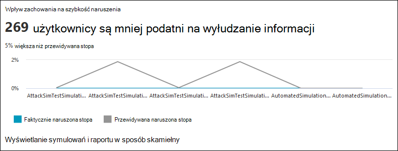
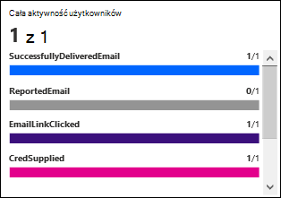
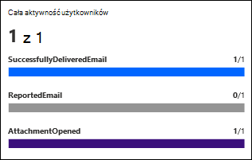
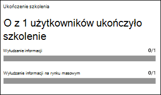

# Szczegółowe informacje i raporty na temat szkolenia symydacyjnego z tematem ataków w programie Defender dla Office 365

**Dotyczy programu** [Microsoft Defender dla Office 365 plan 2](defender-for-office-365.md)

W szkoleniu symulacyjnej platformy Microsoft Defender dla programu Office Plan 2 lub Microsoft 365 E5 firma Microsoft udostępnia szczegółowe informacje i raporty na temat wyników symulacyjnych i odpowiadających im szkoleń. Te informacje informują Cię o postępie gotowości użytkowników do zagrożeń, a także zalecane następne kroki w celu lepszego przygotowania użytkowników do przyszłych ataków.

Szczegółowe informacje i raporty są dostępne w następujących lokalizacjach w szkoleniu symulacyjnych ataków w portalu Microsoft 365 Defender sieci:

- Karta **Omówienie** .
- Szczegóły symulowania na **karcie Symulatory** .

W dalszej części tego artykułu opisano dostępne informacje.

Aby uzyskać informacje na temat szkolenia z symezyjną ataków, zobacz Wprowadzenie do szkolenia z użyciem [symezyjny](attack-simulation-training-get-started.md) ataków.

## Szczegółowe informacje i raporty na karcie Przegląd w szkolenie dotyczące symezyjny ataków

Aby przejść do karty  Przegląd, otwórz portal programu Microsoft 365 Defender <https://security.microsoft.com>w witrynie , **przejdź do** \> szkolenia z & e-mail do współpracy **podczas** ataków i sprawdź, czy jest zaznaczona karta Omówienie (jest to karta domyślna). Aby przejść bezpośrednio do karty **Przegląd** na stronie szkoleń z użyciem **symezyjny ataków** , użyj klawisza <https://security.microsoft.com/attacksimulator?viewid=overview>.

W dalszej części tej sekcji opisano informacje dostępne na karcie Omówienie **szkolenia symulacyjnego** z tematem ataków.

### Karta ostatnich symulacyjnych

Karta **Ostatnie symulacyjne** na **karcie Przegląd** zawiera trzy ostatnie symulatory utworzone lub uruchomione w organizacji.

Aby wyświetlić szczegóły, możesz wybrać symulowanie.

Wybranie **opcji Wyświetl wszystkie czasy symulacyjne** umożliwia wyświetlenie **karty Symulatory** .

Wybranie **opcji Uruchom symulowanie** uruchamia kreatora tworzenia symulacyjnej. Aby uzyskać więcej informacji, zobacz [Symulowanie ataku służącego do wyłudzania informacji w programie Defender dla Office 365](attack-simulation-training.md).

### Wpływ zachowania na kartę oceny naruszenia

Karta **Omówienie ma wpływ** na zachowanie na karcie Ocena  naruszenia pozwala sprawdzić, jak użytkownicy reagowali na Twoje czasy symulacyjne w porównaniu z danymi historycznymi w programie Microsoft 365. Korzystając z tych szczegółowych informacji, można śledzić postęp pracy użytkowników z zagrożeniami dzięki uruchomieniu wielu symulacyjnych dla tych samych grup użytkowników.

Na samym wykresie są przedstawiane następujące informacje:

- **Przewidywana szybkość złamań**\*: średni czas naruszenia dla symezyjnych szkoleń z użyciem tego samego typu obciążenia dla wszystkich innych Microsoft 365 organizacji.
- **Rzeczywista stopa naruszenia**\*: rzeczywisty procent użytkowników, którzy minął w czasie trwania symulacyjnej.

Gdy umieszczasz wskaźnik myszy na punkcie danych na wykresie, wyświetlane są rzeczywiste wartości procentowe.

Na karcie są również wyświetlane następujące informacje podsumowujące:

- **użytkownicy są mniej podatni** na próby wyłudzania informacji: Różnica między rzeczywistą liczbą użytkowników, których bezpieczeństwo zostało naruszone przez symulowany atak, a przewidywaną szybkością naruszenia. W przyszłości ta liczba użytkowników będzie mniej prawdopodobna w przypadku podobnych ataków.
- **x% lepsze niż przewidywana stopa**: wskazuje, jak użytkownicy ogólnie porównali się z przewidywaną stopą naruszenia.

Aby wyświetlić bardziej szczegółowy raport, kliknij pozycję **Wyświetl symulacje i raport ze** szkoleniem. Ten raport został [wyjaśniony w dalszej części tego artykułu](#training-efficacy-tab-for-the-attack-simulation-report).

### Karta obszaru zasięgu symulacyjnego

Na **karcie** Przegląd na karcie Omówienie  na karcie Symulowany jest pokazana wartość procentowa użytkowników w organizacji, którzy otrzymali platformę symulacyjna **(** Symulowani użytkownicy) względem użytkowników, którzy nie otrzymali symulacyjnej **pracy (użytkownicy** niesymulujący). Możesz zatrzymać wskaźnik myszy na sekcji na wykresie, aby wyświetlić rzeczywistą liczbę użytkowników w poszczególnych kategoriach.

Wybranie **funkcji Launch symulacyjnej dla niesymulacyjnych** użytkowników uruchamia kreatora tworzenia symulacyjnego, w którym użytkownicy, którzy nie otrzymują tej symulacyjnej pracy, są automatycznie wybrani na **stronie Użytkownik docelowy** . Aby uzyskać więcej informacji, zobacz [Symulowanie ataku służącego do wyłudzania informacji w programie Defender dla Office 365](attack-simulation-training.md).

Wybranie **opcji Wyświetl raport zasięgu symulacyjnego** umożliwia wyświetlenie karty [Zasięg użytkownika w raporcie symulacyjnej ataków](#user-coverage-tab-for-the-attack-simulation-report).

### Karta ukończenia szkolenia

Karta **Ukończenie** szkolenia na karcie  Przegląd umożliwia organizację wartości procentowych użytkowników, którzy otrzymali szkolenia na podstawie wyników symulacyjnych, w następujących kategoriach:

- **Ukończone**
- **W toku**
- **Nieukończony**

Możesz zatrzymać wskaźnik myszy na sekcji na wykresie, aby wyświetlić rzeczywistą liczbę użytkowników w poszczególnych kategoriach.

Wybranie **opcji Wyświetl raport ukończenia** szkolenia umożliwia wyświetlenie karty [Ukończenie szkolenia dla raportu symulacyjnego z atakami](#training-completion-tab-for-the-attack-simulation-report).

### Repeat offenders card

Karta **Powtórzenia na** karcie Przegląd zawiera informacje  o powtarzających się przestępcach. Repeat _offender to_ użytkownik, który został naruszony przez następujące po sobie symulowania. Domyślna liczba następujących po sobie przykładów to dwie, ale można **zmienić** wartość na karcie Ustawienia szkolenia z symulacyjnej ataków w .<https://security.microsoft.com/attacksimulator?viewid=setting>

Wykres przedstawia powtarzanie danych odwłaszczynych według [typu symulacyjnego](attack-simulation-training.md#select-a-social-engineering-technique):

- **Wszystkie**
- **Załącznik z złośliwym oprogramowaniem**
- **Link do złośliwego oprogramowania**
- **Zbiór poświadczeń**
- **Łączenie w załącznikach**
- **Adres URL dla dysków**

Wybranie **opcji Wyświetl raport powtarzania odwłaścicieli** umożliwia wyświetlenie karty [Powtórzenia w raporcie symulacyjnej ataków](#repeat-offenders-tab-for-the-attack-simulation-report).

### Rekomendacje karty kredytowej

Karta **Rekomendacje** na **karcie Omówienie** sugeruje różne typy symulowań do uruchomienia.

Wybranie **przycisku Uruchom teraz** spowoduje uruchomienie kreatora tworzenia symulacji z automatycznie wybranym typem symulacji na **stronie Wybierz technikę** . Aby uzyskać więcej informacji, zobacz [Symulowanie ataku służącego do wyłudzania informacji w programie Defender dla Office 365](attack-simulation-training.md).

### Raport symulacyjnych ataków

Raport **symezyjny ataków można** otworzyć z karty **Przegląd** , klikając pozycję **Widok... przyciski** raportów dostępne na wielu kartach opisanych w tym artykule. Aby przejść bezpośrednio do raportu, użyj <https://security.microsoft.com/attacksimulationreport>

#### Karta Szkolenia na temat raportu symulacyjnego ataków

Na stronie **Raport symulacyjnych ataków** domyślnie wybrana jest karta Szkolenie **.** Ta karta zawiera te same informacje, które są dostępne w obszarze  Zachowanie na kartę oceny naruszenia, z dodatkowymi kontekstami samej symulacyjnej.

Wykres przedstawia **przewidywaną stopę naruszenia i** **wskaźnik rzeczywistego naruszenia**. Po umieszczeniu wskaźnika myszy na sekcji wykresu zostaną wyświetlone rzeczywiste wartości procentowe.

Tabela szczegółów pod wykresem zawiera następujące informacje:

- **Nazwa symulacyjnej**
- **Technika symulacyjna**
- **Taktyka symulacyjna**
- **Przewidywana naruszona stopa**
- **Stopa rzeczywistego naruszenia**
- **Łączna liczba docelowej liczby użytkowników**
- **Liczba klikowanych użytkowników**

Wyniki możesz posortować, klikając dostępny nagłówek kolumny.

Kliknij **pozycję Dostosuj kolumny** , aby usunąć wyświetlane kolumny. Po zakończeniu kliknij przycisk **Zastosuj**.

Pole  wyszukiwania umożliwia filtrowanie wyników według nazwy **symulacyjnej lub** **techniki symulacyjnej**. Symbole wieloznaczne nie są obsługiwane.

Jeśli klikniesz ikonę  **Przycisk Eksportuj** raport, postęp generowania raportu jest pokazywany jako procent ukończenia. W oknie dialogowym, które zostanie otwarte, możesz otworzyć plik .csv, zapisać .csv i zapamiętać zaznaczenie.

#### Karta zasięgu użytkownika dla raportu symulacyjnego ataków

Na karcie **Zakres użytkowników** wykres przedstawia symulowanych użytkowników i  **użytkowników niesymulowany**. Po umieszczeniu wskaźnika myszy na punkcie danych na wykresie zostaną wyświetlone rzeczywiste wartości.

Tabela szczegółów pod wykresem zawiera następujące informacje:

- **Nazwa użytkownika**
- **Adres e-mail**
- **Uwzględniono w symulacyjnej**
- **Data ostatniej symulacyjnej**
- **Wynik ostatniej symulacyjnej**
- **Liczba klikowanych**
- **Liczba naruszonych zabezpieczeń**

Wyniki możesz posortować, klikając dostępny nagłówek kolumny.

Kliknij **pozycję Dostosuj kolumny** , aby usunąć wyświetlane kolumny. Po zakończeniu kliknij przycisk **Zastosuj**.

Użyj  **wyszukiwania,** aby przefiltrować wyniki według nazwy **użytkownika** lub adresu **e-mail**. Symbole wieloznaczne nie są obsługiwane.

Jeśli klikniesz ikonę  **Przycisk Eksportuj** raport, postęp generowania raportu jest pokazywany jako procent ukończenia. W oknie dialogowym, które zostanie otwarte, możesz otworzyć plik .csv, zapisać .csv i zapamiętać zaznaczenie.

#### Karta Ukończenie szkolenia dla raportu symulacyjnego ataków

Na karcie **Ukończenie** szkolenia na wykresie przedstawiono liczbę symulacyjnych ukończonych **, w** toku i nieukończonych. Po umieszczeniu wskaźnika myszy na sekcji wykresu zostaną wyświetlone rzeczywiste wartości.

Tabela szczegółów pod wykresem zawiera następujące informacje:

- **Nazwa użytkownika**
- **Adres e-mail**
- **Uwzględniono w symulacyjnej**
- **Data ostatniej symulacyjnej**
- **Wynik ostatniej symulacyjnej**
- **Nazwa ukończonego ostatniego szkolenia**
- **Data ukończenia**
- **Wszystkie szkolenia**

Wyniki możesz posortować, klikając dostępny nagłówek kolumny.

Kliknij **pozycję Dostosuj kolumny** , aby usunąć wyświetlane kolumny. Po zakończeniu kliknij przycisk **Zastosuj**.

Kliknij ikonę  **Filtruj** , aby filtrować wykres i tabelę szczegółów według co najmniej jednej z następujących wartości:

- **Ukończone**
- **W toku**
- **Wszystkie**

Po zakończeniu konfigurowania filtrów kliknij pozycję **Zastosuj,** **Anuluj** lub **Wyczyść filtry**.

Użyj  **wyszukiwania,** aby przefiltrować wyniki według nazwy **użytkownika** lub adresu **e-mail**. Symbole wieloznaczne nie są obsługiwane.

Jeśli klikniesz ikonę  **Przycisk Eksportuj** raport, postęp generowania raportu jest pokazywany jako procent ukończenia. W oknie dialogowym, które zostanie otwarte, możesz otworzyć plik .csv, zapisać .csv i zapamiętać zaznaczenie.

#### Repeat offenders tab for the Attack simulation report

Repeat _offender to_ użytkownik, który został naruszony przez następujące po sobie symulowania. Domyślna liczba następujących po sobie przykładów to dwie, ale można **zmienić** wartość na karcie Ustawienia szkolenia z symulacyjnej ataków w .<https://security.microsoft.com/attacksimulator?viewid=setting>

Na karcie **Repeat offenders (Powtarzanie)** na wykresie są organizowanie powtarzanych danych offendera według typu [symulacyjnego](attack-simulation-training.md#select-a-social-engineering-technique):

- **Wszystkie**
- **Zbiór poświadczeń**
- **Załącznik z złośliwym oprogramowaniem**
- **Łącze w załączniku**
- **Link do złośliwego oprogramowania**
- **Adres URL dla dysków**

Po umieszczeniu wskaźnika myszy na punkcie danych na wykresie zostaną wyświetlone rzeczywiste wartości.

Tabela szczegółów pod wykresem zawiera następujące informacje:

- **Użytkownik**
- **Powtarzanie liczby**
- **Typy symulowań**
- **Symulacje**

Wyniki możesz posortować, klikając dostępny nagłówek kolumny.

Kliknij **pozycję Dostosuj kolumny** , aby usunąć wyświetlane kolumny. Po zakończeniu kliknij przycisk **Zastosuj**.

Kliknij ikonę  **Filtruj** wykres i tabelę szczegółów według niektórych lub wszystkich wartości typu symulacyjnego:

- **Zbiór poświadczeń**
- **Załącznik z złośliwym oprogramowaniem**
- **Łącze w załączniku**
- **Link do złośliwego oprogramowania**
- **Adres URL dla dysków**

Po zakończeniu konfigurowania filtrów kliknij pozycję **Zastosuj,** **Anuluj** lub **Wyczyść filtry**.

Użyj  Wyszukiwania, aby przefiltrować wyniki według dowolnej wartości kolumny. Symbole wieloznaczne nie są obsługiwane.

Jeśli klikniesz ikonę  **Przycisk Eksportuj** raport, postęp generowania raportu jest pokazywany jako procent ukończenia. W oknie dialogowym, które zostanie otwarte, możesz otworzyć plik .csv, zapisać .csv i zapamiętać zaznaczenie.

## Szczegółowe informacje i raporty w szczegółach symulacyjnych szkolenia symulacyjnego

Aby przejść do karty **Symulatory**, otwórz portal <https://security.microsoft.com>Microsoft 365 Defender w witrynie ,  \> przejdź do szkolenia & e-mail i **symulacji** ataków, a następnie wybierz **kartę Symulatory**. Aby przejść bezpośrednio do karty **Symulatory** na stronie szkoleń z użyciem **symezyjki ataków**, użyj klawisza <https://security.microsoft.com/attacksimulator?viewid=simulations>.

Po wybraniu z listy symulacyjnej zostanie otwarta strona szczegółów. Na tej stronie znajdują się ustawienia konfiguracji symulowania, która będzie oczekiwana (stan, data uruchomienia, użyte łady itp.).

W dalszej części tej sekcji opisano szczegółowe informacje i raporty dostępne na stronie szczegółów symulowania.

### Sekcja wpływów na symulowanie

Sekcja **Wpływ na symulacyjne** na stronie szczegółów symulacyjnej pokazuje, ilu użytkowników zostało całkowicie skusowanych na podstawie symulacyjnej i łącznej liczby użytkowników w czasie symulacyjnej. Wyświetlane informacje różnią się w zależności od typu symulacyjnej. Przykład:

- Linki: **Wprowadzono poświadczenia** i **nie wprowadzono poświadczeń**.

  

- Załączniki: **Otwarty załącznik** i **Nie otwarto załącznika**.

  

Po umieszczeniu wskaźnika myszy na sekcji na wykresie zostaną wyświetlone rzeczywiste liczby dla każdej kategorii.

### Sekcja Wszystkie działania użytkowników

Sekcja **Cała aktywność użytkownika** na stronie szczegółów symulacyjnej zawiera liczby możliwych wyników symulacyjnej. Wyświetlane informacje różnią się w zależności od typu symulacyjnej. Przykład:

- **SuccessfullyDeliveredEmail**
- **ReportedEmail**: Ilu użytkowników zgłosiło komunikat symulujący jako podejrzany.
- Linki:
  - **EmailLinkClicked**: Ilu użytkowników kliknął link w komunikacie symulacyjnej.
  - **CredSupplied**: Po kliknięciu linku ilu użytkowników podało poświadczenia.

    

- Załączniki:
  - **AttachmentOpened**: Ilu użytkowników otworzyło załącznik w komunikacie symulacyjnej.

    

### Sekcja ukończenia szkolenia

Sekcja **Ukończenie szkolenia** na stronie szczegółów symulacyjnej zawiera informacje o szkoleniach wymaganych do ukończenia symulacyjnej oraz o tym, ilu użytkowników ukończyło szkolenia.

## Sekcja Zalecane akcje

Sekcja **Zalecane akcje** na stronie szczegółów symulowania zawiera zalecane akcje z bezpiecznego wyniku firmy [Microsoft](../defender/microsoft-secure-score.md) oraz wpływ akcji na Wynik bezpiecznego. Te zalecenia są oparte na ładowarce użytej w czasie symulacyjnej i pomagają chronić użytkowników i środowisko. Wybranie **z listy akcji** Ulepszenie przenosi Cię do lokalizacji, w ramach która zostanie zaimplementowana sugerowana akcja.

## Linki pokrewne

[Wprowadzenie do korzystania ze szkolenia symulacyjnego w zakresie ataków](attack-simulation-training-get-started.md)

[Tworzenie symulacyjnej próby wyłudzania informacji](attack-simulation-training.md)

[Tworzenie ładu na szkolenia dla pracowników](attack-simulation-training-payloads.md)
