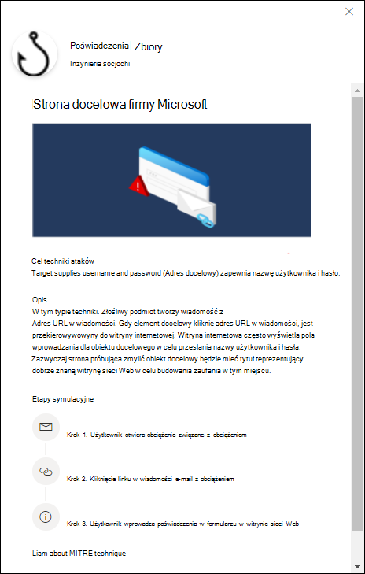
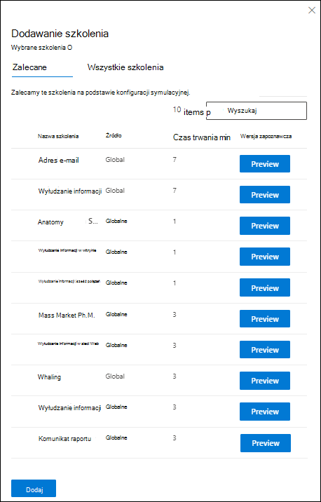
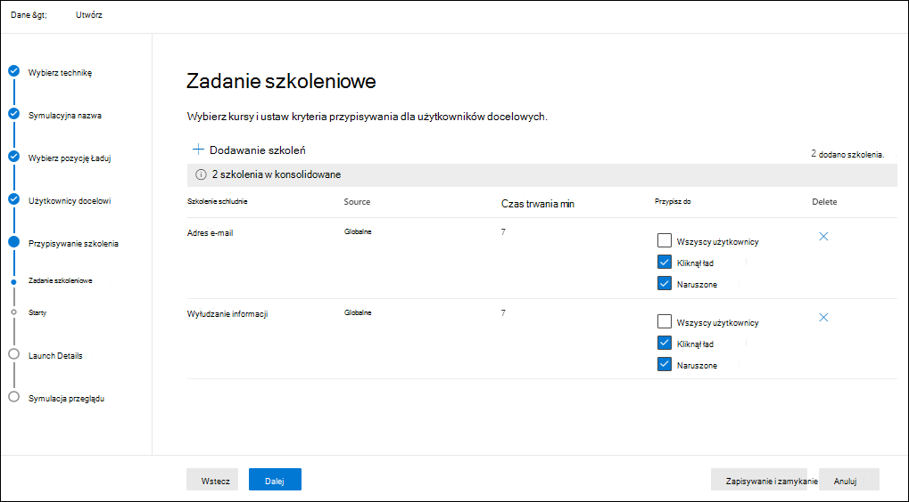
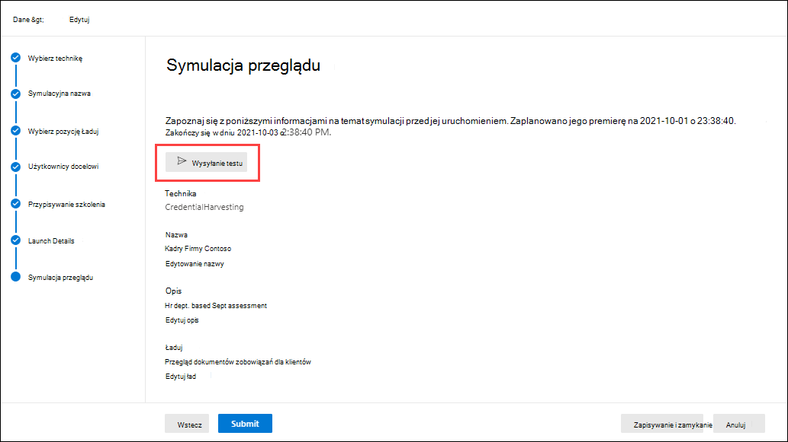

# Symulowanie ataków phishingowego za pomocą szkolenia symezyjnego ataków w programie Defender dla Office 365

**Dotyczy programu** [Microsoft Defender dla Office 365 plan 2](defender-for-office-365.md)

Szkolenie symulacyjne dotyczące ataków w programie Microsoft Defender Office 365 plan 2 lub program Microsoft 365 E5 umożliwia uruchamianie symulacyjnych cyberataków w organizacji. Te symulacje testują zasady i praktyki dotyczące zabezpieczeń, a także przeszkoli pracowników w zakresie zwiększania ich wiedzy i zmniejszenia ich wrażliwości na ataki. Ten artykuł zawiera informacje o tworzeniu symulowanego ataku służącego do wyłudzania informacji przy użyciu szkolenia z użyciem symezyjnej próby wyłudzenia informacji.

Aby uzyskać informacje na temat szkolenia z symezyjną ataków, zobacz Wprowadzenie do szkolenia z użyciem [symezyjny](attack-simulation-training-get-started.md) ataków.

Aby rozpocząć symulowany atak wyłudzania informacji, wykonaj następujące czynności:

1. W portalu Microsoft 365 Defender pod <https://security.microsoft.com>adresem przejdź do karty **E-mail** \> & **szkolenia symulacyjnego** \> z **atakami.**

   Aby przejść bezpośrednio do karty **Symulatory** , użyj klawisza <https://security.microsoft.com/attacksimulator?viewid=simulations>.

2. Na karcie **Symulacje** wybierz pozycję  **Uruchamianie symulacyjnej**.

   

3. Zostanie otwarty kreator tworzenia symulowania. W dalszej części tego artykułu opisano strony i ustawienia, które zawierają.

> [!NOTE]
> W dowolnym momencie kreatora tworzenia symulacyjnej możesz kliknąć przycisk **Zapisz** i zamknij, aby zapisać postęp i kontynuować konfigurowanie symulacyjnej później. W czasie nieukończonej **symulacyjnej wartości stanowej** **na** **karcie Symulatory** . Możesz wybrać miejsce, w którym zostało to pozostawione, wybierając symululę i klikając ikonę  **Symulacyjna** edycja.

## Wybieranie techniki społecznościowej

Na stronie **Select technique (** Wybierz technikę) wybierz dostępną technikę socjochniczną, która została wytyczona na podstawie struktury [MITRE ATT&CK®](https://attack.mitre.org/techniques/enterprise/). Różne łady są dostępne dla różnych technik. Dostępne są następujące techniki społecznościowe:

- **Zbieranie poświadczeń**. Próbuje zbierać poświadczenia przez wprowadzenie nazwy użytkownika i hasła do dobrze znanej witryny internetowej z polami wprowadzania.
- **Załącznik w złośliwym** oprogramowaniu: powoduje dodanie złośliwego załącznika do wiadomości. Gdy użytkownik otworzy załącznik, zostanie uruchomiony dowolny kod, który pomoże intruzowi naruszyć urządzenie docelowe.
- **Link w załączniku**: typ środowiska hybrydowego zbierania poświadczeń. Atakujący wstawia adres URL do załącznika wiadomości e-mail. Adres URL w załączniku jest zgodny z techniką zbioru poświadczeń.
- **Link do złośliwego oprogramowania**: uruchamia dowolny kod z pliku hostowanej w dobrze znanej usłudze udostępniania plików. Wiadomość wysłana do użytkownika będzie zawierać link do tego złośliwego pliku. Otwarcie pliku pomoże atakującemu naruszyć urządzenie docelowe.
- **Adres URL** dysku: złośliwy adres URL w wiadomości przenosi użytkownika do znanej witryny sieci Web, która po cichu uruchamia i/lub instaluje kod na urządzeniu użytkownika.

Kliknięcie linku **Wyświetl szczegóły** w opisie spowoduje otwarcie wysuwu szczegółów, opisujące technikę i kroki symulacyjne wynikające z tej techniki.

Po zakończeniu kliknij przycisk **Dalej**.

## Nazywanie i opisywanie symulowania

Na stronie **Name simulation (Symulacyjne** nazwy) skonfiguruj następujące ustawienia:

- **Nazwa**: Wprowadź unikatową nazwę opisową dla symulacyjnej.
- **Opis**. Wprowadź opcjonalny szczegółowy opis symulowania.

Po zakończeniu kliknij przycisk **Dalej**.

## Wybierz ład

Na **stronie Wybieranie** ładuj musisz wybrać z listy istniejące ład lub utworzyć nowy ład.

Na liście elementów do wyboru są wyświetlane następujące informacje:

- **Nazwa**
- **Język**: język zawartości ładu. Katalog ładów firmy Microsoft (globalna) udostępnia  payloads w ponad 10 językach, które można również filtrować.
- **Szybkość klikania**: ile osób kliknąło ten ład.
- **Przewidywana szybkość naruszenia**: dane historyczne obciążenia na poziomie Microsoft 365, które przewiduje procent osób, które zostaną naruszone przez ten ład.
- **Uruchomiono symeony** i zlicza, ile razy ten ład został użyty w innych symulacyjnych.

Na ikonie  **Pole** wyszukiwania, możesz wpisać część nazwy ładowania i nacisnąć klawisz Enter, aby przefiltrować wyniki.

Jeśli klikniesz **pozycję Filtruj**, dostępne są następujące filtry:

- **Złożoność**: Obliczona na podstawie liczby wskaźników w zbędnych wynikach możliwych ataków (błędy pisowni, pilność itp.). Więcej wskaźników jest łatwiejsze do zidentyfikowania jako atak i wskazuje niższą złożoność. Dostępne wartości:
  - **Niska**
  - **Średni**
  - **High (Wysoki)**
- **Źródło**: wskazuje, czy ład został utworzony w organizacji, czy jest częścią istniejącego katalogu ładów firmy Microsoft. Prawidłowe wartości to:
  - **Globalna** (wbudowana)
  - **Dzierżawa** (niestandardowa)
  - **Wszystkie**
- **Język**: Dostępne wartości to: chiński **(** uproszczony), chiński **(tradycyjny),****angielski,** **francuski**, **niemiecki****, włoski****, japoński**, **koreański**, **portugalski****, rosyjski****, hiszpański** i **holenderski**.
- **Dodawanie tagów**
- **Filtruj** według motywu **: Dostępne** wartości: Aktywacja **konta, Weryfikacja** **konta, Rozliczenia****,** Oczyszczanie **poczty,** Odebrano dokument, **Koszt**, **Faks****, Raport** **finansowy, Wiadomości** przychodzące, Faktura **,** Odebrane **elementy,** **Alert logowania****,** Otrzymano **pocztę**, Hasło, **Płatność**, **Płace**, **Spersonalizowana oferta****,** Kwarantanna, **Praca zdalna**, **Przejrzenie wiadomości**, **Aktualizacja** **zabezpieczeń, Usługa** zawieszona, Podpis **wymagany**, Uaktualnij magazyn skrzynki pocztowej **Weryfikowanie** skrzynki pocztowej, **Poczta głosowa** i **Inne**.
- Filtruj według **marki: Dostępne** wartości to: **American Express**, **Capital One**, **DHL**, **DocuSign**, **Dropbox**, **Facebook**, **First American**, **Microsoft**, **Netflix**, **Scotiabank**, **SendGrid, Title** Title, **Tesco**, **Wells Fargo**, **Syrinx Cloud** i **inne**.
- **Filtruj** według branży: Dostępne **wartości to:** Bankowość **, Usługi** **biznesowe, Usługi** dla klientów **indywidualnych, Edukacja****, Energy****,** Konsygnacja, **Consulting**, Usługi **finansowe**, **Rząd**, **Jednak**, **Ubezpieczenia**, **Prawne**, **Courier services**, **IT****, Opieka** zdrowotna **, Produkcja**, **Sprzedaż** detaliczna, **Telecom**, **Nieruchomości**, i **Inne**.
- **Bieżące zdarzenie**: Dostępne wartości to **Tak** lub **Nie**.
- **Wymierne**: Dostępne wartości to **Tak** lub **Nie**.

Po zakończeniu konfigurowania filtrów kliknij pozycję **Zastosuj,** **Anuluj** lub **Wyczyść filtry**.

Jeśli wybierzesz ład z listy, szczegóły dotyczące tego ładu zostaną wyświetlone w wysuwanych informacjach:

- Karta **Przegląd** zawiera przykład i inne szczegóły dotyczące ładu.
- Karta **Uruchomiono symulatory** zawiera nazwę **symulacyjnej**, **szybkość** klikania, **naruszone tempo** i **działanie**.

Jeśli wybierzesz ład z listy, klikając jego nazwę, zostanie wyświetlona  **Przycisk Wyślij test** jest wyświetlany na stronie głównej, gdzie możesz wysłać kopię wiadomości e-mail z obciążeniem do siebie (obecnie zalogowanego użytkownika) do inspekcji.

Aby utworzyć własny ład, kliknij ikonę  **Utwórz ład.** Aby uzyskać więcej informacji, zobacz [Tworzenie niestandardowych załadowań na szkolenie z symezyjną ataków](attack-simulation-training-payloads.md).

Po zakończeniu kliknij przycisk **Dalej**.

## Użytkownicy docelowi

Na stronie **Użytkownicy docelowi** wybierz osoby, które otrzymają symulowanie. Skonfiguruj jedno z następujących ustawień:

- **Uwzględnij wszystkich użytkowników w organizacji**: użytkownicy, których dotyczy problem, są pokazywani na listach z 10. Do przewijania **listy możesz** **użyć** przycisków Następny i Poprzedni bezpośrednio poniżej listy użytkowników. Możesz również użyć ikony  **Ikona** wyszukiwania na stronie w celu znalezienia użytkowników, których dotyczy problem.

- **Uwzględnij tylko określonych użytkowników i grupy**: Wybierz jedną z następujących opcji:
  -  **Dodawanie użytkowników**: **W wyświetlonym** wysuwanych czacie Dodawanie użytkowników możesz znaleźć użytkowników i grupy na podstawie następujących kryteriów:

    - **Wyszukiwanie użytkowników lub** grup: W polu można wpisać część nazwy lub adresu e-mail użytkownika  lub grupy, a następnie nacisnąć klawisz Enter. Możesz wybrać niektóre lub wszystkie wyniki. Po zakończeniu kliknij pozycję **Dodaj x użytkowników**.

      > [!NOTE]
      > Kliknięcie **przycisku Dodaj filtry** w celu powrotu  do opcji Filtruj użytkowników według kategorii spowoduje wyczyszczenie wszystkich użytkowników lub grup wybranych w wynikach wyszukiwania.

    - **Filtrowanie użytkowników według kategorii**: Wybierz jedną z następujących opcji:

      - **Sugerowane grupy użytkowników**: Wybierz jedną z następujących wartości:
        - **Wszystkie sugerowane grupy użytkowników**
        - **Użytkownicy, którzy nie są docelowi w czasie symulacyjnej pracy w ciągu ostatnich trzech miesięcy**
        - **Powtarzanie czynności przez offenders**

      - **Tagi użytkowników**: Tagi użytkownika to identyfikatory dla określonych grup użytkowników (na przykład konta o priorytecie). Aby uzyskać więcej informacji, zobacz [Tagi użytkownika w programie Microsoft Defender dla Office 365](user-tags.md).

          Użyj następujących opcji:

        - **Wyszukiwanie**: W polu  **Możesz wyszukiwać według tagów** użytkowników, możesz wpisać część tagu użytkownika i nacisnąć klawisz Enter. Możesz wybrać niektóre lub wszystkie wyniki.
        - Wybierz **pozycję Wszystkie tagi użytkownika**
        - Wybierz istniejące tagi użytkownika.

      - **Dział**: Użyj następujących opcji:
        - **Wyszukiwanie**: W  **Wyszukaj według działów**, możesz wpisać część wartości Dział, a następnie nacisnąć klawisz Enter. Możesz wybrać niektóre lub wszystkie wyniki.
        - Wybierz **pozycję Cały dział**
        - Wybierz istniejące wartości department (Dział).

      - **Tytuł**. Użyj następujących opcji:
        - **Wyszukiwanie**: W polu  **Wyszukaj według tytułu**, możesz wpisać część wartości Tytuł, a następnie nacisnąć klawisz Enter. Możesz wybrać niektóre lub wszystkie wyniki.
        - **Zaznaczanie całego tytułu**
        - Wybierz istniejące wartości Title.

      

      Po zidentyfikowaniu kryteriów użytkownicy, których dotyczy problem, są pokazywani  w wyświetlonej sekcji Lista użytkowników, w której można wybrać niektórych lub wszystkich wykrytych adresatów.

      Po zakończeniu kliknij pozycję **Zastosuj(x),** a następnie kliknij pozycję **Dodaj użytkowników x**.

  Z powrotem na **stronie głównej Użytkownicy** docelowi możesz użyć ikony  **Pole** wyszukiwania, aby znaleźć użytkowników, których dotyczy problem. Możesz również kliknąć ikonę  **Usuń,** aby usunąć określonych użytkowników.

-  **Importowanie**: W oknie dialogowym, które zostanie otwarte, określ plik CSV zawierający jeden adres e-mail w wierszu.

  Po odnalezieniu pliku CSV lista użytkowników zostanie zaimportowana i wyświetlona na stronie Użytkownicy **docelowi** . Możesz użyć ikony  **Pole** wyszukiwania, aby znaleźć użytkowników, których dotyczy problem. Możesz również kliknąć ikonę  **Usuń,** aby usunąć określonych użytkowników.

Po zakończeniu kliknij przycisk **Dalej**.

## Przypisywanie szkolenia

Na stronie **Przypisywanie** szkolenia możesz przypisać szkolenia dla symulacyjnej. Zaleca się przypisywanie szkoleń do każdej symulacyjnej sytuacji, ponieważ pracownicy, którzy przejdą szkolenie, są mniej podatni na podobne ataki. Dostępne są następujące ustawienia:

- **Wybierz preferencje dotyczące zawartości szkoleń**: Wybierz jedną z następujących opcji:
  - **Środowisko szkoleniowe firmy Microsoft**: Jest to wartość domyślna, która ma następujące skojarzone opcje konfigurowania:
    - Wybierz jedną z następujących opcji:
      - **Przypisz do mnie szkolenie**: jest to wartość domyślna i zalecana. Przypisujemy szkolenie na podstawie poprzedniej symulacyjnej oraz wyników szkolenia użytkownika. Możesz przejrzeć opcje w następnych krokach kreatora.
      - **Wybierz pozycję kursy** szkoleniowe i moduły samodzielnie. Jeśli wybierzesz tę wartość, w następnym kroku kreatora nadal będzie można wyświetlić zalecaną zawartość, a także wszystkie dostępne kursy i moduły.
    - **Termin realizacji**: Wybierz jedną z następujących wartości:
      - **30 dni po zakończeniu symulowania**: jest to wartość domyślna.
      - **15 dni po zakończeniu symulowania**
      - **7 dni po zakończeniu symulacyjnej pracy**
  - **Przekierowywanie do niestandardowego adresu URL**: Ta wartość ma następujące skojarzone opcje konfigurowania:
    - **Niestandardowy adres URL szkolenia** (wymagany)
    - **Niestandardowa nazwa szkolenia** (wymagane)
    - **Niestandardowy opis szkolenia**
    - **Niestandardowy czas trwania szkolenia (w** minutach): Wartość domyślna to 0, co oznacza, że nie ma określonego czasu trwania szkolenia.
    - **Termin realizacji**: Wybierz jedną z następujących wartości:
      - **30 dni po zakończeniu symulowania**: jest to wartość domyślna.
      - **15 dni po zakończeniu symulowania**
      - **7 dni po zakończeniu symulacyjnej pracy**
  - **Brak szkolenia**: Jeśli wybierzesz tę wartość, jedyną opcją na stronie jest przycisk **Dalej, który** przenosi Cię do [**strony docelowej**](#landing-page) .

### Zadanie szkoleniowe

> [!NOTE]
> Strona **Zadania szkoleniowe jest** dostępna tylko w przypadku wybrania na poprzedniej stronie opcji Wybierz kursy szkoleniowe i moduły szkoleniowe firmy **Microsoft**\>.

Na stronie **Zadanie szkoleniowe** wybierz szkolenia, które chcesz dodać do symulacyjnej pracy, klikając  **Dodaj szkolenia**.

W **wyświetlonym wysuwam** menu Dodaj szkolenie możesz wybrać szkolenia, których chcesz użyć, na następujących dostępnych kartach:

- **Karta** Zalecane: przedstawia zalecane wbudowane szkolenia na podstawie konfiguracji symulacyjnej. Są to te same szkolenia, które zostałyby przypisane, jeśli na poprzedniej stronie wybrano opcję **Przypisz** do mnie szkolenie.
- **Karta Wszystkie szkolenia** : Wyświetla wszystkie dostępne wbudowane szkolenia.

  Dla każdego szkolenia są wyświetlane następujące informacje:

  - **Nazwa szkolenia**
  - **Źródło**: wartość to **Global**.
  - **Czas trwania (miny)**
  - **Podgląd**: Kliknij przycisk **Podgląd** , aby wyświetlić szkolenie.

  Na ikonie  **Pole** wyszukiwania, możesz wpisać część nazwy szkolenia i nacisnąć klawisz Enter, aby przefiltrować wyniki na bieżącej karcie.

  Z bieżącej karty zaznacz wszystkie szkolenia, które chcesz uwzględnić, a następnie kliknij przycisk **Dodaj**.

Na głównej **stronie zadania szkoleniowego** są wyświetlane wybrane szkolenia. Dla każdego szkolenia są wyświetlane następujące informacje:

- **Nazwa szkolenia**
- **Źródło**
- **Czas trwania (miny)**

Dla każdego szkolenia z listy musisz wybrać, kto otrzymuje szkolenie, wybierając wartości w kolumnie **Przypisz do** :

- **Wszyscy użytkownicy**

  lub co najmniej jedną z następujących wartości:

- **Kliknął ład**
- **Naruszone**

Jeśli nie chcesz używać wyświetlonego szkolenia, kliknij ikonę  **Usuń**.

Po zakończeniu kliknij przycisk **Dalej**.

### Strona docelowa

Na stronie **docelowej** możesz skonfigurować stronę sieci Web, do których użytkownik jest przekierowywowywny w przypadku otwarcia przez nich ładu w czasie symulacyjnej.

Strony docelowe firmy Microsoft są dostępne w 12 językach: chiński (uproszczony), chiński (tradycyjny), angielski, francuski, niemiecki, włoski, japoński, koreański, portugalski, rosyjski, hiszpański i holenderski.

- **Wybierz preferencje strony docelowej**: Dostępne wartości:
  - **Użyj domyślnej strony startowej firmy Microsoft**: Jest to wartość domyślna, która ma następujące skojarzone opcje konfigurowania:
    - **Wybieranie układu strony docelowej**: wybierz jeden z dostępnych szablonów.
    - **Dodać logo**: Kliknij przycisk **Przeglądaj,** aby znaleźć i wybrać plik .png, jpeg lub .gif pliku. Aby uniknąć zniekształceń, rozmiar logo powinien być maksymalny 210 x 70. Aby usunąć logo, kliknij przycisk **Usuń**.
    - **Dodawanie wskaźników obciążenia do** wiadomości e-mail: To ustawienie jest niedostępne, jeśli na  stronie Wybierz technikę wcześniej wybrano załącznik złośliwego oprogramowania lub link do [złośliwego](#select-a-social-engineering-technique) oprogramowania.

    Możesz wyświetlić podgląd wyników, klikając przycisk Otwórz **panel podglądu** u dołu strony.

  - **Użyj niestandardowego adresu URL**: To ustawienie jest niedostępne, jeśli na stronie  Wybierz technikę  wcześniej wybrano załącznik złośliwego oprogramowania lub link do [złośliwego](#select-a-social-engineering-technique) oprogramowania.

    Jeśli wybierzesz **pozycję Użyj niestandardowego adresu URL**, musisz dodać adres URL w wyświetlonym polu **Wprowadź adres URL** niestandardowej strony docelowej. Na stronie nie są dostępne żadne inne opcje.

  - **Utwórz własną stronę docelową**: Ta wartość ma następujące skojarzone opcje konfiguracji:
    - **Dodawanie wskaźników opłat za** ład do wiadomości e-mail: To ustawienie jest dostępne do wyboru tylko wtedy, gdy są spełnione oba poniższe warunki:
      - Wcześniej **wybrano opcję Zbiór poświadczeń**, **Łącze w załączniku** lub **Adres URL dysków** na [stronie Wybierz technikę](#select-a-social-engineering-technique) .
      - Po dodaniu **tagu dynamicznego** o nazwie **Wstaw zawartość wiadomości e-mail** do zawartości strony.

    - Zawartość strony: Dostępne są dwie karty:
      - **Funkcje** tekstowe: Do utworzenia strony docelowej jest dostępny edytor tekstów sformatowanych. Oprócz typowych ustawień czcionki i formatowania dostępne są następujące ustawienia:
        - **Tag dynamiczny**: Wybierz z następujących tagów:
          - **Wstaw nazwę**
          - **Wstawianie nazwy nadawcy**
          - **Wstawianie adresu e-mail nadawcy**
          - **Wstawianie tematu wiadomości e-mail**
          - **Wstawianie zawartości wiadomości e-mail**
          - **Wstawianie daty**
        - **Użyj z domyślnego**: Wybierz dostępny szablon na początek. Tekst i układ można zmodyfikować w obszarze edytowania. Aby przywrócić domyślny tekst i układ szablonu strony docelowej, kliknij pozycję **Resetuj do domyślnego.**
    - **Kod**: Możesz bezpośrednio wyświetlać i modyfikować kod HTML.

    Możesz wyświetlić podgląd wyników, klikając przycisk Otwórz **panel podglądu** na środku strony.

Po zakończeniu kliknij przycisk **Dalej**.

> [!NOTE]
> Niektóre znaki towarowe, znaki logo, symbole, insignias i inne identyfikatory źródłowe są chronione na mocy ustaw i ustaw lokalnych, stanowych i federalnych. Nieuprawnione użycie takich wskaźników może nachylić użytkowników do odpowiedzialności, w tym także karnej. Choć nie jest to rozbudowana lista, obejmuje to: Szomówienie, Wicedyrecja i Kopercie, CIA, FBI, Ubezpieczenia społecznego, Opieki medycznej i Anny, Amerykańskiej Administracji Skarbowej i Igrzysk Olimpijskich. Oprócz korzystania z tych kategorii znaków towarowych, korzystanie z znaku towarowego innej firmy i modyfikowanie go wiąże się z ryzykiem. Używanie znaków towarowych i logo w ładowarce byłoby mniej ryzykowne, szczególnie w przypadku, gdy organizacja zezwala na użycie tych znaków. Jeśli masz jakiekolwiek dodatkowe pytania dotyczące tego, co jest lub czego nie należy używać podczas tworzenia lub konfigurowania ładowania, skonsultuj się z doradcami  prawne.

## Wybierz powiadomienie użytkownika końcowego

Na stronie **Wybieranie powiadomienia użytkownika końcowego** wybierz jedną z następujących opcji powiadomień:

- **Nie dostarczaj powiadomień**: Kliknij **przycisk Kontynuuj** w wyświetlonym oknie dialogowym alertu. Jeśli wybierzesz tę opcję, kliknięcie przycisku Dalej spowoduje uruchomienie  strony **Szczegóły.**

- **Powiadomienie domyślne firmy Microsoft (zalecane)**: Na stronie są dostępne następujące dodatkowe ustawienia:
  - **Wybierz język domyślny**: Dostępne wartości to: chiński **(** uproszczony), chiński (tradycyjny **),****angielski,** **francuski****, niemiecki****, włoski****, japoński**, **koreański**, **portugalski****, rosyjski****, hiszpański** i **holenderski**.
  - Domyślnie jedynym dostępnym powiadomieniem do wyboru jest powiadomienie **o dodatnich wiadomościach od firmy Microsoft**. W przypadku tego powiadomienia dostępne są następujące informacje:
    - **Powiadomienia** (nazwa): wartość to powiadomienie o dodatnich **wiadomościach po stronie dodatniej firmy Microsoft**.
    - **Język**: Jeśli powiadomienie zawiera wiele tłumaczeń, dwa pierwsze języki są wyświetlane bezpośrednio. Aby wyświetlić pozostałe języki, umieść wskaźnik myszy na ikonie numerycznej (na przykład **+10**).
    - **Typ**: Wartość jest **dodatnia**.
    - **Preferencje dostarczania**: Wybierz jedną z następujących wartości:
      - **Nie dostarczaj**
      - **Dostarczanie po zakończeniu kampanii**
      - **Dostarczanie w trakcie kampanii**
    - **Dostarczanie do**: Wartość nie **ma zastosowania**.
    - **Akcje**: Kliknięcie ikony  **Ikona** Widok; zostanie **wyświetlona strona z** powiadomieniem Recenzja z następującymi informacjami:
      - **Karta** Podgląd: Wyświetlanie komunikat z powiadomieniem. Aby wyświetlić wiadomość w różnych językach, użyj **pola Wybierz** język.
      - **Karta** Szczegóły: Wyświetl szczegóły powiadomienia:
        - **Opis powiadomienia**
        - **Źródło**: W przypadku wbudowanych powiadomień wartość to **Global**. W przypadku powiadomień niestandardowych wartość to **Dzierżawa**.
        - **Typ powiadomienia**
        - **Zmodyfikowane przez**
        - **Ostatnia modyfikacja**

        Po wprowadzeniu wszystkich zmian kliknij przycisk **Zamknij**.

  Jeśli wybierzesz tę opcję, kliknięcie przycisku Dalej spowoduje uruchomienie  strony **Szczegóły.**

- **Dostosowane powiadomienia dla użytkowników** końcowych: Po kliknięciu przycisku **Dalej** jest przekierowywana strona powiadomień o dodatnich wiadomościach **,** zgodnie z opisem w następnej sekcji, w której można wybrać istniejące powiadomienia lub utworzyć nowe powiadomienia.

Po zakończeniu kliknij przycisk **Dalej**.

### Powiadomienie o dodatnich wiadomościach dodatnich

Strona **powiadomień o dodatnich wiadomościach** jest dostępna tylko w przypadku, **gdy na** poprzedniej stronie wybrano opcję Niestandardowe powiadomienia dla użytkowników końcowych.

- **Preferencje dostarczania**: Wybierz jedną z następujących wartości:
  - **Nie dostarczaj**
  - **Dostarczanie po zrzucie przez użytkownika informacji o wyłudzeniu informacji i zakończeniu kampanii**
  - **Dostarczanie natychmiast po zgłosce użytkownika o wyłudzeniu informacji**

- **Wybierz powiadomienie dodatnie powiadomienie z powiadomieniem**: Możesz wybrać istniejące powiadomienie lub utworzyć nowe powiadomienie o typie Powiadomienie dodatnie **przesłone do** użycia:
  - Aby wybrać istniejące powiadomienie, kliknij pusty obszar obok nazwy powiadomienia. Jeśli klikniesz nazwę powiadomienia, zostanie zaznaczone powiadomienie i zostanie wyświetlone wysuwne okno podglądu. Aby usunąć zaznaczenie powiadomienia, wyczyść pole wyboru obok powiadomienia.
  - Aby wyszukać istniejące powiadomienie, użyj ikony  **Pole** wyszukiwania, aby wyszukać nazwę.
  - Aby utworzyć nowe powiadomienie, kliknij pozycję  **Utwórz nowy**.
  - Aby zmodyfikować istniejące powiadomienie niestandardowe, zaznacz je, a następnie kliknij pozycję  **Edytuj powiadomienie**.

#### Tworzenie nowego kreatora powiadomień

Jeśli kliknąłem pozycję  **Utwórz nowe** na stronie **powiadomień Po dodatnich wiadomościach** , zostanie otwarty kreator tworzenia powiadomień.

Czynności tworzenia są identyczne, jak opisano w [tece Tworzenie powiadomień dla użytkowników końcowych](attack-simulation-traning-end-user-notifications.md#create-end-user-notifications).

> [!NOTE]
> Na stronie **Definiowanie szczegółów** upewnij się, że dla opcji Wybierz typ powiadomień wybierz wartość Powiadomienie o dodatnim **przesłoceniu**. Nie zaznaczaj powiadomień **symulacyjnych**.

Po zakończeniu wracasz do strony powiadomień o dodatnich przechowach, gdzie właśnie utworzone powiadomienie jest wyświetlane na liście powiadomień Wybierz dodatnią  przechłodę.

- Aby utworzyć nowe powiadomienie, kliknij pozycję .
- Aby zmodyfikować powiadomienie lub dodać dodatkowe tłumaczenia, wybierz powiadomienie z listy, a następnie kliknij ikonę  **Edytuj powiadomienie,** aby uruchomić kreatora powiadomień w sposób opisany wcześniej (gdy większość wartości jest już wypełniona). Jeśli powiadomienie zawiera już tłumaczenia dla 12 obsługiwanych języków, nie możesz dodać więcej tłumaczeń.

Wybierz powiadomienie, którego chcesz użyć, a następnie kliknij przycisk **Dalej**.

## Szczegóły uruchamiania

Na stronie **Szczegóły uruchamiania** możesz wybrać czas uruchomienia symulacyjnej oraz czas zakończenia symulacyjnej. Zatrzymamy rejestrowanie interakcji z tą symulacją po  określeniu daty zakończenia.

Dostępne są następujące ustawienia:

- Wybierz jedną z następujących wartości:
  - **Uruchom tę symulę zaraz po jej uruchomieniu**
  - **Zaplanuj późniejową symulację**: Ta wartość ma skojarzone z następującymi opcjami konfiguracji:
    - **Wybierz datę uruchomienia**
    - **Wybierz czas uruchomienia**
- **Konfigurowanie liczby dni do zakończenia symulacyjnej po**: Wartość domyślna to 2.
- **Włączanie dostarczania stref czasowych opartych na regionach**: umożliwia dostarczanie symulowanych komunikatów o atakach do pracowników w godzinach pracy na podstawie ich regionu.
- **Wyświetl stronę z zebranymi danymi** w programie Drive-by technique: Możesz wyświetlić nakładanie na ataki techniki adresu URL drive-bu. Aby ukryć nakładkę i przejść bezpośrednio do strony docelowej, de-select this option.

Po zakończeniu kliknij przycisk **Dalej**.

## Symulacja przeglądu

Na stronie **symulacyjnej** przeglądu możesz przejrzeć szczegóły swojej symulacyjnej.

Kliknij ikonę  **Wyślij przycisk testu** , aby wysłać kopię wiadomości e-mail z obciążeniem do siebie (obecnie zalogowanego użytkownika) do inspekcji.

Możesz wybrać pozycję **Edytuj** w każdej sekcji, aby zmodyfikować ustawienia w sekcji. Możesz też kliknąć przycisk **Wstecz** lub wybrać określoną stronę w kreatorze.

Po zakończeniu kliknij pozycję **Prześlij**.

