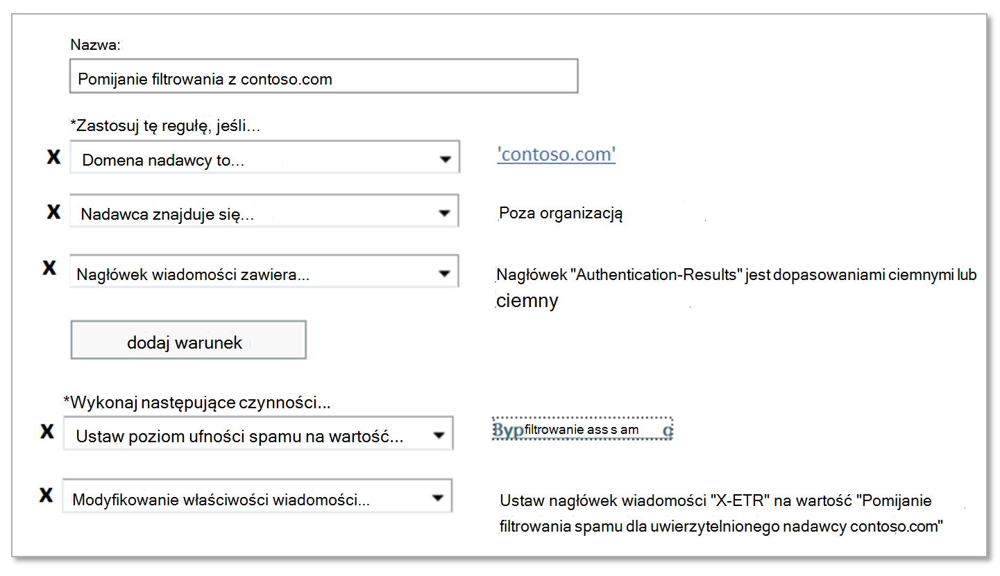

# Tworzenie bezpiecznych list nadawców w uchcie EOP

[!INCLUDE [Microsoft 365 Defender rebranding](../includes/microsoft-defender-for-office.md)]

**Dotyczy**
- [Exchange Online Protection](exchange-online-protection-overview.md)
- [Microsoft Defender dla Office 365 plan 1 i plan 2](defender-for-office-365.md)
- [Microsoft 365 Defender](../defender/microsoft-365-defender.md)

Jeśli jesteś klientem usługi Microsoft 365 ze skrzynkami pocztowymi w programie Exchange Online lub klientem autonomicznej usługi Exchange Online Protection (EOP) bez skrzynek pocztowych usługi Exchange Online, program EOP oferuje wiele sposobów zapewniania, że użytkownicy będą otrzymywać wiadomości e-mail od zaufanych nadawców. Te opcje to między Exchange reguł przepływu poczty e-mail (nazywanych także regułami transportu), nadawców poczty Outlook Sejf, listy dozwolonych adresów IP (filtrowania połączeń) oraz dozwolonych list nadawców lub dozwolonych list domen w zasadach ochrony przed spamem. Te opcje można zbiorczo określić jako listy _bezpiecznych nadawców_.

Dostępne listy bezpiecznych nadawców są opisane na poniższej liście w kolejności od najbardziej zalecanej do najmniej zalecanej:

1. Reguły przepływu poczty e-mail
2. Outlook Sejf nadawców
3. Lista zezwalań adresów IP (filtrowanie połączeń)
4. Listy dozwolonych nadawców lub dozwolonych domen (zasady ochrony przed spamem)

Reguły przepływu poczty e-mail zapewniają większą elastyczność w zakresie dozwolonych tylko odpowiednich wiadomości. Listy dozwolonych nadawców i dozwolonych domen w zasadach ochrony przed spamem nie są tak bezpieczne, jak lista dozwolonych adresów IP, ponieważ domena poczty e-mail nadawcy jest łatwo sfałszowana. Jednak lista adresów IP także stanowi ryzyko, ponieważ poczta e-mail z dowolnej  domeny wysyłanej z tego adresu IP ominie filtrowanie spamu.

> [!IMPORTANT]
>
> - Wiadomości zidentyfikowane jako złośliwe oprogramowanie lub wyłudzanie informacji o wysokiej pewności są zawsze pod kwarantanną niezależnie od opcji listy bezpiecznych nadawców, z których korzystasz. Aby uzyskać więcej informacji, zobacz [Domyślnie bezpieczne w aplikacji Office 365](secure-by-default.md).
>
> - Uważaj, aby dokładnie monitorować _wyjątki_ od filtrowania spamu za pomocą list bezpiecznych nadawców.
>
> - Listy bezpiecznych nadawców mogą pomóc w przypadku wyników fałszywie dodatnich (dobra wiadomość e-mail oznaczona jako zła), jednak należy rozważyć użycie list bezpiecznych nadawców jako tymczasowego rozwiązania, w miarę możliwości których należy unikać. Nie zalecamy zarządzania wyników fałszywie dodatnich za pomocą list bezpiecznych nadawców, ponieważ wyjątki od filtrowania spamu mogą otworzyć Twoją organizację na fałszowanie i inne ataki. Jeśli korzystasz z listy bezpiecznych nadawców do zarządzania wynikami fałszywie dodatnimi, musisz mieć ten temat na bieżąco i przygotować wiadomości i pliki do firmy [Microsoft](report-junk-email-messages-to-microsoft.md) .
>
> - Aby zezwolić domenie na wysyłanie nieuwierzytanych wiadomości e-mail (pomijanie ochrony przed fałszowaniem), ale bez pomijania ochrony przed spamem  i innymi zabezpieczeniami, możesz użyć szczegółowych informacji o analizie fałszowania oraz listy zezwalania[/](tenant-allow-block-list.md)blokowania dzierżawy.
>
> - Usługa EOP Outlook sprawdzić różne właściwości wiadomości w celu określenia nadawcy wiadomości. Aby uzyskać więcej informacji, zobacz [sekcję Uwagi dotyczące zbiorczego poczty e-mail](#considerations-for-bulk-email) w dalszej części tego artykułu.
>

Z kolei masz też kilka opcji blokowania wiadomości e-mail z określonych źródeł przy użyciu _list zablokowanych nadawców_. Aby uzyskać więcej informacji, zobacz [Tworzenie list zablokowanych nadawców w uchęce EOP](create-block-sender-lists-in-office-365.md).

## (Zalecane) Używanie reguł przepływu poczty e-mail

> [!NOTE]
> Nie można używać nagłówków wiadomości i reguł przepływu poczty do wyznaczania nadawcy wewnętrznego jako bezpiecznego nadawcy. Procedury w tej sekcji działają tylko dla nadawców zewnętrznych.

Reguły przepływu poczty w Exchange Online autonomicznej usługi EOP używają warunków i wyjątków do identyfikowania wiadomości oraz akcji w celu określenia, co należy zrobić z tymi wiadomościami. Aby uzyskać więcej informacji, zobacz [Reguły przepływu poczty e-mail (reguły transportu) w programie Exchange Online](/Exchange/security-and-compliance/mail-flow-rules/mail-flow-rules).

W poniższym przykładzie przyjęto, że aby pominąć filtrowanie spamu, contoso.com wiadomości e-mail z poczty e-mail. W tym celu skonfiguruj następujące ustawienia:

1. **Warunek**: **domena** \> **nadawcy jest contoso.com**\>.

2. Skonfiguruj następujące ustawienia:

   - **Warunek reguły przepływu poczty** **e-mail**\>: Nagłówek wiadomości zawiera **dowolny z tych wyrazów** \> **Nazwa** nagłówka: `Authentication-Results` \> **Wartość nagłówka**: `dmarc=pass` lub `dmarc=bestguesspass`.

     Ten warunek sprawdza stan uwierzytelniania poczty e-mail wysyłającej domeny poczty e-mail, aby upewnić się, że domena wysyłająca nie jest sfałszowana. Aby uzyskać więcej informacji na temat uwierzytelniania pocztą e-mail, [zobacz SPF](set-up-spf-in-office-365-to-help-prevent-spoofing.md), [DKIM](use-dkim-to-validate-outbound-email.md) i [DMARC](use-dmarc-to-validate-email.md).

   - **Lista adresów IP zezwalania**. Określ źródłowy adres IP lub zakres adresów w zasadach filtrowania połączenia.

     Użyj tego ustawienia, jeśli domena wysyłająca nie używa uwierzytelniania poczty e-mail. Najbardziej restrykcyjny, jeśli chodzi o źródłowe adresy IP na liście adresów IP. Zalecamy korzystanie z zakresu adresów IP o wartości /24 lub mniejszej (lepszych jest mniej). Nie używaj zakresów adresów IP, które należą do usług dla klientów outlook.com) ani infrastruktury udostępnionej.

   > [!IMPORTANT]
   >
   > - Nigdy nie konfiguruj reguł przepływu _poczty e-mail_ tylko z domeną nadawcy jako warunek, aby pominąć filtrowanie spamu. Spowoduje to znaczne  zwiększenie prawdopodobieństwa spoofingu wysyłającej domeny (lub podszywania się pod pełny adres e-mail), pominięcia wszystkich filtrów spamu i pominięcia testów uwierzytelniania nadawcy w celu wysłania wiadomości do skrzynki odbiorczej adresata.
   >
   > - Nie używaj domen, które posiadasz (nazywanych również zaakceptowanych domen) ani popularnych domen (na przykład microsoft.com) jako warunków w zasadach przepływu poczty e-mail. Takie działania są uznawane za bardzo ryzykowne, ponieważ stwarza możliwość wysyłania przez atakujących wiadomości e-mail, które w przeciwnym razie zostaną odfiltrowane.
   >
   > - Jeśli zezwalasz na adres IP, który znajduje się za bramą translacji adresów sieciowych (NAT), musisz znać serwery, które są związane z pulą translatora NAT, aby poznać zakres listy zezwalań na adresy IP. Adresy IP i uczestnicy NAT mogą się zmieniać. W ramach standardowych procedur konserwacji należy okresowo sprawdzać wpisy listy adresów IP listy zezwalań.

3. **Warunki opcjonalne**:
   - **Nadawca** \> **jest wewnętrzny/zewnętrzny** \> **Poza organizacją**: Ten warunek jest niejawny, ale można go użyć do uwzględnienia lokalnych serwerów poczty e-mail, które mogą nie być poprawnie skonfigurowane.
   - **Temat lub treść** \> **temat lub treść zawiera dowolny z tych wyrazów** \> \<keywords\>: Jeśli możesz dodatkowo ograniczyć wiadomości za pomocą słów kluczowych lub fraz w wierszu tematu lub treści wiadomości, możesz użyć tych wyrazów jako warunku.

4. **Akcja**: Skonfiguruj obie te akcje w regułę:
   1. **Modyfikowanie właściwości wiadomości** \> **ustawianie poziomu ufności filtru spamu** \> **Pomijanie filtrowania spamu**.
   2. **Modyfikowanie właściwości wiadomości** \> **ustaw nagłówek wiadomości**: **Ustaw nagłówek wiadomości** \<CustomHeaderName\> **na wartość** \<CustomHeaderValue\>.

      Na przykład `X-ETR: Bypass spam filtering for authenticated sender 'contoso.com'`. Jeśli reguła zawiera więcej niż jedną domenę, możesz odpowiednio dostosować tekst nagłówka.

      Gdy wiadomość pomija filtrowanie spamu ze względu na regułę przepływu poczty, `SFV:SKN` wartość jest stemplowana w nagłówku **X-Forefront-Antispam-Report** . Jeśli wiadomość pochodzi ze źródła, które znajduje się na liście adresów IP, ta wartość również `IPV:CAL` jest dodawana. Te wartości mogą pomóc w rozwiązywaniu problemów.

## Używanie Outlook Sejf nadawców

> [!CAUTION]
> Ta metoda stwarza duże ryzyko, że atakujący pomyślnie dostarczają wiadomości e-mail do Skrzynki odbiorczej, która w przeciwnym razie zostałaby przefiltrowana. Jednak listy nadawców i domen Sejf użytkowników nie zapobiegają filtrowaniu wiadomości wyłudzających informacje przy Sejf złośliwego oprogramowania ani wiadomości wyłudzających informacje o wysokiej pewności.

Zamiast ustawienia organizacyjnego użytkownicy lub administratorzy mogą dodawać adresy e-mail nadawców do listy Sejf nadawców w skrzynce pocztowej. Aby uzyskać instrukcje, [zobacz Konfigurowanie ustawień wiadomości-śmieci Exchange Online pocztowych w programie Office 365](configure-junk-email-settings-on-exo-mailboxes.md). Nie jest to potrzebne w większości sytuacji, ponieważ nadawcy pomijają części stosu filtrowania. Nadawca jest zaufany, ale i tak może zostać naruszony i wysłać złośliwą zawartość. Najlepiej jest pozwolić, aby nasze filtry sprawdzały każdą wiadomość i raportowały wynik fałszywie dodatni [/](report-junk-email-messages-to-microsoft.md) ujemny firmie Microsoft, jeśli nasze filtry się nie pomyliły. Pominięcie stosu filtrowania zakłóca również działanie [zap.](zero-hour-auto-purge.md)

Jeśli wiadomości pomijają filtrowanie spamu spowodowane listą nadawców w programie Sejf użytkownika, pole nagłówka **X-Forefront-Antispam-Report** `SFV:SFE`będzie zawierać wartość , co oznacza, że filtrowanie spamu, fałszowania i wyłudzania informacji zostało pominięte.

## Korzystanie z listy adresów IP

Jeśli nie możesz używać reguł przepływu poczty e-mail w sposób opisany wcześniej, najlepszą opcją jest dodanie źródłowego serwera lub serwerów poczty e-mail do listy adresów IP w zasadach filtru połączenia. Aby uzyskać szczegółowe informacje, [zobacz Konfigurowanie filtrowania połączeń w u usługi EOP](configure-the-connection-filter-policy.md).

**Uwagi**:

- Należy utrzymać minimalną liczbę dozwolonych adresów IP, dlatego unikaj używania całych zakresów adresów IP, gdy tylko jest to możliwe.
- Nie używaj zakresów adresów IP, które należą do usług dla klientów outlook.com) ani infrastruktury udostępnionej.
- Regularnie przejrzyj wpisy na liście adresów IP i usuń wpisy, które nie są już potrzebne.

> [!CAUTION]
> Bez dodatkowej weryfikacji, na przykład reguł przepływu poczty e-mail, wiadomości e-mail ze źródeł na liście adresów IP pomijają filtrowanie spamu i uwierzytelnianie nadawcy (SPF, DKIM, DMARC). Stwarza to duże ryzyko, że atakujący pomyślnie dostarczają wiadomości e-mail do Skrzynki odbiorczej, która w przeciwnym razie zostałaby przefiltrowana. Jednak lista adresów IP nie zapobiega filtrowaniu wiadomości wyłudzających informacje o złośliwym oprogramowaniu ani wiadomościach wyłudzających informacje o wysokiej pewności.

## Używanie dozwolonych list nadawców lub dozwolonych list domen

Najmniej pożądaną opcją jest użycie listy dozwolonych nadawców lub listy domen dozwolonych w zasadach ochrony przed spamem. Tej opcji należy unikać,  jeśli jest to możliwe, ponieważ nadawcy pomijają wszystkie zabezpieczenia przed spamem, fałszem i wyłudzaniem informacji oraz uwierzytelnianie nadawcy (SPF, DKIM, DMARC). Ta metoda jest najlepsza w przypadku tylko testów tymczasowych. Szczegółowe instrukcje można znaleźć w [temacie Konfigurowanie zasad ochrony przed spamem w umacie usługi EOP](configure-your-spam-filter-policies.md) .

Maksymalne ograniczenie dla tych list wynosi około 1000 wpisów. jednak w portalu będzie można wprowadzić tylko 30 wpisów. Aby dodać więcej niż 30 pozycji, należy użyć programu PowerShell.

> [!CAUTION]
>
> - Ta metoda stwarza duże ryzyko, że atakujący pomyślnie dostarczają wiadomości e-mail do Skrzynki odbiorczej, która w przeciwnym razie zostałaby przefiltrowana. dozwolonych nadawców lub dozwolonych domen nie zapobiega filtrowaniu wiadomości wyłudzających informacje przy dużej pewności.
>
> - Nie używaj domen, których jesteś właścicielem (nazywanych także zaakceptowanych domen) ani popularnych domen (na przykład microsoft.com) na listach dozwolonych domen.

## Zagadnienia dotyczące zbiorczej poczty e-mail

Standardowa wiadomość e-mail SMTP składa się z _koperty_ wiadomości i jej zawartości. Koperta wiadomości zawiera informacje wymagane do przekazywania i dostarczania wiadomości między serwerami SMTP. Zawartość wiadomości zawiera pola nagłówka wiadomości (zbiorczo _nazywane nagłówkiem_ wiadomości) i treść wiadomości. Koperta wiadomości jest opisana w dokumencie RFC 5321, a nagłówek wiadomości jest opisany w dokumencie RFC 5322. Adresaci nigdy nie widzą rzeczywistej koperty wiadomości, ponieważ jest generowana przez proces transmisji wiadomości i w rzeczywistości nie jest ona częścią wiadomości.

- Adres `5321.MailFrom` (znany także jako adres **MAIL FROM** , nadawca P1 lub nadawca koperty) to adres e-mail używany w transmisji SMTP wiadomości. Ten adres e-mail jest zwykle rejestrowany w polu nagłówka **return-ścieżka** w nagłówku wiadomości (chociaż nadawca może wyznaczyć inny adres **e-mail** ze ścieżką zwrotną). Jeśli nie można dostarczyć wiadomości, jest ona adresatem raportu o niedostarczeniu (nazywanego również wiadomością o niedostarczeniu lub wiadomością odsuń).
- Nadawca `5322.From` (nazywany również nadawcą Od lub P2) jest adresem e-mail w polu  nagłówka Od i jest adresem e-mail nadawcy wyświetlanym w klientach poczty e-mail.

Adresy i często są `5321.MailFrom` `5322.From` takie same (komunikacja między osobami). Jednak gdy wiadomości e-mail są wysyłane w imieniu innej osoby, adresy mogą być inne. Dzieje się tak najczęściej w przypadku zbiorczych wiadomości e-mail.

Załóżmy na przykład, że firma Blue Yonder Airlines zatrudniła usługę Podróż Margie'a, aby wysyłać jej wiadomości e-mail z ogłoszeniami. Wiadomość odbierana w Skrzynce odbiorczej ma następujące właściwości:

- Adres `5321.MailFrom` jest blueyonder.airlines@margiestravel.com.
- Adres `5322.From` jest blueyonder@news.blueyonderairlines.com, który jest Outlook.

Sejf listach nadawców i bezpiecznych domenach w zasadach ochrony przed spamem w uciekaniu tylko adresów usługi EOP `5322.From` jest to podobne do tych, które zastosowano do listy Outlook Sejf nadawców`5322.From`, który używa adresu.

Aby zapobiec filtrowaniu tego komunikatu, możesz wykonać następujące czynności:

- Dodaj blueyonder@news.blueyonderairlines.com (adres`5322.From`) jako nadawcę wiadomości Outlook Sejf nadawcy.
- [Użyj reguły przepływu poczty](#recommended-use-mail-flow-rules) e-mail z warunkiem, który wyszukuje wiadomości od blueyonder@news.blueyonderairlines.com ( `5322.From` adres, adres blueyonder.airlines@margiestravel.com (z `5321.MailFrom`) lub obu.
