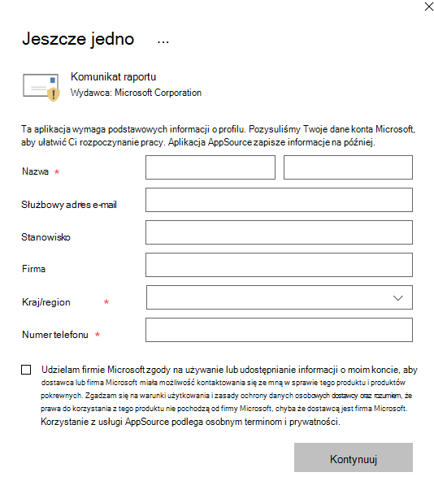
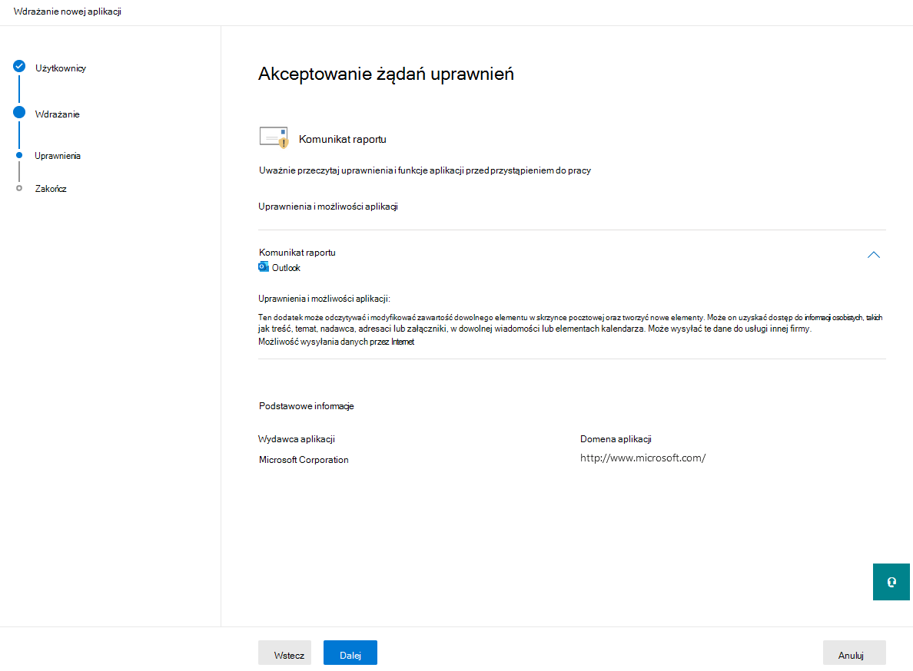
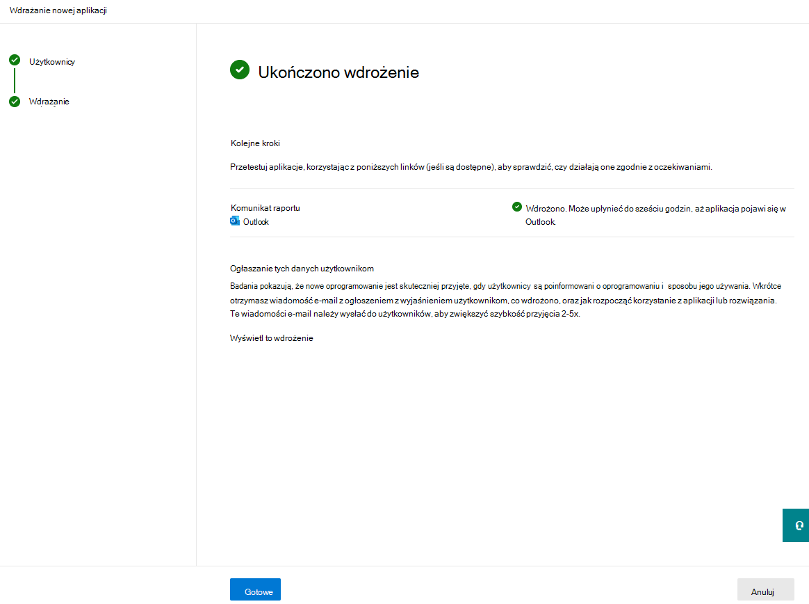
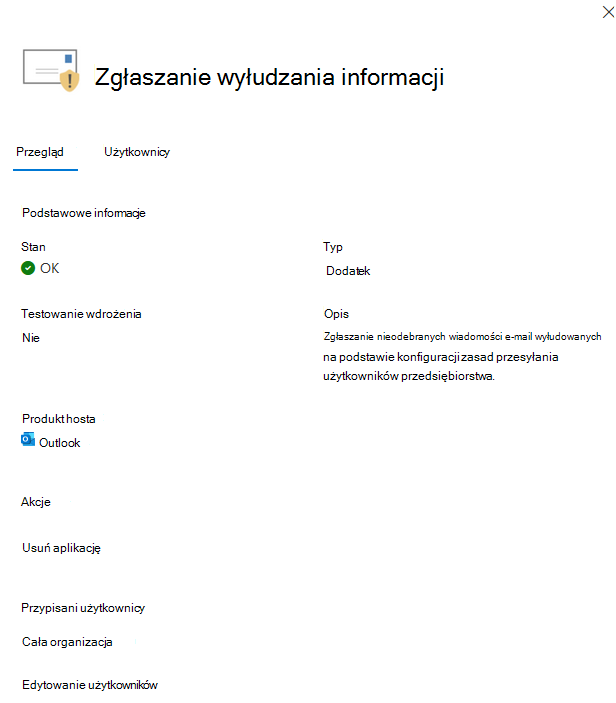

# <a name="enable-the-report-message-or-the-report-phishing-add-ins"></a>Włączanie dodatku Wiadomość raportu lub Wyłudzanie informacji

[!INCLUDE [Microsoft 365 Defender rebranding](../includes/microsoft-defender-for-office.md)]

**Dotyczy**
- [Exchange Online Protection](exchange-online-protection-overview.md)
- [Microsoft Defender dla Office 365 plan 1 i plan 2](defender-for-office-365.md)
- [Microsoft 365 Defender](../defender/microsoft-365-defender.md)

> [!NOTE]
> Jeśli jesteś administratorem w organizacji usługi Microsoft 365 ze skrzynkami pocztowymi usługi Exchange Online, zalecamy korzystanie ze strony Materiały w portalu Microsoft 365 Defender pocztowych. Aby uzyskać więcej informacji, zobacz Przesyłanie administratora w celu przesłania podejrzeń o [spam, wyłudzy, adresy URL i pliki do firmy Microsoft](admin-submission.md).

Dodatki Wiadomości i Wyłudzanie informacji raportu dla usług Outlook i Outlook w sieci Web (dawniej znanej jako Outlook Web App) ułatwiają zgłaszanie wyników fałszywie dodatnich (dobra wiadomość e-mail oznaczona jako zła) lub wyników fałszywie ujemnych (zła poczta e-mail dozwolona) firmie Microsoft i jej podmiotom stowarzyszonym w celu analizy.

Firma Microsoft korzysta z tych przesyłania w celu poprawy skuteczności technik ochrony poczty e-mail. Załóżmy na przykład, że ludzie zgłaszają wiele wiadomości za pomocą dodatku Wyłudzanie informacji raportów. Te informacje są pulpitu nawigacyjnego zabezpieczeń i innych raportów. Te informacje mogą wskazywać na konieczność zaktualizowania zasad ochrony przed wyłudzaniem informacji przez zespół zabezpieczeń organizacji.

Możesz zainstalować dodatek Report Message (Wiadomość raportu) lub Report Phishing (Wyłudzanie informacji). Jeśli chcesz, aby użytkownicy zgłaszali zarówno wiadomości spam, jak i wiadomości wyłudzące informacje, wdaj dodatek Zgłoś wiadomość w organizacji.

Dodatek Wiadomość raportu umożliwia zgłaszanie zarówno wiadomości spamu, jak i wiadomości wyłudzających informacje. Administratorzy mogą włączyć dodatek Wiadomość raportu dla organizacji, a poszczegłoni użytkownicy mogą zainstalować go dla siebie.

Dodatek Wyłudzanie informacji raportu umożliwia zgłaszanie tylko wiadomości wyłudzających informacje. Administratorzy mogą włączyć dodatek Wyłudzanie informacji dla organizacji, a poszczegłoni użytkownicy mogą zainstalować go dla siebie.

Jeśli jesteś użytkownikiem indywidualnym, możesz włączyć oba dodatki dla siebie.

Jeśli jesteś administratorem globalnym lub administratorem programu Exchange Online i Exchange skonfigurowano do korzystania z uwierzytelniania OAuth, możesz włączyć dodatek Wiadomość raportu i dodatek Wyłudzanie raportów dla organizacji. Oba dodatki są teraz dostępne za pośrednictwem [scentralizowanego wdrażania](../../admin/manage/centralized-deployment-of-add-ins.md).

## <a name="what-do-you-need-to-know-before-you-begin"></a>Co należy wiedzieć przed rozpoczęciem?

- Zarówno dodatek Report Message, jak i dodatek Report Phishing działają z Microsoft 365 subskrypcji i następujących produktów:
  - Outlook on the web
  - Outlook 2013 z dodatkiem SP1 lub nowszym
  - Outlook 2016 dla komputerów Mac
  - Outlook dołączone do Microsoft 365 dla Enterprise
  - Outlook dla systemów iOS i Android

- Oba dodatki nie są dostępne dla udostępnionych skrzynek pocztowych.

- Oba dodatki nie są dostępne dla lokalnych skrzynek Exchange pocztowych. 

- Istniejąca przeglądarka internetowa powinna działać zarówno w przypadku dodatków Report Message (Wiadomość raportu), jak i Wyłudzanie informacji (Report Phishing). Jeśli jednak zauważysz, że dodatek nie jest dostępny lub nie działa zgodnie z oczekiwaniami, spróbuj użyć innej przeglądarki.

- W przypadku instalacji organizacyjnych organizacja musi zostać skonfigurowana do korzystania z uwierzytelniania OAuth. Aby uzyskać więcej informacji, [zobacz Określanie](../../admin/manage/centralized-deployment-of-add-ins.md), czy scentralizowane wdrażanie dodatków jest danej organizacji.

- Administratorzy muszą być członkami grupy ról Administratorzy globalni. Aby uzyskać więcej informacji, [zobacz Uprawnienia w portalu Microsoft 365 Defender użytkowników](permissions-microsoft-365-security-center.md).

- Aby uzyskać więcej informacji na temat zgłaszania wiadomości za pomocą funkcji Komunikat raportu, zobacz Zgłaszanie wyników fałszywie dodatnich i ujemnych w [Outlook.](report-false-positives-and-false-negatives.md)

- Organizacje, które mają rozwiązanie do filtrowania adresów URL lub zabezpieczeń (takie jak serwer proxy i/lub zapora), muszą mieć dostęp do punktów końcowych programu ipagave.azurewebsites.net i outlook.office.com w przypadku protokołu HTTPS.

### <a name="turn-off-the-built-in-reporting-experience"></a>Wyłączanie wbudowanego środowisko raportowania

Nie zalecamy korzystania z wbudowanego środowiska raportowania w aplikacji Outlook ponieważ nie może on używać zasad [przesyłania użytkowników](./user-submission.md). Zamiast tego zalecamy użycie dodatku Wiadomość raportu lub dodatku Do wyłudzania informacji raportów.

Aby można było uruchomić to polecenie cmdlet, należy mieć przypisane odpowiednie uprawnienia. Aby znaleźć uprawnienia wymagane do uruchomienia dowolnego polecenia cmdlet lub parametru w organizacji, zobacz Znajdowanie uprawnień wymaganych do uruchamiania dowolnego Exchange [cmdlet](/powershell/exchange/find-exchange-cmdlet-permissions).

Uruchom następujące polecenie programu PowerShell, aby wyłączyć wbudowane środowisko raportowania:

```powershell
Set-OwaMailboxPolicy -Identity OwaMailboxPolicy-Default -ReportJunkEmailEnabled $false
```

## <a name="get-the-report-message-add-in"></a>Pobierz dodatek Wiadomość raportu

### <a name="get-the-report-message-add-in-for-yourself"></a>Pobierz dodatek Wiadomość raportu dla siebie

1. Przejdź do witryny Microsoft AppSource (Źródło Aplikacji) <https://appsource.microsoft.com/marketplace/apps> i wyszukaj dodatek Report Message (Wiadomość raportu). Aby przejść bezpośrednio do dodatku Wiadomość raportu, przejdź do do .<https://appsource.microsoft.com/product/office/wa104381180>

2. Kliknij **pozycję POBIERZ TERAZ**.

   

3. W wyświetlonym oknie dialogowym przejrzyj warunki użytkowania i zasady ochrony prywatności, a następnie kliknij przycisk **Kontynuuj**.

4. Zaloguj się przy użyciu konta służbowego (do użytku służbowego) lub konta Microsoft (do użytku osobistego).

Po zainstalowaniu i włączeniu dodatku zobaczysz następujące ikony:

- W Outlook ekranie ikona wygląda następująco:

    > [!div class="mx-imgBorder"]
    > 

- W Outlook w sieci Web ikona wygląda następująco:

    > [!div class="mx-imgBorder"]
    > 

### <a name="get-the-report-message-add-in-for-your-organization"></a>Uzyskiwanie dodatku Wiadomość raportu dla organizacji

> [!NOTE]
> Może upłynieć do 12 godzin, aż dodatek pojawi się w organizacji.

1. W [centrum administracyjne platformy Microsoft 365 przejdź](https://admin.microsoft.com/AdminPortal/Home?#/homepage) **do Ustawienia** \> **zintegrowanych aplikacji**. Kliknij **pozycję Pobierz aplikacje**.

    > [!div class="mx-imgBorder"]
    > 

2. Na **wyświetlonej Aplikacje Microsoft 365** kliknij w polu wyszukiwania, wprowadź tekst Wiadomość **raportu, a** następnie kliknij **ikonę**  Na liście wyników znajdź i wybierz pozycję **Zgłoś wiadomość**. 

3. Zostanie otwarta strona szczegółów aplikacji. Wybierz **pozycję Pobierz teraz**. 

    > [!div class="mx-imgBorder"]
    >   

4. Uzupełnij podstawowe informacje o profilu, a następnie kliknij przycisk **Kontynuuj**. 

    > [!div class="mx-imgBorder"]
    > 

5. Zostanie **otwarte okno wysuwu** Wdrażanie nowej aplikacji. Skonfiguruj następujące ustawienia. Kliknij **przycisk** Dalej, aby przejść do następnej strony w celu ukończenia konfiguracji. 

   - **Dodawanie użytkowników**: Wybierz jedną z następujących wartości:
     - **Tylko ja**
     - **Cała organizacja**
     - **Pojedyni użytkownicy/grupy**

   - **Wdrożenie**:
     - **Akceptowanie żądań uprawnień**: Przed rozpoczęciem pracy na następnej stronie uważnie przeczytaj uprawnienia i funkcje aplikacji.

        > [!div class="mx-imgBorder"]
        > 

     - **Zakończ wdrażanie**: Przejrzyj i zakończ wdrażanie dodatku. 
     - **Ukończono wdrażanie**: **Wybierz pozycję Gotowe** , aby ukończyć konfigurację. 

        > [!div class="mx-imgBorder"]
        > 

## <a name="edit-settings-for-the-report-message-add-in"></a>Edytowanie ustawień dodatku Wiadomość raportu

1. W centrum administracyjne platformy Microsoft 365 **przejdź do Ustawienia** \> **zintegrowanych aplikacji** \. Następnie znajdź i wybierz **dodatek Report Message** (Wiadomość raportu).

2. W wyświetlonym wysuwu wybierz pozycję **Edytuj użytkowników** , aby edytować ustawienia użytkownika.

    > [!div class="mx-imgBorder"]
    > 

3. Aby usunąć dodatek, wybierz pozycję Usuń aplikację  w **obszarze Akcje w** tym samym wysuwu. 

## <a name="get-the-report-phishing-add-in"></a>Pobierz dodatek Wyłudzanie informacji raportów

### <a name="get-the-report-phishing-add-in-for-yourself"></a>Pobierz dodatek Wyłudzanie informacji raportu dla siebie

1. Przejdź do witryny Microsoft AppSource i <https://appsource.microsoft.com/marketplace/apps> wyszukaj dodatek Wyłudzanie informacji raportów.

2. Kliknij **pozycję POBIERZ TERAZ**.

3. W wyświetlonym oknie dialogowym przejrzyj warunki użytkowania i zasady ochrony prywatności, a następnie kliknij przycisk **Kontynuuj**.

4. Zaloguj się przy użyciu konta służbowego (do użytku służbowego) lub konta Microsoft (do użytku osobistego).

Po zainstalowaniu i włączeniu dodatku zobaczysz następujące ikony:

- W Outlook ekranie ikona wygląda następująco:

  

- W Outlook w sieci Web ikona wygląda następująco:

    > [!div class="mx-imgBorder"]
    > 

### <a name="get-the-report-phishing-add-in-for-your-organization"></a>Pobierz dodatek Wyłudzanie informacji raportu dla organizacji

> [!NOTE]
> Może upłynieć do 12 godzin, aż dodatek pojawi się w organizacji.

1. W [centrum administracyjne platformy Microsoft 365 przejdź](https://admin.microsoft.com/AdminPortal/Home?#/homepage) **do Ustawienia** \> **zintegrowanych aplikacji**. Kliknij **pozycję Pobierz aplikacje**.

    > [!div class="mx-imgBorder"]
    > 

2. Na **wyświetlonej Aplikacje Microsoft 365** kliknij w polu wyszukiwania, wprowadź wyłudzanie informacji w raporcie **, a** następnie kliknij **ikonę**  Na liście wyników znajdź i wybierz pozycję Zgłoś **wyłudzanie informacji**. 
 
3. Zostanie otwarta strona szczegółów aplikacji. Wybierz **pozycję Pobierz teraz**.

4. Uzupełnij podstawowe informacje o profilu, a następnie kliknij przycisk **Kontynuuj**.

5. Zostanie **otwarte okno wysuwu** Wdrażanie nowej aplikacji. Wykonaj czynności opisane [powyżej, aby](enable-the-report-message-add-in.md#get-the-report-message-add-in-for-your-organization) ukończyć konfigurację. 

## <a name="edit-settings-for-the-report-phishing-add-in"></a>Edytowanie ustawień dodatku Wyłudzanie informacji raportów

1. W centrum administracyjne platformy Microsoft 365 **przejdź do Ustawienia** \> **zintegrowanych aplikacji** \. Następnie znajdź i wybierz  dodatek Wyłudzanie informacji w raporcie.

2. W wyświetlonym wysuwu wybierz pozycję **Edytuj użytkowników** , aby edytować ustawienia użytkownika.

    > [!div class="mx-imgBorder"]
    > 

3. Aby usunąć dodatek, wybierz pozycję Usuń aplikację  w **obszarze Akcje w** tym samym wysuwu. 
