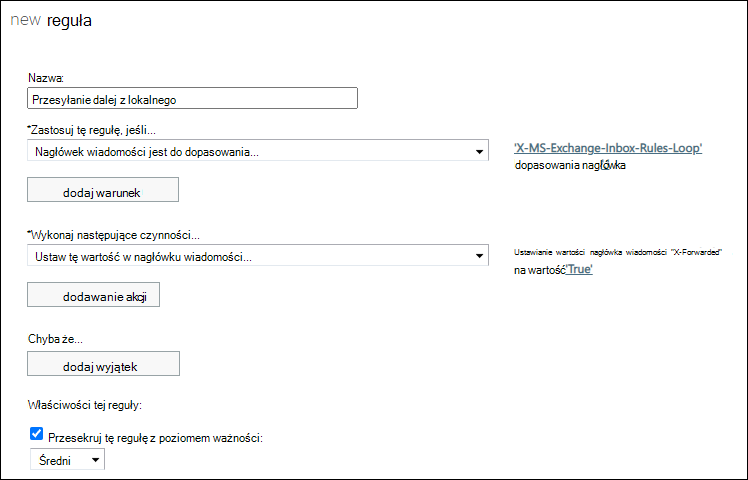

# Sterowanie automatycznym zewnętrznym przesyłaniem dalej wiadomości e-mail w Microsoft 365

[!INCLUDE [Microsoft 365 Defender rebranding](../includes/microsoft-defender-for-office.md)]

**Dotyczy**
- [Exchange Online Protection](exchange-online-protection-overview.md)
- [Microsoft Defender dla Office 365 plan 1 i plan 2](defender-for-office-365.md)
- [Microsoft 365 Defender](../defender/microsoft-365-defender.md)

Jako administrator możesz podlegać wymogom firmy w zakresie ograniczania lub sterowania automatycznie przesyłaną dalej wiadomością do adresatów zewnętrznych (adresatów spoza organizacji). Przesyłanie dalej wiadomości e-mail może być przydatne, ale może także stanowić zagrożenie bezpieczeństwa ze względu na możliwość ujawnienia informacji. Atakujący mogą używać tych informacji do ataków na Twoją organizację lub partnerów.

W programie Microsoft 365 są dostępne następujące typy automatycznego Microsoft 365:

- Użytkownicy mogą skonfigurować reguły [skrzynki odbiorczej tak](https://support.microsoft.com/office/c24f5dea-9465-4df4-ad17-a50704d66c59) , aby wiadomości przesyłane dalej automatycznie do nadawców zewnętrznych (celowo lub w wyniku naruszenia bezpieczeństwa konta).
- Administratorzy mogą skonfigurować przesyłanie [dalej skrzynek](/exchange/recipients-in-exchange-online/manage-user-mailboxes/configure-email-forwarding) pocztowych (nazywane także przesyłaniem _dalej SMTP_) w celu automatycznego przesyłania wiadomości dalej do adresatów zewnętrznych. Administrator może wybrać, czy chcesz po prostu przesyłać dalej wiadomości, czy przechowywać kopie wiadomości przesyłanych dalej w skrzynce pocztowej.

> [!NOTE]
> Użytkownicy, którzy mają automatyczne przesyłanie dalej z lokalnych systemów poczty e-mail za Microsoft 365 będą podlegali takim samym mechanizmom kontroli zasad jak skrzynki pocztowe w chmurze w nadchodzącej aktualizacji. Informacje o tej aktualizacji będą przekazywane za pośrednictwem wpisu w Centrum wiadomości.

Za pomocą zasad filtrowania spamu ruchu wychodzącego można sterować automatycznym przesyłaniem dalej do adresatów zewnętrznych. Dostępne są trzy ustawienia:

- **Automatyczne — sterowane przez system**: Automatyczne przekazywanie zewnętrzne jest zablokowane. Wewnętrzne automatyczne przesyłanie dalej wiadomości będzie nadal działać. Jest to ustawienie domyślne.
- **Wł**.: Automatyczne przekazywanie zewnętrzne jest dozwolone i nie jest ograniczone.
- **Wyłączone**: Automatyczne przekazywanie zewnętrzne jest wyłączone i spowoduje, że do nadawcy zostanie wyświetlony raport o niedostarczeniu (nazywany też raportem o niedostarczeniu lub wiadomością przesyłaną).

Aby uzyskać instrukcje dotyczące konfigurowania tych ustawień, zobacz Konfigurowanie filtrowania [spamu ruchu wychodzącego w u usługi EOP](configure-the-outbound-spam-policy.md).

> [!NOTE]
>
> - Wyłączenie automatycznego przesyłania dalej powoduje wyłączenie reguł skrzynki odbiorczej (użytkowników) i funkcji przesyłania dalej skrzynek pocztowych (administratorów), które przekierowują wiadomości do adresów zewnętrznych.
>
> - Ustawienia zasad filtrowania spamu ruchu wychodzącego nie mają wpływu na automatyczne przesyłanie dalej wiadomości między użytkownikami wewnętrznymi.

## Jak ustawienia zasad filtru spamu ruchu wychodzącego działają z innymi mechanizmami automatycznego przesyłania dalej poczty e-mail

Jako administrator możesz już skonfigurować inne kontrolki w celu zezwalania na automatyczne przesyłanie dalej poczty e-mail lub blokowania go. Przykład:

- [Domeny zdalne,](/exchange/mail-flow-best-practices/remote-domains/remote-domains) aby zezwolić na automatyczne przesyłanie dalej poczty e-mail do niektórych lub wszystkich domen zewnętrznych lub zablokować je.
- Warunki i akcje w Exchange [przepływu poczty e-mail](/exchange/security-and-compliance/mail-flow-rules/mail-flow-rules) (nazywane także regułami transportu) wykrywania i blokowania automatycznie przesyłanych wiadomości do adresatów zewnętrznych.

Ustawienia domeny zdalnej i reguły przepływu poczty e-mail są niezależne od ustawień w zasadach filtru spamu ruchu wychodzącego. Przykład:

- Zezwalasz na automatyczne przesyłanie dalej dla domeny zdalnej, ale blokujesz automatyczne przesyłanie dalej w zasadach filtru spamu ruchu wychodzącego. W tym przykładzie wiadomości automatycznie przekazywane dalej są blokowane.
- Możesz zezwolić na automatyczne przesyłanie dalej w zasadach filtru spamu ruchu wychodzącego, ale możesz używać reguł przepływu poczty e-mail lub ustawień domeny zdalnej do blokowania automatycznie przesyłanych dalej wiadomości e-mail. W tym przykładzie reguły przepływu poczty e-mail lub ustawienia domeny zdalnej będą blokować wiadomości automatycznie przekazywane dalej.

Ta niezależność funkcji umożliwia na przykład automatyczne przesyłanie dalej przychodzących zasad filtrowania spamu, ale za pomocą domen zdalnych steruje domenami zewnętrznymi, do których użytkownicy mogą przesyłać wiadomości dalej.

## Jak znaleźć użytkowników, którzy są automatycznie przesyłani dalej

W raporcie Automatyczne przesyłanie dalej wiadomości dla kont w chmurze są wyświetlane informacje o użytkownikach,  którzy automatycznie przesyłają dalej wiadomości do adresatów zewnętrznych. W przypadku użytkowników lokalnych, którzy automatycznie przesyłają dalej z ich lokalnych systemów poczty e-mail za pośrednictwem Microsoft 365, musisz utworzyć regułę przepływu poczty e-mail, aby śledzić tych użytkowników. Aby uzyskać instrukcje dotyczące tworzenia reguły przepływu poczty e-mail, zobacz Tworzenie reguły przepływu poczty [e-mail](/exchange/security-and-compliance/mail-flow-rules/manage-mail-flow-rules#use-the-eac-to-create-a-mail-flow-rule) przy użyciu Aplikacji EAC.

Poniższe informacje są wymagane do utworzenia reguły przepływu poczty e-mail w centrum Exchange administracyjnego:

- **Zastosuj tę regułę, jeśli** (warunek): **nagłówek wiadomości** \> **odpowiada tym wzorcom tekstu**. Może być konieczne kliknięcie **przycisku Więcej opcji w** celu zobaczenia tej opcji.
  - **Nazwa nagłówka**: `X-MS-Exchange-Inbox-Rules-Loop`
  - **Wartość nagłówka**: `.`

  Warunek wygląda następująco: **Nagłówek "X-MS-Exchange-Skrzynka odbiorcza-pętla-reguły"** odpowiada **"".**

  Ten warunek będzie odpowiadać dowolnej wartości nagłówka.

- (Opcjonalnie) **Wykonaj następujące (** działanie): Możesz skonfigurować akcję opcjonalną. Na przykład można użyć  \> akcji Modyfikuj właściwości wiadomości, aby ustawić nagłówek **wiadomości z nazwą** nagłówka **X-Forwarded** i wartością **Prawda**. Jednak skonfigurowanie akcji nie jest wymagane.
- Ustaw **inspekcję tego dziennika z poziomem ważności** do wartości **Niski**, **Średni** lub **Wysoki**. To ustawienie umożliwia uzyskiwanie szczegółowych informacji o [użytkownikach](view-email-security-reports.md#exchange-transport-rule-report) przesyłanych dalej Exchange raportu reguł transportu.

## Zablokowano przesyłanie dalej wiadomości e-mail

Jeśli wiadomość zostanie wykryta jako automatycznie przesyłana dalej, a zasady filtru [spamu](configure-the-outbound-spam-policy.md) ruchu wychodzącego blokują tę aktywność, wiadomość jest zwracana do nadawcy w komunikacie o niedostarczeniu, który zawiera następujące informacje:

`5.7.520 Access denied, Your organization does not allow external forwarding. Please contact your administrator for further assistance. AS(7555)`
