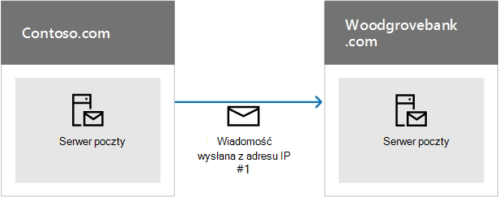
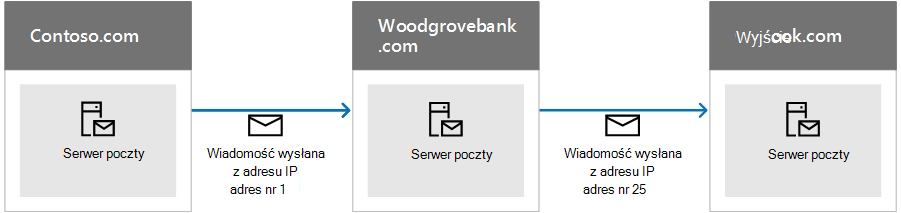

# <a name="how-microsoft-365-uses-sender-policy-framework-spf-to-prevent-spoofing"></a>Jak Microsoft 365 spf (Sender Policy Framework) w celu zapobiegania fałszowania

[!INCLUDE [Microsoft 365 Defender rebranding](../includes/microsoft-defender-for-office.md)]

**Dotyczy**
- [Exchange Online Protection](exchange-online-protection-overview.md)
- [Microsoft Defender dla Office 365 plan 1 i plan 2](defender-for-office-365.md)
- [Microsoft 365 Defender](../defender/microsoft-365-defender.md)

 **Podsumowanie:** W tym artykule opisano, Microsoft 365 rekord TXT SPF (Sender Policy Framework) w systemie DNS, aby zapewnić, że docelowe systemy poczty e-mail będą ufać wiadomościom wysyłanym z domeny niestandardowej. Dotyczy to poczty wychodzącej wysyłanej z usługi Microsoft 365. Wiadomości wysłane z Microsoft 365 do adresata w ramach Microsoft 365 zawsze będą przekazywać SPF.

Rekord TXT SPF to rekord DNS, który ułatwia zapobieganie fałszersce i wyłudzaniu informacji przez zweryfikowanie nazwy domeny, z której są wysyłane wiadomości e-mail. Spf sprawdza pochodzenie wiadomości e-mail, weryfikując adres IP nadawcy względem domniemanego właściciela domeny wysyłającej.

> [!NOTE]
> Typy rekordów SPF zostały wycofane przez internetowe siły inżynierskie (IETF) w 2014 roku. Zamiast tego upewnij się, że używasz rekordów TXT w systemie DNS w celu opublikowania informacji SPF. W dalszej części tego artykułu użyto terminu Rekord TXT SPF w celu zwiększenia przejrzystości.

Administratorzy domeny publikują informacje SPF w rekordach TXT w systemie DNS. Informacje SPF identyfikują autoryzowane serwery poczty wychodzącej. Docelowe systemy poczty e-mail sprawdzają, czy wiadomości pochodzą z autoryzowanych serwerów wychodzących poczty e-mail. Jeśli znasz już spf lub masz proste wdrożenie i po prostu chcesz wiedzieć, co należy uwzględnić w rekordzie TXT SPF w systemie DNS dla systemu Microsoft 365, możesz przejść do tematu Konfigurowanie spf w umacie [Microsoft 365](set-up-spf-in-office-365-to-help-prevent-spoofing.md), aby pomóc w zapobieganiu fałszersce. Jeśli nie masz wdrożenia, które jest w pełni hostowane w Microsoft 365, lub chcesz uzyskać więcej informacji na temat działania SPF lub rozwiązywania problemów z SPF for Microsoft 365, czytaj dalej.

> [!NOTE]
> Wcześniej trzeba było dodać inny rekord TXT SPF do domeny niestandardowej, jeśli był również używany SharePoint Online. Nie jest to już wymagane. Ta zmiana powinna zmniejszyć ryzyko, że SharePoint wiadomości z powiadomieniami online kończące się w folderze Wiadomości-śmieci. Nie musisz natychmiast wprowadzać żadnych zmian, ale jeśli zostanie wyświetlony błąd "zbyt wiele odnośników", zmodyfikuj rekord TXT SPF zgodnie z opisem w temacie Konfigurowanie rekordu SPF w programie [Microsoft 365](set-up-spf-in-office-365-to-help-prevent-spoofing.md) w celu zapobiegania fałszowania.

## <a name="how-spf-works-to-prevent-spoofing-and-phishing-in-microsoft-365"></a>Jak działa SPF w celu zapobiegania fałszowania i wyłudzania informacji w sieci Microsoft 365
<a name="HowSPFWorks"> </a>

Spf określa, czy nadawca może wysyłać wiadomości w imieniu domeny. Jeśli nadawca nie jest w stanie tego zrobić, oznacza to, że jeśli wiadomość e-mail nie sprawdzi rekordu SPF na serwerze odbieracym, zasady dotyczące spamu skonfigurowane na tym serwerze określają, co należy zrobić z wiadomością.

Każdy rekord TXT SPF zawiera trzy części: deklarację, że jest to rekord TXT SPF, adresy IP, które mogą wysyłać pocztę z Twojej domeny, i domeny zewnętrzne, które mogą być wysłane w imieniu Twojej domeny, oraz regułę wymuszania. Wszystkie trzy rekordy są potrzebne w prawidłowym rekordzie TXT SPF. W tym artykule opisano, jak tworzyć rekord TXT SPF i przedstawiono najlepsze rozwiązania dotyczące pracy z usługami w Microsoft 365. Dostępne są również linki do instrukcji dotyczących pracy ze swoim rejestratorem domen w celu opublikowania rekordu w systemie DNS.

### <a name="spf-basics-ip-addresses-allowed-to-send-from-your-custom-domain"></a>Podstawowe informacje o rekordach SPF: adresy IP, które można wysyłać z domeny niestandardowej
<a name="SPFBasicsIPaddresses"> </a>

Zobacz podstawową składnię reguły SPF:

v=spf1 \<IP\> \<enforcement rule\>

Załóżmy na przykład, że istnieje następująca reguła SPF dla contoso.com:

v=spf1 \<IP address #1\> \<IP address #2\> \<IP address #3\> \<enforcement rule\>

W tym przykładzie reguła SPF instruuje odbierający serwer poczty e-mail, aby akceptował pocztę tylko z tych adresów IP dla domeny contoso.com:

- Adres IP nr 1

- Adres IP nr 2

- Adres IP nr 3

Ta reguła SPF informuje odbierający serwer poczty e-mail, że jeśli wiadomość pochodzi z programu contoso.com, ale nie z jednego z tych trzech adresów IP, serwer odbierający powinien zastosować do wiadomości regułę wymuszania. Reguła wymuszania to zwykle jedna z tych opcji:

- **Trudno nie powieść się.** Oznacz wiadomość jako "trudno nieudaną" na kopercie wiadomości, a następnie postępuj zgodnie ze skonfigurowanymi przez serwer odbierający zasadami ochrony przed spamem dla tego typu wiadomości.

- **Miękkie niepowodzenie.** Oznacz wiadomość jako "miękką porażkę" na kopercie wiadomości. Serwery poczty e-mail są zwykle tak skonfigurowane, aby dostarczyć te wiadomości. Większość użytkowników końcowych nie widzi tego znacznika.

- **Neutralna.** Nie oznaczaj koperty wiadomości nic. Jest to zwykle zarezerwowane do celów testowych i jest rzadko używane.

Poniższe przykłady pokazują sposób działania SPF w różnych sytuacjach. W tych przykładach nadawcą contoso.com, a woodgrovebank.com adresatem.

### <a name="example-1-email-authentication-of-a-message-sent-directly-from-sender-to-receiver"></a>Przykład 1. Uwierzytelnianie wiadomości e-mail wysłanej bezpośrednio od nadawcy do odbiorcy
<a name="spfExample1"> </a>

Spf działa najlepiej, gdy ścieżka od nadawcy do odbiorcy jest bezpośrednia, na przykład:



Gdy woodgrovebank.com ten komunikat, jeśli adres IP nr 1 znajduje się w rekordzie TXT SPF dla usługi contoso.com, komunikat przejdzie sprawdzanie SPF i zostanie uwierzytelniony.

### <a name="example-2-spoofed-sender-address-fails-the-spf-check"></a>Przykład 2. Spoofed sender address fails the SPF check
<a name="spfExample2"> </a>

Załóżmy, że phisher znajduje sposób na sfałszowanie contoso.com:


Ponieważ adres IP nr 12 nie znajduje się w rekordzie SPF TXT firmy contoso.com, komunikat kończy się niepowodzeniem sprawdzania rekordu SPF, a adresat może oznaczyć go jako spam.

### <a name="example-3-spf-and-forwarded-messages"></a>Przykład 3. Spf i wiadomości przekazane
<a name="spfExample3"> </a>

Jedną z wad SPF jest to, że nie działa, gdy wiadomość e-mail została przesyłana dalej. Załóżmy na przykład, że woodgrovebank.com skonfiguruje regułę przesyłania dalej w celu wysyłania wszystkich wiadomości e-mail na outlook.com konto:



Wiadomość, która pierwotnie przekazuje sprawdzanie SPF w woodgrovebank.com, ale kończy się niepowodzeniem sprawdzania SPF w outlook.com, ponieważ ip #25 nie znajduje się w rekordzie TXT SPF firmy contoso.com. Outlook.com może następnie oznaczyć wiadomość jako spam. Aby rozwiązać ten problem, użyj funkcji SPF w połączeniu z innymi metodami uwierzytelniania pocztą e-mail, takimi jak DKIM i DMARC.

### <a name="spf-basics-including-third-party-domains-that-can-send-mail-on-behalf-of-your-domain"></a>Podstawy funkcji SPF: w tym domeny innych firm, które mogą wysyłać pocztę w imieniu Twojej domeny
<a name="SPFBasicsIncludes"> </a>

Oprócz adresów IP możesz również skonfigurować rekord TXT SPF tak, aby uwzględniał domeny jako nadawców. Są one dodawane do rekordu TXT SPF jako instrukcje "include". Na przykład contoso.com może obejmować wszystkie adresy IP serwerów poczty z usługi contoso.net i contoso.org, do których również należy. W tym celu contoso.com rekord TXT SPF, który wygląda następująco:

```text
v=spf1 include:contoso.net include:contoso.org -all
```

Gdy serwer odbierający widzi ten rekord w systemie DNS, wykonuje również odnośnik DNS dla rekordu SPF TXT dla contoso.net, a następnie dla contoso.org. Jeśli znajdzie dodatkowe instrukcje include w rekordach dla contoso.net lub contoso.org, także one będą na tej instrukcji postępować zgodnie z tym. Aby ułatwić zapobieganie atakom typu odmowę usługi, maksymalna liczba odnośników DNS dla jednej wiadomości e-mail wynosi 10. Każda instrukcja include odpowiada dodatkoweowi odnośnikowi DNS. Jeśli wiadomość przekracza limit 10, spf komunikatu kończy się niepowodzeniem. Gdy wiadomość osiągnie ten limit, w zależności od konfiguracji serwera odbieraącego, nadawca może otrzymać komunikat informujący, że wiadomość została wygenerowana "zbyt wiele odnośników" lub że "przekroczono maksymalną liczbę przeskoków dla wiadomości" (co może się zdarzyć, gdy pętla odnośników i przekracza limit czasu DNS). Aby uzyskać porady na temat tego, jak tego uniknąć, zobacz Rozwiązywanie problemów[: najlepsze rozwiązania dotyczące SPF w programie Microsoft 365](how-office-365-uses-spf-to-prevent-spoofing.md#SPFTroubleshoot).

## <a name="requirements-for-your-spf-txt-record-and-microsoft-365"></a>Wymagania rekordu TXT SPF i Microsoft 365
<a name="SPFReqsinO365"> </a>

Jeśli podczas jej Microsoft 365 skonfigurujemy pocztę, już został utworzony rekord TXT SPF, który identyfikuje serwery wiadomości firmy Microsoft jako wiarygodne źródło poczty dla Twojej domeny. Ten rekord prawdopodobnie wygląda następująco:

```text
v=spf1 include:spf.protection.outlook.com -all
```

Jeśli jesteś w pełni hostowany klient, to oznacza to, że nie masz żadnych lokalnych serwerów poczty e-mail, które wysyłają pocztę wychodzącą, jest to jedyny rekord TXT SPF, który musisz opublikować dla Office 365.

Jeśli masz wdrożenie hybrydowe (to oznacza, że niektóre skrzynki pocztowe są lokalne, a inne są hostowane w programie Microsoft 365) lub jeśli jesteś klientem autonomicznym usługi Exchange Online Protection (EOP), czyli Twoja organizacja korzysta z usługi EOP do ochrony lokalnych skrzynek pocztowych, musisz dodać adres IP ruchu wychodzącego dla każdego z lokalnych serwerów poczty brzegowej do rekordu TXT SPF w systemie DNS.

## <a name="form-your-spf-txt-record-for-microsoft-365"></a>Form your SPF TXT record for Microsoft 365
<a name="FormYourSPF"> </a>

Użyj informacji o składni w tym artykule, aby tworzyć rekordy TXT SPF dla domeny niestandardowej. Chociaż istnieją inne opcje składni, o których nie wspomniano, są to najczęściej używane opcje. Po formularzu rekordu musisz zaktualizować rekord u rejestratora domen.

Aby uzyskać informacje o domenach, które należy uwzględnić na potrzeby Microsoft 365, zobacz Zewnętrzne rekordy [DNS wymagane dla spf](../../enterprise/external-domain-name-system-records.md). Skorzystaj z [instrukcji krok po kroku dotyczących](../../admin/get-help-with-domains/create-dns-records-at-any-dns-hosting-provider.md#add-or-edit-an-spf-txt-record-to-help-prevent-email-spam-outlook-exchange-online) aktualizowania rekordów SPF (TXT) u rejestratora domen.

### <a name="spf-txt-record-syntax-for-microsoft-365"></a>Składnia rekordu TXT SPF dla Microsoft 365
<a name="SPFSyntaxO365"> </a>

Typowy rekord TXT SPF dla Microsoft 365 ma następującą składnię:

```text
v=spf1 [<ip4>|<ip6>:<IP address>] [include:<domain name>] <enforcement rule>
```

Przykład:

```text
v=spf1 ip4:192.168.0.1 ip4:192.168.0.2 include:spf.protection.outlook.com -all
```

gdzie:

- **Wymagane jest v=spf1** . Rekord TXT jest definiujący go jako rekord TXT SPF.

- **ip4** wskazuje, że używasz adresów IP w wersji 4. **ip6** wskazuje, że używasz adresów IP w wersji 6. Jeśli używasz adresów IP protokołu IPv6, zamień adres **ip4** na **ip6** w przykładach w tym artykule. Zakresy adresów IP można także określić przy użyciu notacji CIDR, na przykład **ip4:192.168.0.1/26**.

- _Adres IP_ to adres IP, który chcesz dodać do rekordu TXT SPF. Zazwyczaj jest to adres IP serwera poczty wychodzącej dla organizacji. Możesz wyświetlić listę wielu wychodzących serwerów poczty e-mail. Aby uzyskać więcej informacji, zobacz [Przykład: rekord TXT SPF dla wielu](how-office-365-uses-spf-to-prevent-spoofing.md#ExampleSPFMultipleMailServerO365) lokalnych serwerów poczty wychodzącej i Microsoft 365.

- _nazwa domeny_ to domena, którą chcesz dodać jako wiarygodnego nadawcę. Aby uzyskać listę nazw domen, które należy uwzględnić na potrzeby Microsoft 365, zobacz Zewnętrzne rekordy [DNS wymagane dla rekordu SPF](../../enterprise/external-domain-name-system-records.md).

- Reguła wymuszania to zwykle jedna z następujących czynności:

  - — all

    Wskazuje na trudny porażkę. Jeśli znasz wszystkie autoryzowane adresy IP dla Twojej domeny, wyekslij je w rekordzie TXT SPF i użyj kwalifikatora -all (hard fail). Ponadto, jeśli używasz tylko funkcji SPF, czyli nie używasz funkcji DMARC ani DKIM, należy użyć kwalifikatora -all. Zalecamy, aby zawsze używać tego kwalifikatora.

  - ~all

    Wskazuje na "miękkie niepowodzenie". Jeśli nie masz pewności, czy masz pełną listę adresów IP, użyj kwalifikatora ~all (soft fail). Ponadto, jeśli używasz funkcji DMARC z kwarantanną p=quarantine lub p=reject, możesz użyć funkcji ~all. W przeciwnym razie użyj funkcji -all.

  - ?all

    Wskazuje na neutralność. Jest on używany podczas testowania SPF. Nie zalecamy używania tego kwalifikatora w swoim wdrożeniu na żywo.

### <a name="example-spf-txt-record-to-use-when-all-of-your-mail-is-sent-by-microsoft-365"></a>Przykład: Rekord TXT SPF do użycia, gdy cała poczta jest wysyłana przez Microsoft 365
<a name="ExampleSPFNoSP"> </a>

Jeśli cała poczta jest wysyłana za pośrednictwem Microsoft 365, użyj jej w rekordzie TXT SPF:

```text
v=spf1 include:spf.protection.outlook.com -all
```

### <a name="example-spf-txt-record-for-a-hybrid-scenario-with-one-on-premises-exchange-server-and-microsoft-365"></a>Przykład: Rekord TXT SPF dla scenariusza hybrydowego z jedną lokalną Exchange Server i Microsoft 365
<a name="ExampleSPFHybridOneExchangeServer"> </a>

W środowisku hybrydowym, jeśli adres IP lokalnego serwera Exchange Server to 192.168.0.1, aby ustawić regułę wymuszania spf na trudny niepowodzenie, formuj rekord TXT SPF w następujący sposób:

```text
v=spf1 ip4:192.168.0.1 include:spf.protection.outlook.com -all
```

### <a name="example-spf-txt-record-for-multiple-outbound-on-premises-mail-servers-and-microsoft-365"></a>Przykład: Rekord TXT SPF dla wielu lokalnych serwerów poczty wychodzącej i Microsoft 365
<a name="ExampleSPFMultipleMailServerO365"> </a>

Jeśli masz wiele wychodzących serwerów poczty, dołącz adres IP każdego serwera poczty do rekordu TXT SPF i oddziel poszczególne adresy IP spacją i instrukcje "ip4:". Przykład:

```text
v=spf1 ip4:192.168.0.1 ip4:192.168.0.2 ip4:192.168.0.3 include:spf.protection.outlook.com -all
```

## <a name="next-steps-set-up-spf-for-microsoft-365"></a>Następne kroki: Konfigurowanie spf for Microsoft 365
<a name="SPFNextSteps"> </a>

Po sfałszowaniu rekordu TXT SPF wykonaj czynności opisane w temacie Konfigurowanie rekordu SPF w programie [Microsoft 365](set-up-spf-in-office-365-to-help-prevent-spoofing.md), aby zapobiec fałszowanie w celu dodania go do swojej domeny.

Mimo że spf jest przeznaczony do zapobiegania fałszersce, istnieją jednak techniki podszywania się, przed które spf nie chroni. Aby chronić się przed tymi ustawieniami, po skonfigurowaniu spf musisz również skonfigurować dla nich DKIM i DMARC Microsoft 365. Aby rozpocząć, zobacz Używanie funkcji DKIM do sprawdzania poprawności wychodzących wiadomości e-mail wysłanych z domeny [niestandardowej w Microsoft 365](use-dkim-to-validate-outbound-email.md). Następnie zobacz Używanie funkcji [DMARC do sprawdzania poprawności wiadomości e-mail Microsoft 365](use-dmarc-to-validate-email.md).

## <a name="troubleshooting-best-practices-for-spf-in-microsoft-365"></a>Rozwiązywanie problemów: najlepsze rozwiązania dotyczące SPF w programie Microsoft 365
<a name="SPFTroubleshoot"> </a>

Możesz utworzyć tylko jeden rekord TXT SPF dla swojej domeny niestandardowej. Utworzenie wielu rekordów powoduje zaokrąglaną sytuację, w której spf (SPF) nie powiedzie się. Aby tego uniknąć, możesz utworzyć osobne rekordy dla każdej poddomeny. Na przykład utwórz jeden rekord dla contoso.com, a drugi dla bulkmail.contoso.com.

Jeśli wiadomość e-mail powoduje więcej niż 10 odnośników DNS przed jej dostarczeniaą, odbierający serwer poczty odpowie z trwałym błędem, nazywanym także wartością  _permerror_, i spowoduje niepowodzenie sprawdzania rekordu SPF. Serwer odbierający może też odpowiedzieć raportem o niedostarczeniu (NDR, non-delivery report) zawierającym błąd podobny do następującego:

- Wiadomość przekroczyła liczbę przeskoków.

- Wiadomość wymagała zbyt wielu odnośników.

## <a name="avoiding-the-too-many-lookups-error-when-you-use-third-party-domains-with-microsoft-365"></a>Unikanie błędu "zbyt wiele odnośników" podczas używania domen innych firm z Microsoft 365
<a name="SPFTroubleshoot"> </a>

Niektóre rekordy TXT SPF dla domen innych firm kierują serwer odbierający do wykonywania dużej liczby odnośników DNS. Na przykład w czasie pisania ten artykuł zawiera Salesforce.com w swoim rekordzie 5 instrukcji:

```text
v=spf1 include:_spf.google.com
include:_spfblock.salesforce.com
include:_qa.salesforce.com
include:_spfblock1.salesforce.com
include:spf.mandrillapp.com mx ~all
```

Aby uniknąć tego błędu, możesz wdrożyć zasady, za pomocą których każda osoba wysyłająca masową pocztę e-mail będzie na przykład używać poddomeny specjalnie do tego celu. Następnie należy zdefiniować inny rekord TXT SPF dla poddomeny, która zawiera zbiorczą pocztę e-mail.

 W niektórych przypadkach, na przykład w przykładzie salesforce.com, musisz użyć domeny w rekordzie TXT SPF, ale w innych przypadkach inna podmiot mógł już utworzyć poddomenę, która będzie dla Ciebie używać w tym celu. Na przykład exacttarget.com utworzył poddomenę, która ma być potrzebna dla rekordu TXT SPF:

```text
cust-spf.exacttarget.com
```

Gdy do rekordu TXT SPF dołączasz domeny innych firm, musisz potwierdzić u tej innej firmy, której domeny lub poddomeny użyć, aby uniknąć konieczności używania limitu 10 odnośników.

## <a name="how-to-view-your-current-spf-txt-record-and-determine-the-number-of-lookups-that-it-requires"></a>Jak wyświetlić bieżący rekord TXT SPF i ustalić liczbę wymaganych odnośników
<a name="SPFTroubleshoot"> </a>

Za pomocą funkcji nslookup możesz wyświetlić rekordy DNS, w tym rekord TXT SPF. Dostępnych jest wiele bezpłatnych narzędzi online, których można użyć do wyświetlenia zawartości rekordu SPF TXT. Patrząc na rekord TXT SPF i zgodnie z łańcuchem instrukcji include i przekierowywania, możesz ustalić, ile odnośników DNS wymaga rekord. Niektóre narzędzia online zliczą i wyświetlą te wyszukiwania za Ciebie. Śledzenie tego numeru pomoże zapobiec wyzwalaniu przez wiadomości wysyłane z organizacji trwałego błędu, nazywanego błędem perm, z serwera odbieraącego.

## <a name="for-more-information"></a>Aby uzyskać więcej informacji
<a name="SPFTroubleshoot"> </a>

Potrzebujesz pomocy przy dodawaniu rekordu SPF TXT? Zapoznaj się z artykułem Tworzenie rekordów DNS dla usługi [Microsoft 365 dns](../../admin/get-help-with-domains/create-dns-records-at-any-dns-hosting-provider.md#add-or-edit-an-spf-txt-record-to-help-prevent-email-spam-outlook-exchange-online) w celu uzyskania szczegółowych informacji o używaniu struktury zasad dotyczących nadawców z domeną niestandardową w Microsoft 365. [Nagłówki wiadomości przed spamem](anti-spam-message-headers.md) zawierają składnię i pola nagłówków używane przez program Microsoft 365 do sprawdzania spf.
