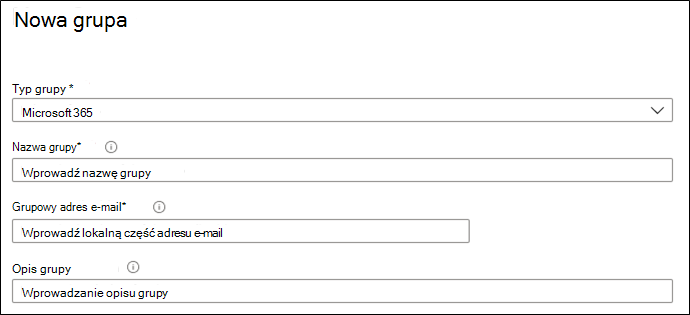

# Typowe zasady dostępu do urządzeń i tożsamości bez zaufania

W tym artykule opisano typowe zalecane zasady dostępu do urządzeń i tożsamości zerowego zaufania w celu zabezpieczania dostępu do usług Microsoft 365 w chmurze, w tym aplikacji lokalnych opublikowanych w programie proxy aplikacji usługi Azure Active Directory (Azure AD).

W tym przewodniku omówiono sposób wdrażania zalecanych zasad w nowo aprowizowanym środowisku. Skonfigurowanie tych zasad w osobnym środowisku laboratoryjnym umożliwia zrozumienie i ocenę zalecanych zasad przed stagowaniem procesu ich stosowania w środowiskach przedprodukcji i produkcji. Nowo aprowowane środowisko może być oparte na chmurze lub hybrydowe, aby odzwierciedlało Twoje potrzeby w zakresie oceny.

## Zestaw zasad

Na poniższym diagramie przedstawiono zalecany zestaw zasad. Pokazano w nim, której warstwy ochrony obowiązują poszczególne zasady, i czy zasady dotyczą komputerów PC, telefonów i tabletów, czy obu kategorii urządzeń. Ponadto wskazuje miejsce, w którym konfigurujesz te zasady.

:::image type="content" source="../../media/microsoft-365-policies-configurations/identity-device-access-policies-byplan.png" alt-text="Typowe zasady konfigurowania tożsamości zerowego zaufania i dostępu do urządzeń." lightbox="../../media/microsoft-365-policies-configurations/identity-device-access-policies-byplan.png":::

<!--

Here's a one-page PDF summary:

   [View as a PDF](../../downloads/MSFT-cloud-architecture-identity-device-protection-handout.pdf) \| [Download as a PDF](https://github.com/MicrosoftDocs/microsoft-365-docs/raw/public/microsoft-365/downloads/MSFT-cloud-architecture-identity-device-protection-handout.pdf)

--> 

W dalszej części tego artykułu opisano sposób konfigurowania tych zasad.

> [!NOTE]
> Wymaganie korzystania z uwierzytelniania wieloskładnikowego (MFA) jest zalecane przed zarejestrowaniem urządzeń w usłudze Intune w celu zapewnienia, że urządzenie znajduje się w posiadaniu zamierzonego użytkownika. Aby wymusić zasady zgodności urządzeń, musisz zarejestrować urządzenia w usłudze Intune.

Aby zapewnić Ci czas na wykonanie tych zadań, zalecamy zaimplementowanie zasad punktu początkowego w kolejności wymienionej w tej tabeli. Jednak zasady uwierzytelniania wieloskładnikowego dla przedsiębiorstw i wyspecjalizowane poziomy zabezpieczeń można zaimplementować w dowolnym momencie.

|Poziom ochrony|Policies (zasady)|Więcej informacji|Licencjonowanie|
|---|---|---|---|
|**Punkt początkowy**|[Wymagaj uwierzytelniania wieloskładnikowego, gdy ryzyko logowania *jest średnie* lub *wysokie*](#require-mfa-based-on-sign-in-risk)||Microsoft 365 E5 lub Microsoft 365 E3 pomocą dodatku E5 Security|
||[Blokowanie klientów, którzy nie obsługują nowoczesnego uwierzytelniania](#block-clients-that-dont-support-multi-factor)|Klienci, którzy nie używają nowoczesnego uwierzytelniania, mogą pominąć zasady dostępu warunkowego, dlatego należy je zablokować.|Microsoft 365 E3 lub E5|
||[Zmiana hasła przez użytkowników o wysokim poziomie ryzyka](#high-risk-users-must-change-password)|Wymusza na użytkownikach zmianę hasła podczas logowania się w przypadku wykrycia dla ich konta aktywności o wysokim poziomie ryzyka.|Microsoft 365 E5 lub Microsoft 365 E3 pomocą dodatku E5 Security|
||[Stosowanie ochrony danych zasad ochrony aplikacji (APP)](#apply-app-data-protection-policies)|One Intune App Protection policy per platform (Windows, iOS/iPadOS, Android).|Microsoft 365 E3 lub E5|
||[Wymaganie zatwierdzonych aplikacji i ochrony aplikacji](#require-approved-apps-and-app-protection)|Wymusza ochronę aplikacji mobilnej dla telefonów i tabletów za pomocą systemu iOS, iPadOS lub Android.|Microsoft 365 E3 lub E5|
|**Enterprise**|[Wymagaj uwierzytelniania wieloskładnikowego, gdy ryzyko logowania jest *niskie*, *średnie* lub *wysokie*](#require-mfa-based-on-sign-in-risk)||Microsoft 365 E5 lub Microsoft 365 E3 pomocą dodatku E5 Security|
||[Definiowanie zasad zgodności urządzeń](#define-device-compliance-policies)|Jedna zasada dla każdej platformy.|Microsoft 365 E3 lub E5|
||[Wymaganie zgodności komputerów i urządzeń przenośnych](#require-compliant-pcs-and-mobile-devices)|Wymusza zarządzanie usługą Intune zarówno na komputerach PC (Windows lub macOS), jak i na telefonach i tabletach (z systemem iOS, iPadOS lub Android).|Microsoft 365 E3 lub E5|
|**Wyspecjalizowane zabezpieczenia**|[*Zawsze wymagaj* uwierzytelniania wieloskładnikowego](#assigning-policies-to-groups-and-users)||Microsoft 365 E3 lub E5|

## Przypisywanie zasad do grup i użytkowników

Przed skonfigurowaniem zasad zidentyfikuj grupy usługi Azure AD, których używasz dla każdej warstwy ochrony. Zazwyczaj ochrona punktami początkowymi dotyczy wszystkich osób w organizacji. Użytkownik uwzględniony zarówno w celu ochrony punktu początkowego, jak i ochrony przedsiębiorstwa, będzie miał zastosowane wszystkie zasady punktu początkowego oraz zasady przedsiębiorstwa. Ochrona ma charakter skumulowany i są wymuszane najbardziej restrykcyjne zasady.

Zalecanym rozwiązaniem jest utworzenie grupy usługi Azure AD dla wykluczenia dostępu warunkowego. Dodaj tę grupę do wszystkich zasad dostępu warunkowego w ustawieniu  Wyklucz **ustawienie Użytkownicy** i grupy w **sekcji** Przydziały. Jest to metoda zapewnienia użytkownikowi dostępu podczas rozwiązywania problemów z dostępem. Jest to zalecane tylko jako rozwiązanie tymczasowe. Monitoruj tę grupę pod celu upewnienia się, że grupa wykluczeń jest używana tylko zgodnie z zamierzeniami.

Oto przykład przypisania grupy i wykluczeń, które wymagają uwierzytelniania MFA.

Oto wyniki:

- Wszyscy użytkownicy muszą korzystać z uwierzytelniania MFA, gdy ryzyko logowania jest średnie lub wysokie.

- Członkowie grupy personelu kierowniczego muszą korzystać z uwierzytelniania wieloskładnikowego, gdy ryzyko logowania jest niskie, średnie lub wysokie.

  W tym przypadku członkowie grupy Personelu kierowniczego są dopasowani zarówno do punktu początkowego, jak i do zasad dostępu warunkowego przedsiębiorstwa. Kontrolki dostępu dla obu zasad są łączone, co w tym przypadku jest równoważne z zasadami dostępu warunkowego przedsiębiorstwa.

- Członkowie grupy Top Secret Project X są zawsze wymagani do korzystania z uwierzytelniania wieloskładnikowego

  W tym przypadku członkowie grupy Top Secret Project X są dopasowani zarówno do punktu początkowego, jak i do wyspecjalizowanych zasad dostępu warunkowego. Kontrolki dostępu dla obu zasad są łączone. Ponieważ kontrolka dostępu do wyspecjalizowanych zasad dostępu warunkowego jest bardziej restrykcyjna, jest używana.

Podczas stosowania wyższych poziomów ochrony do grup i użytkowników należy zachować ostrożność. Na przykład członkowie grupy Top Secret Project X będą zobowiązani do używania uwierzytelniania wieloskładnikowego za każdym razem, gdy się zalogują, nawet jeśli nie pracują nad wyspecjalizowaną zawartością zabezpieczeń dla systemu Project X.

Wszystkie grupy usługi Azure AD utworzone w ramach tych zaleceń należy tworzyć jako Microsoft 365 grupy. Jest to ważne w przypadku wdrażania etykiet wrażliwości podczas zabezpieczania dokumentów w Microsoft Teams i SharePoint.

## Wymaganie uwierzytelniania wieloskładnikowego na podstawie ryzyka logowania

Użytkownicy powinni rejestrować się w celu uwierzytelniania WIELOSKŁADNIKowego przed koniecznością ich używania. Jeśli masz program Microsoft 365 E5, usługę Microsoft 365 E3 z dodatku Zabezpieczenia E5, usługę Office 365 z licencją EMS E5 lub indywidualne licencje programu Azure AD — wersja Premium P2, możesz użyć zasad rejestracji uwierzytelniania wieloskładnikowego z usługą Azure AD Identity Protection, aby wymagać od użytkowników zarejestrowania się w celu uwierzytelniania wieloskładnikowego. [Wymaganie wstępne obejmuje](identity-access-prerequisites.md) zarejestrowanie wszystkich użytkowników za pomocą uwierzytelniania MFA.

Po zarejestrowaniu użytkowników możesz wymagać uwierzytelniania MFA w celu logowania się przy użyciu nowych zasad dostępu warunkowego.

1. Przejdź do portalu [Azure Portal](https://portal.azure.com) i zaloguj się przy użyciu poświadczeń.
2. Na liście usług platformy Azure wybierz pozycję **Azure Active Directory**.
3. Na liście **Zarządzaj** wybierz pozycję **Zabezpieczenia**, a następnie wybierz pozycję **Dostęp warunkowy**.
4. Wybierz **pozycję Nowe** zasady i wpisz nazwę nowych zasad.

W poniższych tabelach opisano ustawienia zasad dostępu warunkowego wymagające uwierzytelniania MFA na podstawie ryzyka logowania.

W **sekcji Zadania** :

|Ustawienie|Właściwości|Wartości|Uwagi|
|---|---|---|---|
|Użytkownicy i grupy|Uwzględnij|**Wybierz użytkowników i grupy, > użytkowników i** grupy: Wybierz konkretne grupy zawierające konta użytkowników docelowych.|Zacznij od grupy, która obejmuje pilotażowe konta użytkowników.|
||Wyklucz|**Użytkownicy i grupy**: wybierz grupę wyjątków Dostęp warunkowy. kont usługi (tożsamości aplikacji).|Członkostwo należy modyfikować tymczasowo, gdy jest to konieczne.|
|Aplikacje lub akcje w chmurze|**Aplikacje w chmurze > Dołączanie**|**Wybierz aplikacje**: Wybierz aplikacje, do których chcesz zastosować te zasady. Na przykład wybierz pozycję Exchange Online.||
|Warunki|||Konfigurowanie warunków, które są specyficzne dla danego środowiska i potrzeb.|
||Ryzyko logowania||Zobacz wskazówki w poniższej tabeli.|

### Ustawienia warunków ryzyka logowania

Ustawienia poziomu ryzyka należy stosować w zależności od docelowego poziomu ochrony.

|Poziom ochrony|Wymagane wartości poziomu ryzyka|Akcja|
|---|---|---|
|Punkt początkowy|Wysoki, średni|Sprawdź oba te pola.|
|Enterprise|Wysoki, średni, niski|Sprawdź wszystkie trzy.|
|Wyspecjalizowane zabezpieczenia||Jeśli wszystkie opcje nie są zaznaczone, zawsze wymuszaj uwierzytelniania wieloskładnikowego.|

W sekcji **Kontrolki programu Access** :

|Ustawienie|Właściwości|Wartości|Akcja|
|---|---|---|---|
|Grant|**Grant access**||Wybieranie|
|||**Wymaganie uwierzytelniania wieloskładnikowego**|Czek|
||**Wymaganie wszystkich zaznaczonych kontrolek**||Wybieranie|

Wybierz **pozycję Wybierz** , aby zapisać **ustawienia Udzielanie** .

Na koniec wybierz pozycję **Włącz dla** **opcji Włącz zasady**, a następnie wybierz pozycję **Utwórz**.

Rozważ [też przetestowanie](/azure/active-directory/active-directory-conditional-access-whatif) zasad za pomocą narzędzia "Co zrobić".

## Blokowanie klientów, którzy nie obsługują wieloskładnikowego

Za pomocą ustawień w tych tabelach zasady dostępu warunkowego można blokować klientów, którzy nie obsługują uwierzytelniania wieloskładnikowego.

Zobacz [ten artykuł](../../enterprise/microsoft-365-client-support-multi-factor-authentication.md), aby uzyskać listę klientów w p Microsoft 365 które obsługują uwierzytelnianie wieloskładnikowe.

W **sekcji Zadania** :

|Ustawienie|Właściwości|Wartości|Uwagi|
|---|---|---|---|
|Użytkownicy i grupy|Uwzględnij|**Wybierz użytkowników i grupy, > użytkowników i** grupy: Wybierz konkretne grupy zawierające konta użytkowników docelowych.|Zacznij od grupy, która obejmuje pilotażowe konta użytkowników.|
||Wyklucz|**Użytkownicy i grupy**: wybierz grupę wyjątków Dostęp warunkowy. kont usługi (tożsamości aplikacji).|Członkostwo należy modyfikować tymczasowo, gdy jest to konieczne.|
|Aplikacje lub akcje w chmurze|**Aplikacje w chmurze > Dołączanie**|**Wybierz aplikacje**: Wybierz aplikacje odpowiadające klientom, którzy nie obsługują nowoczesnego uwierzytelniania.||
|Warunki|**Aplikacje klienckie**|Wybierz **pozycję Tak** dla ustawienia **Konfiguruj** 
 Wyczyszczenie znaczników wyboru dla **aplikacji przeglądarki** **i dla urządzeń przenośnych oraz klientów klasycznych**||

W sekcji **Kontrolki programu Access** :

|Ustawienie|Właściwości|Wartości|Akcja|
|---|---|---|---|
|Grant|**Blokuj dostęp**||Wybieranie|
||**Wymaganie wszystkich zaznaczonych kontrolek**||Wybieranie|

Wybierz **pozycję Wybierz** , aby zapisać **ustawienia Udzielanie** .

Na koniec wybierz pozycję **Włącz dla** **opcji Włącz zasady**, a następnie wybierz pozycję **Utwórz**.

Rozważ [przetestowanie zasad](/azure/active-directory/active-directory-conditional-access-whatif) za pomocą narzędzia Co zrobić.

Na Exchange Online można użyć zasad uwierzytelniania, aby wyłączyć uwierzytelnianie [podstawowe, które](/exchange/clients-and-mobile-in-exchange-online/disable-basic-authentication-in-exchange-online) wymusza na wszystkich żądaniach dostępu klienta używanie nowoczesnego uwierzytelniania.

## Zmiana hasła przez użytkowników o wysokim poziomie ryzyka

Aby zapewnić, że konta wszystkich użytkowników o wysokim poziomie ryzyka będą wymuszane do zmiany hasła podczas logowania się, należy zastosować poniższe zasady.

Zaloguj się do portalu [Microsoft Azure (https://portal.azure.com)za](https://portal.azure.com/) pomocą poświadczeń administratora, a następnie przejdź do usługi **Azure AD Identity Protection > zasad ryzyka użytkownika**.

W **sekcji Zadania** :

|Wpisać|Właściwości|Wartości|Akcja|
|---|---|---|---|
|Użytkownicy|Uwzględnij|**Wszyscy użytkownicy**|Wybieranie|
|Ryzyko użytkownika|**High (Wysoki)**||Wybieranie|

W drugiej **sekcji Zadań** :

|Wpisać|Właściwości|Wartości|Akcja|
|---|---|---|---|
|Access|**Zezwalaj na dostęp**||Wybieranie|
|||**Wymagaj zmiany hasła**|Czek|

Wybierz **pozycję Gotowe** , aby zapisać **ustawienia programu Access** .

Na koniec wybierz pozycję **Wł.** **dla opcji Wymuszaj zasady**, a następnie wybierz pozycję **Zapisz**.

Rozważ [przetestowanie zasad](/azure/active-directory/active-directory-conditional-access-whatif) za pomocą narzędzia Co zrobić.

Skorzystaj z tych zasad w połączeniu z konfigurowaniem ochrony hasłem usługi [Azure AD](/azure/active-directory/authentication/concept-password-ban-bad), która wykrywa i blokuje znane słabe hasła i ich warianty oraz dodatkowe warunki słabe specyficzne dla Twojej organizacji. Korzystanie z usługi Azure AD Password Protection gwarantuje, że zmienione hasła są silne.

## Stosowanie zasad ochrony danych aplikacji

Konta AP określają, które aplikacje są dozwolone, oraz akcje, które mogą być podejmowane wraz z danymi organizacji. Opcje dostępne w aplikacji umożliwiają organizacjom dostosowanie ochrony do określonych potrzeb. Dla niektórych nie jest wiadomo, które ustawienia zasad są wymagane do wdrożenia pełnego scenariusza. Aby ułatwić organizacjom priorytetyzowanie punktów końcowych klientów przenośnych, firma Microsoft wprowadziła taksonomię dla swojej struktury ochrony danych aplikacji dla systemów iOS i Android dotyczących zarządzania aplikacją mobilną.

Struktury ochrony danych aplikacji są zorganizowane na trzy osobne poziomy konfiguracji, a każdy poziom jest konfiguracyjnych na poprzednim poziomie:

- **Poziom 1. Enterprise ochrony** danych zapewnia, że aplikacje są chronione za pomocą numeru PIN i zaszyfrowane, oraz wykonuje operacje czyszczenia selektywnego. W przypadku urządzeń z systemem Android ten poziom sprawdza poprawność ateterów urządzeń z systemem Android. Jest to konfiguracja na poziomie wpisów, która zapewnia podobną kontrolę ochrony danych w Exchange Online skrzynce pocztowej i wprowadza do aplikacji APP funkcje IT i populacji użytkowników.
- **Poziom 2. Enterprise ochrony** danych wprowadza mechanizmy ochrony przed wyciekami danych aplikacji oraz minimalne wymagania dotyczące systemu operacyjnego. Jest to konfiguracja, która ma zastosowanie do większości użytkowników mobilnych, którzy mają dostęp do danych służbowych lub szkolnych.
- **Poziom 3. Enterprise ochrony** danych wprowadza zaawansowane mechanizmy ochrony danych, rozszerzoną konfigurację numeru PIN i obronę przed zagrożeniami w aplikacji mobilnej. Ta konfiguracja jest pożądana w przypadku użytkowników, którzy mają dostęp do danych wysokiego ryzyka.

Aby zapoznać się z konkretnymi zaleceniami dla poszczególnych poziomu konfiguracji i minimalnymi aplikacjami, które muszą być chronione, zapoznaj się z zasadami ochrony danych [przy użyciu zasad ochrony aplikacji](/mem/intune/apps/app-protection-framework).

Zgodnie z zasadami opisanymi w tece Zero Trust identity and [device access configurations](microsoft-365-policies-configurations.md) (Konfiguracje dostępu do urządzeń) warstwy punktu początkowego i Enterprise są blisko mapowane z ustawieniami rozszerzonej ochrony danych (poziom 2) dla przedsiębiorstw. Poziom specjalistycznej warstwy ochrony zabezpieczeń jest blisko ustawień poziomu 3 w przedsiębiorstwie o wysokim poziomie ochrony danych.

|Poziom ochrony|Zasady ochrony aplikacji|Więcej informacji|
|---|---|---|
|Punkt początkowy|[Ulepszona ochrona danych poziomu 2](/mem/intune/apps/app-protection-framework#level-2-enterprise-enhanced-data-protection)|Ustawienia zasad wymuszane na poziomie 2 obejmują wszystkie ustawienia zasad zalecane dla poziomu 1 i tylko dodają lub aktualizuje poniższe ustawienia zasad, aby wdrożyć więcej kontrolek i bardziej zaawansowaną konfigurację niż poziom 1.|
|Enterprise|[Ulepszona ochrona danych poziomu 2](/mem/intune/apps/app-protection-framework#level-2-enterprise-enhanced-data-protection)|Ustawienia zasad wymuszane na poziomie 2 obejmują wszystkie ustawienia zasad zalecane dla poziomu 1 i tylko dodają lub aktualizuje poniższe ustawienia zasad, aby wdrożyć więcej kontrolek i bardziej zaawansowaną konfigurację niż poziom 1.|
|Wyspecjalizowane zabezpieczenia|[Poziom 3. Ochrona danych wysokiego poziomu przedsiębiorstwa](/mem/intune/apps/app-protection-framework#level-3-enterprise-high-data-protection)|Ustawienia zasad wymuszane na poziomie 3 obejmują wszystkie ustawienia zasad zalecane dla poziomu 1 i 2 i tylko dodają lub aktualizuje poniższe ustawienia zasad, aby wdrożyć więcej kontrolek i bardziej zaawansowaną konfigurację niż poziom 2.|

Aby utworzyć nowe zasady ochrony aplikacji dla każdej platformy (w systemach iOS i Android) w obrębie systemu Microsoft Endpoint Manager przy użyciu ustawień struktury ochrony danych, możesz:

1. Ręcznie utwórz zasady, korzystając z procedury opisanej [w jak tworzyć](/mem/intune/apps/app-protection-policies) i wdrażać zasady ochrony aplikacji za pomocą Microsoft Intune.
2. Zaimportuj [przykładowe szablony JSON struktury konfiguracji](https://github.com/microsoft/Intune-Config-Frameworks/tree/master/AppProtectionPolicies) zasad ochrony aplikacji Intune za pomocą [skryptów programu PowerShell usługi Intune](https://github.com/microsoftgraph/powershell-intune-samples).

## Wymaganie zatwierdzonych aplikacji i ochrony aplikacji

Aby wymusić zasady ochrony aplikacji zastosowane w usłudze Intune, musisz utworzyć zasady dostępu warunkowego, aby wymagać zatwierdzonych aplikacji klienckich i warunków określonych w zasadach ochrony aplikacji.

Wymuszanie zasad ochrony aplikacji wymaga zestawu zasad opisanego w tece Wymaganie zasad ochrony aplikacji dla dostępu do aplikacji w chmurze [za pomocą dostępu warunkowego](/azure/active-directory/conditional-access/app-protection-based-conditional-access). Te zasady są zawarte w tym zalecanym zestawie zasad konfiguracji tożsamości i dostępu.

Aby utworzyć zasady dostępu warunkowego, które wymagają zatwierdzonych aplikacji i ochrony aplikacji, wykonaj czynności opisane w tece Wymagaj zatwierdzonych aplikacji klienckich lub zasad ochrony aplikacji na urządzeniach [przenośnych, co](/azure/active-directory/conditional-access/howto-policy-approved-app-or-app-protection#require-approved-client-apps-or-app-protection-policy-with-mobile-devices) zezwala tylko na dostęp do kont w aplikacjach mobilnych chronionych przez zasady ochrony aplikacji na dostęp do Microsoft 365 końcowych.

   > [!NOTE]
   > Te zasady zapewniają użytkownikom urządzeń przenośnych dostęp do wszystkich Microsoft 365 końcowych przy użyciu odpowiednich aplikacji.

Te zasady blokuje Exchange ActiveSync przenośnych z siecią Exchange Online. Można jednak utworzyć osobne zasady obsługi Exchange ActiveSync wszystkich urządzeniach. Aby uzyskać więcej informacji, zobacz [Blokowanie klientów protokołu ActiveSync](secure-email-recommended-policies.md#block-activesync-clients), co uniemożliwia Exchange ActiveSync klienci korzystający z uwierzytelniania podstawowego nie mogą się połączyć z Exchange Online. Te zasady nie są obrazowane na ilustracji u góry tego artykułu. Opisano ją i opisano w opisie zaleceń [dotyczących zasad dotyczących zabezpieczania poczty e-mail](secure-email-recommended-policies.md).

 Te zasady wykorzystują kontrolki przyznawania uprawnień [Wymagaj zatwierdzonej aplikacji klienckiej](/azure/active-directory/conditional-access/concept-conditional-access-grant#require-approved-client-app) i [Wymagaj zasad ochrony aplikacji](/azure/active-directory/conditional-access/concept-conditional-access-grant#require-app-protection-policy).

Ponadto blokowanie starszego uwierzytelniania dla innych aplikacji klienckich na urządzeniach z systemami iOS i Android zapewnia, że ci klienci nie mogą pomijać zasad dostępu warunkowego. Jeśli czytasz wskazówki z tego artykułu, oznacza to, że skonfigurowano już klientów blokowania, [którzy nie obsługują nowoczesnego uwierzytelniania](#block-clients-that-dont-support-multi-factor).

<!---
With Conditional Access, organizations can restrict access to approved (modern authentication capable) iOS and Android client apps with Intune app protection policies applied to them. Several Conditional Access policies are required, with each policy targeting all potential users. Details on creating these policies can be found in [Require app protection policy for cloud app access with Conditional Access](/azure/active-directory/conditional-access/app-protection-based-conditional-access).

1. Follow "Step 1: Configure an Azure AD Conditional Access policy for Microsoft 365" in [Scenario 1: Microsoft 365 apps require approved apps with app protection policies](/azure/active-directory/conditional-access/app-protection-based-conditional-access#scenario-1-office-365-apps-require-approved-apps-with-app-protection-policies), which allows Outlook for iOS and Android, but blocks OAuth capable Exchange ActiveSync clients from connecting to Exchange Online.

   > [!NOTE]
   > This policy ensures mobile users can access all Office endpoints using the applicable apps.

2. If enabling mobile access to Exchange Online, implement [Block ActiveSync clients](secure-email-recommended-policies.md#block-activesync-clients), which prevents Exchange ActiveSync clients leveraging basic authentication from connecting to Exchange Online.

   The above policies leverage the grant controls [Require approved client app](/azure/active-directory/conditional-access/concept-conditional-access-grant#require-approved-client-app) and [Require app protection policy](/azure/active-directory/conditional-access/concept-conditional-access-grant#require-app-protection-policy).

3. Disable legacy authentication for other client apps on iOS and Android devices. For more information, see [Block clients that don't support modern authentication](#block-clients-that-dont-support-modern-authentication).
-->

## Definiowanie zasad zgodności urządzeń

Zasady zgodności urządzeń określają wymagania, które muszą spełnić urządzenia, aby być określone jako zgodne. Zasady zgodności urządzeń usługi Intune tworzy się z poziomu Microsoft Endpoint Manager administracyjnego.

Należy utworzyć zasady dla każdej platformy komputera, telefonu lub tabletu:

- Administratora urządzenia z systemem Android
- Android Enterprise
- iOS/iPadOS
- macOS
- Windows 8.1 i nowsze
- Windows 10 lub nowszy

Aby utworzyć zasady zgodności urządzeń, zaloguj się do centrum administracyjnego usługi [Microsoft Endpoint Manager przy](https://endpoint.microsoft.com) użyciu poświadczeń administratora, a następnie przejdź do pozycji **Zasady** \> **zgodności urządzeń**\>. Wybierz **pozycję Utwórz zasady**.

Aby zasady zgodności urządzeń zostały wdrożone, muszą być przypisane do grup użytkowników. Zasady przypisuje się po ich utworzeniu i zapisaniu. W centrum administracyjnym wybierz zasady, a następnie wybierz **pozycję Zadania**. Po wybraniu grup, do których chcesz otrzymać zasady, wybierz pozycję Zapisz, aby zapisać przypisanie do grupy i wdrożyć zasady.

Aby uzyskać szczegółowe instrukcje dotyczące tworzenia zasad zgodności w usłudze Intune, zobacz Tworzenie  zasad zgodności Microsoft Intune w dokumentacji usługi Intune.

### Zalecane ustawienia dla systemu iOS

System iOS/iPadOS obsługuje kilka scenariuszy rejestracji, z których dwa są objęte tą strukturą:

- [Rejestracja urządzeń osobistych —](/mem/intune/enrollment/ios-enroll) te urządzenia są własnością osobistą i są używane zarówno do użytku służbowego, jak i osobistego.
- [Nadzorowana automatyczna rejestracja](/mem/intune/enrollment/device-enrollment-program-enroll-ios) urządzeń dla urządzeń firmowych — są one firmowe, skojarzone z jednym użytkownikiem i używane wyłącznie do użytku służbowego, a nie osobistego.

Framework konfiguracji zabezpieczeń systemu iOS/iPadOS jest zorganizowany w kilka różnych scenariuszy konfiguracji i zapewnia wskazówki dla urządzeń z własnością użytkownika i urządzeń nadzorowanych.

W przypadku urządzeń należących do użytkownika:

- Podstawowe zabezpieczenia (poziom 1) — firma Microsoft zaleca użycie tej konfiguracji jako minimalnej konfiguracji zabezpieczeń dla urządzeń osobistych, na których użytkownicy mają dostęp do danych służbowych lub szkolnych. Jest to wykonywane przez wymuszanie zasad haseł, cech blokowania urządzeń i wyłączanie niektórych funkcji urządzenia (takich jak niezaufane certyfikaty).
- Ulepszone zabezpieczenia (poziom 2) — firma Microsoft zaleca tę konfigurację w przypadku urządzeń, na których użytkownicy mają dostęp do informacji poufnych lub poufnych. Ta konfiguracja wprowadza mechanizmy kontroli udostępniania danych. Ta konfiguracja ma zastosowanie do większości użytkowników urządzeń przenośnych, którzy mają dostęp do danych służbowych lub szkolnych na urządzeniu.
- Wysoki poziom zabezpieczeń (poziom 3) — firma Microsoft zaleca tę konfigurację dla urządzeń używanych przez określonych użytkowników lub grupy o wyjątkowo wysokim poziomie ryzyka (użytkownicy, którzy przetwarzają bardzo poufne dane, gdy nieuprawnione ujawnienie powoduje znaczną utratę istotnych informacji w organizacji). Ta konfiguracja wymusza silniejsze zasady dotyczące haseł, wyłącza niektóre funkcje urządzeń i wymusza dodatkowe ograniczenia transferu danych.

W przypadku urządzeń nadzorowanych:

- Zabezpieczenia podstawowe (poziom 1) — firma Microsoft zaleca tę konfigurację jako minimalną konfigurację zabezpieczeń urządzeń nadzorowanych, na których użytkownicy mają dostęp do danych służbowych lub szkolnych. Jest to wykonywane przez wymuszanie zasad haseł, cech blokowania urządzeń i wyłączanie niektórych funkcji urządzenia (takich jak niezaufane certyfikaty).
- Ulepszone zabezpieczenia (poziom 2) — firma Microsoft zaleca tę konfigurację w przypadku urządzeń, na których użytkownicy mają dostęp do informacji poufnych lub poufnych. Ta konfiguracja wprowadza mechanizmy kontroli udostępniania danych i blokuje dostęp do urządzeń USB. Ta konfiguracja ma zastosowanie do większości użytkowników urządzeń przenośnych, którzy mają dostęp do danych służbowych lub szkolnych na urządzeniu.
- Wysoki poziom zabezpieczeń (poziom 3) — firma Microsoft zaleca tę konfigurację dla urządzeń używanych przez określonych użytkowników lub grupy o wyjątkowo wysokim poziomie ryzyka (użytkownicy, którzy przetwarzają bardzo poufne dane, gdy nieuprawnione ujawnienie powoduje znaczną utratę istotnych informacji w organizacji). W tej konfiguracji obowiązują silniejsze zasady dotyczące haseł, wyłączane są niektóre funkcje urządzeń, wymuszane są dodatkowe ograniczenia transferu danych i aplikacje muszą być instalowane za pośrednictwem programu zakupów wymaganych przy użyciu systemu firmy Apple (volume purchase program).

Zgodnie z zasadami opisanymi w tece Zero Trust identity and [device access configurations](microsoft-365-policies-configurations.md) (Konfiguracje dostępu do urządzeń) warstwy punktu początkowego i Enterprise są blisko mapowane z rozszerzonymi ustawieniami zabezpieczeń poziomu 2. Warstwa wyspecjalizowanej ochrony zabezpieczeń jest blisko odwętego od ustawień zabezpieczeń poziomu 3.

|Poziom ochrony  |Zasady dotyczące urządzeń |Więcej informacji  |
|---------|---------|---------|
|Punkt początkowy     |Ulepszone zabezpieczenia (poziom 2)         |Ustawienia zasad wymuszane na poziomie 2 obejmują wszystkie ustawienia zasad zalecane dla poziomu 1 i tylko dodają lub aktualizuje poniższe ustawienia zasad, aby wdrożyć więcej kontrolek i bardziej zaawansowaną konfigurację niż poziom 1.         |
|Enterprise     |Ulepszone zabezpieczenia (poziom 2)         |Ustawienia zasad wymuszane na poziomie 2 obejmują wszystkie ustawienia zasad zalecane dla poziomu 1 i tylko dodają lub aktualizuje poniższe ustawienia zasad, aby wdrożyć więcej kontrolek i bardziej zaawansowaną konfigurację niż poziom 1.         |
|Wyspecjalizowane zabezpieczenia     |Wysoki poziom zabezpieczeń (poziom 3)         |Ustawienia zasad wymuszane na poziomie 3 obejmują wszystkie ustawienia zasad zalecane dla poziomu 1 i 2 i tylko dodają lub aktualizuje poniższe ustawienia zasad, aby wdrożyć więcej kontrolek i bardziej zaawansowaną konfigurację niż poziom 2.         |

Aby zapoznać się z zaleceniami w zakresie zgodności z przepisami i ograniczeń urządzeń dla poszczególnych poziomu konfiguracji, zapoznaj się z zasadami konfiguracji zabezpieczeń systemu [iOS/iPadOS](/mem/intune/enrollment/ios-ipados-configuration-framework).

### Zalecane ustawienia dla systemu Android

System Android Enterprise obsługuje kilka scenariuszy rejestracji, z których dwa zostały uwzględnione w ramach tej struktury:

- [Profil Enterprise](/intune/android-work-profile-enroll) w Androidzie — ten model rejestracji jest zazwyczaj używany na urządzeniach należących do osoby, gdzie IT chce zapewnić wyraźny podział na granice między służbowym i osobistymi danymi. Zasady kontrolowane przez it zapewniają, że danych służbowych nie można przenieść do profilu osobistego.
- [Urządzenia Enterprise z systemem Android](/intune/android-fully-managed-enroll) — są to urządzenia należące do firmy, skojarzone z jednym użytkownikiem i używane wyłącznie do użytku służbowego, a nie osobistego.

Framework konfiguracji zabezpieczeń systemu Android Enterprise jest zorganizowana w kilka różnych scenariuszy konfiguracji, dostarczając wskazówek dotyczących profilu służbowego i w pełni zarządzanych scenariuszy.

W przypadku Enterprise profilów służbowych systemu Android:

- Ulepszone zabezpieczenia profilu służbowego (poziom 2) — firma Microsoft zaleca użycie tej konfiguracji jako minimalnej konfiguracji zabezpieczeń dla urządzeń osobistych, na których użytkownicy mają dostęp do danych służbowych lub szkolnych. Ta konfiguracja wprowadza wymagania dotyczące haseł, oddziela dane służbowe i osobiste oraz sprawdza poprawność atestacji urządzeń z systemem Android.
- Profil służbowy o wysokim poziomie zabezpieczeń (poziom 3) — firma Microsoft zaleca tę konfigurację dla urządzeń używanych przez określonych użytkowników lub grupy o wyjątkowo wysokim poziomie ryzyka (użytkownicy, którzy przetwarzają bardzo poufne dane, gdy nieuprawnione ujawnienie powoduje znaczną utratę istotnych informacji w organizacji). Ta konfiguracja wprowadza obronę przed zagrożeniami na urządzeniach przenośnych lub usługę Microsoft Defender for Endpoint, ustawia minimalną wersję systemu Android, forsuje silniejsze zasady dotyczące haseł oraz dodatkowo ogranicza pracę i osobiste wyciągi barwne.

W przypadku urządzeń Enterprise z systemem Android:

- W pełni zarządzane zabezpieczenia podstawowe (poziom 1) — firma Microsoft zaleca użycie tej konfiguracji jako minimalnej konfiguracji zabezpieczeń dla urządzenia przedsiębiorstwa. Ta konfiguracja ma zastosowanie do większości użytkowników mobilnych, którzy mają dostęp do danych służbowych lub szkolnych. Ta konfiguracja wprowadza wymagania dotyczące haseł, określa minimalną wersję systemu Android i podlega pewnym ograniczeniom urządzeń.
- W pełni zarządzane rozszerzone zabezpieczenia (poziom 2) — firma Microsoft zaleca tę konfigurację w przypadku urządzeń, na których użytkownicy mają dostęp do informacji poufnych lub poufnych. Ta konfiguracja powoduje, że zasady dotyczące haseł są silniejsze, a funkcje użytkownika/konta są wyłączane.
- W pełni zarządzane wysoki poziom zabezpieczeń (poziom 3) — firma Microsoft zaleca tę konfigurację dla urządzeń używanych przez określonych użytkowników lub grupy o wyjątkowo wysokim poziomie ryzyka (użytkownicy, którzy przetwarzają bardzo poufne dane, gdy nieuprawnione ujawnienie powoduje znaczną utratę istotnych informacji w organizacji). Ta konfiguracja zwiększa minimalną wersję systemu Android, wprowadza ochronę przed zagrożeniami na urządzeniach przenośnych lub usługę Microsoft Defender for Endpoint i wymusza dodatkowe ograniczenia dotyczące urządzeń.

Zgodnie z zasadami opisanymi w tece Zero Trust identity and [device access configurations](microsoft-365-policies-configurations.md) (Konfiguracje dostępu do urządzeń) warstwy początkowy i Enterprise ochrony są blisko mapowane na podstawowe zabezpieczenia poziomu 1 dla urządzeń należących do użytkownika i rozszerzone ustawienia zabezpieczeń poziomu 2 w pełni zarządzanych urządzeń. Warstwa wyspecjalizowanej ochrony zabezpieczeń jest blisko odwętego od ustawień zabezpieczeń poziomu 3.

W przypadku Enterprise profilów służbowych systemu Android:

|Poziom ochrony  |Zasady dotyczące urządzeń |Więcej informacji  |
|---------|---------|---------|
|Punkt początkowy     |Profil służbowy: Podstawowe zabezpieczenia (poziom 1)      |Nie dotyczy         |
|Enterprise     |Profil służbowy: Podstawowe zabezpieczenia (poziom 1)         |Nie dotyczy         |
|Punkt początkowy     |W pełni zarządzane: Rozszerzone zabezpieczenia (poziom 2)       |Ustawienia zasad wymuszane na poziomie 2 obejmują wszystkie ustawienia zasad zalecane dla poziomu 1 i tylko dodają lub aktualizuje poniższe ustawienia zasad, aby wdrożyć więcej kontrolek i bardziej zaawansowaną konfigurację niż poziom 1.         |
|Enterprise     |W pełni zarządzane: Rozszerzone zabezpieczenia (poziom 2)         |Ustawienia zasad wymuszane na poziomie 2 obejmują wszystkie ustawienia zasad zalecane dla poziomu 1 i tylko dodają lub aktualizuje poniższe ustawienia zasad, aby wdrożyć więcej kontrolek i bardziej zaawansowaną konfigurację niż poziom 1.         |
|Wyspecjalizowane zabezpieczenia     |Wysoki poziom zabezpieczeń (poziom 3)         |Ustawienia zasad wymuszane na poziomie 3 obejmują wszystkie ustawienia zasad zalecane dla poziomu 1 i 2 i tylko dodają lub aktualizuje poniższe ustawienia zasad, aby wdrożyć więcej kontrolek i bardziej zaawansowaną konfigurację niż poziom 2.         |

Aby zapoznać się z zaleceniami w zakresie zgodności z przepisami i ograniczeń urządzeń dla poszczególnych poziomów konfiguracji, zapoznaj się z zasadami Enterprise [konfiguracji zabezpieczeń systemu Android](/mem/intune/enrollment/android-configuration-framework).

### Zalecane ustawienia dla Windows 10 i nowszych

Poniższe ustawienia są zalecane dla komputerów z systemem Windows 10 i nowszych, skonfigurowanych w Kroku **2:** Ustawienia zgodności procesu tworzenia zasad.

Aby **sprawdzić kondycję > Windows reguł oceny** usług kondycji, zobacz tę tabelę.

|Właściwości|Value|Akcja|
|---|---|---|
|Wymagaj funkcji BitLocker|Wymagaj|Wybieranie|
|Wymagaj bezpiecznego rozruchu, aby było włączone na urządzeniu|Wymagaj|Wybieranie|
|Wymaganie integralności kodu|Wymagaj|Wybieranie|

W **przypadku właściwości urządzenia** określ odpowiednie wartości dla wersji systemu operacyjnego na podstawie zasad zabezpieczeń i IT.

Aby **Menedżer konfiguracji zgodności**, wybierz pozycję **Wymagaj**.

W **przypadku zabezpieczeń systemu** zobacz tę tabelę.

|Wpisać|Właściwości|Value|Akcja|
|---|---|---|---|
|Password (hasło)|Wymaganie hasła do odblokowywania urządzeń przenośnych|Wymagaj|Wybieranie|
||Proste hasła|Blokuj|Wybieranie|
||Typ hasła|Urządzenie domyślne|Wybieranie|
||Minimalna długość hasła|6|Wpisać|
||Maksymalna liczba minut braku aktywności przed wymaganego hasła|15|Wpisać 
 To ustawienie jest obsługiwane dla systemu Android w wersji 4.0 lub systemach KNOX 4.0 i starszych. W przypadku urządzeń z systemem iOS jest ona obsługiwana przez system iOS 8.0 lub wyżej.|
||Wygasanie hasła (dni)|41|Wpisać|
||Liczba poprzednich haseł w celu uniknięcia ponownego użycia|5|Wpisać|
||Wymagaj hasła, gdy urządzenie zwraca stan bezczynności (urządzenia przenośne i holograficzne)|Wymagaj|Dostępne dla Windows 10 lub nowszego|
|Szyfrowanie|Szyfrowanie magazynu danych na urządzeniu|Wymagaj|Wybieranie|
|Zabezpieczenia urządzenia|Zapora|Wymagaj|Wybieranie|
||Oprogramowanie antywirusowe|Wymagaj|Wybieranie|
||Ochrona przed złośliwym oprogramowaniem|Wymagaj|Wybieranie 
 To ustawienie wymaga oprogramowania szpiegującego zarejestrowanego w Zabezpieczenia Windows programie.|
|Defender for Cloud|Microsoft Defender Antimalware|Wymagaj|Wybieranie|
||Minimalna wersja programu Microsoft Defender w celu ochrony przed złośliwym oprogramowaniem||Wpisać 
 Obsługiwane tylko w przypadku Windows 10 komputera. Firma Microsoft zaleca, aby wersje najnowszej wersji nie zawierały więcej niż pięciu wersji.|
||Aktualny podpis w programie Microsoft Defender w celu ochrony przed złośliwym oprogramowaniem|Wymagaj|Wybieranie|
||Ochrona w czasie rzeczywistym|Wymagaj|Wybieranie 
 Obsługiwane tylko dla Windows 10 komputerów stacjonarnych i nowszych|

#### Ochrona punktu końcowego w usłudze Microsoft Defender

|Wpisać|Właściwości|Value|Akcja|
|---|---|---|---|
|Reguły programu Microsoft Defender dla punktu końcowego w centrum Microsoft Endpoint Manager administracyjnego|[Wymaganie, aby urządzenie było na poziomie lub poniżej wyniku ryzyka związanego z maszyną](/mem/intune/protect/advanced-threat-protection-configure#create-and-assign-compliance-policy-to-set-device-risk-level)|Średni|Wybieranie|

<!--
## Require compliant PCs (but not compliant phones and tablets)

Before adding a policy to require compliant PCs, be sure to enroll your devices for management in Intune. Using multi-factor authentication is recommended before enrolling devices into Intune for assurance that the device is in the possession of the intended user.

To require compliant PCs:

1. Go to the [Azure portal](https://portal.azure.com), and sign in with your credentials.
2. In the list of Azure services, choose **Azure Active Directory**.
3. In the **Manage** list, choose **Security**, and then choose **Conditional Access**.
4. Choose **New policy** and type the new policy's name.

5. Under **Assignments**, choose **Users and groups** and include who you want the policy to apply to. Also exclude your Conditional Access exclusion group.

6. Under **Assignments**, choose **Cloud apps or actions**.

7. For **Include**, choose **Select apps > Select**, and then select the desired apps from the **Cloud apps** list. For example, select Office 365. Choose **Select** when done.

8. To require compliant PCs (but not compliant phones and tablets), under **Assignments**, choose **Conditions > Device platforms**. Select **Yes** for **Configure**. Choose  **Select device platforms**, select **Yes** and select **Any device** and under Exclude select **iOS** and **Android**, and then choose **Done**.

9. Under **Access controls**, choose **Grant** .

10. Choose **Grant access** and then check **Require device to be marked as compliant**. For multiple controls, select **Require all the selected controls**. When complete, choose **Select**.

11. Select **On** for **Enable policy**, and then choose **Create**.

> [!NOTE]
> Make sure that your device is compliant before enabling this policy. Otherwise, you could get locked out and will be unable to change this policy until your user account has been added to the Conditional Access exclusion group.

--> 

## Wymaganie zgodności komputerów i urządzeń przenośnych

Aby wymagać zgodności dla wszystkich urządzeń:

1. Przejdź do portalu [Azure Portal](https://portal.azure.com) i zaloguj się przy użyciu poświadczeń.
2. Na liście usług platformy Azure wybierz pozycję **Azure Active Directory**.
3. Na liście **Zarządzaj** wybierz pozycję **Zabezpieczenia**, a następnie wybierz pozycję **Dostęp warunkowy**.
4. Wybierz **pozycję Nowe** zasady i wpisz nazwę nowych zasad.

5. W **obszarze Zadania** wybierz **pozycję Użytkownicy i** grupy i określ, do kogo chcesz zastosować zasady. Wyklucz także grupę wykluczeń dostępu warunkowego.

6. W **obszarze Zadania** wybierz aplikacje **lub akcje w chmurze**.

7. W **przypadku opcji** Dołącz wybierz **pozycję Wybierz > wybierz pozycję** Wybierz, a następnie wybierz odpowiednie aplikacje z listy **Aplikacje w** chmurze. Na przykład wybierz pozycję Office 365. Po **wybraniu przycisku** Wybierz po jego wybraniu.

8. W **obszarze Kontrolki programu Access** wybierz pozycję **U grant** .

9. Wybierz **pozycję Ułań dostęp** , a następnie zaznacz pole **wyboru Wymagaj oznaczania urządzenia jako zgodnego**. W przypadku wielu kontrolek zaznacz **pole wyboru Wymagaj wszystkich zaznaczonych kontrolek**. Po zakończeniu wybierz pozycję **Wybierz**.

10. Wybierz **pozycję Włącz** **dla opcji Włącz zasady**, a następnie wybierz pozycję **Utwórz**.

> [!NOTE]
> Przed włączeniem tych zasad upewnij się, że Twoje urządzenie jest zgodne. W przeciwnym razie możesz zablokować konto i nie będzie można zmienić tych zasad, dopóki Twoje konto użytkownika nie zostanie dodane do grupy wykluczeń dostępu warunkowego.

## Następny krok

[Dowiedz się więcej o zaleceniach dotyczących zasad dla gości i użytkowników zewnętrznych](identity-access-policies-guest-access.md)
