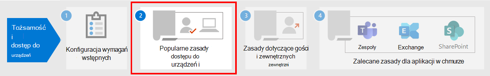

# Wymagania wstępne dotyczące wdrażania zasad dostępu do urządzeń i tożsamości zerowego zaufania

W tym artykule opisano wymagania wstępne, których administratorzy muszą spełnić, aby użyć zalecanych zasad dostępu do urządzeń i tożsamości zerowego zaufania oraz korzystania z dostępu warunkowego. Omówiono w nim również zalecane ustawienia domyślne dotyczące konfigurowania platform klienckich w celu najlepszego logowania jednokrotnego (SSO).

## Wymagania wstępne

Przed użyciem zalecanych zasad dostępu do urządzeń i tożsamości bez zaufania Twoja organizacja musi spełniać wymagania wstępne. Wymagania te różnią się w przypadku różnych wymienionych modeli tożsamości i uwierzytelniania:

- Tylko w chmurze
- Tryb hybrydowy z uwierzytelnianiem synchronizacji skrótów haseł (PHS)
- Tryb hybrydowy z uwierzytelnianiem pass-through (PTA)
- Federowany

W poniższej tabeli przedstawiono wstępnie wymagane funkcje i ich konfigurację, które mają zastosowanie do wszystkich modeli tożsamości, z wyjątkiem przypadków wspomniano.

|Konfiguracja|Wyjątki|Licencjonowanie|
|---|:---:|---|
|[Konfigurowanie phs](/azure/active-directory/hybrid/how-to-connect-password-hash-synchronization).  To musi być włączone, aby wykrywać wyciekające poświadczenia i działać na nich w celu dostępu warunkowego opartego na czynniku ryzyka. **Uwaga:** Jest to wymagane niezależnie od tego, czy w organizacji jest używane uwierzytelnianie federowane.|Tylko w chmurze|Microsoft 365 E3 lub E5|
|[Włącz bezproblemowe logowanie pojedyncze,](/azure/active-directory/connect/active-directory-aadconnect-sso) aby automatycznie logować użytkowników, gdy znajdują się na swoich urządzeniach organizacji połączonych z twoją siecią organizacji.|Tylko w chmurze i federacyjnie|Microsoft 365 E3 lub E5|
|[Konfigurowanie nazwanych lokalizacji](/azure/active-directory/reports-monitoring/quickstart-configure-named-locations). Usługa Azure AD Identity Protection zbiera i analizuje wszystkie dostępne dane sesji w celu wygenerowania wyniku ryzyka. Zalecamy określenie zakresów publicznych adresów IP organizacji dla sieci w konfiguracji nazwanych lokalizacji usługi Azure AD. Ruchowi pochodzącemu z tych zakresów jest nadany wynik zmniejszonego ryzyka, a ruch spoza środowiska organizacji jest o wyższym poziomie ryzyka.||Microsoft 365 E3 lub E5|
|[Zarejestruj wszystkich użytkowników w celu samodzielnego resetowania hasła (SSPR) i uwierzytelniania wieloskładnikowego (MFA).](/azure/active-directory/authentication/concept-registration-mfa-sspr-converged) Zalecamy zarejestrowanie użytkowników w usłudze Azure AD Multifactor Authentication wcześniej. Usługa Azure AD Identity Protection używa usługi Azure AD Multifactor Authentication w celu przeprowadzenia dodatkowej weryfikacji zabezpieczeń. Ponadto, aby uzyskać najlepsze środowisko logowania, zalecamy użytkownikom zainstalowanie aplikacji Microsoft Authenticator i aplikacji  Microsoft Portal firmy na ich urządzeniach. Można je zainstalować ze sklepu z aplikacjami dla każdej platformy.||Microsoft 365 E3 lub E5|
|[Włącz automatyczną rejestrację urządzeń dla komputerów Windows przyłączone do domeny](/azure/active-directory/active-directory-conditional-access-automatic-device-registration-setup). Dostęp warunkowy zapewnia, że urządzenia łączące się z aplikacjami są przyłączone do domeny lub zgodne. Aby można było obsługiwać tę Windows komputerach, urządzenie musi być zarejestrowane w usłudze Azure AD.  W tym artykule omówiono sposób konfigurowania automatycznej rejestracji urządzeń.|Tylko w chmurze|Microsoft 365 E3 lub E5|
|**Przygotuj zespół pomocy technicznej**. Miej plan w miejscu dla użytkowników, którzy nie mogą ukończyć uwierzytelniania MFA. Może to oznaczać dodanie ich do grupy wykluczeń zasad lub zarejestrowanie dla nich nowych informacji uwierzytelniania wieloskładnikowego. Przed wprowadzeniem jednej z tych zmian, które dotyczą zabezpieczeń, należy się upewnić, że rzeczywisty użytkownik żąda zmiany. Wymaganie od menedżerów użytkowników pomocy w zatwierdzaniu to skuteczny krok.||Microsoft 365 E3 lub E5|
|[Skonfiguruj pisanie zwrotne haseł w lokalnej u usługi AD](/azure/active-directory/active-directory-passwords-getting-started). Funkcja zapisu hasła umożliwia usłudze Azure AD wymaganie od użytkowników zmiany haseł lokalnych w przypadku wykrycia zagrożenia bezpieczeństwa konta. Tę funkcję możesz włączyć przy użyciu usługi Azure AD Połączenie na jeden z dwóch sposobów: włącz funkcję  zapisu hasła na ekranie funkcji opcjonalnych konfiguracji usługi Azure AD Połączenie lub włącz ją za pośrednictwem Windows PowerShell.|Tylko w chmurze|Microsoft 365 E3 lub E5|
|[Konfigurowanie ochrony hasłem usługi Azure AD](/azure/active-directory/authentication/concept-password-ban-bad). Usługa Azure AD Password Protection wykrywa i blokuje znane słabe hasła i ich warianty, a także może zablokować dodatkowe słabe terminy specyficzne dla Twojej organizacji. Domyślne globalne listy zablokowanych haseł są automatycznie stosowane do wszystkich użytkowników w dzierżawie usługi Azure AD. Możesz zdefiniować dodatkowe wpisy na niestandardowej liście zablokowanych haseł. Gdy użytkownicy zmieniają lub resetują swoje hasła, te listy zablokowanych haseł są sprawdzane, aby wymusić stosowanie silnych haseł.||Microsoft 365 E3 lub E5|
|[Włącz Azure Active Directory tożsamości](/azure/active-directory/identity-protection/overview-identity-protection). Usługa Azure AD Identity Protection umożliwia wykrywanie potencjalnych luk w zabezpieczeniach tożsamości organizacji i konfigurowanie automatycznych zasad rozwiązywania problemów na niskie, średnie i wysokie ryzyko związane z logowaniem oraz ryzyko użytkownika.||Microsoft 365 E5 lub Microsoft 365 E3 pomocą dodatku E5 Security|
|**Włącz nowoczesne uwierzytelnianie** [na Exchange Online](/Exchange/clients-and-mobile-in-exchange-online/enable-or-disable-modern-authentication-in-exchange-online) dla usługi [Skype dla firm Online](https://social.technet.microsoft.com/wiki/contents/articles/34339.skype-for-business-online-enable-your-tenant-for-modern-authentication.aspx). Nowoczesne uwierzytelnianie jest wymaganiem wstępnym dla korzystania z uwierzytelniania wieloskładnikowego. Nowoczesne uwierzytelnianie jest domyślnie włączone dla klientów Office 2016 i 2019, klientów SharePoint i OneDrive dla Firm.||Microsoft 365 E3 lub E5|
|[Włącz funkcję oceny dostępu ciągłego](microsoft-365-continuous-access-evaluation.md) dla usługi Azure AD. Ciągłe ocenianie dostępu proaktywnie kończy aktywne sesje użytkowników i wymusza zmiany zasad dzierżawy w niedalekiej czasie rzeczywistym.||Microsoft 365 E3 lub E5|
|

## Zalecane konfiguracje klienta

W tej sekcji opisano domyślne konfiguracje klienta platformy, zalecane jest zapewnienie użytkownikom najlepszego środowisko logowania jednokrotnego, a także wymagań wstępnych dla dostępu warunkowego.

### Windows urządzenia

Zalecamy korzystanie Windows 11 lub Windows 10 (wersja 2004 lub nowsza), ponieważ platforma Azure została zaprojektowana tak, aby zapewnić najsłanniejsze środowisko logowania jednokrotnego możliwe zarówno w środowisku lokalnym, jak i w usłudze Azure AD. Urządzenia służbowe powinny być skonfigurowane tak, aby bezpośrednio dołączały do usługi Azure AD lub jeśli organizacja korzysta z lokalnego sprzężenia z domeną usługi AD, te urządzenia powinny być skonfigurowane w taki sposób, aby były automatycznie i dyskretnie rejestrowane w usłudze [Azure AD](/azure/active-directory/active-directory-conditional-access-automatic-device-registration-setup).

W przypadku Windows byOD użytkownicy mogą używać funkcji **Dodaj konto służbowe**. Użytkownicy przeglądarki Google Chrome na urządzeniach z systemem Windows Windows 11 lub Windows 10 muszą zainstalować rozszerzenie, aby uzyskać taki sam  sposób płynnego logowania jak dla Microsoft Edge użytkowników. Ponadto, jeśli Twoja organizacja ma urządzenia z systemem Windows 8 lub 8.1 przyłączone do domeny, możesz zainstalować aplikację Microsoft Workplace Join dla komputerów Windows 10 komputerach. [Pobierz pakiet, aby zarejestrować urządzenia](https://www.microsoft.com/download/details.aspx?id=53554) w usłudze Azure AD.

### Urządzenia z systemem iOS

Zalecamy zainstalowanie tej aplikacji [Microsoft Authenticator na](/azure/multi-factor-authentication/end-user/microsoft-authenticator-app-how-to) urządzeniach użytkowników przed wdrożeniem zasad dostępu warunkowego lub uwierzytelniania wieloskładnikowego. Aplikacja powinna być instalowana co najmniej wtedy, gdy użytkownicy są proszeni o zarejestrowanie swojego urządzenia w usłudze Azure AD przez dodanie konta służbowego lub po zainstalowaniu aplikacji portalu firmy Intune w celu zarejestrowania swojego urządzenia w zarządzaniu. To zależy od skonfigurowanych zasad dostępu warunkowego.

### Urządzenia z systemem Android

Zalecamy, aby użytkownicy [zainstalowali aplikację Intune — Portal firmy i](https://play.google.com/store/apps/details?id=com.microsoft.windowsintune.companyportal&hl=en) aplikację [Microsoft Authenticator](/azure/multi-factor-authentication/end-user/microsoft-authenticator-app-how-to) przed wdrożeniem zasad dostępu warunkowego lub gdy będzie to wymagane podczas niektórych prób uwierzytelniania. Po zainstalowaniu aplikacji można poprosić użytkowników o zarejestrowanie się w usłudze Azure AD lub zarejestrowanie urządzenia w usłudze Intune. To zależy od skonfigurowanych zasad dostępu warunkowego.

Zalecamy również, aby urządzenia będące własnością organizacji zostały znormalizowane w programach OEM i wersjach, które obsługują system Android for Work lub Samsung Knox w celu umożliwienia zarządzania kontami poczty i ochrony za pomocą zasad MDM usługi Intune.

### Polecani klienci poczty e-mail

Następujący klienci poczty e-mail obsługują nowoczesne uwierzytelnianie i dostęp warunkowy.

|Platforma|Klient|Wersja/notatki|
|---|---|---|
|**Windows**|Outlook|2019, 2016, 2013 
 [Włączanie nowoczesnego uwierzytelniania](../../admin/security-and-compliance/enable-modern-authentication.md) 
 [Wymagane aktualizacje](https://support.office.com/article/Outlook-Updates-472c2322-23a4-4014-8f02-bbc09ad62213)|
|**iOS**|Outlook dla systemu iOS|[Najnowsze](https://itunes.apple.com/us/app/microsoft-outlook-email-and-calendar/id951937596?mt=8)|
|**Android**|Outlook dla systemu Android|[Najnowsze](https://play.google.com/store/apps/details?id=com.microsoft.office.outlook&hl=en)|
|**macOS**|Outlook|2019 i 2016|
|**Linux**|Nieobsługiwane||
|

### Zalecane platformy klienckie podczas zabezpieczania dokumentów

Poniższe klienty są zalecane, gdy zastosowano zasady bezpiecznych dokumentów.

|Platforma|Word/Excel/PowerPoint|OneNote|OneDrive aplikacja|SharePoint aplikacja|[Klient synchronizacji OneDrive](/onedrive/enable-conditional-access)|
|---|---|---|---|---|---|
|Windows 11 lub Windows 10|Obsługiwane|Obsługiwane|nd.|nd.|Obsługiwane|
|Windows 8.1|Obsługiwane|Obsługiwane|nd.|nd.|Obsługiwane|
|Android|Obsługiwane|Obsługiwane|Obsługiwane|Obsługiwane|Nie dotyczy|
|iOS|Obsługiwane|Obsługiwane|Obsługiwane|Obsługiwane|Nie dotyczy|
|macOS|Obsługiwane|Obsługiwane|nd.|nd.|Nieobsługiwane|
|Linux|Nieobsługiwane|Nieobsługiwane|Nieobsługiwane|Nieobsługiwane|Nieobsługiwane|
|

### Microsoft 365 obsługi klienta

Aby uzyskać więcej informacji na temat pomocy technicznej Microsoft 365, zobacz następujące artykuły:

- [Microsoft 365 aplikacji klienckiej — dostęp warunkowy](../../enterprise/microsoft-365-client-support-conditional-access.md)
- [Microsoft 365 aplikacji klienckiej — uwierzytelnianie wieloskładnikowe](../../enterprise/microsoft-365-client-support-multi-factor-authentication.md)

## Ochrona kont administratora

W Microsoft 365 E3 lub E5 albo z oddzielnymi licencjami Azure AD — wersja Premium P1 lub P2 możesz wymagać uwierzytelniania MFA dla kont administratora z ręcznie utworzonymi zasadami dostępu warunkowego. Aby [uzyskać szczegółowe informacje, zobacz Dostęp warunkowy: wymaganie uwierzytelniania MFA](/azure/active-directory/conditional-access/howto-conditional-access-policy-admin-mfa) dla administratorów.

W przypadku wersji programu Microsoft 365 lub Office 365, które nie obsługują dostępu warunkowego, możesz włączyć ustawienia domyślne zabezpieczeń, które  wymagają uwierzytelniania MFA dla wszystkich kont.

Oto kilka dodatkowych zaleceń:

- Użyj [usługi Azure AD Privileged Identity Management](/azure/active-directory/privileged-identity-management/pim-getting-started), aby zmniejszyć liczbę trwałych kont administracyjnych.
- [Korzystaj z funkcji zarządzania dostępem](../../compliance/privileged-access-management-overview.md) z uprawnieniami, aby chronić organizację przed naruszeniem zabezpieczeń, które mogą korzystać z istniejących kont administratora z uprawnieniami z dostępem na pozycji do poufnych danych lub dostępem do krytycznych ustawień konfiguracji.
- Tworzenie oddzielnych kont przypisanych do Microsoft 365 [administratorów tylko](../../admin/add-users/about-admin-roles.md) do *administrowania*. Administratorzy powinni mieć własne konta użytkowników do regularnego używania nieadministracyjnym i używać konta administracyjnego tylko wtedy, gdy jest to konieczne do wykonania zadania skojarzonego z ich rolą lub funkcją.
- Postępuj [zgodnie z najlepszymi rozwiązaniami](/azure/active-directory/admin-roles-best-practices) w zakresie zabezpieczania kont z uprawnieniami w usłudze Azure AD.

## Następny krok

[Konfigurowanie wspólnych zasad zerowego zaufania i dostępu do urządzeń](identity-access-policies.md)