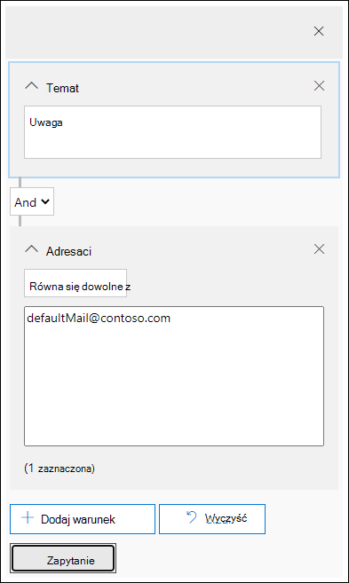

# Badanie złośliwych wiadomości e-mail dostarczonych w Microsoft 365

[!INCLUDE [Microsoft 365 Defender rebranding](../includes/microsoft-defender-for-office.md)]

**Dotyczy:**

- [Microsoft Defender dla Office 365 plan 1 i plan 2](defender-for-office-365.md)
- [Microsoft 365 Defender](../defender/microsoft-365-defender.md)

[Program Microsoft Defender for Office 365](defender-for-office-365.md) umożliwia badanie działań, które nałożyły ryzyko osób w organizacji, oraz podejmie działania w celu ochrony organizacji. Jeśli na przykład należysz do zespołu zabezpieczeń organizacji, możesz znaleźć i zbadać podejrzane wiadomości e-mail, które zostały dostarczone. Możesz to zrobić przy użyciu [Eksploratora zagrożeń (lub wykrywania w czasie rzeczywistym](threat-explorer.md)).

> [!NOTE]
> Przejdź tutaj do artykułu o rozwiązywaniu [problemów](remediate-malicious-email-delivered-office-365.md).

## Przed rozpoczęciem

Upewnij się, że są spełnione następujące wymagania:

- Twoja organizacja korzysta [z programu Microsoft Defender Office 365](defender-for-office-365.md), a licencje [są przypisywane do użytkowników](../../admin/manage/assign-licenses-to-users.md).

- [Rejestrowanie inspekcji](../../compliance/turn-audit-log-search-on-or-off.md) jest włączone dla organizacji.

- Twoja organizacja ma zdefiniowane zasady dotyczące ochrony przed spamem, złośliwym oprogramowaniem, ochrony przed wyłudzaniem informacji itp. Zobacz [Ochrona przed zagrożeniami w Office 365](protect-against-threats.md).

- Jesteś administratorem globalnym lub masz przypisaną rolę Administrator zabezpieczeń albo Wyszukiwanie i przeczyszczanie w portalu Microsoft 365 Defender sieci. Aby uzyskać więcej informacji, [zobacz Uprawnienia w portalu Microsoft 365 Defender użytkowników](permissions-microsoft-365-security-center.md). W przypadku niektórych akcji musisz mieć przypisaną także rolę Podgląd.

### Uprawnienia roli w wersji Preview

Aby wykonać określone czynności, takie jak wyświetlanie nagłówków wiadomości lub pobieranie zawartości wiadomości e-mail, musisz dodać rolę  Podgląd do innej odpowiedniej grupy ról. W poniższej tabeli objaśnia się wymagane role i uprawnienia.

|Działanie|Grupa ról|Rola w wersji Preview jest potrzebna?|
|---|---|---|
|Analizowanie zagrożeń za pomocą Eksploratora zagrożeń (i wykrywania w czasie rzeczywistym)|Administrator globalny 
 Administrator zabezpieczeń 
 Czytnik zabezpieczeń|Nie|
|Używanie Eksploratora zagrożeń (i wykrywania w czasie rzeczywistym) do wyświetlania nagłówków wiadomości e-mail oraz wyświetlania podglądu i pobierania poddanych kwarantannie wiadomości e-mail|Administrator globalny 
 Administrator zabezpieczeń 
 Czytnik zabezpieczeń|Nie|
|Używanie Eksploratora zagrożeń do wyświetlania nagłówków, wyświetlania podglądu wiadomości e-mail (tylko na stronie jednostki poczty e-mail) i pobierania wiadomości e-mail dostarczonych do skrzynek pocztowych|Administrator globalny 
 Administrator zabezpieczeń 
 Czytnik zabezpieczeń 
 Wersja zapoznawcza|Tak|

> [!NOTE]
> **Wersja Preview** to rola, a nie grupa ról. Rola Preview musi zostać dodana do istniejącej grupy ról lub nowej grupy ról w portalu Microsoft 365 Defender grupy. Aby uzyskać więcej informacji, [zobacz Uprawnienia w portalu Microsoft 365 Defender użytkowników](permissions-microsoft-365-security-center.md).
>
> Administrator globalny ma przypisaną rolę administratorów centrum administracyjne platformy Microsoft 365 stronie <https://admin.microsoft.com>. Role administratora zabezpieczeń i czytnika zabezpieczeń są przypisywane w Microsoft 365 Defender sieci.

Rozumiemy, że przeglądanie i pobieranie wiadomości e-mail to działania poufne, więc inspekcja jest włączona dla tych działań. Gdy administrator wykona te działania w wiadomości e-mail, dzienniki inspekcji są generowane dla tego samego pliku i są widoczne w portalu   \> <https://security.microsoft.com> usługi Microsoft 365 Defender na karcie Przeszukiwanie inspekcji, a następnie filtruj według nazwy administratora w polu Użytkownicy. W filtrowanych wynikach zostanie pokazana aktywność **AdminMailAccess**. Wybierz wiersz, aby wyświetlić szczegóły w sekcji **Więcej** informacji o podglądzie lub pobraniu wiadomości e-mail.

## Znajdowanie podejrzanych wiadomości e-mail, które zostały dostarczone

Eksplorator zagrożeń to zaawansowany raport, który może służyć do wielu celów, takich jak znajdowanie i usuwanie wiadomości, identyfikowanie adresu IP złośliwego nadawcy wiadomości e-mail lub rozpoczynanie zdarzenia w celu dalszego badania. W poniższej procedurze skupiono się na używaniu Eksploratora do odnajdowania i usuwania złośliwych wiadomości e-mail ze skrzynek pocztowych adresatów.

> [!NOTE]
> Domyślne wyszukiwania w Eksploratorze obecnie nie obejmują elementów dostarczonych, które zostały usunięte ze skrzynki pocztowej w chmurze przez automatyczne przeczyszczanie bez godziny (ZAP). To ograniczenie dotyczy wszystkich widoków (na przykład widoków e-mail **\> malware** lub **email \> phish**). Aby uwzględnić elementy usunięte przez zap, musisz dodać akcję **dostarczenia ustawioną** tak, aby **zawierała pozycję Usunięte przez zap**. Jeśli uwzględnisz wszystkie opcje, zobaczysz wszystkie wyniki akcji dostarczenia, w tym elementy usunięte przez zap.

1. W portalu Microsoft 365 Defender w witrynie <https://security.microsoft.com>, przejdź do eksploratora poczty **e-mail & współpracy** \> . Aby przejść bezpośrednio do strony **Eksploratora**, użyj .<https://security.microsoft.com/threatexplorer>

   Na stronie **Eksplorator** w **kolumnie Dodatkowe** akcje są pokazy dla administratorów wynik przetwarzania wiadomości e-mail. Do **kolumny Akcje** dodatkowe można uzyskać dostęp w tym samym miejscu, w którym znajduje się akcja **dostarczenia** i **lokalizacja dostarczania**. Na końcu osi czasu poczty e-mail Eksploratora zagrożeń mogą być aktualizowane akcje specjalne, która jest nową funkcją schłodną w celu lepszej pracy administratorów.

2. Z menu **Widok** wybierz z listy rozwijanej pozycję **Wyślij** \> wszystkie wiadomości e-mail pocztą e-mail.

    

    Widok *Złośliwe* oprogramowanie jest obecnie widokiem domyślnym i przechwytuje wiadomości e-mail, w których wykryto zagrożenie złośliwym oprogramowaniem. Widok *Phish* działa tak samo jak widok Phish.

    Jednak w *widoku Wszystkie wiadomości* e-mail jest wymieniona każda wiadomość odebrana przez organizację niezależnie od tego, czy zagrożenia zostały wykryte. Jak możesz sobie wyobrazić, jest to mnóstwo danych, dlatego w tym widoku jest przedstawiany symbol zastępczy z prośbą o zastosowanie filtru. (Ten widok jest dostępny tylko dla usługi Defender dla klientów Office 365 P2).

    *Widok Przesłane* materiały zawiera wszystkie wiadomości przesłane przez administratora lub użytkownika, które zostały zgłoszone firmie Microsoft.

4. **Wyszukiwanie i filtrowanie w Eksploratorze zagrożeń**: Filtry są wyświetlane w górnej części strony na pasku wyszukiwania, aby ułatwić administratorom w śledztwach. Zwróć uwagę, że można zastosować jednocześnie wiele filtrów i dodać do filtru wiele wartości rozdzielanych przecinkami, aby zawęzić wyszukiwanie. Zapamiętaj:

    - Filtry są dokładnie dopasowane do większości warunków filtru.
    - W filtrze tematu jest używane zapytanie CONTAINS.
    - Filtry adresów URL działają z protokołami lub bez (np. https).
    - Domena adresu URL, ścieżka adresu URL oraz domena adresu URL i filtry ścieżek nie wymagają filtrowania za pomocą protokołu.
    - Należy kliknąć ikonę Odśwież za każdym razem, gdy zmieniasz wartości filtru, aby uzyskać odpowiednie wyniki.

5. **Filtry zaawansowane**: przy użyciu tych filtrów można tworzyć złożone zapytania i filtrować zestaw danych. Kliknięcie pozycji *Filtry zaawansowane powoduje* otwarcie wysuwu z opcjami.

   Filtrowanie zaawansowane to świetny dodatek do funkcji wyszukiwania. Wartość logiczna NIE w filtrach domeny **Adresat**, **Nadawca** i Nadawca umożliwia administratorom badanie, wykluczając wartości. Ta opcja nie powoduje **zaznaczenia równa się** . Ta opcja umożliwia administratorom wykluczanie niechcianych skrzynek pocztowych z prowadzonych spraw (na przykład skrzynek pocztowych alertów i domyślnych skrzynek pocztowych odpowiedzi) i jest przydatna w przypadkach, gdy administratorzy wyszukują określony temat (na przykład Uwaga), gdzie adresata można ustawić na wartość Brak wartości *defaultMail@contoso.com*. To jest dokładne wyszukiwanie wartości.

   

   Dodanie filtru czasu do daty rozpoczęcia i daty zakończenia ułatwia zespołowi zabezpieczeń szybkie przechodzenie do szczegółów. Najmniejszy dozwolony czas trwania to 30 minut. Jeśli możesz zawęzić podejrzaną akcję do czasu (np. została ona wykonana 3 godziny temu), ograniczy to kontekst i pomoże w skojarze problemu.

   

6. **Pola w Eksploratorze zagrożeń**: Eksplorator zagrożeń udostępnia znacznie więcej informacji o wiadomościach związanych z zabezpieczeniami *, takich* jak akcja *dostarczania, lokalizacja* *dostarczania, akcja* specjalna *,* kierunkowość *,* zastępowanie i zagrożenia w adresie *URL*. Umożliwia to również zespołowi ds. zabezpieczeń organizacji badanie z większą pewnością.

    *Akcja dostarczania* to akcja podjęta w związku z wiadomością e-mail z powodu istniejących zasad lub wykrycia. Oto możliwe działania, jakie może podjąć wiadomość e-mail:

    - **Dostarczono** — wiadomość e-mail została dostarczona do skrzynki odbiorczej lub folderu użytkownika i użytkownik może uzyskać do niego bezpośredni dostęp.
    - **Wiadomości-śmieci** (Dostarczono do wiadomości-śmieci)— wiadomości e-mail zostały wysłane do folderu wiadomości-śmieci lub folderu usuniętego użytkownika, a użytkownik ma dostęp do wiadomości e-mail w folderze Wiadomości-śmieci lub Usunięte.
    - **Zablokowane —** wszystkie wiadomości e-mail, które są pod kwarantanną, zakończyły się niepowodzeniem lub zostały porzucone.
    - **Zamieniane** — każda wiadomość e-mail, w której złośliwe załączniki są zamieniane .txt plikami ze stanem załącznika był złośliwy

    **Lokalizacja dostarczania**: Filtr Lokalizacja dostarczania jest dostępny, aby ułatwić administratorom zrozumienie tego, gdzie mogą zakończyć się złośliwe wiadomości i jakie działania zostały podejmowane w tej sytuacji. Dane wynikowe można wyeksportować do arkusza kalkulacyjnego. Możliwe lokalizacje dostarczania są:

    - **Skrzynka odbiorcza lub folder** — wiadomość e-mail znajduje się w skrzynce odbiorczej lub określonym folderze, zgodnie z regułami poczty e-mail.
    - **Lokalna lub zewnętrzna —** skrzynka pocztowa nie istnieje w chmurze, ale jest lokalna.
    - **Folder wiadomości-śmieci** — wiadomość e-mail znajduje się w folderze wiadomości-śmieci użytkownika.
    - **Folder Elementy usunięte** — wiadomość e-mail znajduje się w folderze Elementy usunięte użytkownika.
    - **Kwarantanna** — poczta e-mail poddana kwarantannie, a nie w skrzynce pocztowej użytkownika.
    - **Nie powiodło się** — wiadomość e-mail nie dotarła do skrzynki pocztowej.
    - **Upuszczona** — wiadomość e-mail została utracona w przepływie poczty.

    **Kierunkowość**: Ta opcja umożliwia zespołowi operacji zabezpieczeń filtrowanie według "kierunku", z którym pochodzi poczta, lub że trwa. Wartości kierunkowości to: *Przychodzące**,* Wychodzące i *Wewnątrz* organizacji (odpowiadające poczty przychodzącej do organizacji spoza organizacji, wysyłanej z Twojej organizacji lub wysyłanej wewnętrznie do Twojej organizacji). Te informacje mogą ułatwić zespołom operacji zabezpieczeń namierzenie spoofingu i personifikacji, ponieważ niezgodność między wartością Directionality (np. *Przychodzący),* a domena nadawcy (która wydaje się być  domeną wewnętrzną) zostanie dosyć dosyć! Wartość Kierunkowość jest odrębna i może się różnić od śledzenia wiadomości. Wyniki można wyeksportować do arkusza kalkulacyjnego.

    **Zastępuje:** Ten filtr pobiera informacje wyświetlane na karcie szczegółów wiadomości i używa go do udostępnienia informacji o tym, gdzie zostały zastąpione zasady organizacji lub użytkowników dotyczące zezwalania na wiadomości i blokowania *ich*. Najważniejsze, aby ten filtr był pomocny zespołowi zabezpieczeń w organizacji w zobaczycej, ile podejrzanych wiadomości e-mail dostarczono z powodu konfiguracji. Umożliwia to użytkownikom modyfikowanie zezwalania i bloków zgodnie z potrzebami. Ten zestaw wyników tego filtru można wyeksportować do arkusza kalkulacyjnego.

    |Zastępowanie Eksploratora zagrożeń|Znaczenie|
    |---|---|
    |Dozwolone przez zasady organizacji|Poczta została wpuszona do skrzynki pocztowej zgodnie z zasadami organizacji.|
    |Zasady organizacji zablokowane przez|Poczta została zablokowana z dostarczeniem do skrzynki pocztowej zgodnie z zasadami organizacji.|
    |Rozszerzenie pliku zablokowane przez zasady organizacji|Plik został zablokowany z dostarczeniem do skrzynki pocztowej zgodnie z zasadami organizacji.|
    |Dozwolone przez zasady użytkownika|Poczta została wpuszona do skrzynki pocztowej zgodnie z zasadami użytkownika.|
    |Zablokowane przez zasady użytkownika|Poczta została zablokowana z dostarczeniem do skrzynki pocztowej zgodnie z zasadami użytkownika.|

    **Zagrożenie w adresie** URL: Pole zagrożenia adresu URL zostało uwzględnione  na karcie szczegółów wiadomości e-mail w celu wskazania zagrożenia przedstawionego za pomocą adresu URL. Zagrożenia przedstawione za pomocą adresu URL mogą  obejmować złośliwe *oprogramowanie, wiadomości* o  wyłudzeniu *lub spam**, a* w sekcji zagrożeń adres URL bez zagrożeń będzie zawierał frazę Brak.

7. **Widok osi czasu poczty** e-mail: Zespół operacyjny ds. zabezpieczeń może potrzebować szczegółowych informacji dotyczących wiadomości e-mail w celu dalszego zbadania. Oś czasu poczty e-mail pozwala administratorom wyświetlać akcje wykonane w wiadomości e-mail od dostarczenia do po dostarczeniu. Aby wyświetlić oś czasu wiadomości e-mail, kliknij temat wiadomości e-mail, a następnie kliknij pozycję Oś czasu wiadomości e-mail. (Jest on wyświetlany między innymi nagłówkami w panelu, na przykład Podsumowanie lub Szczegóły). Te wyniki można wyeksportować do arkusza kalkulacyjnego.

    Oś czasu wiadomości e-mail zostanie otwarta w tabeli z wszystkimi zdarzeniami dostarczenia i po dostarczeniu wiadomości e-mail. Jeśli nie ma żadnych dalszych działań w wiadomości e-mail, dla pierwotnego dostarczenia powinno zostać zobaczyć jedno zdarzenie z potwierdzeniem takiego *wyniku, jak* Zablokowane, werdykt, taki jak *Phish*. Administratorzy mogą wyeksportować całą oś czasu poczty e-mail, łącznie ze wszystkimi szczegółami na karcie i wiadomościami e-mail (takimi jak Temat, Nadawca, Adresat, Sieć i Identyfikator wiadomości). Oś czasu poczty e-mail ogranicza losowanie, ponieważ mniej czasu poświęcisz na sprawdzanie różnych lokalizacji, aby spróbować zrozumieć zdarzenia, które miały miejsce od czasu, w którym przyszła wiadomość e-mail. Gdy kilka zdarzeń ma miejsce w tym samym czasie lub w tym samym czasie co wiadomość e-mail, zdarzenia te są wyświetlane w widoku osi czasu.

8. **Wersja zapoznawcza / pobieranie**: Eksplorator zagrożeń przekazuje zespołowi ds. zabezpieczeń szczegóły potrzebne do zbadania podejrzanych wiadomości e-mail. Zespół operacyjny ds. zabezpieczeń może:

    - [Sprawdź akcję i lokalizację dostarczenia](#check-the-delivery-action-and-location).

    - [Wyświetlanie osi czasu wiadomości e-mail](#view-the-timeline-of-your-email).

### Sprawdzanie akcji i lokalizacji dostarczenia

W [Eksploratorze zagrożeń (i wykrywaniach w](threat-explorer.md) czasie rzeczywistym) są teraz dostępne  kolumny Akcja  dostarczania i Lokalizacja dostarczania zamiast poprzedniej **kolumny Stan** dostarczenia. W ten sposób możesz uzyskać pełniejszą ilustrację miejsca, do którego trafią wiadomości e-mail. Celem tej zmiany jest ułatwienie zespołów ds. bezpieczeństwa badań, ale wynikiem sieci jest znajomość lokalizacji problemowych wiadomości e-mail.

Stan dostarczenia jest teraz podzielone na dwie kolumny:

- **Akcja dostarczenia** — jaki jest stan tej wiadomości e-mail?
- **Lokalizacja dostarczania** — gdzie w wyniku tego ta wiadomość e-mail została rozsyłana?

Akcja dostarczania to akcja podjęta w związku z wiadomością e-mail z powodu istniejących zasad lub wykrycia. Oto możliwe działania, jakie może podjąć wiadomość e-mail:

- **Dostarczono** — wiadomość e-mail została dostarczona do skrzynki odbiorczej lub folderu użytkownika i użytkownik może uzyskać do niego bezpośredni dostęp.
- **Wiadomości-śmieci** — wiadomość e-mail została wysłana do folderu wiadomości-śmieci lub folderu usuniętego użytkownika, a użytkownik ma dostęp do wiadomości e-mail w folderze Wiadomości-śmieci lub Usunięte.
- **Zablokowane —** wszystkie wiadomości e-mail, które są pod kwarantanną, zakończyły się niepowodzeniem lub zostały porzucone.
- **Zamieniane** — wszystkie wiadomości e-mail, w których złośliwe załączniki są zamieniane .txt plikami ze stanem złośliwego załącznika.

Lokalizacja dostarczania zawiera wyniki zasad i wykrycia uruchamianych po dostarczeniu. Jest on połączony z akcją dostarczenia. To pole zostało dodane, aby uzyskać szczegółowe informacje o czynnościach, które zostały wykonane po odnalezioniu poczty problemu. Poniżej znajdują się możliwe wartości lokalizacji dostarczania:

- **Skrzynka odbiorcza lub folder** — wiadomość e-mail znajduje się w skrzynce odbiorczej lub folderze (zgodnie z regułami poczty e-mail).
- **Lokalna lub zewnętrzna —** skrzynka pocztowa nie istnieje w chmurze, ale jest lokalna.
- **Folder wiadomości-śmieci** — wiadomość e-mail znajduje się w folderze Wiadomości-śmieci użytkownika.
- **Folder Elementy usunięte** — wiadomość e-mail znajduje się w folderze Elementy usunięte użytkownika.
- **Kwarantanna** — poczta e-mail poddana kwarantannie, a nie w skrzynce pocztowej użytkownika.
- **Nie powiodło się** — wiadomość e-mail nie dotarła do skrzynki pocztowej.
- **Upuszczona** — wiadomość e-mail zostanie utracona w przepływie poczty.

### Wyświetlanie osi czasu wiadomości e-mail

**Oś czasu poczty e-mail** to pole w Eksploratorze zagrożeń, które ułatwia pracę zespołu ds. bezpieczeństwa. Gdy wiadomość e-mail zawiera wiele zdarzeń lub zdarzenia są blisko tego samego czasu, są wyświetlane w widoku osi czasu. Niektóre zdarzenia, które mają miejsce po dostarczeniu wiadomości e-mail, są przechwytywane w **kolumnie Akcje** specjalne. Połączenie informacji z osi czasu wiadomości e-mail z dowolnymi czynnościami specjalnymi, które zostały wykonane po dostarczeniu, zapewnia administratorom wgląd w zasady i obsługę zagrożeń (na przykład miejsce, do którego została rozsyłana poczta, a w niektórych przypadkach także na temat ostatecznej oceny).

> [!IMPORTANT]
> Przejdź tutaj do tematu rozwiązywania [problemów](remediate-malicious-email-delivered-office-365.md).

## Tematy pokrewne

[Remediate malicious email delivered in Office 365](remediate-malicious-email-delivered-office-365.md)

[Usługa Microsoft Defender dla Office 365](office-365-ti.md)

[Ochrona przed zagrożeniami w Office 365](protect-against-threats.md)

[Wyświetlanie raportów usługi Defender dla Office 365](view-reports-for-mdo.md)
