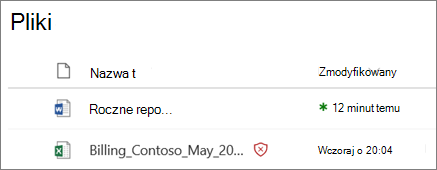
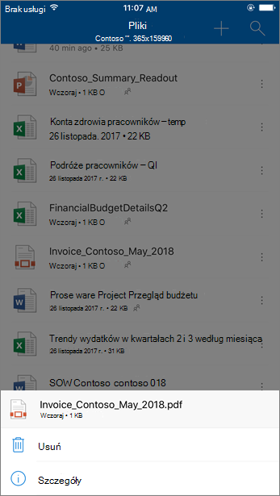

# Sejf załączników do SharePoint, OneDrive i Microsoft Teams

[!INCLUDE [Microsoft 365 Defender rebranding](../includes/microsoft-defender-for-office.md)]

**Dotyczy**
- [Microsoft Defender dla Office 365 plan 1 i plan 2](defender-for-office-365.md)
- [Microsoft 365 Defender](../defender/microsoft-365-defender.md)

Sejf Załączniki do SharePoint, OneDrive i Microsoft Teams w programie [Microsoft Defender dla Office 365](whats-new-in-defender-for-office-365.md) zapewnia dodatkową warstwę ochrony dla plików, które już były skanowane asynchronicznie przez wspólny aparat wykrywania wirusów w [ Microsoft 365](virus-detection-in-spo.md). Sejf załączniki do SharePoint, plików OneDrive i Microsoft Teams pomagają wykrywać i blokować istniejące pliki, które są zidentyfikowane jako złośliwe w witrynach  zespołowych i bibliotekach dokumentów.

Sejf Załączniki wiadomości SharePoint, OneDrive i Microsoft Teams nie są domyślnie włączone. Aby włączyć ten program, zobacz [Włączanie Sejf załączników wiadomości SharePoint, OneDrive i Microsoft Teams](turn-on-mdo-for-spo-odb-and-teams.md).

## Jak Sejf załączniki do SharePoint, OneDrive i Microsoft Teams się

Gdy załączniki Sejf dla systemów SharePoint, OneDrive i Microsoft Teams są włączone i identyfikują plik jako złośliwy, plik jest blokowany przy użyciu bezpośredniej integracji z magazynami plików. Na poniższej ilustracji przedstawiono przykład złośliwego pliku wykrytego w bibliotece.

Mimo że zablokowany plik jest nadal wymieniony w bibliotece dokumentów oraz w sieci Web, na urządzeniu przenośnym lub w aplikacjach klasycznych, inne osoby nie mogą otwierać, kopiować, przenosić ani udostępniać pliku. Jednak mogą oni usunąć zablokowany plik.

Poniżej podano przykładowy wygląd zablokowanego pliku na urządzeniu przenośnym:

Domyślnie blokowany plik można pobrać. Pobieranie zablokowanego pliku na urządzeniu przenośnym wygląda tak:

SharePoint online mogą uniemożliwić użytkownikom pobieranie złośliwych plików. Aby uzyskać instrukcje, [zobacz SharePoint Online PowerShell](turn-on-mdo-for-spo-odb-and-teams.md#step-2-recommended-use-sharepoint-online-powershell-to-prevent-users-from-downloading-malicious-files), aby uniemożliwić użytkownikom pobieranie złośliwych plików.

Aby dowiedzieć się więcej na temat obsługi użytkownika po wykryciu pliku jako złośliwego, zobacz Co zrobić w przypadku wykrycia złośliwego pliku w aplikacji [SharePoint Online,](https://support.microsoft.com/office/01e902ad-a903-4e0f-b093-1e1ac0c37ad2) OneDrive lub Microsoft Teams.

## Wyświetlanie informacji o złośliwych plikach wykrytych przez załączniki Sejf załączników do SharePoint, OneDrive i Microsoft Teams

Pliki zidentyfikowane jako złośliwe przez załączniki Sejf dla programów SharePoint, OneDrive i Microsoft Teams będą wyświetlane w raportach programu [Microsoft Defender](view-reports-for-mdo.md) dla programu Office 365 i w Eksploratorze [(](threat-explorer.md)oraz w czasie rzeczywistym).

Jeśli plik zostanie zidentyfikowany jako złośliwy przez załączniki Sejf dla SharePoint, OneDrive i Microsoft Teams, plik ten jest również dostępny w kwarantannie, ale tylko dla administratorów. Aby uzyskać więcej informacji, zobacz [Zarządzanie plikami poddanymi kwarantannie w programie Defender dla Office 365](manage-quarantined-messages-and-files.md#use-the-microsoft-365-defender-portal-to-manage-quarantined-files-in-defender-for-office-365).

## Należy pamiętać o tych punktach

- Defender for Office 365 will not scan every single file in SharePoint Online, OneDrive dla Firm, or Microsoft Teams. Takie działanie jest zgodne z projektem programu. Pliki są skanowane asynchronicznie. Ten proces używa zdarzeń udostępniania i aktywności gościa oraz inteligentnej heuristics i sygnałów zagrożeń do identyfikowania złośliwych plików.

- Upewnij się, SharePoint witryny są skonfigurowane do korzystania z [nowoczesnego obsługi](/sharepoint/guide-to-sharepoint-modern-experience). Ochrona usługi Defender Office 365 ma zastosowanie zarówno w przypadku widoku nowoczesnego, jak i klasycznego, jednak wskaźniki wizualne, że plik jest zablokowany, są dostępne tylko w tym trybie.

- Sejf załączniki do programów SharePoint, OneDrive i Microsoft Teams stanowią część ogólnej strategii ochrony przed zagrożeniami w organizacji, która obejmuje ochronę przed Exchange Online Protection spamem i złośliwym oprogramowaniem w uciekowoniu (EOP) oraz linki Sejf i Sejf załączników w programie Microsoft Defender dla Office 365. Aby dowiedzieć się więcej, zobacz [Ochrona przed zagrożeniami w sieci Office 365](protect-against-threats.md).
