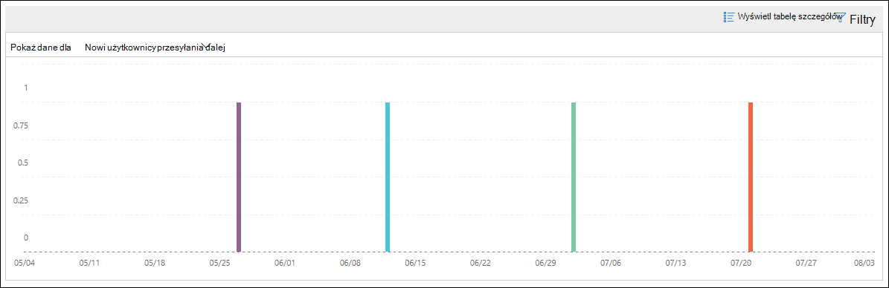
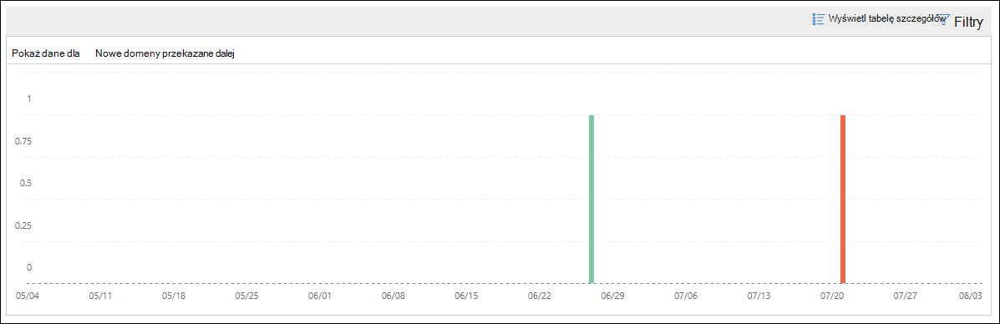

# Nowi użytkownicy mogą przesyłać dalej informacje dotyczące poczty e-mail w Centrum & zgodności

[!INCLUDE [Microsoft 365 Defender rebranding](../includes/microsoft-defender-for-office.md)]

**Dotyczy**
- [Exchange Online Protection](exchange-online-protection-overview.md)
- [Microsoft Defender dla Office 365 plan 1 i plan 2](defender-for-office-365.md)
- [Microsoft 365 Defender](../defender/microsoft-365-defender.md)

Jest to podejrzane, gdy nowe konta użytkowników w Twojej organizacji nagle zaczną przesyłać dalej wiadomości e-mail do domen zewnętrznych.

Szczegółowe **informacje o nowych** domenach w Centrum & zabezpieczeń  i zgodności informują o tym, gdy nowo utworzeni użytkownicy w organizacji będą przesyłać wiadomości do domen zewnętrznych. Ten warunek może wskazywać, że do utworzenia nowych użytkowników zostały użyte naruszone konta administratora. Jeśli podejrzewasz, że konta zostały naruszone, zobacz Odpowiadanie na [naruszone konto e-mail](responding-to-a-compromised-email-account.md).

Ta informacja jest widoczna tylko po wykryciu problemu i pojawia się na stronie [Raport przesyłany](view-mail-flow-reports.md#forwarding-report) dalej.

Po kliknięciu widżetu zostanie wyświetlone wysuwne okno, w którym można znaleźć więcej szczegółowych informacji na temat wiadomości przesyłanych dalej, w tym  link do raportu o zmianach w przesyłaniu dalej zgodnie z opisem w dalszej części tego artykułu.

Możesz również przejść do tej strony szczegółów, gdy wybierzesz szczegółowe informacje po kliknięciu przycisku Wyświetl wszystkie w obszarze Najważniejsze informacje **& zalecenia** na (**Pulpit** \> nawigacyjny **Raporty** lub <https://protection.office.com/insightdashboard>).

Możesz kliknąć link Zobacz **raport skojarzony z informacjami** , aby przejść do raportu do przesyłania dalej **zmian zgodnie z** opisem w następnej sekcji.

## Forwarding modifications report

Raport **Modyfikacje przesyłania dalej** zawiera szczegółowe informacje o wiadomościach automatycznie przesyłanych dalej od nadawców w organizacji:

- Nowo utworzone konta, które przesyła dalej wiadomości do domen zewnętrznych.
- Konta, które przesyłają dalej wiadomości do domen zewnętrznych, które nigdy nie zostały przekazane przez innych nadawców w organizacji.

Tego typu wiadomości przekazane mogą stanowić zagrożenie bezpieczeństwa lub zgodności, a także wskazywać na naruszone konta.

Raport zawiera dane do 90 dni. Domyślnie raport zawiera dane z ostatnich 7 dni.

Ten raport nie jest dostępny bezpośrednio na pulpicie nawigacyjnym [przepływu poczty](mail-flow-insights-v2.md) ani na [pulpicie nawigacyjnym Raporty](view-mail-flow-reports.md). Aby uzyskać do **raportu nie tylko** link Zobacz raport skojarzony z skojarzoną z informacjami w szczegółowych informacjach o nowych użytkownikach, ale również:

- Kliknięcie **linku do raportu powiadomienia dalej** w szczegółach szczegółowych informacji o nowych [domenach przesyłanych dalej wiadomości e-mail](mfi-new-domains-being-forwarded-email.md).
- Otwieranie <https://protection.office.com/reportv2?id=MailFlowNewForwarding>.

### Widok raportu dla raportu do przesyłania dalej zmian

W widoku raportu są dostępne następujące wykresy:

- **Pokaż dane dla: Nowi użytkownicy przesyłania dalej**:

  

- **Pokaż dane dla: Nowe domeny przesyłania dalej**:

  

Jeśli klikniesz **pozycję Filtry** w widoku raportu, możesz określić zakres dat w **datach Rozpoczęcie** i **Data zakończenia**.

### Widok tabeli Szczegóły dla raportu do przesyłania dalej modyfikacji

Jeśli **klikniesz pozycję Wyświetl** tabelę szczegółów, wyświetlane informacje zależą od wyświetlanego wykresu:

- **Pokaż dane dla: Nowi użytkownicy przesyłania dalej**:

  - **Nazwa**: adres e-mail nadawcy.
  - **Typ przesyłania dalej**
  - **Adres adresata**
  - **Szczegóły**
  - **Liczba**
  - **Data pierwszej wiadomości przesyłanych dalej**

- **Pokaż dane dla: Nowe domeny przesyłania dalej**:

  - **Nazwa**: domena adresu e-mail nadawcy.
  - **Typ przesyłania dalej**
  - **Adres adresata**
  - **Szczegóły**
  - **Liczba**
  - **Data pierwszej wiadomości przesyłanych dalej**

Jeśli klikniesz **pozycję Filtry** w widoku tabeli szczegółów, możesz określić zakres dat z **datami rozpoczęcia** i **datami zakończenia**.

W przypadku wybrania wiersza z tabeli zostanie wyświetlone **wysuwne okno** Szczegóły z następującymi informacjami:

- **Nazwa**: Adres e-mail nadawcy (w widoku Pokaż dane dla **:** Nowi użytkownicy przesyłający dalej) lub domena poczty e-mail nadawcy (z pokaż dane **dla:** Nowy widok domen przesyłania dalej).
- **Typ przesyłania dalej**
- **Adresat**
- **Szczegóły**
- **Liczba**
- **Data rozpoczęcia**
- **Zalecenie**: W tym miejscu możesz kliknąć link, aby zarządzać użytkownikiem w centrum administracyjne platformy Microsoft 365.

Aby wrócić do widoku raportów, kliknij pozycję **Wyświetl raport**.

## Tematy pokrewne

Aby uzyskać więcej informacji na temat pulpitu nawigacyjnego przepływu poczty e-mail, zobacz Szczegółowe informacje o przepływie poczty w [Centrum & zabezpieczeń i zgodności](mail-flow-insights-v2.md).
