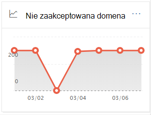

# Raport o nie zaakceptowanych domenach w Centrum & zabezpieczeń i zgodności

[!INCLUDE [Microsoft 365 Defender rebranding](../includes/microsoft-defender-for-office.md)]

**Dotyczy**
- [Exchange Online Protection](exchange-online-protection-overview.md)
- [Microsoft Defender dla Office 365 plan 1 i plan 2](defender-for-office-365.md)
- [Microsoft 365 Defender](../defender/microsoft-365-defender.md)

**Raport Nie** zaakceptowane domeny na pulpicie  nawigacyjnym przepływu poczty w Centrum zgodności zabezpieczeń [&](https://protection.office.com) wyświetla informacje o wiadomościach od lokalnej organizacji poczty e-mail, w przypadku których domena nadawcy nie jest skonfigurowana jako zaakceptowana domena w Twojej Microsoft 365 organizacji.

Microsoft 365 tych wiadomości mogą zostać ograniczone, jeśli mamy dane, które udowadniają, że celem tych wiadomości jest złośliwy. Dlatego ważne jest zrozumienie, co się dzieje, i rozwiązanie problemu.

## Widok raportu dla raportu o niedo zaakceptowanych domenach

Kliknięcie wykresu na **widżecie Nie zaakceptowana** domena spowoduje kliknięcie raportu **o niedo zaakceptowanych domenach** .

Domyślnie jest wyświetlana aktywność dla wszystkich łączników, których dotyczy problem. Jeśli klikniesz **pozycję Pokaż dane** dla, możesz wybrać konkretny łącznik z listy rozwijanej.

Umieszczenie wskaźnika myszy nad punktem danych (dniem) na wykresie pozwala wyświetlić łączną liczbę wiadomości łącznika.

## Widok tabeli Szczegóły raportu o niedo zaakceptowanych domenach

Kliknięcie **przycisku Wyświetl tabelę szczegółów** w widoku raportu umożliwia wyświetlenie następujących informacji:

- **Data**
- **Nazwa łącznika ruchu przychodzącego**
- **Domena nadawcy**
- **Liczba wiadomości**
- **Przykładowe wiadomości**: Identyfikatory wiadomości przykładowych wiadomości, których dotyczy problem.

Jeśli klikniesz **pozycję Filtry** w widoku tabeli szczegółów, możesz określić zakres dat z **datami rozpoczęcia** i **datami zakończenia**.

Aby wysłać raport pocztą e-mail z określonym zakresem dat do jednego lub większej liczby adresatów, kliknij pozycję **Poproś o pobranie**.

Po zaznaczeniu wiersza w tabeli zostanie wyświetlone wysuwne okno z następującymi informacjami:

- **Data**
- **Nazwa łącznika ruchu przychodzącego**
- **Domena nadawcy**
- **Liczba wiadomości**
- **Przykładowe wiadomości**: Możesz kliknąć pozycję **Wyświetl przykładowe wiadomości**,  aby wyświetlić wyniki śledzenia wiadomości dla przykładowych wiadomości, których dotyczy problem.

Aby wrócić do widoku raportów, kliknij pozycję **Wyświetl raport**.

## Tematy pokrewne

Aby uzyskać więcej informacji na temat pulpitu nawigacyjnego przepływu poczty e-mail, zobacz Szczegółowe informacje o przepływie poczty w [Centrum & zabezpieczeń i zgodności](mail-flow-insights-v2.md).
