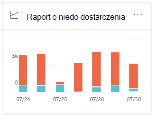
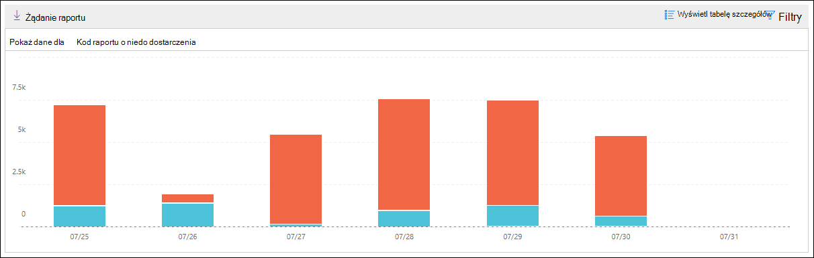

# Raport o niedo dostarczenia w Centrum & zgodności z zabezpieczeniami

[!INCLUDE [Microsoft 365 Defender rebranding](../includes/microsoft-defender-for-office.md)]

**Dotyczy**
- [Exchange Online Protection](exchange-online-protection-overview.md)
- [Microsoft Defender dla Office 365 plan 1 i plan 2](defender-for-office-365.md)
- [Microsoft 365 Defender](../defender/microsoft-365-defender.md)

Raport o **niedo** dostarczenia na pulpicie  nawigacyjnym przepływu poczty w Centrum zgodności usługi [&](https://protection.office.com) zabezpieczeń zawiera informacje o najczęściej występujących kodach błędów w raportach o niedo dostarczenia (nazywanych również raportami o niedo dostarczenia lub wiadomościach zwracanych) dla użytkowników w organizacji. Ten raport zawiera szczegółowe informacje o raportach o stanie dostarczenia, co umożliwia rozwiązywanie problemów z dostarczaniem wiadomości e-mail.

## Widok raportu o niedo dostarczenia

Kliknięcie **widżetu Raportu o niedo dostarczenia** spowoduje kliknięcie raportu **o niedo dostarczenia**.

Domyślnie jest wyświetlane działanie dla wszystkich kodów błędów. Jeśli klikniesz **pozycję Pokaż dane** dla, możesz wybrać określony kod błędu z listy rozwijanej.

Jeśli najedziesz kursorem na określony kolor (kod błędu) określonego dnia na wykresie, zobaczysz łączną liczbę komunikatów o błędzie.

## Widok tabeli Szczegóły dla raportu o niedo dostarczenia

Kliknięcie **przycisku Wyświetl tabelę szczegółów** w widoku raportu umożliwia wyświetlenie następujących informacji:

- **Data**
- **Kod raportu o niedo dostarczenia**
- **Liczba**
- **Przykładowe wiadomości**: Identyfikatory wiadomości przykładowych wiadomości, których dotyczy problem.

Jeśli klikniesz **pozycję Filtry** w widoku tabeli szczegółów, możesz określić zakres dat z **datami rozpoczęcia** i **datami zakończenia**.

Aby wysłać raport pocztą e-mail z określonym zakresem dat do jednego lub większej liczby adresatów, kliknij pozycję **Poproś o pobranie**.

Po zaznaczeniu wiersza w tabeli zostanie wyświetlone wysuwne okno z następującymi informacjami:

- **Data**
- **Kod raportu o niedo dostarczenia**: Możesz kliknąć link, aby znaleźć więcej informacji o przyczynach i rozwiązaniach konkretnego kodu błędu.
- **Liczba**
- **Przykładowe wiadomości**: Możesz kliknąć pozycję **Wyświetl przykładowe wiadomości**,  aby wyświetlić wyniki śledzenia wiadomości dla przykładowych wiadomości, których dotyczy problem.

## Tematy pokrewne

Aby uzyskać więcej informacji na temat pulpitu nawigacyjnego przepływu poczty e-mail, zobacz Szczegółowe informacje o przepływie poczty w [Centrum & zabezpieczeń i zgodności](mail-flow-insights-v2.md).
