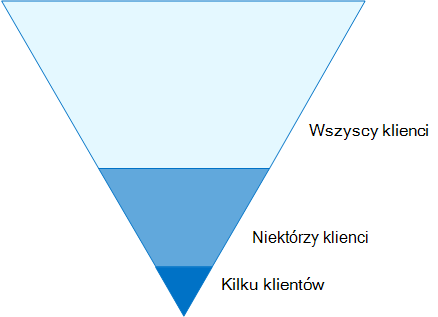
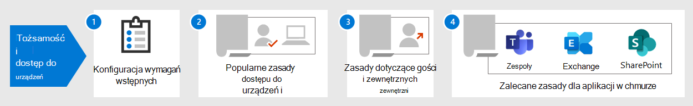

# Konfiguracje zerowym zaufaniem tożsamości i dostępu do urządzeń

Architektury zabezpieczeń zależne od zapór sieciowych i wirtualnych sieci prywatnych (VPN) w celu odizolowania i ograniczenia dostępu do zasobów i usług technologicznych organizacji nie są już wystarczające dla pracowników, którzy regularnie wymagają dostępu do aplikacji i zasobów istniejących poza tradycyjnymi firmowymi granicami sieci.

Aby zająć się tym nowym światem przetwarzania danych, firma Microsoft zdecydowanie zaleca model zabezpieczeń Zero Trust, który jest oparty na tych wytycznych:

- Jawne weryfikowanie

  Zawsze uwierzytelnianie i autoryzacja na podstawie wszystkich dostępnych punktów danych. W tym miejscu zasady dostępu do urządzeń i tożsamości bez zaufania mają kluczowe znaczenie dla logowania się i stałej weryfikacji.

- Użyj dostępu z najmniejszymi uprawnieniami

  Ogranicz dostęp użytkowników dzięki technologii Just-In-Time i Just-Enough-Access (JIT/JEA), adaptacyjnym zasadom opartym na ryzyko i ochronie danych.  

- Założono naruszenie

  Minimalizowanie promieni rozdęć i dostępu segmentów. Weryfikuj zaawansowane szyfrowanie i korzystaj z analizy, aby uzyskać widoczność, usprawnić wykrywanie zagrożeń i usprawnić obronę.

Oto ogólna architektura zaufania zerowego.

:::image type="content" source="../../media/microsoft-365-policies-configurations/zero-trust-architecture.png" alt-text="Architektura Microsoft Zero Trust" lightbox="../../media/microsoft-365-policies-configurations/zero-trust-architecture.png":::

Zasady zerowego zaufania w zakresie tożsamości i dostępu do urządzeń są adresowane do zasady weryfikowania **jawnie** prowadzącej do:

- Tożsamości

  Gdy tożsamość próbuje uzyskać dostęp do zasobu, sprawdź, czy ta tożsamość jest silne uwierzytelnianie, i upewnij się, że żądany dostęp jest zgodny i typowy.

- Urządzenia (nazywane również punktami końcowymi)

  Monitorowanie i wymuszanie wymagań dotyczących kondycji i zgodności urządzeń w celu zapewnienia bezpiecznego dostępu.

- Aplikacje

  Zastosuj kontrolki i technologie, aby wykryć w tle rozwiązania IT, zapewnić odpowiednie uprawnienia w aplikacji, dostęp do bramy na podstawie analizy w czasie rzeczywistym, monitorowanie nieprawidłowych zachowań, kontrolowanie akcji użytkownika oraz weryfikowanie bezpiecznych opcji konfiguracji.

W tej serii artykułów opisano zestaw konfiguracji wymagań wstępnych dotyczących tożsamości i dostępu do urządzeń oraz zestaw usług Azure Active Directory (Azure AD) i Microsoft Intune dostępu warunkowego oraz innych zasad zerowego zaufania dostępu do Microsoft 365  dla usług i aplikacji w chmurze przedsiębiorstwa, innych usług SaaS oraz aplikacji lokalnych opublikowanych przy użyciu serwera proxy aplikacji Azure AD.

Ustawienia i zasady zerowego zaufania oraz dostępu do urządzeń są zalecane w trzech warstwach: punktu początkowego, przedsiębiorstwa i wyspecjalizowanego zabezpieczeń w środowiskach z wysoce uregulowanymi lub klasyfikowanym danymi. Te warstwy i odpowiadające im konfiguracje zapewniają spójny poziom ochrony przed zerowym zaufaniem dla danych, tożsamości i urządzeń.

Te funkcje i ich zalecenia:

- Są obsługiwane w Microsoft 365 E3 i Microsoft 365 E5.
- Są one zgodne z [programem Microsoft Secure Score](../defender/microsoft-secure-score.md) , a także z wynikami tożsamości w usłudze [Azure AD](/azure/active-directory/fundamentals/identity-secure-score) i zwiększają te wyniki dla organizacji.
- Pomoże to w zaimplementowaniu tych [pięciu kroków w celu zabezpieczenia infrastruktury tożsamości](/azure/security/azure-ad-secure-steps).

Jeśli Twoja organizacja ma unikatowe wymagania dotyczące środowiska lub ich złożone cechy, na początek skorzystaj z tych zaleceń. Jednak większość organizacji może wdrożyć te zalecenia w określony sposób.

Ten klip wideo zawiera krótki przegląd konfiguracji tożsamości i dostępu do urządzeń w celu Microsoft 365 przedsiębiorstwa.

 

> [!VIDEO https://www.microsoft.com/videoplayer/embed/RWxEDQ]

> [!NOTE]
> Firma Microsoft sprzedaje również Enterprise Mobility + Security (EMS) na Office 365 subskrypcji. Funkcje EMS E3 i EMS E5 są równoważne z możliwościami w programach Microsoft 365 E3 i Microsoft 365 E5. Aby [uzyskać szczegółowe informacje, zobacz Plany EMS](https://www.microsoft.com/microsoft-365/enterprise-mobility-security/compare-plans-and-pricing) .

## Docelowa grupa odbiorców

Te zalecenia są przeznaczone dla specjalistów ds. architektury przedsiębiorstwa i informatyków, którzy znają usługi Microsoft 365 zwiększające produktywność i zabezpieczenia w chmurze, w tym usługi Azure AD (tożsamość), Microsoft Intune (zarządzanie urządzeniami) i Microsoft Information Protection (ochrona danych).

### Środowisko klienta

Zalecane zasady mają zastosowanie do organizacji przedsiębiorstw działających zarówno w chmurze firmy Microsoft, jak i klientów z hybrydową infrastrukturą tożsamości, która jest lokalnym lasem Usługi domenowe w usłudze Active Directory (AD DS) synchronizowany z dzierżawą usługi Azure AD.

Wiele z podanych zaleceń polega na usługach dostępnych tylko w Microsoft 365 E5 Microsoft 365 E3 zabezpieczeń E5, EMS E5 lub Azure AD — wersja Premium P2 licencji.

W przypadku organizacji, które nie mają tych licencji, firma Microsoft zaleca przynajmniej wdrożenie ustawień domyślnych [zabezpieczeń, które](/azure/active-directory/fundamentals/concept-fundamentals-security-defaults) są zawarte we wszystkich Microsoft 365 planach.

### Zastrzeżenie

Twoja organizacja może podlegać wymogom prawa lub innym wymogom zgodności z przepisami, w tym określonymi zaleceniami, które mogą wymagać stosowania zasad zgodnych z tymi zalecanymi konfiguracjami. Te konfiguracje zalecają kontrolki użycia, które nie były dostępne w przeszłości. Zalecamy te mechanizmy kontroli, ponieważ uważamy, że stanowią one równowagę między zabezpieczeniami a wydajnością.

Zrobiliśmy wszystko, aby uwzględnić różnorodne wymagania dotyczące ochrony organizacji, ale nie możemy uwzględnić wszystkich możliwych wymagań ani wszystkich unikatowych aspektów Twojej organizacji.

## Trzy warstwy ochrony

Większość organizacji ma określone wymagania dotyczące zabezpieczeń i ochrony danych. Te wymagania różnią się w zależności od segmentu branży i funkcji stanowiska w organizacjach. Na przykład dział prawny i administratorzy mogą wymagać dodatkowej kontroli nad zabezpieczeniami i ochroną informacji związanej z korespondencją e-mail, która nie jest wymagana w przypadku innych jednostek biznesowych.

Każda branża ma również własny zestaw specjalistycznych przepisów. Zamiast dostarczać listę wszystkich możliwych opcji zabezpieczeń lub zalecenia dla segmentu branży lub funkcji, dano zalecenia dotyczące trzech różnych poziomów zabezpieczeń i ochrony, które można stosować w zależności od szczegółowości twoich potrzeb.

- **Punkt początkowy**: zalecamy, aby wszyscy klienci ustanawiali i stosować minimalny standard do ochrony danych, a także tożsamości i urządzeń, które mają dostęp do danych. Możesz postępować zgodnie z tymi zaleceniami, aby zapewnić silną domyślną ochronę jako punkt wyjścia dla wszystkich organizacji.
- **Enterprise**: Niektórzy klienci mają podzbiór danych, który musi być chroniony na wyższych poziomach, lub mogą wymagać, aby wszystkie dane były chronione na wyższym poziomie. Możesz zastosować większą ochronę do wszystkich lub określonych zestawów danych w twoim Microsoft 365 danych. Zalecamy ochronę tożsamości i urządzeń, które mają dostęp do poufnych danych o porównywalnych poziomach zabezpieczeń.
- **Wyspecjalizowane zabezpieczenia**: w razie potrzeby kilku klientów ma niewielkie ilości danych, które są wysoce klasyfikowane, stanowią tajemnice handlowe lub są uregulowane w stopniu uregulowanym. Firma Microsoft udostępnia funkcje, które ułatwiają tym klientom spełnienie tych wymagań, w tym dodatkową ochronę tożsamości i urządzeń.

W tych wskazówkach pokazano, jak wdrożyć ochronę zerowego zaufania dla tożsamości i urządzeń dla każdego z tych poziomów ochrony. Skorzystaj z tych wskazówek jako minimum dla organizacji i dostosuj zasady do wymagań specyficznych dla organizacji.

Ważne jest stosowanie spójnych poziomów ochrony dla tożsamości, urządzeń i danych. &mdash;Na przykład ochrona użytkowników z kontami o priorytecie, którzy są kierownikami, kierownikami,&mdash; kierownikami i innymi osobami, powinna zapewniać taki sam poziom ochrony dla tożsamości, ich urządzeń i danych, do których mają dostęp. 
<!--

The **Zero Trust identity and device protection for Microsoft 365** architecture model shows you which capabilities are comparable.

   [View as a PDF](../../downloads/MSFT_cloud_architecture_identity&device_protection.pdf) \| [Download as a PDF](https://github.com/MicrosoftDocs/microsoft-365-docs/raw/public/microsoft-365/downloads/MSFT_cloud_architecture_identity&device_protection.pdf)  \| [Download as a Visio](https://github.com/MicrosoftDocs/microsoft-365-docs/raw/public/microsoft-365/downloads/MSFT_cloud_architecture_identity&device_protection.vsdx)

--> 

Ponadto zobacz rozwiązanie [Wdrażaj ochronę informacji w celu ochrony](../../solutions/information-protection-deploy.md) prywatności danych w celu ochrony informacji przechowywanych w sieci Microsoft 365.

## Bezpieczeństwo i produktywne produktywne produktywne produktywne

Wdrażanie każdej strategii zabezpieczeń wymaga podpowiedzialności między zabezpieczeniami a wydajnością. Warto ocenić, jak każda decyzja wpłynie na równowagę zabezpieczeń, funkcjonalności i łatwości użytkowania.

Zalecenia są oparte na następujących zasadach:

- Poznaj użytkowników i bądź elastycznie do ich wymagań dotyczących zabezpieczeń i funkcjonalności.
- Zastosuj zasady zabezpieczeń w sam sposób i upewnij się, że są zrozumiałe.

## Usługi i koncepcje związane z tożsamością bez zaufania i ochroną dostępu do urządzeń

Microsoft 365 dla przedsiębiorstw zaprojektowano dla dużych organizacji, aby umożliwić wszystkim kreatywną i bezpieczną współpracę.

Ta sekcja zawiera omówienie usług i Microsoft 365 i możliwości, które są ważne w przypadku dostępu do urządzeń i tożsamości bez zaufania.

### Azure AD

Usługa Azure AD zapewnia pełny zestaw możliwości zarządzania tożsamościami. Zalecamy korzystanie z tych funkcji w celu zapewnienia bezpiecznego dostępu.

|Funkcja lub funkcja|Opis|Licencjonowanie|
|---|---|---|
|[Uwierzytelnianie wieloskładnikowe](/azure/active-directory/authentication/concept-mfa-howitworks)|Uwierzytelniania wieloskładnikowego użytkownicy muszą zapewniać dwie formy weryfikacji, takie jak hasło użytkownika oraz powiadomienie z aplikacji Microsoft Authenticator lub połączenia telefonicznego. Uwierzytelniania wieloskładnikowego znacznie zmniejsza ryzyko, że w celu uzyskania dostępu do środowiska można użyć skradzionych poświadczeń. Microsoft 365 logowania oparte na uwierzytelniania wieloskładnikowego Azure AD.|Microsoft 365 E3 lub E5|
|[Dostęp warunkowy](/azure/active-directory/conditional-access/overview)|Usługa Azure AD ocenia warunki logowania użytkownika i ustala dozwolony dostęp za pomocą zasad dostępu warunkowego. W tych wskazówkach popisano na przykład, jak utworzyć zasady dostępu warunkowego w celu wymagania zgodności urządzenia w celu uzyskania dostępu do danych poufnych. Znacznie zmniejsza to ryzyko, że haker na własnych urządzeniach i skradzione poświadczenia będą mieć dostęp do Twoich danych poufnych. Chroni także poufne dane na urządzeniach, ponieważ muszą one spełniać określone wymagania dotyczące kondycji i zabezpieczeń.|Microsoft 365 E3 lub E5|
|[Grupy usługi Azure AD](/azure/active-directory/fundamentals/active-directory-manage-groups)|Zasady dostępu warunkowego, zarządzanie urządzeniami za pomocą usługi Intune, a nawet uprawnienia do plików i witryn w organizacji opierają się na przypisaniu ich do kont użytkowników lub grup usługi Azure AD. Zalecamy utworzenie grup usługi Azure AD, które odpowiadają wprowadzanych poziomach ochrony. Na przykład pracownicy kierownictwa są prawdopodobnie wyższymi wartościami dla hakerów. Dlatego warto dodać konta użytkowników tych pracowników do grupy usługi Azure AD i przypisać tę grupę do zasad dostępu warunkowego i innych zasad, które wymuszają wyższy poziom ochrony dostępu.|Microsoft 365 E3 lub E5|
|[Rejestracja urządzenia](/azure/active-directory/devices/overview)|Zarejestrujesz urządzenie w usłudze Azure AD, aby utworzyć dla tego urządzenia tożsamość. Ta tożsamość jest używana do uwierzytelniania urządzenia, gdy użytkownik się w niej znajduje, i do stosowania zasad dostępu warunkowego wymagających komputerów przyłączonych do domeny lub zgodnych. Aby uzyskać te wskazówki, skorzystaj z rejestrowania urządzeń w celu automatycznego zarejestrowania komputerów Windows przyłączone do domeny. Rejestracja urządzeń jest wymaganie wstępne do zarządzania urządzeniami za pomocą usługi Intune.|Microsoft 365 E3 lub E5|
|[Azure AD Identity Protection](/azure/active-directory/identity-protection/overview)|Pozwala wykrywać potencjalne luki w zabezpieczeniach tożsamości organizacji i konfigurować automatyczne zasady rozwiązywania problemów do niskiego, średniego i wysokiego ryzyka związanego z logowaniem oraz ryzyka użytkownika. Te wskazówki są oparte na tej ocenie ryzyka w celu zastosowania zasad dostępu warunkowego w przypadku uwierzytelniania wieloskładnikowego. Wskazówki te obejmują również zasady dostępu warunkowego, które wymagają od użytkowników zmiany hasła w przypadku wykrycia dla konta aktywności o wysokim poziomie ryzyka.|Microsoft 365 E5 Microsoft 365 E3 E5 Security, EMS E5 lub licencji Azure AD — wersja Premium P2 E5|
|[Samodzielne resetowanie hasła (SSPR)](/azure/active-directory/authentication/concept-sspr-howitworks)|Zezwalaj użytkownikom na bezpieczne i bez interwencji działu pomocy technicznej, zapewniając weryfikację wielu metod uwierzytelniania, które administrator może kontrolować.|Microsoft 365 E3 lub E5|
|[Ochrona hasłem w usłudze Azure AD](/azure/active-directory/authentication/concept-password-ban-bad)|Wykrywaj i blokuj znane słabe hasła i ich warianty oraz dodatkowe słaby terminy specyficzne dla Twojej organizacji. Domyślne globalne listy zablokowanych haseł są automatycznie stosowane do wszystkich użytkowników w dzierżawie usługi Azure AD. Możesz zdefiniować dodatkowe wpisy na niestandardowej liście zablokowanych haseł. Gdy użytkownicy zmieniają lub resetują swoje hasła, te listy zablokowanych haseł są sprawdzane, aby wymusić stosowanie silnych haseł.|Microsoft 365 E3 lub E5|

Poniżej znajdują się składniki tożsamości i dostępu do urządzeń bez zaufania, w tym obiekty usługi Intune i azure AD, ustawienia i podsługi.

:::image type="content" source="../../media/microsoft-365-policies-configurations/identity-device-access-components.png" alt-text="Składniki tożsamości i dostępu do urządzeń bez zaufania." lightbox="../../media/microsoft-365-policies-configurations/identity-device-access-components.png":::

### Microsoft Intune

[Intune](/intune/introduction-intune) to oparta na chmurze usługa firmy Microsoft do zarządzania urządzeniami przenośnymi. W tych wskazówkach zaleca się zarządzanie urządzeniami na Windows PC za pomocą usługi Intune, a także zaleca konfiguracje zasad zgodności urządzeń. Usługa Intune określa, czy urządzenia są zgodne, i wysyła te dane do usługi Azure AD, aby używać ich podczas stosowania zasad dostępu warunkowego.

#### Ochrona aplikacji Intune

[Zasady ochrony aplikacji Intune](/intune/app-protection-policy) mogą być używane do ochrony danych Twojej organizacji w aplikacjach mobilnych, za pomocą lub bez rejestrowania urządzeń do zarządzania. Usługa Intune pomaga chronić informacje, upewniając się, że twoi pracownicy nadal mogą wydajnie pracować, i zapobiegać utracie danych. Dzięki zaimplementowaniu zasad na poziomie aplikacji możesz ograniczyć dostęp do zasobów firmy i zachować dane pod kontrolą działu IT.

W tych wskazówkach pokazano, jak utworzyć zalecane zasady wymuszania używania zatwierdzonych aplikacji i określania, w jaki sposób można ich używać z danymi biznesowymi.

### Microsoft 365

W tym przewodniku pokazano, jak wdrożyć zestaw zasad w celu ochrony dostępu Microsoft 365 usług w chmurze, takich jak Microsoft Teams, Exchange, SharePoint i OneDrive. Oprócz wdrażania tych zasad zalecamy również podniesienie poziomu ochrony dzierżawy przy użyciu tych zasobów:

- [Konfigurowanie dzierżawy w celu zwiększenia zabezpieczeń](tenant-wide-setup-for-increased-security.md)

  Rekomendacje które dotyczą zabezpieczeń początkowych dzierżawy.

- [Plan zabezpieczeń: najważniejsze priorytety w pierwszych 30 dniach, 90 dniach i później](security-roadmap.md)

  Rekomendacje, które obejmują rejestrowanie, zarządzanie danymi, dostęp administratora i ochronę przed zagrożeniami.

### Windows 11 lub Windows 10 z Aplikacje Microsoft 365 dla przedsiębiorstw

Windows 11 lub Windows 10 z Aplikacje Microsoft 365 dla przedsiębiorstw to zalecane środowisko klienta dla komputerów PC. Zalecamy korzystanie Windows 11 lub Windows 10 ponieważ platforma Azure została zaprojektowana tak, aby zapewnić jak najs wygładzone środowisko zarówno w środowisku lokalnym, jak i w usłudze Azure AD. Windows 11 lub Windows 10 również zaawansowane funkcje zabezpieczeń, które można zarządzać za pomocą usługi Intune. Aplikacje Microsoft 365 dla przedsiębiorstw zawiera najnowsze wersje Office aplikacji. Korzystają one z nowoczesnego uwierzytelniania, które jest bezpieczniejsze i wymaga dostępu warunkowego. Te aplikacje zawierają również ulepszone narzędzia zabezpieczeń i zgodności.

## Stosowanie tych funkcji na trzech warstwach ochrony

W poniższej tabeli podsumowano zalecenia dotyczące używania tych funkcji na trzech warstwach ochrony.

|Mechanizm ochrony|Punkt początkowy|Enterprise|Wyspecjalizowane zabezpieczenia|
|---|---|---|---|
|**Wymuszanie uwierzytelniania wieloskładnikowego**|Średnie lub większe ryzyko związane z logowaniem|Przy niskim lub powyżej ryzyka związanego z logowaniem|We wszystkich nowych sesjach|
|**Wymuszanie zmiany hasła**|W przypadku użytkowników o wysokim poziomie ryzyka|W przypadku użytkowników o wysokim poziomie ryzyka|W przypadku użytkowników o wysokim poziomie ryzyka|
|**Wymuszanie ochrony aplikacji Intune**|Tak|Tak|Tak|
|**Wymuszanie rejestracji w usłudze Intune dla urządzenia będącego własnością organizacji**|Wymaganie zgodnego lub przyłączonego do domeny komputera, ale zezwalanie na posiadanie własnych urządzeń (BYOD) telefonów i tabletów|Wymaganie zgodnego urządzenia lub urządzenia przyłączonego do domeny|Wymaganie zgodnego urządzenia lub urządzenia przyłączonego do domeny|

## Własność urządzenia

W powyższej tabeli odzwierciedlone są trendy w wielu organizacjach dotyczące obsługi różnych urządzeń należących do organizacji, a także osobistych lub identyfikatorów BYOD, aby umożliwić pracownikom produktywną pracę w urządzeniach przenośnych. Zasady ochrony aplikacji Intune zapewniają, że poczta e-mail jest chroniona przed eksfiltrowaniem się z aplikacji mobilnej Outlook i innych aplikacji mobilnych usługi Office na urządzeniach należących do organizacji i identyfikatorach BYOD.

Zalecamy, aby urządzeniami należącymi do organizacji zarządzać usługa Intune lub dołączane do domeny w celu zastosowania dodatkowych zabezpieczeń i kontroli. W zależności od wrażliwości danych Twoja organizacja może nie zezwalać na identyfikatory BYODs dla określonych populacji użytkowników lub określonych aplikacji.

## Wdrożenie i aplikacje

Przed skonfigurowaniem i rozpoczęciem konfigurowania i konfigurowania dostępu do urządzeń i tożsamości zerowego zaufania dla aplikacji zintegrowanych z usługą Azure AD należy:

- Zdecyduj, które aplikacje są używane w Twojej organizacji, które chcesz chronić.
- Przeanalizuj tę listę aplikacji, aby określić zestaw zasad, które zapewniają odpowiednie poziomy ochrony.

  Nie należy tworzyć osobnych zestawów zasad dla każdej aplikacji, ponieważ zarządzanie nimi może być uciążliwe. Firma Microsoft zaleca grupowanie aplikacji, które mają takie same wymagania dotyczące ochrony dla tych samych użytkowników.

  Na przykład możesz mieć jeden zestaw zasad, które obejmują wszystkie aplikacje Microsoft 365 dla wszystkich użytkowników na temat ochrony punktowej i drugi zestaw zasad dla wszystkich poufnych aplikacji, takich jak te używane przez działy kadr lub działy finansowe, i zastosuj je do tych grup.

Po  ustaliniu zestawu zasad dla aplikacji, które chcesz zabezpieczyć, stopniowo wdaj te zasady w dane użytkowników, aby po drodze rozwiązać problemy.

Na przykład skonfiguruj zasady, które będą używane dla wszystkich twoich aplikacji pakietu Microsoft 365 tylko dla Exchange z dodatkowymi zmianami dla Exchange. Wdaj te zasady na użytkowników i powysyłaj wszelkie problemy. Następnie dodaj Teams z dodatkowymi zmianami i wdaj to w użytkowników. Następnie dodaj SharePoint z dodatkowymi zmianami. Kontynuuj dodawanie pozostałych aplikacji do momentu skonfigurowania tych zasad punktu początkowego tak, aby uwzględniały wszystkie Microsoft 365 aplikacji.

Podobnie w przypadku poufnych aplikacji utwórz zestaw zasad i dodaj jedną aplikację na raz, a następnie póki nie zostaną uwzględnione wszystkie problemy w zestawie poufnych zasad aplikacji.

Firma Microsoft zaleca, aby nie tworzyć zestawów zasad, które mają zastosowanie do wszystkich aplikacji, ponieważ mogą one powodować kilka niezamierzonych konfiguracji. Na przykład zasady blokujące wszystkie aplikacje mogą blokować administratorów poza Azure Portal i wykluczeń nie można skonfigurować dla ważnych punktów końcowych, takich jak microsoft Graph.

## Procedura konfigurowania tożsamości bez zaufania i dostępu do urządzeń

1. Skonfiguruj wstępnie wymagane funkcje tożsamości i ich ustawienia.
2. Konfigurowanie wspólnych zasad dostępu warunkowego i tożsamości.
3. Skonfiguruj zasady dostępu warunkowego dla gości i użytkowników zewnętrznych.
4. Konfigurowanie zasad dostępu warunkowego Microsoft 365 aplikacji&mdash; w chmurze, takich jak Microsoft Teams,&mdash; Exchange i SharePoint programu Microsoft Defender dla aplikacji w chmurze.

Po skonfigurowaniu tożsamości zerowego zaufania i dostępu do urządzeń zobacz Przewodnik po wdrażaniu funkcji usługi [Azure AD](/azure/active-directory/fundamentals/active-directory-deployment-checklist-p2) , aby uzyskać listę etapową listy dodatkowych funkcji do rozważenia oraz zarządzania tożsamościami usługi [Azure AD](/azure/active-directory/governance/) w celu ochrony, monitorowania i dostępu inspekcji.

## Następny krok

[Wymagania wstępne dotyczące wdrażania zasad dostępu do urządzeń i tożsamości zerowego zaufania](identity-access-prerequisites.md)
