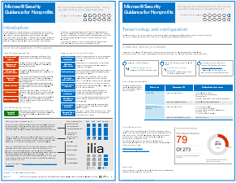

# Wskazówki firmy Microsoft dotyczące zabezpieczeń kampanii politycznych, organizacji niedochodowych i innych organizacji Agile

[!INCLUDE [Microsoft 365 Defender rebranding](../includes/microsoft-defender-for-office.md)]

**Dotyczy**
- [Exchange Online Protection](exchange-online-protection-overview.md)
- [Microsoft Defender dla Office 365 plan 1 i plan 2](defender-for-office-365.md)

 **Podsumowanie:** Wskazówki dotyczące planowania i implementacji dla szybko rozwijających się organizacji, które mają zwiększony profil zagrożeń.

Jeśli Twoja organizacja korzysta z metodyki Agile, korzystasz z małego zespołu IT, a profil zagrożeń jest wyższy niż średnia, te wskazówki są przeznaczone dla Ciebie. To rozwiązanie pokazuje, jak szybko utworzyć środowisko przy użyciu podstawowych usług w chmurze, które od początku zawierają bezpieczne kontrolki. Wskazówki te zawierają preskrybujące zalecenia dotyczące zabezpieczeń w celu ochrony danych, tożsamości, poczty e-mail i dostępu za pomocą urządzeń przenośnych.

## Wskazówki dotyczące rozwiązania zabezpieczającego

W tym przewodniku opisano sposób wdrażania bezpiecznego środowiska chmury. Wskazówki dotyczące rozwiązania mogą być używane przez dowolną organizację. Zapewnia ona dodatkową pomoc dla organizacji Agile dzięki dostępowi BYOD i kontam gości. Te wskazówki mogą stanowić punkt wyjścia do projektowania własnego środowiska. Twoja opinia jest dla nas [CloudAdopt@microsoft.com.](mailto:CloudAdopt@microsoft.com)

****

|Element|Opis|
|---|---|
|**Wskazówki na temat zabezpieczeń firmy Microsoft dla kampanii politycznych**      [PDF](https://download.microsoft.com/download/B/4/D/B4D520C3-4D0C-4B4D-BFB9-09F0651C2775/MSFT_Cloud_architecture_security%20for%20political%20campaigns.pdf) \| [Visio](https://download.microsoft.com/download/B/4/D/B4D520C3-4D0C-4B4D-BFB9-09F0651C2775/MSFT_Cloud_architecture_security%20for%20political%20campaigns.vsdx)|W tych wskazówkach użyto jako przykładu organizacji kampanii politycznych. Niniejszych wskazówek należy używać jako punktu wyjścia dla dowolnego środowiska.|
|**Wskazówki dotyczące zabezpieczeń firmy Microsoft dla organizacji niedochodowych**      [PDF](https://download.microsoft.com/download/9/4/3/94389612-C679-4061-8DF2-D9A15D72B65F/Microsoft_Cloud%20Architecture_Security%20for%20Nonprofits.pdf) \| [Visio](https://download.microsoft.com/download/9/4/3/94389612-C679-4061-8DF2-D9A15D72B65F/Microsoft_Cloud%20Architecture_Security%20for%20Nonprofits.vsdx)|Ten przewodnik został nieco zmieniony dla organizacji niedochodowych. Na przykład odnosi się do Office 365 Nonprofit planów. Wskazówki techniczne są takie same jak w przewodniku po rozwiązaniach kampanii politycznych.|
|

## Zobacz też

[Zasoby dotyczące architektury it chmury firmy Microsoft](../../solutions/cloud-architecture-models.md)
