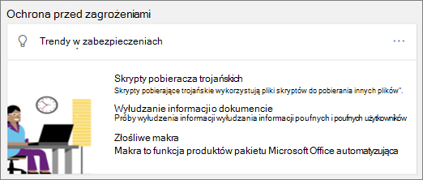

# Badanie zagrożeń i odpowiedź

[!INCLUDE [Microsoft 365 Defender rebranding](../includes/microsoft-defender-for-office.md)]

**Dotyczy**
- [Microsoft Defender dla Office 365 plan 2](defender-for-office-365.md)

Funkcje analizy zagrożeń i reakcji w uchcie [programu Microsoft Defender Office 365](defender-for-office-365.md) analitykom zabezpieczeń i administratorom w zakresie ochrony Microsoft 365 firmowych przez:

- Ułatwia ona identyfikowanie, monitorowanie i zrozumienie cyberataków.
- Pomoc w szybkich rozwiązaniach związanych z Exchange Online, dostępem SharePoint online, OneDrive dla Firm i Microsoft Teams.
- Udostępniaj szczegółowe informacje i wiedzę, aby ułatwić operacje zabezpieczające przed cyberatakami wobec ich organizacji.
- Zautomatyzowanie [badań i reakcji w Office 365](automated-investigation-response-office.md) w przypadku krytycznych zagrożeń związanych z pocztą e-mail.

Funkcje analizy zagrożeń i reagowania zapewniają szczegółowe informacje o zagrożeniach i powiązanych akcjach odpowiedzi dostępnych w Microsoft 365 Defender sieci. Te informacje mogą ułatwić zespołowi ds. zabezpieczeń Twojej organizacji ochronę użytkowników przed atakami opartymi na wiadomościach e-mail i plikach. Te funkcje pomagają monitorować sygnały i zbierać dane z wielu źródeł, takich jak aktywność użytkowników, uwierzytelnianie, poczta e-mail, naruszone komputery i zdarzenia dotyczące zabezpieczeń. Twórcy decyzji biznesowych i twój zespół operacyjny ds. zabezpieczeń mogą za pomocą tych informacji zrozumieć zagrożenia dla organizacji i reagować na nie oraz chronić Twoją własność intelektualną.

## Zapoznanie się z narzędziami do analizy zagrożeń i reagowania

Funkcje analizy zagrożeń i reagowania w portalu Microsoft 365 Defender są <https://security.microsoft.com> zestawem narzędzi i przepływów pracy odpowiedzi, które obejmują:

- [Eksplorator](#explorer)
- [Zdarzenia](#incidents)
- [Szkolenie z symeny ataków](attack-simulation-training.md)
- [Zautomatyzowane badanie i odpowiedź](automated-investigation-response-office.md)

### Eksplorator

Używaj [Eksploratora (i](threat-explorer.md) wykrywanie w czasie rzeczywistym) do analizowania zagrożeń, analizowania liczby ataków w czasie oraz analizowania danych według rodzin zagrożeń, infrastruktury atakujących i nie tylko. Eksplorator zagrożeń (nazywany także Eksploratorem zagrożeń) jest miejscem wyjścia do każdego przepływu pracy analityka analizy zabezpieczeń.

Aby wyświetlić raport i użyć go w portalu Microsoft 365 Defender pod <https://security.microsoft.com>adresem , przejdź do eksploratora współpracy poczty **&-mail**\>. Aby przejść bezpośrednio do strony **Eksploratora** , użyj przeglądarki <https://security.microsoft.com/threatexplorer>.

## Office 365 połączenia analizy zagrożeń

Ta funkcja jest dostępna tylko w przypadku aktywnej subskrypcji usługi Office 365 E5 lub dodatku Analizy zagrożeń. Aby uzyskać więcej informacji, zobacz stronę produktu Office 365 Enterprise E5.

Po włączeniu tej funkcji będzie można dołączać dane z usługi Microsoft Defender for Office 365 do programu Microsoft 365 Defender w celu przeprowadzenia kompleksowego badania zabezpieczeń w skrzynkach pocztowych usługi Office 365 i Windows urządzeniach.

> [!NOTE]
> Aby włączyć tę funkcję, musisz mieć odpowiednią licencję.

Aby otrzymywać kontekstową integrację urządzeń z usługą Office 365 analizą zagrożeń, musisz włączyć ustawienia usługi Defender for Endpoint na pulpicie nawigacyjnym Zabezpieczenia & zgodności.

### Zdarzenia

Lista Zdarzenia (nazywana również Zdarzeniami) pozwala wyświetlić listę zdarzeń bezpieczeństwa lotów. Zdarzenia są używane do śledzenia zagrożeń, takich jak podejrzane wiadomości e-mail, oraz do przeprowadzania dalszych badań i rozwiązywania problemów.

Aby wyświetlić listę bieżących <https://security.microsoft.com>zdarzeń dotyczących organizacji w portalu Microsoft 365 Defender, przejdź do tematu Zdarzenia i **& Zdarzenia** \> **.** Aby przejść bezpośrednio do strony **Zdarzenia**, użyj .<https://security.microsoft.com/incidents>

### Szkolenie z symeny ataków

Skorzystaj ze szkolenia symulacyjnego z użyciem ataków, aby skonfigurować i uruchomić realistycznych cyberataków w organizacji oraz zidentyfikować osoby narażone na ataki, zanim prawdziwe cyberataki nawądną na Twoją firmę. Aby dowiedzieć się więcej, zobacz [Symulowanie ataku służącego do wyłudzania informacji](attack-simulation-training.md).

Aby wyświetlić i używać tej funkcji w <https://security.microsoft.com>portalu Microsoft 365 Defender pod adresem ,  >  przejdź do tematu Szkolenie & e-mail do **współpracyAttack symulacja**. Aby przejść bezpośrednio do strony szkoleniowej symezyjny **ataków** , użyj narzędzia <https://security.microsoft.com/attacksimulator?viewid=overview>.

### Zautomatyzowane badanie i odpowiedź

Skorzystaj z funkcji automatycznego badania i odpowiedzi (AIR), aby zaoszczędzić czas i nakład pracy skorelowany z zawartością, urządzeniami i osobami ryzyka ze strony zagrożeń w organizacji. Procesy AIR mogą być rozpoczynane zawsze po wyzwoleniu określonych alertów lub rozpoczęciu ich przez zespół operacyjny ds. zabezpieczeń. Aby dowiedzieć się więcej, zobacz [Automatyczne badanie i reagowanie w programie Office 365](automated-investigation-response-office.md).

## Widżety analizy zagrożeń

W ramach usługi Microsoft Defender for Office 365 Plan 2 analitycy zabezpieczeń mogą przeglądać szczegóły dotyczące znanego zagrożenia. Jest to przydatne przy określaniu, czy istnieją dodatkowe środki/kroki zapobiegania, które można podjąć, aby zapewnić bezpieczeństwo użytkowników.

## Jak możemy uzyskać te funkcje?

Microsoft 365 analizy zagrożeń i reakcji są zawarte w programie Microsoft Defender for Office 365 Plan 2, który jest zawarty w planie Enterprise E5 lub jako dodatek do niektórych subskrypcji. Aby dowiedzieć się więcej, [zobacz Defender Office 365 Plan 1 i Plan 2](defender-for-office-365.md#microsoft-defender-for-office-365-plan-1-and-plan-2).

## Wymagane role i uprawnienia

Usługa Microsoft Defender dla Office 365 korzysta z kontroli dostępu opartej na rolach. Uprawnienia są przypisywane za pośrednictwem określonych ról w Azure Active Directory, centrum administracyjne platformy Microsoft 365 lub w portalu Microsoft 365 Defender.

> [!TIP]
> Niektóre role, takie jak Administrator zabezpieczeń, można przypisać w portalu Microsoft 365 Defender, ale zamiast tego rozważ centrum administracyjne platformy Microsoft 365 lub Azure Active Directory zabezpieczeń. Aby uzyskać informacje o rolach, grupach ról i uprawnieniach, zobacz następujące zasoby:
>
> - [Uprawnienia w Microsoft 365 Defender portalu](permissions-microsoft-365-security-center.md)
> - [Wbudowane role w usłudze Azure AD](/azure/active-directory/roles/permissions-reference)

 

****

|Działanie|Role i uprawnienia|
|---|---|
|Korzystanie z pulpitu nawigacyjnego zarządzania & zagrożeniami (lub nowego [pulpitu nawigacyjnego zarządzania zabezpieczeniami)](security-dashboard.md) 
 Wyświetlanie informacji o najnowszych lub bieżących zagrożeniach|Jedna z następujących czynności: <ul><li>**Administrator globalny**</li><li>**Administrator zabezpieczeń**</li><li>**Czytnik zabezpieczeń**</li></ul> 
 Te role można przypisywać w programie Azure Active Directory (<https://portal.azure.com>) lub w centrum administracyjne platformy Microsoft 365 (<https://admin.microsoft.com>).|
|Analizowanie zagrożeń za pomocą Eksploratora [(i wykrywania w](threat-explorer.md) czasie rzeczywistym)|Jedna z następujących czynności: <ul><li>**Administrator globalny**</li><li>**Administrator zabezpieczeń**</li><li>**Czytnik zabezpieczeń**</li></ul> 
 Te role można przypisywać w programie Azure Active Directory (<https://portal.azure.com>) lub w centrum administracyjne platformy Microsoft 365 (<https://admin.microsoft.com>).|
|Wyświetlanie zdarzeń (nazywanych również badaniami) 
 Dodawanie wiadomości e-mail do zdarzenia|Jedna z następujących czynności: <ul><li>**Administrator globalny**</li><li>**Administrator zabezpieczeń**</li><li>**Czytnik zabezpieczeń**</li></ul> 
 Te role można przypisywać w programie Azure Active Directory (<https://portal.azure.com>) lub w centrum administracyjne platformy Microsoft 365 (<https://admin.microsoft.com>).|
|Wyzwalanie akcji wiadomości e-mail w przypadku zdarzenia 
 Znajdowanie i usuwanie podejrzanych wiadomości e-mail|Jedna z następujących czynności: <ul><li>**Administrator globalny**</li><li>**Administrator zabezpieczeń** oraz rola **Wyszukiwania i przeczyszczania**</li></ul> 
 Role **administratora globalnego** i **administratora** zabezpieczeń można przypisywać w programie Azure Active Directory (<https://portal.azure.com>) lub w centrum administracyjne platformy Microsoft 365 (<https://admin.microsoft.com>). 
 Rola **Wyszukiwania i przeczyszczania** musi być przypisana w rolach współpracy poczty **e-mail & w** portalu usługi Microsoft 36 Defender (<https://security.microsoft.com>).|
|Integracja programu Microsoft Defender dla Office 365 Plan 2 z programem Microsoft Defender for Endpoint 
 Integracja programu Microsoft Defender dla Office 365 Plan 2 z serwerem SIEM|Administrator **globalny lub administrator** zabezpieczeń z  przypisaną rolą administratora zabezpieczeń Azure Active Directory (<https://portal.azure.com>) lub administratorem centrum administracyjne platformy Microsoft 365 ().<https://admin.microsoft.com> 
 --- **plus** --- 
 Odpowiednia rola przypisana w dodatkowych aplikacjach (takich [Centrum zabezpieczeń usługi Microsoft Defender](/windows/security/threat-protection/microsoft-defender-atp/user-roles) lub serwerze SIEM).|
|

## Następne kroki

- [Informacje na temat śledzenia zagrożeń — nowe i godne uwagi](threat-trackers.md)
- [Znajdowanie i badanie dostarczonych złośliwych wiadomości e-mail (Office 365 analizy zagrożeń i odpowiedzi)](investigate-malicious-email-that-was-delivered.md)
- [Integracja Office 365 analizy zagrożeń i reakcji za pomocą programu Microsoft Defender for Endpoint](integrate-office-365-ti-with-mde.md)
- [Symulowanie ataku wyłudzania informacji](attack-simulation-training.md)
