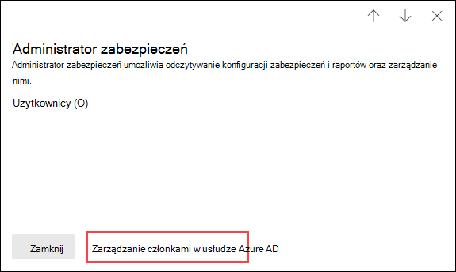

# Uprawnienia w centrum Centrum zgodności platformy Microsoft 365 i Microsoft 365 zabezpieczeń

[!INCLUDE [Microsoft 365 Defender rebranding](../includes/microsoft-defender-for-office.md)]

**Dotyczy**
- [Exchange Online Protection](exchange-online-protection-overview.md)
- [Microsoft Defender dla Office 365 plan 1 i plan 2](defender-for-office-365.md)
- [Microsoft 365 Defender](../defender/microsoft-365-defender.md)

Twoja organizacja musi zarządzać scenariuszami zgodności i zabezpieczeń obejmującej wszystkie Microsoft 365 zabezpieczeń. Potrzebujesz też elastycznego nadawać odpowiednie uprawnienia administratora odpowiednim osobom w grupie IT organizacji. Korzystając z centrum Microsoft 365 zabezpieczeń lub centrum Centrum zgodności platformy Microsoft 365, możesz centralnie zarządzać uprawnieniami do wszystkich zadań związanych z zabezpieczeniami lub zgodnością.

Gdy administrator globalny doda użytkowników do tych ról administratora, ten administrator będzie miał dostęp do funkcji i danych dotyczących wszystkich usług w usłudze Microsoft 365, takich jak centrum zabezpieczeń usługi Microsoft 365, usługi Centrum zgodności platformy Microsoft 365, azure, Office 365 i Enterprise Mobility + Security.

## Czym są Microsoft 365 ról

Role wyświetlane w Centrum zabezpieczeń Centrum zgodności platformy Microsoft 365 i Microsoft 365 zabezpieczeń to Azure Active Directory zabezpieczeń. Te role są zaprojektowane tak, aby były zgodne z funkcjami funkcji w grupie IT organizacji, dzięki czemu można łatwo nadać osobie wszystkie uprawnienia niezbędne do wykonywania swojej pracy.

****

|Rola|Opis|
|---|---|
|**Administrator globalny**|Dostęp do wszystkich funkcji administracyjnych we wszystkich Microsoft 365 usługach. Tylko administratorzy globalni mogą przypisywać inne role administratora. Aby uzyskać więcej informacji, zobacz [Administrator globalny /Administrator firmy](/azure/active-directory/roles/permissions-reference#global-administrator--company-administrator).|
|**Administrator danych zgodności**|Monitoruj dane organizacji w różnych Microsoft 365, upewnij się, że są chronione, i uzyskaj szczegółowe informacje na temat wszelkich problemów, aby zmniejszyć ryzyko. Aby uzyskać więcej informacji, zobacz [Administrator danych zgodności](/azure/active-directory/roles/permissions-reference#compliance-data-administrator).|
|**Administrator zgodności**|Pomóż organizacji zachować zgodność z wymaganiami prawnymi, zarządzać sprawami zbierania elektronicznych materiałów dowodowych i utrzymywać zasady zarządzania danymi w Microsoft 365 lokalizacjach, tożsamościach i aplikacjach. Aby uzyskać więcej informacji, zobacz [Administrator zgodności](/azure/active-directory/roles/permissions-reference#compliance-administrator).|
|**Operator zabezpieczeń**|Wyświetlaj i badaj aktywne zagrożenia oraz odpowiadaj na nie Microsoft 365 użytkowników, urządzeń i zawartości. Aby uzyskać więcej informacji, zobacz [Operator zabezpieczeń](/azure/active-directory/roles/permissions-reference#security-operator).|
|**Czytelnik zabezpieczeń**|Wyświetlaj i badaj aktywne zagrożenia dla użytkowników Microsoft 365, urządzeń i zawartości, ale (w przeciwieństwie do operatora zabezpieczeń) nie mają one uprawnień do reagowania przez podejmowanie działań. Aby uzyskać więcej informacji, zobacz [Czytnik zabezpieczeń](/azure/active-directory/roles/permissions-reference#security-reader).|
|**Administrator zabezpieczeń**|Możesz kontrolować ogólne bezpieczeństwo organizacji, zarządzając zasadami zabezpieczeń, przeglądając analizy zabezpieczeń i raporty Microsoft 365 różnych produktów oraz na bieżąco śledzenia zagrożeń. Aby uzyskać więcej informacji, zobacz [Administrator zabezpieczeń](/azure/active-directory/roles/permissions-reference#security-administrator).|
|**Czytelnik globalny**|Wersja tylko do odczytu roli **administratora globalnego** . Wyświetlanie wszystkich ustawień i informacji administracyjnych w Microsoft 365. Aby uzyskać więcej informacji, zobacz [Czytnik globalny](/azure/active-directory/roles/permissions-reference#global-reader).|
|

## Administratorzy globalni mogą zarządzać rolami w Azure Active Directory

Po Centrum zgodności platformy Microsoft 365 i Microsoft 365 zabezpieczeń po wybraniu roli możesz wyświetlić jej przypisania. Aby jednak zarządzać tymi zadaniami, musisz przejść do Azure Active Directory.

Aby uzyskać więcej informacji, [zobacz Wyświetlanie i przypisywanie ról administratora w programie Azure Active Directory](/azure/active-directory/users-groups-roles/directory-manage-roles-portal).

## Zarządzanie rolami w usłudze zamiast Azure Active Directory

Role wyświetlane w centrum zabezpieczeń usług Centrum zgodności platformy Microsoft 365 i Microsoft 365 są również wyświetlane w usługach, w których mają uprawnienia. Te role można na przykład wyświetlić w Centrum zabezpieczeń & zgodności.

Aby uzyskać informacje na temat sposobu, w jaki te role są używane w Centrum zabezpieczeń & zgodności, zobacz Uprawnienia w Centrum zabezpieczeń & [zgodności](permissions-in-the-security-and-compliance-center.md).

### Przerywanie dziedziczenia

Ważne jest, aby zrozumieć, że gdy zarządzasz tymi rolami w układzie Azure Active Directory, robisz to centralnie **we wszystkich** Microsoft 365 usługach. Jednak gdy zarządzasz rolą w określonej usłudze, takiej jak Centrum zabezpieczeń & zgodności, zarządzasz rolą tylko **dla tej** konkretnej usługi. Przypisania i uprawnienia dla roli w usłudze zastępują wszystkie uprawnienia przyznane Azure Active Directory roli.

Może to być przydatne. Na przykład osoba przypisana do roli administratora zabezpieczeń nie ma uprawnień do zarządzania zdarzeniami. Jednak możesz użyć uprawnień w usłudze Microsoft Defender for Endpoint, aby nadać im konkretne uprawnienia do zarządzania zdarzeniami w tej usłudze.

## Gdzie można znaleźć informacje o rolach dla poszczególnych Microsoft 365 usługi

Przypisując użytkownika do jednej z ról administratora zgodności Microsoft 365 zabezpieczeń lub zgodności, możesz nadać temu użytkownikowi uprawnienia do zakresu usług Microsoft 365 zabezpieczeń. Skorzystaj z poniższych linków, aby uzyskać więcej informacji na temat poszczególnych uprawnień dla roli w poszczególnych usługach.

****

|Microsoft 365 usługi|Informacje o roli|
|---|---|
|Role administratorów w planach Office 365 i Microsoft 365 dla firm|[Microsoft 365 ról administratora](../../admin/add-users/about-admin-roles.md)|
|Azure Active Directory (Azure AD) i Azure AD Identity Protection|[Role administratora usługi Azure AD](/azure/active-directory/users-groups-roles/directory-assign-admin-roles)|
|Microsoft Defender for Identity|[Grupy ról usługi Microsoft Defender dla tożsamości](/azure-advanced-threat-protection/atp-role-groups)|
|Azure Information Protection|[Role administratora usługi Azure AD](/azure/active-directory/users-groups-roles/directory-assign-admin-roles)|
|Menedżer zgodności|[Menedżer zgodności](../../compliance/compliance-manager-setup.md#set-user-permissions-and-assign-roles)|
|Exchange Online|[Exchange kontroli dostępu opartej na rolach](/exchange/permissions-exo/permissions-exo)|
|Intune|[Kontrola dostępu oparta na rolach w usłudze Intune](/intune/role-based-access-control)|
|Zarządzany pulpit|[Role administratora usługi Azure AD](/azure/active-directory/users-groups-roles/directory-assign-admin-roles)|
|Microsoft Cloud App Security|[Kontrola dostępu oparta na rolach](/cloud-app-security/manage-admins)|
|Centrum & zabezpieczeń|[Microsoft 365 ról administratora](permissions-in-the-security-and-compliance-center.md)|
|Privileged Identity Management|[Role administratora usługi Azure AD](/azure/active-directory/users-groups-roles/directory-assign-admin-roles)|
|Secure Score|[Role administratora usługi Azure AD](/azure/active-directory/users-groups-roles/directory-assign-admin-roles)|
|SharePoint Online|[Role administratora usługi Azure AD](/azure/active-directory/users-groups-roles/directory-assign-admin-roles) 
 [Rola administratora usługi SharePoint Online — informacje](/sharepoint/sharepoint-admin-role)|
|Teams/Skype dla firm|[Role administratora usługi Azure AD](/azure/active-directory/users-groups-roles/directory-assign-admin-roles)|
|Ochrona punktu końcowego w usłudze Microsoft Defender|[Program Microsoft Defender for Endpoint — kontrola dostępu oparta na rolach](/windows/security/threat-protection/windows-defender-atp/rbac-windows-defender-advanced-threat-protection)|
|

## Wkrótce

Nadal pracujemy nad uprawnieniami w Centrum zabezpieczeń usługi Centrum zgodności platformy Microsoft 365 i Microsoft 365 zabezpieczeń. Na przykład obecnie pracujemy nad obsługą możliwości:

- Zarządzaj rolami w centrum Centrum zgodności platformy Microsoft 365 i Microsoft 365, zamiast Azure Active Directory.
- Dostosowywanie ról przez dodawanie lub usuwanie określonych uprawnień.
- Tworzenie niestandardowych ról przy użyciu własnych uprawnień.