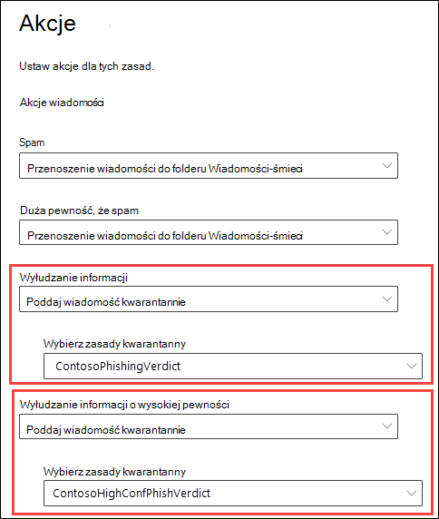
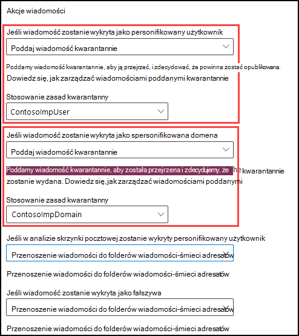
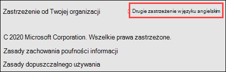
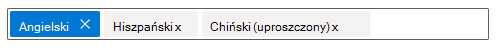
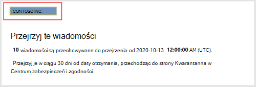
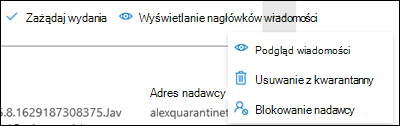

# <a name="quarantine-policies"></a>Zasady kwarantanny

Zasady kwarantanny (wcześniej nazywane tagami kwarantanny _) w_ programach Exchange Online Protection (EOP) i Microsoft Defender dla Office 365 pozwalają administratorom kontrolować, co użytkownicy mogą robić w kwarantannie wiadomości w zależności od tego, dlaczego wiadomość została poddana kwarantannie.

W tradycyjnej bazie danych dozwolonych lub odrzucono poziomy interakcji w kwarantannie wiadomości w zależności od tego, dlaczego wiadomość została poddana kwarantannie. Na przykład użytkownicy mogą wyświetlać i zwalniać wiadomości poddanych kwarantannie przez filtrowanie spamu jako spam lub zbiorczo, ale nie mogą wyświetlać ani zwalniać wiadomości poddanych kwarantannie jako złośliwe oprogramowanie lub oprogramowanie pod kątem wysokiej pewności.

W [przypadku obsługiwanych funkcji](#step-2-assign-a-quarantine-policy-to-supported-features) ochrony zasady kwarantanny określają, co użytkownicy mogą robić na własnych wiadomościach (wiadomościach, do których są adresatami) w kwarantannie i w powiadomieniach _kwarantanny_. [Powiadomienia kwarantanny](use-spam-notifications-to-release-and-report-quarantined-messages.md) zastępują powiadomienia użytkowników końcowych o spamie. Te powiadomienia są teraz kontrolowane przez zasady kwarantanny i zawierają informacje o wiadomościach poddanych kwarantannie dla wszystkich obsługiwanych funkcji ochrony (nie tylko zasad ochrony przed spamem i werdyktów zasad ochrony przed wyłudzaniem informacji).

Domyślne zasady kwarantanny wymuszają historyczne funkcje użytkownika są automatycznie przypisywane do akcji w obsługiwanych funkcjach ochrony, które poddają wiadomości kwarantannie. Można też utworzyć niestandardowe zasady kwarantanny i przypisać je do obsługiwanych funkcji ochrony, aby zezwolić użytkownikom na wykonywanie określonych akcji na tych typach wiadomości poddanych kwarantannie lub uniemożliwić im wykonywanie tych czynności.

Poszczególne uprawnienia do kwarantanny są łączone z następującymi wstępnie ustawionymi grupami uprawnień:

- Brak dostępu
- Ograniczony dostęp
- Pełny dostęp

Poszczególne uprawnienia do kwarantanny zawarte w wstępnie ustawionych grupach uprawnień są opisane w poniższej tabeli:

|Uprawnienie|Brak dostępu|Ograniczony dostęp|Pełny dostęp|
|---|:---:|:---:|:---:|
|**Blokowanie nadawcy** (_PermissionToBlockSender_)||||
|**Delete** (_PermissionToDelete_)||||
|**Podgląd** (_permissionToPreview_)||||
|**Zezwalanie adresatom na wydanie wiadomości z kwarantanny** (_PermissionToRelease_)||||
|**Zezwalaj adresatom na żądanie przesłania wiadomości** do kwarantanny (_PermissionToRequestRelease_)||||

Domyślne zasady kwarantanny, skojarzone z nimi grupy uprawnień oraz informacje o tym, czy powiadomienia kwarantanny są włączone, są opisane w poniższej tabeli:

|Domyślne zasady kwarantanny|Użyta grupa uprawnień|Włączono powiadomienia kwarantanny?|
|---|---|---|
|AdminOnlyAccessPolicy|Brak dostępu|Nie|
|DefaultFullAccessPolicy|Pełny dostęp|Nie|
|NotificationEnabledPolicy<sup>\*</sup>|Pełny dostęp|Tak|

Jeśli uprawnienia domyślne w wstępnie ustawionych grupach uprawnień nie są odpowiednie lub jeśli chcesz włączyć powiadomienia kwarantanny, utwórz niestandardowe zasady kwarantanny i użyj ich. Aby uzyskać więcej informacji o tym, do czego mają uprawnienia, [zobacz sekcję](#quarantine-policy-permission-details) Szczegóły uprawnień do kwarantanny zasad w dalszej części tego artykułu.

Zasady kwarantanny tworzy się i przypisuje w portalu usługi Microsoft 365 Defender lub w programie PowerShell (Exchange Online PowerShell dla organizacji Microsoft 365 ze skrzynkami pocztowymi usługi Exchange Online; autonomiczny program EOP PowerShell w organizacjach usługi EOP bez Exchange Online skrzynki pocztowe).

> [!NOTE]
> Czas przechowywania wiadomości poddanych kwarantannie w kwarantannie, zanim wygaśnie, jest kontrolowany przez politykę Zachowaj **spam** w kwarantannie przez tę wiele dni (_QuarantineRetentionPeriod_) w zasadach ochrony przed spamem. Aby uzyskać więcej informacji, zobacz [Konfigurowanie zasad ochrony przed spamem w u usługi EOP](configure-your-spam-filter-policies.md).
>
> Jeśli zmienisz zasady kwarantanny przypisane do obsługiwanej funkcji ochrony, zmiana ta będzie mieć wpływ na wiadomości poddane kwarantannie po wymażeniu tej zmiany. Ustawienia nowego przydziału zasad kwarantanny nie mają wpływu na wiadomości, które poprzednio zostały poddane kwarantannie przez tę funkcję ochrony.

## <a name="full-access-permissions-and-quarantine-notifications"></a>Uprawnienia pełnego dostępu i powiadomienia kwarantanny

<sup>\*</sup> Zasady kwarantanny o nazwie NotificationEnabledPolicy nie są obecne we wszystkich środowiskach. Zasady kwarantanny NotificationEnabledPolicy są dla Ciebie zgodne z następującymi wymaganiami:

- Twoja organizacja istniała przed włączeniu funkcji zasad kwarantanny (pod koniec lipca/na początku sierpnia 2021 r.).
- W przypadku jednej lub większej liczby zasad ochrony przed [spamem](configure-your-spam-filter-policies.md) (domyślne zasady ochrony przed spamem lub niestandardowe zasady ochrony przed spamem) było włączone ustawienie Włącz powiadomienia użytkowników końcowych o **spamie** .

Zgodnie z wcześniejszym opisem powiadomienia kwarantanny w zasadach kwarantanny zastępują powiadomienia użytkowników końcowych o spamie używane do ich włączanie i wyłączanie w zasadach ochrony przed spamem. Wbudowane zasady kwarantanny o nazwie DefaultFullAccessPolicy duplikują uprawnienia historyczne  dla wiadomości poddanych kwarantannie,  ale powiadomienia kwarantanny nie są włączone w zasadach kwarantanny. Ponadto, ponieważ nie można modyfikować wbudowanych zasad, nie można włączyć powiadomień kwarantanny w programie DefaultFullAccessPolicy.

Aby zapewnić uprawnienia ustawienia DefaultFullAccessPolicy, ale z włączonymi powiadomieniami kwarantanny, utworzono zasady o nazwie NotificationEnabledPolicy, które mają być w miejscu wartości DefaultFullAccessPolicy dla organizacji, które jej potrzebowały (w organizacjach, w których włączona była opcja powiadomień użytkowników końcowych o spamie).

W przypadku nowych lub starszych organizacji, w których powiadomienia użytkowników końcowych o spamie nigdy nie były włączone w zasadach ochrony przed spamem, nie będą dostępne zasady kwarantanny o nazwie NotificationEnabledPolicy. Sposobem na włączenie powiadomień kwarantanny jest utworzenie i używanie niestandardowych zasad kwarantanny, w których są włączone powiadomienia kwarantanny.

## <a name="what-do-you-need-to-know-before-you-begin"></a>Co należy wiedzieć przed rozpoczęciem?

- Otwierasz portal Microsoft 365 Defender w witrynie <https://security.microsoft.com>. Aby przejść bezpośrednio do strony **Zasady kwarantanny**, użyj .<https://security.microsoft.com/quarantinePolicies>

- Aby nawiązać połączenie Exchange Online PowerShell, zobacz Połączenie[, Exchange Online PowerShell](/powershell/exchange/connect-to-exchange-online-powershell). Aby nawiązać połączenie z autonomicznym programem PowerShell usługi EOP, [Połączenie się z Exchange Online Protection PowerShell](/powershell/exchange/connect-to-exchange-online-protection-powershell).

- Aby wyświetlać, tworzyć, modyfikować lub usuwać zasady kwarantanny, musisz być członkiem ról Zarządzanie **organizacją,** **Administrator** zabezpieczeń lub Administrator kwarantanny w portalu Microsoft 365 Defender. Aby uzyskać więcej informacji, [zobacz Uprawnienia w portalu Microsoft 365 Defender użytkowników](permissions-microsoft-365-security-center.md).

## <a name="step-1-create-quarantine-policies-in-the-microsoft-365-defender-portal"></a>Krok 1. Tworzenie zasad kwarantanny w portalu Microsoft 365 Defender poczty

1. W portalu [Microsoft 365 Defender przejdź](https://security.microsoft.com) \> do sekcji & e-mail i zasad & **zasad** \>  \> zagrożeń. 

2. Na stronie **Zasady kwarantanny** kliknij ikonę  **Dodawanie zasad niestandardowych**.

3. Zostanie **otwarty kreator Nowych** zasad. Na stronie **Nazwa zasad** wprowadź krótką, ale unikatową nazwę w **polu Nazwa zasad** . W kolejnych krokach należy zidentyfikować i wybrać zasady kwarantanny według nazwy. Po zakończeniu kliknij przycisk **Dalej**.

4. Na stronie **Dostęp do wiadomości adresata** wybierz jedną z następujących wartości:
   - **Ograniczony dostęp**: Poszczególne uprawnienia zawarte w tej grupie uprawnień są opisane wcześniej w tym artykule.
   - **Ustaw określony dostęp (zaawansowany)**: ta wartość umożliwia określenie uprawnień niestandardowych. Skonfiguruj wyświetlone następujące ustawienia:
     - **Wybierz preferencję akcji zwolnienia**: Wybierz jedną z następujących wartości:
       - Puste: jest to wartość domyślna.
       - **Zezwalanie adresatom na wypuszczenie wiadomości z kwarantanny**
       - **Zezwalaj adresatom na żądanie wypuszczeniu wiadomości z kwarantanny**
     - **Wybierz dodatkowe akcje, które adresaci mogą podjąć w przypadku** wiadomości poddanych kwarantannie: Zaznacz niektóre, wszystkie lub żadną z następujących wartości:
       - **Usuń**
       - **Wersja zapoznawcza**
       - **Blokowanie nadawcy**

   Te uprawnienia i ich wpływ na wiadomości poddanych kwarantannie oraz w powiadomieniach kwarantanny opisano w sekcji Szczegóły uprawnień zasad [kwarantanny w](#quarantine-policy-permission-details) dalszej części tego artykułu.

   Po zakończeniu kliknij przycisk **Dalej**.

5. Na stronie **Powiadomienia użytkowników końcowych o spamie** wybierz pozycję **Włącz** , aby włączyć powiadomienia kwarantanny (wcześniej nazywane powiadomieniami użytkowników końcowych o spamie). Po zakończeniu kliknij przycisk **Dalej**.

   > [!NOTE]
   > Jak wyjaśniono wcześniej, wbudowane zasady (AdminOnlyAccessPolicy lub DefaultFullAccessPolicy) nie mają włączonych powiadomień poddanych kwarantannie i nie można ich modyfikować.

6. Na **stronie Przeglądanie zasad** przejrzyj ustawienia. Możesz wybrać pozycję **Edytuj** w każdej sekcji, aby zmodyfikować ustawienia w sekcji. Możesz też kliknąć przycisk **Wstecz** lub wybrać określoną stronę w kreatorze.

   Po zakończeniu kliknij pozycję **Prześlij**.

7. Na wyświetlonej stronie potwierdzenia kliknij pozycję **Gotowe**.

Teraz możesz przypisać zasady kwarantanny do funkcji kwarantanny zgodnie z opisem w [sekcji Krok 2](#step-2-assign-a-quarantine-policy-to-supported-features) .

### <a name="create-quarantine-policies-in-powershell"></a>Tworzenie zasad kwarantanny w programie PowerShell

Jeśli wolisz tworzyć zasady kwarantanny za pomocą programu PowerShell, połącz się z programem Exchange Online PowerShell lub programem Exchange Online Protection PowerShell i użyj polecenia cmdlet **New-QuarantinePolicy**.

> [!NOTE]
> Jeśli nie używasz parametru _ESNEnabled_ `$true`i wartości , powiadomienia kwarantanny są wyłączone.

#### <a name="use-the-enduserquarantinepermissionsvalue-parameter"></a>Użyj parametru EndUserQuarantinePermissionsValue

Aby utworzyć zasady kwarantanny przy użyciu _parametru EndUserQuarantinePermissionsValue_ , użyj następującej składni:

```powershell
New-QuarantinePolicy -Name "<UniqueName>" -EndUserQuarantinePermissionsValue <0 to 236> [-EsnEnabled $true]
```

Parametr _EndUserQuarantinePermissionsValue_ używa wartości dziesiętnej przekonwertowanej z wartości binarnej. Wartość binarna odpowiada dostępnym uprawnieniam użytkownika końcowego do kwarantanny w określonej kolejności. Dla każdego uprawnienia wartość 1 jest równa wartości Prawda, a wartość 0 równa się Fałsz.

Wymaganą kolejność i wartości dla poszczególnych uprawnień opisano w poniższej tabeli:

|Uprawnienie|Wartość dziesiętna|Wartość binarna|
|---|:---:|:---:|
|PermissionToViewHeader<sup>\*</sup>|128|10000000|
|PermissionToDownload<sup>\*\*</sup>|64|01000000|
|PermissionToAllowSender<sup>\*\*</sup>|32|00100000|
|PermissionToBlockSender|16|00010000|
|PermissionToRequestRelease<sup>\*\*\*</sup>|8|00001000|
|PermissionToRelease<sup>\*\*\*</sup>|4|00000100|
|PermissionToPreview|2|00000010|
|PermissionToDelete|1|00000001|

<sup>\*</sup>Wartość 0 nie powoduje ukrycia przycisku Wyświetl  nagłówek wiadomości w szczegółach wiadomości poddanej kwarantannie (przycisk jest zawsze dostępny).

<sup>\*\*</sup> To ustawienie nie jest używane (wartość 0 lub 1 nic nie robi).

<sup>\*\*\*</sup> Nie ustawiaj wartości obu tych wartości na 1. Ustaw jedną wartość na 1, a drugą na 0 lub wartość 0 obu na 0.

W przypadku uprawnień z ograniczonym dostępem wymagane wartości:

|Uprawnienie|Ograniczony dostęp|
|---|:--:|
|PermissionToViewHeader|0|
|PermissionToDownload|0|
|PermissionToAllowSender|0|
|PermissionToBlockSender|1|
|PermissionToRequestRelease|1|
|PermissionToRelease|0|
|PermissionToPreview|1|
|PermissionToDelete|1|
|Wartość binarna|00011011|
|Wartość dziesiętna do użycia|27|

W tym przykładzie są pisywane nowe zasady kwarantanny o nazwie Ograniczony dostęp z włączonymi powiadomieniami kwarantanny, w których są przypisywane uprawnienia Ograniczony dostęp zgodnie z opisem w poprzedniej tabeli.

```powershell
New-QuarantinePolicy -Name LimitedAccess -EndUserQuarantinePermissionsValue 27 -EsnEnabled $true
```

W przypadku uprawnień niestandardowych użyj poprzedniej tabeli, aby uzyskać wartość binarną odpowiadającą wymaganym uprawnieniam. Przekonwertuj wartość binarną na wartość dziesiętną i użyj wartości dziesiętnej dla parametru _EndUserQuarantinePermissionsValue_ . Nie używaj wartości binarnej dla wartości parametru.

Aby uzyskać szczegółowe informacje o składni i parametrach, [zobacz New-QuarantinePolicy](/powershell/module/exchange/new-quarantinepolicy).

## <a name="step-2-assign-a-quarantine-policy-to-supported-features"></a>Krok 2. Przypisywanie zasad kwarantanny do obsługiwanych funkcji

W _obsługiwanych_ funkcjach ochrony, które poddasz kwarantannie wiadomości e-mail, możesz przypisać zasady kwarantanny do dostępnych akcji kwarantanny. Funkcje kwarantanny wiadomości i dostępność zasad kwarantanny są opisane w poniższej tabeli:

|Funkcja|Czy zasady kwarantanny są obsługiwane?|Domyślne zasady kwarantanny używane|
|---|:---:|---|
|[Zasady ochrony przed spamem](configure-your-spam-filter-policies.md): <ul><li>**Spam** (_SpamAction_)</li><li>**Spam o dużej pewności** (_HighConfidenceSpamAction_)</li><li>**Wyłudzanie** informacji (_phishSpamAction_)</li><li>**Wyłudzanie informacji** o wysokiej pewności (_HighConfidencePhishAction_)</li><li>**Bulk** (_BulkSpamAction_)</li></ul>|Tak|<ul><li>DefaultFullAccessPolicy<sup>\*</sup> (pełny dostęp)</li><li>DefaultFullAccessPolicy<sup>\*</sup> (pełny dostęp)</li><li>DefaultFullAccessPolicy<sup>\*</sup> (pełny dostęp)</li><li>AdminOnlyAccessPolicy (Brak dostępu)</li><li>DefaultFullAccessPolicy<sup>\*</sup> (pełny dostęp)</li></ul>|
|Zasady ochrony przed wyłudzaniem informacji: <ul><li>[Ochrona przed fałszerami](set-up-anti-phishing-policies.md#spoof-settings) (_UwierzytelnianieFailucja_)</li><li>[Ochrona personifikacji w uchcie Defender dla Office 365](set-up-anti-phishing-policies.md#impersonation-settings-in-anti-phishing-policies-in-microsoft-defender-for-office-365):<ul><li>**Jeśli wiadomość zostanie wykryta jako personifikowany użytkownik** (_TargetedUserProtectionAction_)</li><li>**Jeśli wiadomość zostanie wykryta jako spersonifikowana domena** (_TargetedDomainProtectionAction_)</li><li>**Jeśli inteligencja skrzynek pocztowych wykryje i personifikuje** użytkownika (_MailboxIntelligenceProtectionAction_)</li></ul></li></ul>|Tak|<ul><li>DefaultFullAccessPolicy<sup>\*</sup> (pełny dostęp)</li><li>Ochrona personifikacji:<ul><li>DefaultFullAccessPolicy<sup>\*</sup> (pełny dostęp)</li><li>DefaultFullAccessPolicy<sup>\*</sup> (pełny dostęp)</li><li>DefaultFullAccessPolicy<sup>\*</sup> (pełny dostęp)</li></ul></li></ul>|
|[Zasady ochrony przed złośliwym oprogramowaniem](configure-anti-malware-policies.md): Wszystkie wykryte wiadomości są zawsze poddane kwarantannie.|Tak|AdminOnlyAccessPolicy (Brak dostępu)|
|[Sejf załączników](safe-attachments.md): <ul><li>W przypadku wiadomości e-mail z załącznikami poddanymi kwarantannie jako złośliwe oprogramowanie Sejf zasady dotyczące załączników (_Włączanie_ i _działanie_)</li><li>Pliki poddane kwarantannie jako złośliwe oprogramowanie [przez Sejf załączników do SharePoint, OneDrive i Microsoft Teams](mdo-for-spo-odb-and-teams.md)</li></ul>|<ul><li>Tak</li><li>Nie</li></ul>|<ul><li>AdminOnlyAccessPolicy (Brak dostępu)</li><li>n/a</li></ul>|
|[Reguły przepływu poczty](/exchange/security-and-compliance/mail-flow-rules/mail-flow-rules) (nazywane także regułami transportu) z akcją: **Dostarczanie** wiadomości do hostowanej kwarantanny (_Kwarantanna_).|Nie|n/a|

<sup>\*</sup> Jak [opisano wcześniej w tym artykule](#full-access-permissions-and-quarantine-notifications), organizacja może używać funkcji NotificationEnabledPolicy zamiast wartości DefaultFullAccessPolicy. Jedyna różnica między tymi dwoma zasadami kwarantanny to, że powiadomienia kwarantanny są włączone w notificationEnabledPolicy i wyłączone w defaultFullAccessPolicy.

Domyślne zasady kwarantanny, wstępnie ustawione grupy uprawnień i uprawnienia opisano na początku [tego](#quarantine-policies) artykułu i w [dalszej części tego artykułu](#preset-permissions-groups).

> [!NOTE]
> Jeśli domyślne uprawnienia użytkownika końcowego i powiadomienia kwarantanny są dostępne (lub nie) przez domyślne zasady kwarantanny, nie musisz nic robić. Jeśli chcesz dodać lub usunąć funkcje użytkowników końcowych (dostępne przyciski) dla wiadomości poddanych kwarantannie użytkownika lub włączyć powiadomienia kwarantanny oraz dodać lub usunąć te same funkcje w powiadomieniach kwarantanny, możesz przypisać inne zasady kwarantanny do akcji kwarantanny.

## <a name="assign-quarantine-policies-in-supported-policies-in-the-microsoft-365-defender-portal"></a>Przypisywanie zasad kwarantanny w obsługiwanych zasadach w Microsoft 365 Defender klienta

### <a name="anti-spam-policies"></a>Zasady ochrony przed spamem

1. W portalu [Microsoft 365 Defender przejdź](https://security.microsoft.com) \> do sekcji Zasady & wiadomości **e-mail** **i &** \>  \> zasady zagrożeń Ochrona przed spamem **w sekcji** Zasady.

   Aby przejść bezpośrednio do strony Zasady dotyczące używania **spamu przez Ant-spam**, użyj .<https://security.microsoft.com/antispam>

2. Na stronie **Zasady ochrony przed spamem** wykonaj jedną z następujących czynności:
   - Znajdź i wybierz istniejące zasady **przychodzącej** ochrony przed spamem.
   - Utwórz nowe zasady **przychodzącej** ochrony przed spamem.

3. Wykonaj jedną z następujących czynności:
   - **Edytuj istniejące**: Wybierz zasady, klikając nazwę zasad. W wysuwanych szczegółach zasad przejdź do sekcji **Akcje** , a następnie kliknij pozycję **Edytuj akcje**.
   - **Utwórz nowe**: W kreatorze nowych zasad uzyskaj stronę **Akcje** .

4. Na stronie **Akcje każdy** werdykt z akcją kwarantanny wiadomości będzie również  miał pole Wybierz zasady kwarantanny, aby można było wybrać odpowiednie zasady kwarantanny.

   **Uwaga**: Gdy tworzysz nowe zasady, wartość pustych  zasad Wybierz kwarantannę wskazuje domyślne zasady kwarantanny dla tego werdyktu. Podczas późniejszego edytowania zasad puste wartości są zamieniane na rzeczywiste domyślne nazwy zasad kwarantanny zgodnie z opisem w poprzedniej tabeli.

   

Pełne instrukcje dotyczące tworzenia i modyfikowania zasad ochrony przed spamem opisano w tece Konfigurowanie zasad ochrony [przed spamem w uciekaniu usługi EOP](configure-your-spam-filter-policies.md).

#### <a name="anti-spam-policies-in-powershell"></a>Zasady ochrony przed spamem w programie PowerShell

Jeśli wolisz używać programu PowerShell do przypisywania zasad kwarantanny w zasadach ochrony przed spamem, połącz się z programem Exchange Online PowerShell lub Exchange Online Protection PowerShell i użyj następującej składni:

```powershell
<New-HostedContentFilterPolicy -Name "<Unique name>" | Set-HostedContentFilterPolicy -Identity "<Policy name>"> [-SpamAction Quarantine] [-SpamQuarantineTag <QuarantineTagName>] [-HighConfidenceSpamAction Quarantine] [-HighConfidenceSpamQuarantineTag <QuarantineTagName>] [-PhishSpamAction Quarantine] [-PhishQuarantineTag <QuarantineTagName>] [-HighConfidencePhishQuarantineTag <QuarantineTagName>] [-BulkSpamAction Quarantine] [-BulkQuarantineTag <QuarantineTagName>] ...
```

**Uwagi**:

- Wartość domyślna parametrów _PhishSpamAction_ i _HighConfidencePhishAction_ to Kwarantanna, więc nie musisz ich używać podczas tworzenia nowych zasad filtru spamu w programie PowerShell. W przypadku _parametrów Akcji_ spamu, _HighConfidenceSpamAction_ i _BulkSpamAction_ w nowych lub istniejących zasadach ochrony przed spamem zasady kwarantanny mają wartość Kwarantanna tylko wtedy, gdy jej wartość to Kwarantanna.

  Aby wyświetlić ważne wartości parametrów w istniejących zasadach ochrony przed spamem, uruchom następujące polecenie:

  ```powershell
  Get-HostedContentFilterPolicy | Format-List Name,*SpamAction,HighConfidencePhishAction,*QuarantineTag
  ```

  Aby uzyskać informacje o domyślnych wartościach akcji i wartościach akcji zalecanych dla ustawień Standardowe i Ścisłe, zobacz Ustawienia zasad ochrony [przed spamem firmy EOP](recommended-settings-for-eop-and-office365.md#eop-anti-spam-policy-settings).

- Podczas tworzenia nowych zasad ochrony przed spamem werdykt filtrowania spamu bez odpowiadającego parametru zasad kwarantanny oznacza, że dla tego werdyktu są używane domyślne zasady kwarantanny.[](#step-2-assign-a-quarantine-policy-to-supported-features)

  Domyślne zasady kwarantanny musisz zastąpić niestandardowymi zasadami kwarantanny tylko wtedy, gdy chcesz zmienić domyślne funkcje użytkowników końcowych w wiadomościach poddanych kwarantannie dla tego konkretnego werdyktu filtrowania spamu.

- Nowe zasady ochrony przed spamem w programie PowerShell wymagają zasad (ustawień) filtrowania spamu przy użyciu polecenia cmdlet **New-HostedContentFilterPolicy** i wyjątkowej reguły filtrowania spamu (filtrów adresatów) przy użyciu polecenia cmdlet **New-HostedContentFilterRule** . Aby uzyskać instrukcje, [zobacz Tworzenie zasad ochrony przed spamem za pomocą programu PowerShell](configure-your-spam-filter-policies.md#use-powershell-to-create-anti-spam-policies).

W tym przykładzie są owane nowe zasady filtrowania spamu o nazwie Dział badań z następującymi ustawieniami:

- Akcja dla wszystkich werdyktów filtrowania spamu jest ustawiona na Kwarantannę.
- Niestandardowe zasady kwarantanny o nazwie NoAccess, które  przypisują uprawnienia Brak dostępu, zastępują domyślne zasady kwarantanny, które domyślnie nie przypisują jeszcze **żadnych** uprawnień dostępu.

```powershell
New-HostedContentFilterPolicy -Name "Research Department" -SpamAction Quarantine -SpamQuarantineTag NoAccess -HighConfidenceSpamAction Quarantine -HighConfidenceSpamQuarantineTag NoAction -PhishSpamAction Quarantine -PhishQuarantineTag NoAction -BulkSpamAction Quarantine -BulkQuarantineTag NoAccess
```

Aby uzyskać szczegółowe informacje o składni i parametrach, [zobacz New-HostedContentFilterPolicy](/powershell/module/exchange/new-hostedcontentfilterpolicy).

W tym przykładzie zmodyfikowane są istniejące zasady filtrowania spamu o nazwie Zasoby ludzkie. Akcja dla werdyktu kwarantanny antyspamowej jest ustawiona na kwarantannę i zostanie przypisana niestandardowa zasada kwarantanny o nazwie NoAccess.

```powershell
Set-HostedContentFilterPolicy -Identity "Human Resources" -SpamAction Quarantine -SpamQuarantineTag NoAccess
```

Aby uzyskać szczegółowe informacje o składni i parametrach, [zobacz Set-HostedContentFilterPolicy](/powershell/module/exchange/set-hostedcontentfilterpolicy).

### <a name="anti-phishing-policies"></a>Zasady ochrony przed wyłudzaniem informacji

Funkcje spoof intelligence są dostępne w programach EOP i Defender for Office 365. Ochrona personifikacji użytkownika, ochrona personifikacji domeny i inteligencja skrzynek pocztowych są dostępne tylko w u kont Office 365. Aby uzyskać więcej informacji, zobacz [Zasady ochrony przed wyłudzaniem informacji w programie Microsoft 365](set-up-anti-phishing-policies.md).

1. W portalu [Microsoft 365 Defender przejdź](https://security.microsoft.com) \> do sekcji Zasady & **e-mail** **&** \>  \> zasad ochrony przed zagrożeniami, które mają na celu ochrona przed wyłudzaniem informacji.

   Aby przejść bezpośrednio do strony Zasady dotyczące używania **spamu przez Ant-spam**, użyj .<https://security.microsoft.com/antiphishing>

2. Na stronie **ochrona przed wyłudzaniem** informacji wykonaj jedną z następujących czynności:
   - Znajdź i wybierz istniejące zasady ochrony przed wyłudzaniem informacji.
   - Utwórz nowe zasady ochrony przed wyłudzaniem informacji.

3. Wykonaj jedną z następujących czynności:
   - **Edytuj istniejące**: Wybierz zasady, klikając nazwę zasad. W wysuwanych szczegółach zasad przejdź do sekcji **Ustawienia ochrony** , a następnie kliknij **pozycję Edytuj ustawienia ochrony**.
   - **Utwórz nowe**: W kreatorze nowych zasad uzyskaj stronę **Akcje** .

4. Na stronie **Ustawienia ochrony** sprawdź, czy następujące ustawienia są włączone i skonfigurowane zgodnie z wymaganiami:
   - **Włączoną ochronę dla użytkowników**: Określanie użytkowników.
   - **Włączone domeny do ochrony**: Wybierz pozycję **Uwzględnij domeny, których jestem właścicielem** i/lub **Uwzględnij domeny niestandardowe** i określ domeny.
   - **Włączanie analizy skrzynek pocztowych**
   - **Włączanie analizy dla ochrony personifikacji**
   - **Włączanie analizy fałszowania**

5. Wykonaj jedną z następujących czynności:
   - **Edytuj istniejące**: W wysuwanych szczegółach zasad przejdź do sekcji **Akcje** , a następnie kliknij pozycję **Edytuj akcje**.
   - **Utwórz nowe**: W kreatorze nowych zasad uzyskaj stronę **Akcje** .

6. Na stronie **Akcje każdy** werdykt, który ma  akcję Kwarantanna wiadomości, również będzie zawierał pole Zastosuj zasady kwarantanny, aby można było wybrać odpowiednie zasady kwarantanny.

   **Uwaga**: Po utworzeniu nowych zasad pusta wartość zasad Zastosuj  kwarantannę wskazuje domyślne zasady kwarantanny dla tej akcji. Podczas późniejszego edytowania zasad puste wartości są zamieniane na rzeczywiste domyślne nazwy zasad kwarantanny zgodnie z opisem w poprzedniej tabeli.

   

Pełne instrukcje dotyczące tworzenia i modyfikowania zasad ochrony przed wyłudzaniem informacji są dostępne w następujących tematach:

- [Konfigurowanie zasad ochrony przed wyłudzaniem informacji w u usługi EOP](configure-anti-phishing-policies-eop.md)
- [Konfigurowanie zasad ochrony przed wyłudzaniem informacji w programie Microsoft Defender dla Office 365](configure-mdo-anti-phishing-policies.md)

#### <a name="anti-phishing-policies-in-powershell"></a>Zasady ochrony przed wyłudzaniem informacji w programie PowerShell

Jeśli wolisz używać programu PowerShell do przypisywania zasad kwarantanny w zasadach ochrony przed wyłudzaniem informacji, połącz się z programem Exchange Online PowerShell lub Exchange Online Protection PowerShell i użyj następującej składni:

```powershell
<New-AntiPhishPolicy -Name "<Unique name>" | Set-AntiPhishPolicy -Identity "<Policy name>"> [-EnableSpoofIntelligence $true] [-AuthenticationFailAction Quarantine] [-SpoofQuarantineTag <QuarantineTagName>] [-EnableMailboxIntelligence $true] [-EnableMailboxIntelligenceProtection $true] [-MailboxIntelligenceProtectionAction Quarantine] [-MailboxIntelligenceQuarantineTag <QuarantineTagName>] [-EnableOrganizationDomainsProtection $true] [-EnableTargetedDomainsProtection $true] [-TargetedDomainProtectionAction Quarantine] [-TargetedDomainQuarantineTag <QuarantineTagName>] [-EnableTargetedUserProtection $true] [-TargetedUserProtectionAction Quarantine] [-TargetedUserQuarantineTag <QuarantineTagName>] ...
```

**Uwagi**:

- Parametr _Włącz\*_ jest wymagany do włączenia określonych funkcji ochrony. Wartość domyślna parametrów _EnableMailboxIntelligence_ i _EnableSpoofIntelligence_ to $true, więc nie trzeba ich używać podczas tworzenia nowych zasad ochrony przed wyłudami w programie PowerShell. Wszystkie inne _parametry Włącz\*_ muszą mieć wartość $true, aby można było ustawić wartość Kwarantanna _\*_ w odpowiednich parametrach akcji, a następnie przypisać zasady kwarantanny. Żaden z parametrów _*\Action_ nie ma wartości domyślnej Kwarantanna.

  Aby wyświetlić ważne wartości parametrów w istniejących zasadach ochrony przed wyłudami, uruchom następujące polecenie:

  ```powershell
  Get-AntiPhishPolicy | Format-List Name,Enable*Intelligence,Enable*Protection,*Action,*QuarantineTag
  ```

  Aby uzyskać informacje o domyślnych wartościach akcji oraz wartościach akcji zalecanych dla ustawień Standardowe i Ścisłe, zobacz Ustawienia zasad ochrony przed wyłudzaniem informacji usługi [EOP](recommended-settings-for-eop-and-office365.md#eop-anti-phishing-policy-settings) i Ustawienia personifikacji w zasadach ochrony przed wyłudzaniem informacji w uchcie [Microsoft Defender for Office 365](recommended-settings-for-eop-and-office365.md#impersonation-settings-in-anti-phishing-policies-in-microsoft-defender-for-office-365).

- Podczas tworzenia zasad ochrony przed wyłudzaniem informacji akcja zapobiegająca wyłudzaniu informacji bez odpowiedniego [](#step-2-assign-a-quarantine-policy-to-supported-features) parametru zasad kwarantanny oznacza, że są używane domyślne zasady kwarantanny dla tego werdyktu.

  Domyślne zasady kwarantanny musisz zastąpić niestandardowymi zasadami kwarantanny tylko wtedy, gdy chcesz zmienić domyślne funkcje użytkowników końcowych w wiadomościach poddanych kwarantannie dla tego konkretnego werdyktu.

- Nowe zasady ochrony przed wyłudzaniem informacji w programie PowerShell wymagają zasad ochrony przed wyłudzaniem informacji (ustawień) przy użyciu polecenia cmdlet **New-AntiPhishPolicy** i wyjątkowej reguły ochrony przed wyłudzaniem informacji (filtrów adresatów) przy użyciu polecenia cmdlet **New-AntiPhishRule** . Aby uzyskać instrukcje, zobacz następujące tematy:
  - [Konfigurowanie zasad ochrony przed wyłudzaniem informacji w u programie EOP za pomocą programu PowerShell](configure-anti-phishing-policies-eop.md#use-exchange-online-powershell-to-configure-anti-phishing-policies)
  - [Konfigurowanie Exchange Online wyłudzania informacji przy użyciu programu PowerShell](configure-mdo-anti-phishing-policies.md#use-exchange-online-powershell-to-configure-anti-phishing-policies)

W tym przykładzie są  tworzyne nowe zasady ochrony przed wyłudami o nazwie Dział badań z następującymi ustawieniami:

- Akcja dla wszystkich werdyktów filtrowania spamu jest ustawiona na Kwarantannę.
- Niestandardowe zasady kwarantanny o nazwie NoAccess, które  przypisują uprawnienia Brak dostępu, zastępują domyślne zasady kwarantanny, które domyślnie nie przypisują jeszcze **żadnych** uprawnień dostępu.

```powershell
New-AntiPhishPolicy -Name "Research Department" -AuthenticationFailAction Quarantine -SpoofQuarantineTag NoAccess -EnableMailboxIntelligenceProtection $true -MailboxIntelligenceProtectionAction Quarantine -MailboxIntelligenceQuarantineTag NoAccess -EnableOrganizationDomainsProtection $true -EnableTargetedDomainsProtection $true -TargetedDomainProtectionAction Quarantine -TargetedDomainQuarantineTag NoAccess -EnableTargetedUserProtection $true -TargetedUserProtectionAction Quarantine -TargetedUserQuarantineTag NoAccess
```

Aby uzyskać szczegółowe informacje o składni i parametrach, [zobacz New-AntiPhishPolicy](/powershell/module/exchange/new-antiphishpolicy).

W tym przykładzie zmodyfikuje się istniejącą politykę anty wyłud klasyfikacyjną o nazwie Zasoby ludzkie. Akcja dla wiadomości wykrytych przez personifikację użytkownika i personifikację domeny jest ustawiana na Kwarantannę i jest przypisywana niestandardowa zasada kwarantanny o nazwie NoAccess.

```powershell
Set-AntiPhishPolicy -Identity "Human Resources" -EnableTargetedDomainsProtection $true -TargetedDomainProtectionAction Quarantine -TargetedDomainQuarantineTag NoAccess -EnableTargetedUserProtection $true -TargetedUserProtectionAction Quarantine -TargetedUserQuarantineTag NoAccess
```

Aby uzyskać szczegółowe informacje o składni i parametrach, [zobacz Set-AntiPhishPolicy](/powershell/module/exchange/set-antiphishpolicy).

### <a name="anti-malware-policies"></a>Zasady ochrony przed złośliwym oprogramowaniem

1. W portalu [Microsoft 365 Defender przejdź](https://security.microsoft.com) \> do sekcji Zasady & **e-mail** **i & zasady** \>  \> zagrożeń chroniące przed złośliwym oprogramowaniem w **sekcji** Zasady.

   Aby przejść bezpośrednio do strony ochrony **przed złośliwym oprogramowaniem**, użyj .<https://security.microsoft.com/antimalwarev2>

2. Na stronie **ochrona przed złośliwym oprogramowaniem** wykonaj jedną z następujących czynności:
   - Znajdź i wybierz istniejące zasady ochrony przed złośliwym oprogramowaniem.
   - Utwórz nowe zasady ochrony przed złośliwym oprogramowaniem.

3. Wykonaj jedną z następujących czynności:
   - **Edytuj istniejące**: Wybierz zasady, klikając nazwę zasad. W wysuwanych szczegółach zasad przejdź do sekcji **Ustawienia ochrony** , a następnie kliknij **pozycję Edytuj ustawienia ochrony**.
   - **Utwórz nowe**: W kreatorze nowych zasad uzyskaj stronę **Akcje** .

4. Na stronie **Ustawienia ochrony** wybierz zasady kwarantanny w polu **Zasady kwarantanny** .

   **Uwaga**: Po utworzeniu nowych zasad pusta wartość zasad kwarantanny wskazuje domyślne zasady kwarantanny, które są używane. Podczas późniejszego edytowania zasad pusta wartość jest zamieniana na rzeczywistą domyślną nazwę zasad kwarantanny zgodnie z opisem w poprzedniej tabeli.

#### <a name="anti-malware-policies-in-powershell"></a>Zasady ochrony przed złośliwym oprogramowaniem w programie PowerShell

Jeśli wolisz używać programu PowerShell do przypisywania zasad kwarantanny w zasadach ochrony przed złośliwym oprogramowaniem, połącz się z programem Exchange Online PowerShell lub Exchange Online Protection PowerShell i użyj następującej składni:

```powershell
<New-AntiMalwarePolicy -Name "<Unique name>" | Set-AntiMalwarePolicy -Identity "<Policy name>"> [-QuarantineTag <QuarantineTagName>]
```

**Uwagi**:

- Podczas tworzenia nowych zasad ochrony przed złośliwym oprogramowaniem bez użycia parametru QuarantineTag podczas tworzenia nowych zasad ochrony przed złośliwym oprogramowaniem są używane domyślne zasady kwarantanny wykrywania złośliwego oprogramowania (AdminOnlyAccessPolicy).

  Domyślne zasady kwarantanny należy zastąpić niestandardowymi zasadami kwarantanny tylko wtedy, gdy chcesz zmienić domyślne funkcje użytkowników końcowych w przypadku wiadomości poddanych kwarantannie jako złośliwe oprogramowanie.

  Aby wyświetlić ważne wartości parametrów w istniejących zasadach ochrony przed wyłudami, uruchom następujące polecenie:

  ```powershell
  Get-MalwareFilterPolicy | Format-Table Name,QuarantineTag
  ```

- Nowe zasady ochrony przed złośliwym oprogramowaniem w programie PowerShell wymagają zasad (ustawień) filtrowania złośliwego oprogramowania przy użyciu polecenia cmdlet **New-MalwareFilterPolicy** oraz wyjątkowej reguły filtrowania złośliwego oprogramowania (filtrów adresatów) przy użyciu polecenia cmdlet **New-MalwareFilterRule** . Aby uzyskać instrukcje, zobacz Exchange Online [programu PowerShell lub autonomicznego programu PowerShell usługi EOP w celu skonfigurowania zasad ochrony przed złośliwym oprogramowaniem](configure-anti-malware-policies.md#use-exchange-online-powershell-or-standalone-eop-powershell-to-configure-anti-malware-policies).

W tym przykładzie są tworzyć zasady filtrowania złośliwego oprogramowania o nazwie Dział badań, które mają niestandardową politykę  kwarantanny o nazwie NoAccess, która przypisuje do wiadomości poddanych kwarantannie uprawnienia dostępu Bez dostępu.

```powershell
New-MalwareFilterPolicy -Name "Research Department" -QuarantineTag NoAccess
```

Aby uzyskać szczegółowe informacje o składni i parametrach, [zobacz New-MalwareFilterPolicy](/powershell/module/exchange/new-malwarefilterpolicy).

W tym przykładzie zmodyfikowane zostały istniejące zasady filtrowania złośliwego oprogramowania o nazwie Zasoby ludzkie, przypisując do wiadomości  poddanych kwarantannie niestandardowe zasady kwarantanny o nazwie NoAccess.

```powershell
New-MalwareFilterPolicy -Identity "Human Resources" -QuarantineTag NoAccess
```

Aby uzyskać szczegółowe informacje o składni i parametrach, [zobacz Set-MalwareFilterPolicy](/powershell/module/exchange/set-malwarefilterpolicy).

### <a name="safe-attachments-policies-in-defender-for-office-365"></a>Sejf załączników w programie Defender dla Office 365

1. W portalu [Microsoft 365 Defender przejdź](https://security.microsoft.com) \> do sekcji Zasady & e-mail **&** \>  \> zasady zagrożeń **Sejf załączników** **w sekcji** Zasady.

   Aby przejść bezpośrednio do strony **załączników Sejf**, użyj .<https://security.microsoft.com/safeattachmentv2>

2. Na stronie **Sejf Załączniki** wykonaj jedną z następujących czynności:
   - Znajdowanie i wybieranie istniejącej zasady Sejf załączników.
   - Tworzenie nowych zasad Sejf załączników.

3. Wykonaj jedną z następujących czynności:
   - **Edytuj istniejące**: Wybierz zasady, klikając nazwę zasad. W wysuwanych szczegółach zasad przejdź **do sekcji Ustawienia**, a następnie kliknij **pozycję Edytuj ustawienia**.
   - **Utwórz nowy**: W kreatorze nowych zasad przejdę do **Ustawienia** strony.

4. Na **Ustawienia wykonaj** następujące czynności:
   1. **Sejf załączników odpowiedź z nieznanym złośliwym oprogramowaniem**: Wybierz **pozycję Blokuj**, **Zamień** lub **Dostarczanie dynamiczne**.
   2. Wybierz zasady kwarantanny w **polu Zasady kwarantanny** .

   **Uwaga**: Po utworzeniu nowych zasad pusta wartość zasad kwarantanny wskazuje, że są używane domyślne zasady kwarantanny. Podczas późniejszego edytowania zasad pusta wartość jest zamieniana na rzeczywistą domyślną nazwę zasad kwarantanny zgodnie z opisem w poprzedniej tabeli.

Pełne instrukcje dotyczące tworzenia i modyfikowania zasad załączników Sejf opisano w tece Konfigurowanie załączników Sejf w programie [Microsoft Defender for Office 365](set-up-safe-attachments-policies.md).

#### <a name="safe-attachments-policies-in-powershell"></a>Sejf dotyczące załączników w programie PowerShell

Jeśli wolisz używać programu PowerShell do przypisywania zasad kwarantanny w programie Sejf Zasady załączników, połącz się z programem Exchange Online PowerShell lub Exchange Online Protection PowerShell i użyj następującej składni:

```powershell
<New-SafeAttachmentPolicy -Name "<Unique name>" | Set-SafeAttachmentPolicy -Identity "<Policy name>"> -Enable $true -Action <Block | Replace | DynamicDelivery> [-QuarantineTag <QuarantineTagName>]
```

**Uwagi**:

- Wartości _parametrów_ Akcji Blokuj, Zamień lub DynamicDelivery mogą powodować, że wiadomości będą poddane kwarantannie (wartość Zezwalaj nie powoduje kwarantanny wiadomości). Wartość parametru _Action ma_ znaczenie tylko wtedy, gdy wartość _parametru Enable_ to `$true`.

- Podczas tworzenia nowych zasad Sejf bez użycia parametru QuarantineTag są używane domyślne zasady kwarantanny dla programu Sejf Wykrywanie załączników w wiadomościach e-mail (AdminOnlyAccessPolicy).

  Domyślne zasady kwarantanny musisz zastąpić niestandardowymi zasadami kwarantanny tylko wtedy, gdy chcesz zmienić domyślne funkcje użytkowników końcowych w wiadomościach e-mail poddanych kwarantannie przez zasady Sejf załączników.

  Aby wyświetlić ważne wartości parametrów, uruchom następujące polecenie:

  ```powershell
  Get-SafeAttachmentPolicy | Format-List Name,Enable,Action,QuarantineTag
  ```

- Nowe zasady załączników wiadomości Sejf w programie PowerShell wymagają bezpiecznych zasad załączników (ustawień) przy użyciu polecenia cmdlet **New-SafeAttachmentPolicy** i wyjątkowej bezpiecznej reguły załączników (filtrów adresatów) przy użyciu polecenia cmdlet **New-SafeAttachmentRule**. Aby uzyskać instrukcje, zobacz Konfigurowanie Exchange Online programu PowerShell lub autonomicznego programu [PowerShell Sejf usługi EOP](set-up-safe-attachments-policies.md#use-exchange-online-powershell-or-standalone-eop-powershell-to-configure-safe-attachments-policies).

W tym przykładzie są tworzyć zasady bezpiecznych załączników o nazwie Dział badań, które blokowały wykryte wiadomości i używały niestandardowych zasad  kwarantanny o nazwie NoAccess, które przydzielają uprawnienia dostępu do wiadomości poddanych kwarantannie.

```powershell
New-SafeAttachmentPolicy -Name "Research Department" -Enable $true -Action Block -QuarantineTag NoAccess
```

Aby uzyskać szczegółowe informacje o składni i parametrach, [zobacz New-MalwareFilterPolicy](/powershell/module/exchange/new-malwarefilterpolicy).

W tym przykładzie zmodyfikuje się istniejące bezpieczne zasady załączników o nazwie Kadry, przypisując niestandardowe zasady kwarantanny o nazwie NoAccess, które mają **przypisaną nazwę Brak** uprawnień dostępu.

```powershell
Set-SafeAttachmentPolicy -Identity "Human Resources" -QuarantineTag NoAccess
```

Aby uzyskać szczegółowe informacje o składni i parametrach, [zobacz Set-MalwareFilterPolicy](/powershell/module/exchange/set-malwarefilterpolicy).

## <a name="configure-global-quarantine-notification-settings-in-the-microsoft-365-defender-portal"></a>Konfigurowanie ustawień powiadomień globalnej kwarantanny w Microsoft 365 Defender poczty

Globalne ustawienia zasad kwarantanny umożliwiają dostosowanie powiadomień kwarantanny wysyłanych do adresatów kwarantanny, jeśli w zasadach kwarantanny są włączone powiadomienia kwarantanny. Aby uzyskać więcej informacji na temat tych powiadomień, zobacz [Poddaj powiadomienia kwarantannie](use-spam-notifications-to-release-and-report-quarantined-messages.md).

1. W portalu Microsoft 365 Defender przejdź   \> do sekcji Zasady & e-mail **& zasady** \>  \> zagrożeń w **kwarantannie**.

2. Na stronie **Zasady kwarantanny** wybierz pozycję **Ustawienia globalne**.

3. W **czacie wysuwanych ustawień** powiadomień kwarantanny skonfiguruj niektóre lub wszystkie z następujących ustawień:

   - **Nazwa wyświetlana**: Dostosuj nazwę wyświetlaną nadawcy, która jest używana w powiadomieniach kwarantanny.

     Dla każdego dodanego języka wybierz język w drugim polu języka (nie klikaj znaku X) i wprowadź wartość tekstową w polu Nazwa **wyświetlana** .

     Poniższy zrzut ekranu przedstawia dostosowaną nazwę wyświetlaną w powiadomieniu kwarantanny:

     

   - **Zastrzeżenie**: Dodaj niestandardowe zastrzeżenie u dołu powiadomień kwarantanny. Zlokalizowany tekst ( **Zastrzeżenie z Twojej organizacji:** jest zawsze uwzględniany jako pierwszy), a po nim określony tekst.

     Dla każdego dodanego języka wybierz język w drugim polu języka (nie klikaj znaku X) i wprowadź wartość tekstową w polu Zastrzeżenie.

     Na poniższym zrzucie ekranu przedstawiono dostosowane zastrzeżenie w powiadomieniu kwarantanny:

     

   - **Wybierz język**: Powiadomienia kwarantanny są już zlokalizowane w zależności od ustawień językowych adresata. Dla wartości Nazwa wyświetlana i Zastrzeżenie można określić tekst niestandardowy w różnych  **językach**.

     Wybierz co najmniej jeden język w pierwszym polu języka, a następnie kliknij przycisk **Dodaj**. Możesz wybrać wiele języków, klikając pozycję **Dodaj** po każdym z nich. W polu Język sekcji są wszystkie wybrane języki:

     

   - **Użyj logo firmy**: wybierz tę opcję, aby zastąpić domyślne logo firmy Microsoft używane u góry powiadomień kwarantanny. Zanim to zrobisz, należy postępować zgodnie z instrukcjami w temacie Dostosowywanie motywu Microsoft 365 [organizacji](../../admin/setup/customize-your-organization-theme.md) w celu przekazania niestandardowego logo.

     Poniższy zrzut ekranu przedstawia niestandardowe logo w powiadomieniu kwarantanny:

     

   - **Wysyłaj użytkownikom końcowych powiadomienia o spamie co (dni)**: wybierz częstotliwość powiadomień kwarantanny.

## <a name="view-quarantine-policies-in-the-microsoft-365-defender-portal"></a>Wyświetlanie zasad kwarantanny w Microsoft 365 Defender poczty

1. W portalu Microsoft 365 Defender przejdź   \> do sekcji Zasady & e-mail **& zasady** \>  \> zagrożeń w **kwarantannie**.

2. Strona **Zasady kwarantanny** zawiera listę zasad według pól **Nazwa** **i Data ostatniej** aktualizacji.

3. Aby wyświetlić ustawienia wbudowanych lub niestandardowych zasad kwarantanny, wybierz zasady kwarantanny z listy, klikając nazwę.

4. Aby wyświetlić ustawienia globalne, kliknij pozycję **Ustawienia globalne**

### <a name="view-quarantine-policies-in-powershell"></a>Wyświetlanie zasad kwarantanny w programie PowerShell

Jeśli wolisz wyświetlać zasady kwarantanny za pomocą programu PowerShell, wykonaj dowolną z następujących czynności:

- Aby wyświetlić listę podsumowania wszystkich wbudowanych lub niestandardowych zasad, uruchom następujące polecenie:

  ```powershell
  Get-QuarantinePolicy | Format-Table Name
  ```

- Aby wyświetlić ustawienia wbudowanych lub niestandardowych zasad kwarantanny kwarantanny, \<QuarantinePolicyName\> zastąp je nazwą zasad kwarantanny i uruchom następujące polecenie:

  ```powershell
  Get-QuarantinePolicy -Identity "<QuarantinePolicyName>"
  ```

- Aby wyświetlić ustawienia globalne powiadomień kwarantanny, uruchom następujące polecenie:

  ```powershell
  Get-QuarantinePolicy -QuarantinePolicyType GlobalQuarantinePolicy
  ```

Aby uzyskać szczegółowe informacje o składni i parametrach, [zobacz Get-HostedContentFilterPolicy](/powershell/module/exchange/get-hostedcontentfilterpolicy).

## <a name="modify-quarantine-policies-in-the-microsoft-365-defender-portal"></a>Modyfikowanie zasad kwarantanny w Microsoft 365 Defender poczty

Nie można modyfikować wbudowanych zasad kwarantanny o nazwach AdminOnlyAccessPolicy lub DefaultFullAccessPolicy. Możesz zmodyfikować wbudowane zasady o nazwie NotificationEnabledPolicy [(jeśli](#full-access-permissions-and-quarantine-notifications) ją masz) i niestandardowe zasady kwarantanny.

1. W portalu Microsoft 365 Defender przejdź   \> do sekcji Zasady & e-mail **& zasady** \>  \> zagrożeń w **kwarantannie**.

2. Na stronie **Kwarantanna** zasad wybierz zasady, klikając nazwę.

3. Po wybraniu zasad kliknij ikonę Edytuj  **Wyświetlona ikona** Edytuj zasady.

4. Otwarty **kreator edytuj** zasady jest praktycznie identyczny z kreatorem nowych  zasad, zgodnie z opisem w sekcji Tworzenie zasad [kwarantanny w Microsoft 365 Defender portalu](#step-1-create-quarantine-policies-in-the-microsoft-365-defender-portal) we wcześniejszej części tego artykułu.

   Główna różnica polega na tym, że nie można zmienić nazwy istniejących zasad.

5. Po zakończeniu modyfikowania zasad przejdź do strony **Podsumowanie** i kliknij pozycję **Prześlij**.

### <a name="modify-quarantine-policies-in-powershell"></a>Modyfikowanie zasad kwarantanny w programie PowerShell

Jeśli wolisz użyć programu PowerShell do modyfikowania niestandardowych zasad kwarantanny, \<QuarantinePolicyName\> zamień je na nazwy zasad kwarantanny i użyj następującej składni:

```powershell
Set-QuarantinePolicy -Identity "<QuarantinePolicyName>" [Settings]
```

Dostępne ustawienia są takie same jak w przypadku tworzenia zasad kwarantanny we wcześniejszej wersji tego artykułu.

Aby uzyskać szczegółowe informacje o składni i parametrach, [zobacz Set-QuarantinePolicy](/powershell/module/exchange/set-quarantinepolicy).

## <a name="remove-quarantine-policies-in-the-microsoft-365-defender-portal"></a>Usuwanie zasad kwarantanny z Microsoft 365 Defender poczty

**Uwagi**:

- Nie można usunąć wbudowanych zasad kwarantanny o nazwach AdminOnlyAccessPolicy lub DefaultFullAccessPolicy. Możesz usunąć wbudowane zasady o nazwie NotificationEnabledPolicy [(jeśli](#full-access-permissions-and-quarantine-notifications) ją masz) i niestandardowe zasady kwarantanny.
- Przed usunięciem zasad kwarantanny sprawdź, czy nie są używane. Na przykład uruchom następujące polecenie w programie PowerShell:

  ```powershell
  Write-Output -InputObject "Anti-spam policies","----------------------";Get-HostedContentFilterPolicy | Format-List Name,*QuarantineTag; Write-Output -InputObject "Anti-phishing policies","----------------------";Get-AntiPhishPolicy | Format-List Name,*QuarantineTag; Write-Output -InputObject "Anti-malware policies","----------------------";Get-MalwareFilterPolicy | Format-List Name,QuarantineTag; Write-Output -InputObject "Safe Attachments policies","---------------------------";Get-SafeAttachmentPolicy | Format-List Name,QuarantineTag
  ```

  Jeśli zasady kwarantanny są używane, [zastąp przypisane](#step-2-assign-a-quarantine-policy-to-supported-features) zasady kwarantanny przed ich usunięciem.

1. W portalu Microsoft 365 Defender przejdź   \> do sekcji Zasady & e-mail **& zasady** \>  \> zagrożeń w **kwarantannie**.

2. Na stronie **Zasady kwarantanny** wybierz niestandardowe zasady kwarantanny, które chcesz usunąć, klikając nazwę.

3. Po wybraniu zasad kliknij ikonę Usuń  **Wyświetlona** ikona usuwania zasad.

4. Kliknij **pozycję Usuń zasady** w wyświetlonym oknie dialogowym potwierdzenia.

### <a name="remove-quarantine-policies-in-powershell"></a>Usuwanie zasad kwarantanny w programie PowerShell

Jeśli wolisz używać programu PowerShell do usuwania niestandardowych zasad kwarantanny, \<QuarantinePolicyName\> zastąp je nazwą zasad kwarantanny i uruchom następujące polecenie:

```powershell
Remove-QuarantinePolicy -Identity "<QuarantinePolicyName>"
```

Aby uzyskać szczegółowe informacje o składni i parametrach, [zobacz Remove-QuarantinePolicy](/powershell/module/exchange/remove-quarantinepolicy).

## <a name="system-alerts-for-quarantine-release-requests"></a>Alerty systemowe dotyczące żądań wydania w kwarantannie

Domyślnie domyślne zasady alertów o nazwie Użytkownik  zażądał zwolnienia wiadomości poddanej kwarantannie automatycznie generuje alert informacyjny i wysyła wiadomości z powiadomieniami do członków następujących grup ról, gdy użytkownik zażąda wydania wiadomości poddanej kwarantannie:

- Administrator kwarantanny
- Administrator zabezpieczeń
- Zarządzanie organizacją (administrator globalny)

Administratorzy mogą dostosowywać adresatów powiadomień e-mail lub tworzyć niestandardowe zasady alertów, aby uzyskać więcej opcji.

Aby uzyskać więcej informacji na temat zasad alertów, zobacz [Zasady alertów w programie Microsoft 365](../../compliance/alert-policies.md).

## <a name="quarantine-policy-permission-details"></a>Szczegóły uprawnień do kwarantanny zasad

W poniższych sekcjach opisano efekty wstępnie ustawionych grup uprawnień i poszczególnych uprawnień w szczegółach wiadomości poddanych kwarantannie oraz w powiadomieniach kwarantanny.

### <a name="preset-permissions-groups"></a>Wstępnie ustawione grupy uprawnień

Poszczególne uprawnienia zawarte w wstępnie ustawionych grupach uprawnień znajdują się w tabeli na początku tego artykułu.

#### <a name="no-access"></a>Brak dostępu

Jeśli zasady kwarantanny **przypiszeją** uprawnienia Brak dostępu (tylko dostęp administratora), użytkownicy nie będą mogli zobaczyć wiadomości poddanych kwarantannie:

- **Szczegóły wiadomości poddanej kwarantannie**: W widoku użytkownika końcowego nie będą wyświetlane żadne wiadomości.
- **Powiadomienia kwarantanny**: Dla tych wiadomości nie będą wysyłane żadne powiadomienia.

#### <a name="limited-access"></a>Ograniczony dostęp

Jeśli zasady kwarantanny **przypiszeją** uprawnienia Ograniczony dostęp, użytkownicy otrzymają następujące możliwości:

- **Szczegóły wiadomości poddanej kwarantannie**: Dostępne są następujące przyciski:
  - **Zażądaj wydania**
  - **Wyświetlanie nagłówków wiadomości**
  - **Podgląd wiadomości**
  - **Usuwanie z kwarantanny**
  - **Blokowanie nadawcy**

  

- **Poddaj powiadomienia** kwarantannie: Dostępne są następujące przyciski:
  - **Blokowanie nadawcy**
  - **Zażądaj wydania**
  - **Recenzja**

  

#### <a name="full-access"></a>Pełny dostęp

Jeśli zasady kwarantanny **przypiszeją** uprawnienia Pełny dostęp (wszystkie dostępne uprawnienia), użytkownicy otrzymają następujące funkcje:

- **Szczegóły wiadomości poddanej kwarantannie**: Dostępne są następujące przyciski:
  - **Komunikat o wersji**
  - **Wyświetlanie nagłówków wiadomości**
  - **Podgląd wiadomości**
  - **Usuwanie z kwarantanny**
  - **Blokowanie nadawcy**

  

- **Poddaj powiadomienia** kwarantannie: Dostępne są następujące przyciski:
  - **Blokowanie nadawcy**
  - **Wydanie**
  - **Recenzja**

  

### <a name="individual-permissions"></a>Indywidualne uprawnienia

#### <a name="block-sender-permission"></a>Blokowanie uprawnień nadawcy

Uprawnienie **Blokowanie nadawców** (_PermissionToBlockSender_) steruje dostępem do przycisku, który pozwala użytkownikom na wygodne dodawanie nadawcy wiadomości poddanych kwarantannie do listy zablokowanych nadawców.

- **Szczegóły wiadomości poddanej kwarantannie**:
  - **Włączone uprawnienie Blokowanie** nadawcy: Przycisk Zablokuj **nadawcę** jest dostępny.
  - **Wyłączono uprawnienie** Blokowanie nadawcy: **Przycisk Zablokuj nadawcę** jest niedostępny.

- **Poddaj powiadomienia kwarantannie**:
  - **Włączone uprawnienie Blokowanie** nadawcy: Przycisk Zablokuj **nadawcę** jest dostępny.
  - **Wyłączono uprawnienie** Blokowanie nadawcy: **Przycisk Zablokuj nadawcę** jest niedostępny.

Aby uzyskać więcej informacji na temat listy zablokowanych nadawców, [](https://support.microsoft.com/office/274ae301-5db2-4aad-be21-25413cede077#__toc304379667) zobacz Blokowanie wiadomości od kimś i Używanie programu Exchange Online PowerShell do konfigurowania kolekcji listy bezpiecznych adresów [w skrzynce pocztowej](configure-junk-email-settings-on-exo-mailboxes.md#use-exchange-online-powershell-to-configure-the-safelist-collection-on-a-mailbox).

#### <a name="delete-permission"></a>Uprawnienie do usuwania

Uprawnienie **Usuwanie** (_PermissionToDelete_) kontroluje możliwość usuwania przez użytkowników ich wiadomości (wiadomości, do których użytkownik jest adresatem) z kwarantanny.

- **Szczegóły wiadomości poddanej kwarantannie**:
  - **Włączono** uprawnienie Usuwanie: **Przycisk Usuń z kwarantanny** jest dostępny.
  - **Wyłączono** uprawnienie Usuwanie z kwarantanny: przycisk Usuń **z kwarantanny** jest niedostępny.

- **Powiadomienia kwarantanny**: Brak efektu.

#### <a name="preview-permission"></a>Uprawnienia podglądu

Uprawnienia **Podgląd** (_PermissionToPreview_) sterują możliwością wyświetlania przez użytkowników podglądu ich wiadomości w kwarantannie.

- **Szczegóły wiadomości poddanej kwarantannie**:
  - **Włączono** uprawnienie Podgląd: **Dostępny jest przycisk Podgląd** wiadomości.
  - **Wyłączono** uprawnienie Podgląd: **Przycisk Podgląd wiadomości** jest niedostępny.

- **Powiadomienia kwarantanny**: Brak efektu.

#### <a name="allow-recipients-to-release-a-message-from-quarantine-permission"></a>Zezwalanie adresatom na wydanie wiadomości z uprawnienia kwarantanny

Uprawnienia **Zezwalaj adresatom** na zwalnianie wiadomości z kwarantanny (_PermissionToRelease_) sterują możliwością użytkowników do zwolnienia poddanych kwarantannie wiadomości bezpośrednio i bez zatwierdzenia przez administratora.

- **Szczegóły wiadomości poddanej kwarantannie**:
  - Włączono uprawnienie: **Przycisk Komunikat o wydaniu** jest dostępny.
  - Uprawnienie wyłączone: **Przycisk Komunikat o wydaniu** jest niedostępny.

- **Poddaj powiadomienia kwarantannie**:
  - Włączono uprawnienie: **Przycisk Zwolnij** jest dostępny.
  - Uprawnienie wyłączone: **Przycisk Zwolnij** jest niedostępny.

#### <a name="allow-recipients-to-request-a-message-to-be-released-from-quarantine-permission"></a>Zezwalaj adresatom na żądanie wypuszczenia wiadomości z uprawnienia kwarantanny

Uprawnienia **Zezwalaj adresatom na** żądanie zwolnienia wiadomości z kwarantanny (_PermissionToRequestRelease_) sterują możliwością użytkowników, aby zażądali wydania ich wiadomości poddanych kwarantannie. Wiadomość zostanie opublikowana dopiero po zatwierdzeniu żądania przez administratora.

- **Szczegóły wiadomości poddanej kwarantannie**:
  - Włączono uprawnienie: **Przycisk Zażądaj wydania** jest dostępny.
  - Uprawnienie wyłączone: **Przycisk Zażądaj wydania** jest niedostępny.

- **Poddaj powiadomienia kwarantannie**:
  - Włączono uprawnienie: **Przycisk Zażądaj wydania** jest dostępny.
  - Uprawnienie wyłączone: **Przycisk Zażądaj wydania** jest niedostępny.
